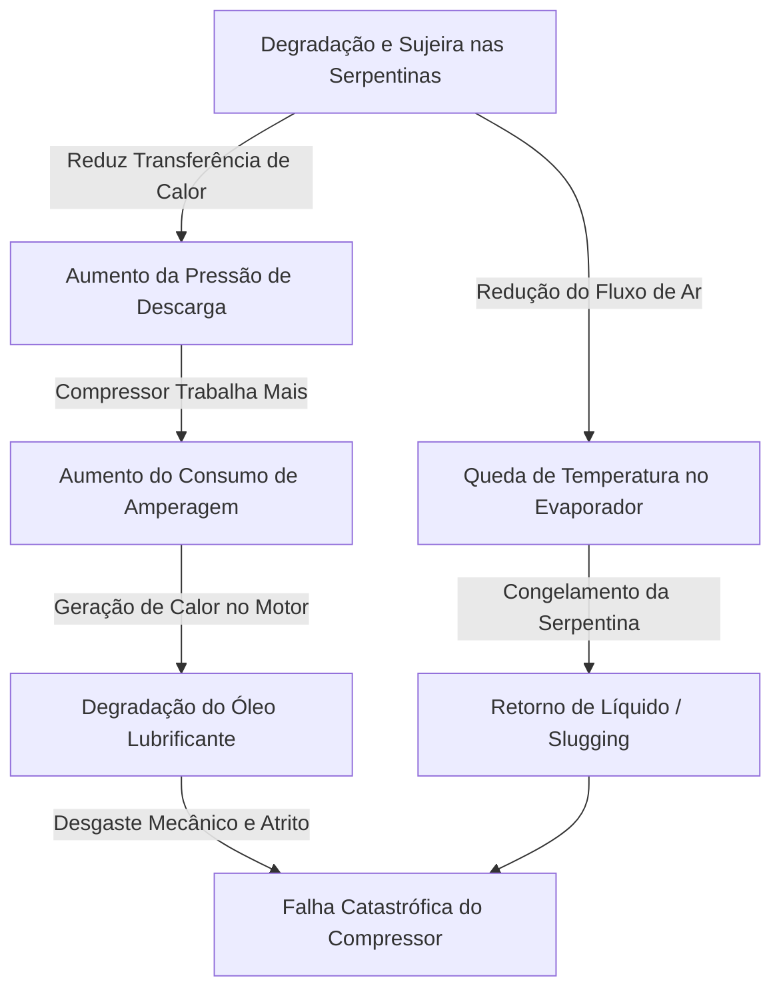

# 1.1 A Filosofia do Custo Total de Propriedade (TCO) na Manutenção de AVAC

## Otimização Estratégica do Custo Total de Propriedade (TCO) na Gestão de Ativos de AVAC Comerciais

A gestão de sistemas comerciais e industriais de Aquecimento, Ventilação, Ar Condicionado e Refrigeração (AVAC-R) historicamente sofre de uma perspectiva financeira fragmentada. As equipes de compras e aquisição concentram-se obsessivamente no gasto de capital inicial (*CapEx*), enquanto as equipes de operações e manutenção combatem os orçamentos contínuos de concessionárias de energia e reparos em isolamento (*OpEx*). Esta abordagem desarticulada mascara o verdadeiro fardo financeiro da infraestrutura de climatização. 

A metodologia do **Custo Total de Propriedade (TCO - *Total Cost of Ownership*)** fornece uma estrutura financeira e de engenharia unificada que quantifica cada centavo gasto em um ativo, desde a aquisição e operação até a manutenção, degradação e eventual substituição ao fim da vida útil.

Em imóveis comerciais, manufatura industrial e instalações institucionais, os sistemas de AVAC não são meros requisitos funcionais; são passivos financeiros massivos que consomem até **40% do perfil energético total de um edifício** [1]. Além disso, arquiteturas modernas e complexas — como redes de Fluxo de Refrigerante Variável (VRF), centrais de água gelada (chillers) centrífugas e refrigeração crítica de câmaras frias — exigem modelagem termodinâmica e financeira rigorosa. 

Mudar de um paradigma operacional reativo de "apagar incêndios" (*break-fix*) para um modelo preditivo orientado pelo TCO não é apenas uma boa prática de engenharia; é um imperativo fiduciário profundo que mitiga riscos sistêmicos, reduz drasticamente as pegadas de carbono e otimiza de forma expressiva a economia do ciclo de vida do ambiente construído.

---

## 1. Economia do Ciclo de Vida: Desvendando a Verdadeira Estrutura de Custos

O erro fundamental na aquisição tradicional de AVAC é a supervalorização dos custos iniciais de instalação. Os tomadores de decisão frequentemente comprometem a eficiência do sistema ou as estruturas de manutenção preventiva para reduzir o desembolso imediato de capital, permanecendo inteiramente alheios aos multiplicadores financeiros subsequentes. Uma análise abrangente de TCO revela que o preço de compra representa apenas uma fração marginal da pegada econômica total do ativo.

### 1.1 A Divisão Quantitativa do TCO de Sistemas de AVAC

Dados empíricos de ciclo de vida de ativos de AVAC comerciais revelam uma realidade gritante sobre onde o capital é realmente consumido ao longo de um ciclo de vida operacional de 15 a 25 anos. O custo real de um ativo de AVAC está distribuído em cinco domínios primários, provando que o ativo nunca é definido pelo seu preço de compra [3]. Uma análise das principais infraestruturas comerciais revela uma divisão proporcional consistente ao longo da vida útil do equipamento:

| Categoria de Custo do Ciclo de Vida | Porcentagem do TCO | Principais Direcionadores Financeiros |
| :--- | :---: | :--- |
| **Custos de Energia** | 32% | Consumo elétrico, eficiência em kW/TR (ou kW/ton), horas de operação, tarifas de demanda de pico. |
| **Mão de Obra de Manutenção** | 28% | Contratos de manutenção preventiva, mão de obra de diagnóstico, chamados de emergência fora do horário comercial. |
| **Peças de Reposição** | 20% | Consumíveis (filtros, correias), componentes principais (compressores, serpentinas, placas inversoras/inverter). |
| **Compra de Capital Inicial (CapEx)** | 12% | Equipamento básico, içamento (*rigging*), aluguel de guindastes, preparação do local, dutos, comissionamento. |
| **Downtime (Inatividade) e Impacto no Negócio** | 8% | Perda de produtividade dos funcionários, deterioração de produtos, penalidades de contrato de locação, climatização temporária de emergência. |

A fase operacional do ativo, que compreende energia, mão de obra, peças e inatividade, constitui impressionantes **88% do custo total do ciclo de vida** [3]. Portanto, qualquer decisão de aquisição de capital que falhe em integrar a modelagem operacional de longo prazo é fundamentalmente falha. 

Uma máquina de meio milhão de dólares com alto consumo de energia, consumíveis caros e requisitos de manutenção frequentes pode custar milhões a mais ao longo de sua vida útil, enquanto uma unidade com um custo de capital inicial mais alto, mas com eficiência superior, gerará um TCO significativamente menor [4].

### 1.2 Depreciação de Ativos e a Penalidade de Renovação de Capital

Organizações como a *American Society of Heating, Refrigerating and Air-Conditioning Engineers* (ASHRAE) e a *Building Owners and Managers Association* (BOMA) fornecem dados padronizados de expectativa de vida para equipamentos mecânicos [5]. Os sistemas de AVAC comerciais típicos são projetados com vidas úteis operacionais que variam de 15 a 30 anos, dependendo da classificação do equipamento. Por exemplo:
* **Unidades de cobertura comerciais (*rooftops*):** Geralmente classificadas para 15 a 20 anos.
* **Chillers centrífugos resfriados a água de grande porte:** Projetados para operar por mais de 25 anos [7].

No entanto, essas vidas úteis teóricas pressupõem uma adesão rigorosa aos protocolos de manutenção preventiva. Na ausência de tal manutenção, a curva de degradação acelera violentamente. 

Dados empíricos ditam que **cada real diferido (economizado/adiado) em manutenção rotineira se traduz em uma penalidade de quatro reais em custos subsequentes de renovação de capital (CapEx)** [8]. Sistemas operados sob uma metodologia reativa de "rodar até quebrar" (*run-to-fail*) normalmente sofrem falhas catastróficas entre os anos 10 e 15, forçando a substituição prematura do capital [9]. 

As consequências financeiras de reduzir de cinco a dez anos o cronograma de amortização de um ativo distorcem permanentemente o Valor Presente Líquido (VPL) do investimento em infraestrutura do edifício, criando crises imediatas de fluxo de caixa para as entidades de gestão de propriedades.

### 1.3 Modelando a Economia: Custo do Ciclo de Vida do Edifício (BLCC)

Para orçar com precisão o horizonte de 30 anos de um sistema de AVAC, os engenheiros utilizam parâmetros específicos de desconto e inflação. Utilizando programas como o *Building Life Cycle Cost (BLCC)* do NIST, os analistas aplicam taxas de desconto — comumente modeladas em 3% — aos fluxos futuros de energia e manutenção, ajustando para a inflação projetada dos preços da eletricidade comercial, que historicamente apresenta uma tendência de aumento anual de 2% a 2,4% [10].

Essa modelagem é crítica porque a eficiência termodinâmica da unidade dita diretamente a maior variável na equação do TCO. Um sistema VRF de alta eficiência pode ter um prêmio de capital inicial de 30% sobre um sistema padrão de unidades *packaged rooftop* (RTU). No entanto, se o sistema VRF operar com um Coeficiente de Desempenho (COP) e um Valor de Carga Parcial Integrado (IPLV) significativamente mais altos, o VPL das economias operacionais superará o prêmio de capital inicial no primeiro terço da vida útil do sistema. Todo esse modelo econômico, no entanto, desmorona se o equipamento for negligenciado e sofrer degradação mecânica ou termodinâmica.

---

## 2. A Economia da Degradação: A Termodinâmica Encontra as Finanças

Os sistemas de AVAC são redes altamente dinâmicas de trocadores de calor, dinâmica de fluidos e refrigerantes que mudam de fase. A partir do momento em que um sistema é comissionado, ele inicia um processo lento de degradação entrópica. Sem intervenção, o desempenho do sistema cai devido ao desgaste mecânico, resistência elétrica e incrustação de transferência de calor. A economia da degradação quantifica exatamente quanta energia elétrica extra é necessária para superar essas barreiras físicas e produzir a mesma unidade de resfriamento ou aquecimento.

### 2.1 A Matemática da Sujeira nas Serpentinas e Perda de Transferência de Calor

A causa mais destrutiva e, ao mesmo tempo, evitável de perda de eficiência em AVAC é a sujeira (*fouling*) das superfícies dos trocadores de calor. A sujeira é o acúmulo de material particulado, poeira, aerossóis biológicos e poluentes urbanos nas superfícies aletadas de alumínio e cobre das serpentinas do evaporador e do condensador [11]. Essas camadas microscópicas agem como isolantes térmicos altamente eficazes, criando uma barreira formidável entre o ar que passa e o refrigerante dentro dos tubos [12].

O impacto volumétrico desse isolamento é assustador. Pesquisas indicam que **um acúmulo de sujeira de meros 1,07 mm (0,042 polegadas) em uma serpentina condensadora reduz a eficiência global do sistema em 21%** [13]. Além disso, **uma película de poeira tão fina quanto 0,5 mm (0,02 polegadas) em uma serpentina evaporadora reduzirá a eficiência de transferência de calor em 15% e estrangulará o fluxo de ar volumétrico em 11%** [16]. O acúmulo dessas partículas cria um cenário onde serpentinas típicas acumulam sujeira suficiente para dobrar a perda de carga do evaporador em aproximadamente 7,5 anos, muito antes do fim esperado da vida útil do equipamento [11].

À medida que a incrustação aumenta a resistência térmica, o equilíbrio termodinâmico do sistema colapsa. No lado do condensador, o compressor deve operar a uma pressão de descarga muito mais alta para forçar o refrigerante a rejeitar calor através da barreira isolada de sujeira. A temperatura de condensação aumenta em proporção direta ao fator de sujeira [17]. 

Como o consumo de potência do compressor escala linearmente com o diferencial de pressão que ele deve superar, **o compressor consome uma amperagem elétrica significativamente maior para atingir a mesma carga de resfriamento** [18].

Simultaneamente, o fluxo de ar reduzido através de uma serpentina evaporadora suja significa que o refrigerante não consegue absorver calor suficiente do interior do edifício. O sistema funciona por muito mais tempo para satisfazer o termostato, exacerbando o consumo elétrico [16]. 

Em casos extremos, o fluxo de ar restrito faz com que a temperatura do evaporador caia abaixo do ponto de orvalho, congelando o condensado na serpentina, bloqueando totalmente a transferência de calor, o que frequentemente leva ao retorno de líquido (*liquid slugging*) e à destruição catastrófica do compressor.

### 2.2 Analisando a Alegação de Perda de Eficiência de "1% por Mês"

Na gestão de facilidades, uma métrica frequentemente citada sugere que sistemas de AVAC negligenciados sofrem uma perda de eficiência de **1% ao mês** devido à sujeira nas serpentinas e degradação de desempenho. Embora as médias nacionais amplas indiquem uma queda anual de eficiência de 5% a 7% para sistemas comerciais padrão operados sem manutenção [9], a alegação de "1% ao mês" (representando cerca de 12% de degradação anualizada) é matematicamente sólida e empiricamente observável em ambientes específicos de alto estresse.

Esta taxa de degradação acelerada é observada principalmente em ambientes sujeitos a alta carga de partículas, tais como:
* Pisos de manufatura industrial.
* Cozinhas e restaurantes com gordura ambiente suspensa no ar.
* Propriedades comerciais costeiras sujeitas a corrosão salina severa e areia soprada pelo vento [19].

Dado a métrica estabelecida de que uma camada de sujeira de 1,07 mm causa uma redução de eficiência de 21% [13], atingir essa espessura em um período de 20 meses em um ambiente severo e sem filtragem adequada resulta diretamente em uma perda de eficiência que excede 1% ao mês. 

Adicionalmente, ao combinar a sujeira nas serpentinas com microvazamentos simultâneos de refrigerante — que alteram inerentemente a capacidade volumétrica das válvulas de expansão —, a perda de eficiência composta atinge ou supera facilmente esse limite de 1% mensal, servindo como um alerta crítico para operações em climas exigentes.

### 2.3 Curvas de Degradação de Desempenho Sistêmico

Quando a manutenção é adiada, os sistemas não custam apenas a mesma quantidade para rodar até que quebrem; eles sangram capital operacional diariamente. Estudos longitudinais que observam sistemas comerciais ao longo de um ciclo de vida de 15 anos sob um regime de manutenção negligenciado demonstram curvas severas de degradação. 

Ao longo de um período de 15 anos sem manutenção adequada, **o Coeficiente de Desempenho (COP) do equipamento principal de resfriamento despenca entre 34% e 52%**, enquanto equipamentos auxiliares, como torres de resfriamento e bombas hidrônicas, degradam de 7% a 19% [20].

Como o equipamento central degrada, os sistemas secundários são forçados a compensar:
1. Os chillers funcionam por mais tempo.
2. As bombas com inversores de frequência (VFD) rampam para a vazão máxima para superar trocadores de calor obstruídos.
3. Os ventiladores das torres de resfriamento operam continuamente para rejeitar calor de loops de condensação comprometidos.

Esse estresse mecânico composto cria um ciclo de retroalimentação (*feedback loop*) de ineficiência crescente. Consequentemente, **no 15º ano de operação, o consumo total de energia da instalação negligenciada aumenta em impressionantes 41% em comparação com sua linha de base inicial** [20].



### 2.4 Desgaste Mecânico e Degradação Elétrica

Além da sujeira na transferência de calor, os componentes físicos degradam-se de formas que inflam silenciosamente as contas de energia. Partes móveis, como os rolamentos do motor do ventilador e os pistões do compressor, desenvolvem ranhuras microscópicas na superfície ao longo de anos de operação [18]. Este atrito mecânico aumentado exige maior torque elétrico para manter as velocidades de rotação necessárias.

Concomitantemente, a degradação dos componentes elétricos força os sistemas a consumirem uma amperagem mais alta. Os capacitores perdem suas capacidades dielétricas de armazenamento de carga, os contatores desenvolvem superfícies de carbono picadas e queimadas devido ao arco elétrico, e as conexões dos terminais oxidam [18]. 

Esses aumentos microscópicos na resistência elétrica significam que mais energia bruta do painel elétrico da instalação é convertida em calor desperdiçado em vez de trabalho mecânico, forçando o sistema a drenar correntes mais pesadas [18]. 

À medida que o consumo elétrico aumenta, as tarifas de demanda de pico da instalação aumentam severamente, introduzindo duras penalidades financeiras das concessionárias de energia com base puramente na leitura de quilowatts (kW) mais alta registrada durante o ciclo de faturamento [21].

---

## 3. O ROI Quantificável da Manutenção Preventiva

Para combater a economia da degradação, as instalações comerciais devem implantar um contrato estruturado de manutenção preventiva e operação (no Brasil, estruturado sob o escopo do **PMOC - Plano de Manutenção, Operação e Controle**). A transição de uma postura reativa para uma estratégia proativa de gestão de ativos não é apenas uma mudança operacional; é um investimento financeiro de alto rendimento. 

Dados de grandes portfólios imobiliários comerciais provam definitivamente que a manutenção preventiva gera retornos que superam em muito os investimentos padrão do mercado financeiro.

### 3.1 A Referência de 545% de ROI e Ganhos de Eficiência

Um estudo empírico de referência realizado pela empresa global de serviços imobiliários comerciais *Jones Lang LaSalle* (JLL) analisou centenas de edifícios e milhares de ordens de serviço para calcular o retorno financeiro exato da manutenção preventiva estruturada. O estudo concluiu que **a manutenção preventiva abrangente em sistemas de AVAC comerciais gera um impressionante Retorno sobre o Investimento (ROI) de 545%** [22].

Este retorno excepcional é derivado matematicamente de quatro fluxos de valor distintos e compostos [23]:

1. **Redução de Energia e R$/TR Economizado:** Reverter os efeitos da sujeira nas serpentinas, oclusão de filtros e atrito mecânico restaura o equipamento para um COP próximo ao de fábrica. A manutenção adequada reduz o consumo total de energia do edifício em **15% a 20% ao ano** [8]. Dado que o AVAC representa até 40% da carga total do edifício, isso representa economias absolutas massivas. Ao otimizar o ciclo termodinâmico, o custo por Unidade Térmica por hora entregue ao espaço ocupado é drasticamente minimizado.
2. **Evitação de Reparos de Emergência:** A manutenção proativa corrige pequenos problemas antes que eles se transformem em eventos catastróficos. O Departamento de Energia dos EUA (DOE) confirma que **um programa estruturado de manutenção preventiva custa 50% menos para ser executado do que uma abordagem puramente reativa** [23].
3. **Erradicação de Inatividade (*Downtime*) e Melhoria do MTBF:** A manutenção preventiva correlaciona-se com uma **redução de 70% a 75% nas quebras do sistema** e uma disponibilidade operacional próxima de 100%. Especificamente, a manutenção preventiva baseada em condição aumenta o Tempo Médio Entre Falhas (MTBF) de 90 para 175 horas em comparação com abordagens reativas [8], protegendo as receitas principais do negócio e a segurança dos ocupantes.
4. **Diferimento de Capital e Extensão da Vida Útil:** Ao minimizar o desgaste mecânico, os sistemas comerciais bem mantidos alcançam facilmente vidas úteis operacionais de 20 a 25 anos [9]. A gestão estruturada de ativos pode estender a vida útil do equipamento de 5 a 10 anos, representando uma **extensão de vida útil de até 30%** [24]. Adiar a substituição de uma central de água gelada multimilionária ou de um sistema VRF altera fundamentalmente os modelos de despesas de CapEx de longo prazo da organização.

### 3.2 Estratégias de Manutenção em Níveis: Preventiva vs. Preditiva

Embora a manutenção preventiva baseada em calendário seja altamente eficaz, a indústria está transitando cada vez mais para a Manutenção Preditiva (PdM) baseada em condição, utilizando sensores de Internet das Coisas (IoT) industrial, análise de vibração e monitoramento algorítmico contínuo. 

De acordo com dados de 2025 da Siemens, a manutenção preditiva adiciona de 8% a 12% em economia operacional além das abordagens preventivas padrão, resultando em **25% a 40% de economia total em comparação com os métodos reativos** [27]. 

A tecnologia preditiva analisa continuamente a integridade termodinâmica do sistema — como o monitoramento do diferencial de temperatura ($\Delta T$) em um circuito de água gelada ou as microvibrações nos rolamentos de um compressor centrífugo — e aciona um evento de manutenção apenas quando a degradação física é detectada, eliminando mão de obra desnecessária e antecipando falhas.

Uma arquitetura de manutenção sofisticada classifica os ativos em níveis para maximizar o ROI [28]:

| Nível de Manutenção | Classificação do Ativo | Estratégia de Manutenção | Justificativa Financeira |
| :---: | :--- | :--- | :--- |
| **Nível 1** | **Ativos Críticos**<br>(Chillers, Câmaras Frias, Centrais VRF) | Preditiva baseada em condição e monitoramento contínuo via sensores IoT. | Os custos de falha (R$ 250k+) tornam insignificante o custo anual do sensor e monitoramento (R$ 1.500 - R$ 3.000). |
| **Nível 2** | **Ativos Principais**<br>(Rooftops padrão, UTAs de zonas amplas) | Preventiva baseada em calendário (PMOC mensal/trimestral). | A probabilidade matemática favorece a atenção regular para evitar respostas emergenciais de alto custo. |
| **Nível 3** | **Ativos Descartáveis**<br>(Pequenos exaustores de banheiro, aquecedores) | Reativa planejada (*Run-to-fail*). | O custo de mão de obra de manutenção preventiva acumulada superaria o valor de substituição rápida do próprio ativo. |

Ao implantar o protocolo de manutenção correto para a classe de ativos apropriada, os gestores de facilidades garantem que cada centavo gasto em mão de obra gere um retorno líquido positivo.

### 3.3 Impacto da Manutenção Específico por Domínio: Cadeia de Frio e Armazenamento

A importância da manutenção escala exponencialmente em ambientes com controle crítico de temperatura. Sistemas de refrigeração para armazenamento a frio na fabricação de alimentos e logística farmacêutica devem manter faixas precisas de temperatura continuamente. Nesses ambientes, a manutenção engloba verificações mecânicas rígidas (níveis de óleo do compressor, integridade da serpentina, tensão de correias) e conformidades regulatórias rigorosas (registro contínuo de temperatura, integridade das vedações de portas e barreiras de ar, higienização do sistema de drenagem) [29].

Negligenciar tarefas simples, como substituir gaxetas de portas rachadas ou falhar na limpeza de serpentinas condensadoras, força os compressores a operarem continuamente para manter as temperaturas de congelamento, levando à quebra prematura do equipamento. **No armazenamento a frio, o custo de uma substituição emergencial de compressor é 4,8 vezes maior do que uma revisão preventiva planejada** [29].

---

## 4. Análise de Custos de Falha: Substituições Reativas vs. Contratos PMOC

A prova definitiva da eficácia do framework de TCO reside na comparação financeira direta entre o custo de um contrato de manutenção abrangente e a carnificina financeira de uma falha reativa. A economia favorece esmagadoramente a intervenção proativa, principalmente devido aos graves multiplicadores associados a cenários de emergência.

### 4.1 A Anatomia de uma Falha de Compressor Comercial

O compressor é o coração de qualquer ciclo de refrigeração e AVAC, sendo o responsável por estabelecer o diferencial de pressão que permite a ocorrência da transferência de calor. É o componente mais precisamente projetado, caro e crítico do sistema. 

Quando um compressor falha, raramente é devido a um defeito mecânico aleatório; é quase universalmente o sintoma final de um estresse sistêmico prolongado e não resolvido — como o retorno de líquido (*slugging*) devido a serpentinas evaporadoras congeladas, superaquecimento severo decorrente de condensadoras sujas ou queima ácida decorrente de contaminação por umidade no circuito de refrigerante [31].

O custo para substituir um compressor comercial varia de acordo com a arquitetura do sistema, mas é sempre punitivo:

| Arquitetura do Sistema | Custo de Substituição Típico (USD / BRL equivalente) | Principais Direcionadores de Custos e Complicações |
| :--- | :---: | :--- |
| **Rooftops Comerciais (RTUs)** | **$3.000 – $10.000**<br>(~R$ 16.500 – R$ 55.000) [32] | Custos elevados de aluguel de guindastes para acesso ao telhado (*rigging* de R$ 10.000 a R$ 30.000), recuperação de refrigerante e peso do componente. |
| **Fluxo de Refrigerante Variável (VRF/VRV)** | **$4.000 – $12.000**<br>(~R$ 22.000 – R$ 66.000) [34] | Exige recuperação de volumes massivos de refrigerante, varredura de nitrogênio, diagnósticos de comunicação complexos e substituição de placas inverter. |
| **Chillers Resfriados a Ar** | **$15.000 – $50.000**<br>(~R$ 82.500 – R$ 275.000) [35] | Compressores herméticos ou semi-herméticos de grande escala que exigem pórticos de elevação, longa inatividade e substituição de grandes cargas de óleo e filtros secadores. |
| **Chillers Centrifugais Resfriados a Água** | **$22.000 – $85.000**<br>(~R$ 120.000 – R$ 467.500) [36] | Exige recondicionamento (*overhaul*) mecânico complexo *in-situ* ou remanufatura em fábrica certificada. Substituição completa pode exceder R$ 1.500.000. |

Em sistemas avançados como o VRF, a falha do compressor frequentemente representa **50% a 70% do custo de uma unidade condensadora externa inteiramente nova**, o que frequentemente induz a substituição total do sistema em vez do reparo, encurtando prematuramente o ciclo de vida do ativo [34].

### 4.2 Os Multiplicadores da Resposta de Emergência

O custo seco do compressor é apenas a linha de base de uma falha. A manutenção reativa força a contratação de serviços sob extrema urgência (*under duress*), o que dispara múltiplos gatilhos inflacionários:
* **Sazonalidade:** Como **63% das falhas de AVAC ocorrem durante condições de pico de carga** (dias de calor extremo no verão ou frio intenso no inverno), as equipes de manutenção operam saturadas [37].
* **Taxas de Urgência:** Chamados fora do horário comercial, fins de semana ou feriados carregam prêmios de mão de obra de **50% a 100% mais altos** que as taxas padrão de contrato [22].
* **Frete Expresso:** O envio expresso de peças pesadas de reposição adiciona custos logísticos substanciais.
* **Complexidade Secundária:** Reparos reativos no inverno ou verão sob estresse térmico severo podem gerar custos de 3 a 5 vezes mais altos devido a congelamento de tubulações, estouros de serpentinas ou danos colaterais por vazamentos de água e condensado na infraestrutura civil do edifício [39].

### 4.3 O Iceberg Oculto: Tempo de Inatividade (*Downtime*) e Perda de Receita

O custo direto da fatura de substituição do compressor representa **menos de 25% do impacto financeiro real**. A maior fatia do iceberg está oculta nas perdas de produtividade operacional e interrupção do negócio. O custo real da inatividade do sistema de AVAC comercial é, em média, **4,2 vezes maior do que o custo visível do reparo mecânico** [37].

```
┌──────────────────────────────────────────────────────────┐
│                   CUSTO DO REPARO (25%)                  │  <-- O que o cliente vê (Peças + Mão de Obra)
└──────────────────────────────────────────────────────────┘
                              │
  ==================== NÍVEL DA ÁGUA ====================
                              │
┌──────────────────────────────────────────────────────────┐
│              PERDAS DE PRODUTIVIDADE (40%)               │  
├──────────────────────────────────────────────────────────┤
│             PERDA DE CLIENTES E VENDAS (20%)             │  <-- O Iceberg Oculto (Impacto Total = 4.2x maior)
├──────────────────────────────────────────────────────────┤
│               DANOS À INFRAESTRUTURA (15%)               │  
└──────────────────────────────────────────────────────────┘
```

Dependendo da aplicação comercial da instalação, as penalidades financeiras variam drasticamente:
* **Escritórios Corporativos:** Os padrões regulatórios indicam que o conforto e a segurança do trabalhador degradam rapidamente acima de 29°C. Em um ambiente corporativo típico de Classe A com 340 funcionários, estima-se uma perda de produtividade de **R$ 4.500 a R$ 13.000 por hora de inatividade do sistema** [37].
* **Hospitais e Clínicas Médicas:** A falha de uma UTA que atende salas cirúrgicas interrompe a pressão positiva e a esterilização do ar. O cancelamento ou atraso de cirurgias em três salas de operação pode custar a um hospital mais de **R$ 400.000 em uma única tarde**, além dos imensos riscos de conformidade jurídica e segurança do paciente [37].
* **Manufatura e Processamento de Alimentos:** Uma falha de resfriamento de 4 horas em uma linha de processamento de alimentos com 180 trabalhadores pode resultar em uma perda imediata de mais de **R$ 260.000 em descarte de produtos e parada de linha**, além dos custos de reparo mecânico [37].

### 4.4 Comparação Anualizada de Custos: O Veredito Financeiro

Sintetizando os custos de operação, reparo e substituição de capital, o veredito financeiro é absoluto. 

Contratos abrangentes de manutenção baseados no PMOC para instalações comerciais custam anualmente uma fração previsível do custo de ativos. Para um edifício comercial padrão de 1.000 metros quadrados (aproximadamente 10.700 sq ft):

* **Com Contrato Proativo (PMOC estruturado):** O custo operacional anual previsível do sistema de AVAC (incluindo energia otimizada, manutenção preventiva rigorosa e pequenos reparos preventivos) estabiliza-se entre **R$ 45.000 e R$ 65.000 por ano** [9]. O equipamento opera de forma confiável de 20 a 25 anos em alta eficiência energética.
* **Sem Contrato (Metodologia Reativa):** O custo operacional anual médio torna-se volátil e imprevisível, saltando para **R$ 80.000 a R$ 140.000 por ano** [9]. Esse custo inchado é impulsionado por:
  - Perdas de 5% a 7% ao ano em eficiência de consumo de energia elétrica.
  - Taxas emergenciais repetidas.
  - Necessidade de substituição total do equipamento 10 anos antes do esperado.

Ao longo de uma trajetória de 5 anos, uma única unidade comercial de AVAC sob manutenção preventiva acumula cerca de R$ 12.000 em custos de conservação. A mesma unidade, operada sob regime de negligência reativa, consome mais de R$ 65.000 em reparos emergenciais e perda acelerada de valor de capital do equipamento [8]. 

**As empresas que operam de forma reativa não estão economizando dinheiro ao cortar orçamentos de manutenção; estão pagando um prêmio inflacionado severo pela ineficiência diária e desastres operacionais constantes** [27].

---

## 5. O Framework de Comunicação com o Cliente: Traduzindo AVAC para Finanças

Apesar dos esmagadores dados empíricos de engenharia que suportam a manutenção preventiva, os gestores de facilidades e técnicos de AVAC frequentemente falham em obter os orçamentos necessários das diretorias corporativas. Essa falha de comunicação ocorre porque os profissionais técnicos tentam justificar investimentos usando termos de engenharia (como serpentinas sujas, contatores desgastados ou taxas de compressão inadequadas). 

Os Diretores Financeiros (*CFOs*) operam em um universo conceitual inteiramente diferente. Em média, um CFO de uma grande corporação recebe dezenas de solicitações de investimentos em CapEx e OpEx mensalmente, aprovando menos de um terço delas [41]. 

Eles avaliam alocações de capital com base em **mitigação de riscos, prazos de retorno financeiro e retorno definitivo do investimento**. Para fechar contratos de manutenção robustos ou aprovar atualizações de equipamentos, o profissional de AVAC deve traduzir a linguagem técnica para a terminologia financeira.

### 5.1 Utilizando Métricas Financeiras Padrão

O caso de negócios bem-sucedido para a gestão de ativos de AVAC baseia-se em três métricas financeiras essenciais [42]:

* **Período de Payback Simples:** A métrica mais rápida de avaliação executiva. Calcula o tempo necessário para recuperar o custo do investimento.
  $$\text{Payback Simples (Anos)} = \frac{\text{Investimento Inicial (R\$)}}{\text{Economia Anual Gerada (R\$) + Custos Evitados (R\$)}}$$
  *Exemplo:* Se um contrato de manutenção custa R$ 25.000 por ano, mas gera comprovadamente R$ 30.000 em economia de energia e evita reparos emergenciais médios históricos de R$ 10.000, o retorno ocorre em menos de 8 meses. Períodos de payback abaixo de 18 a 24 meses são altamente atraentes para qualquer diretoria financeira.
* **Valor Presente Líquido (VPL - *Net Present Value*):** O padrão de ouro para aprovação de capital. O VPL calcula o valor atual de todos os fluxos de caixa futuros e economias gerados pelo programa de manutenção, descontados à taxa mínima de atratividade da empresa para contabilizar o valor do dinheiro no tempo, deduzido o investimento inicial do contrato. Um VPL positivo prova matematicamente que investir no contrato de manutenção gera mais riqueza para a organização do que qualquer aplicação financeira de baixo risco.
* **Taxa Interna de Retorno (TIR - *Internal Rate of Return*):** A TIR identifica a taxa de desconto na qual o VPL do investimento se torna igual a zero. Ela funciona como a "taxa de juros equivalente" que o projeto rende. Dado o ROI global de 545% da manutenção preventiva de AVAC, a TIR desses programas rotineiramente supera as taxas mínimas de atratividade (*hurdle rates*) corporativas, tornando o projeto uma proposição financeira imbatível.

### 5.2 Estruturando a Apresentação do Caso de Negócios

Ao apresentar propostas de manutenção para a diretoria executiva, estruture o argumento em torno de três pilares de impacto financeiro duro, eliminando o jargão puramente técnico [23]:

1. **Quantifique a Economia de Energia Real (Hard Savings):** Não use termos vagos como "melhora a eficiência". Apresente dados modelados claros:
   * *"Restaurar o COP de um chiller centrífugo sujo de 100 TR reduzirá em 15% o consumo anual de eletricidade da instalação. Reduzir a potência de 0,82 kW/TR para a linha de base original de 0,52 kW/TR traduz-se diretamente em uma economia anual comprovada de R$ 75.000 em tarifas de consumo elétrico."* [36]
2. **Monetize a Mitigação de Risco de Inatividade (Downtime):** Calcule o custo de uma falha catastrófica:
   * *"Sem o monitoramento preditivo e preventivo mensal, a probabilidade de falha mecânica de pico do compressor nos próximos 12 meses é de 22%. Uma quebra gerará uma parada operacional estimada de 18 horas, custando à empresa R$ 81.000 em produtividade perdida e cancelamento de entregas de clientes, além de uma taxa emergencial de reparo de R$ 25.000. O contrato preventivo de R$ 20.000 ao ano atua como uma apólice de seguro que reduz essa probabilidade de risco para menos de 2%."*
3. **Modele o Diferimento de Capital (Lifespan Extension):** Apresente a manutenção como uma proteção do patrimônio físico da empresa:
   * *"Ao estender a vida útil da central VRF do edifício de 12 para 20 anos através do nosso protocolo preventivo, adiamos um investimento de CapEx de substituição de R$ 450.000 em 8 anos. Isso reduz a depreciação anual na demonstração de resultados da empresa de R$ 37.500 para R$ 22.500, liberando fluxo de caixa líquido contábil imediatamente."* [36]

---

## Conclusão

A abordagem do Custo Total de Propriedade (TCO) redefine fundamentalmente a gestão de AVAC e refrigeração comercial. Ao ir além da visão míope dos custos de capital iniciais e analisar meticulosamente o ciclo de vida de 25 anos dos ativos térmicos, os profundos perigos financeiros da degradação sistêmica tornam-se matematicamente inegáveis. 

A incrustação microscópica das serpentinas, o atrito mecânico acumulado, a degradação de componentes elétricos e as taxas exorbitantes de mão de obra de emergência escalam silenciosamente para perdas massivas de caixa, inflacionando o consumo de energia em até 41% e destruindo prematuramente a infraestrutura predial.

A evidência empírica é definitiva: programas de manutenção preventiva e preditiva estruturados produzem retornos extraordinários de até 545% de ROI. Traduzindo complexidades termodinâmicas em modelos financeiros de VPL, TIR e extensão de vida útil de ativos, as organizações podem converter suas infraestruturas mecânicas de AVAC de um passivo de alto risco operacional em um ativo financeiro otimizado. 

No cenário comercial moderno, a gestão de ativos de AVAC não é mais um debate técnico de engenharia; é um pilar central da estratégia financeira corporativa de sustentabilidade e lucratividade.

---

## Referências Citadas

1. **Benefits of commercial HVAC maintenance** - ABM Perspectives, acessado em junho 13, 2026, [ABM Perspectives](https://www.abm.com/perspectives/benefits-of-commercial-hvac-maintenance).
2. **Commercial HVAC Preventative Maintenance vs Reactive Repairs**, acessado em junho 13, 2026, [Northstar HVACR](https://www.northstarhvacr.com/post/commercial-hvac-preventative-maintenance).
3. **HVAC Asset Lifecycle Management: From Installation to Replacement Decisions** - Oxmaint, acessado em junho 13, 2026, [Oxmaint Industry Reports](https://oxmaint.com/industries/hvac/hvac-asset-lifecycle-management-installation-replacement).
4. **Capital Equipment TCO Guide | Lifecycle Cost Analysis** - SpecLens, acessado em junho 13, 2026, [SpecLens Guides](https://www.speclens.ai/guides/capital-equipment-tco).
5. **Financial Series: Cost of Ownership** - Campbell Mechanical Services, acessado em junho 13, 2026, [Campbell Inc.](https://www.campbellinc.com/resources/financial-considerations/financial-series-cost-of-ownership).
6. **Preventive Maintenance Guidebook**, acessado em junho 13, 2026, [Illinois iCAP Portal](https://icap.sustainability.illinois.edu/files/projectupdate/2289/Project%20Lifespan%20Estimates.pdf).
7. **How Facility Managers Can Extend the Life of HVAC Equipment by 10+ Years**, acessado em junho 13, 2026, [Ambient Mechanical](https://www.ambientmechanical.ca/blog/extend-hvac-equipment-life).
8. **HVAC Preventive vs Reactive Maintenance | Cost & Downtime**, acessado em junho 13, 2026, [Oxmaint Resources](https://oxmaint.com/industries/hvac/hvac-preventive-vs-reactive-maintenance).
9. **Maximizing ROI — How Proactive HVAC Maintenance Saves Real Money**, acessado em junho 13, 2026, [NY-HVAC Blog](https://ny-hvac.com/blog/hvac-maintenance-roi/).
10. **COST OF OWNERSHIP ANALYSIS OF AN HVAC SYSTEM** - MavMatrix, UTA, acessado em junho 13, 2026, [UTA MavMatrix Portal](https://mavmatrix.uta.edu/cgi/viewcontent.cgi?article=1026&context=honors_spring2020).
11. **Dirty Air Conditioners: Energy Implications of Coil Fouling**, acessado em junho 13, 2026, [ACEEE Proceedings](https://www.aceee.org/files/proceedings/2002/data/papers/SS02_Panel1_Paper23.pdf).
12. **Causes & Solutions to Airside Coil Fouling** - The Super Blog, acessado em junho 13, 2026, [Super Radiator Coils](https://www.superradiatorcoils.com/blog/airside-fouling-in-heat-exchangers-causes-and-solutions).
13. **How to Reduce HVAC Energy Costs by 20-30% with CMMS-Driven Maintenance**, acessado em junho 13, 2026, [Oxmaint Maintenance Guide](https://oxmaint.com/industries/hvac/reduce-hvac-energy-costs-20-30-percent-cmms-maintenance).
14. **Dirty AC Evaporator Coil: Symptoms, Causes & Fixes**, acessado em junho 13, 2026, [Non-Stop Air Conditioning](https://www.nonstopair-fl.com/dirty-ac-evaporator-coil/).
15. **Air Intake Screen Protection** - Permatron, acessado em junho 13, 2026, [Permatron Protection Portal](https://permatron.com/prevent-installs/air-intake-screen-protection).
16. **How a Dirty Evaporator Coil Can Ruin Your Efficiency (and Your Energy Bill)**, acessado em junho 13, 2026, [The Furnace Outlet](https://thefurnaceoutlet.com/blogs/hvac-tips/how-a-dirty-evaporator-coil-can-ruin-your-efficiency-and-your-energy-bill).
17. **Reduce Energy Costs with Water Treatment** - Metro Group Inc, acessado em junho 13, 2026, [Metro Group Solutions](https://www.metrogroupinc.com/reduce-energy-costs-with-water-treatment/).
18. **Why Is My HVAC System Using More Energy Than It Used To?**, acessado em junho 13, 2026, [Opachs HVAC Blog](https://www.opachs.com/why-is-my-hvac-system-using-more-energy-than-it-used-to/).
19. **HVAC Maintenance in Santa Monica, CA** - Copperline Climate Co., acessado em junho 13, 2026, [Copperline Climate Services](https://copperlineclimate.com/areas/santa-monica/hvac-maintenance/).
20. **Analysis of Heat Source System Degradation Due to Aging and Wear**, acessado em junho 13, 2026, [MDPI Energies Journal](https://www.mdpi.com/1996-1073/15/23/9217).
21. **Top Operations and Maintenance (O&M) Efficiency Opportunities at DoD/Army Sites** - Pacific Northwest National Laboratory, acessado em junho 13, 2026, [PNNL Technical Reports](https://www.pnnl.gov/main/publications/external/technical_reports/PNNL-16615.pdf).
22. **HVAC Maintenance Plan Pricing Calculator** - Oxmaint, acessado em junho 13, 2026, [Oxmaint Cost Calculator](https://oxmaint.com/industries/hvac/hvac-maintenance-plan-pricing-calculator).
23. **How to Calculate HVAC Maintenance ROI (Commercial Guide)**, acessado em junho 13, 2026, [Oxmaint Guides](https://oxmaint.com/industries/hvac/calculate-hvac-maintenance-roi-commercial).
24. **Proactive Commercial HVAC Maintenance Tips Extend Equipment Lifespan**, acessado em junho 13, 2026, [VA Commercial HVAC](https://vacommercialhvac.com/proactive-commercial-hvac-maintenance-tips-extend-equipment-lifespan-30).
25. **How Much Can Preventive Maintenance Save?** - Powell Company, acessado em junho 13, 2026, [Powell Company Blog](https://www.powellcompanyltd.com/product-education/blog/how-much-can-preventive-maintenance-save.aspx).
26. **Research Shows Preventive Maintenance Produces a ROI of 545%**, acessado em junho 13, 2026, [MicroMain Case Studies](https://micromain.com/preventive-maintenance-study/).
27. **HVAC Maintenance Cost Reduction Strategies | Lower Costs Effectively**, acessado em junho 13, 2026, [Oxmaint Solutions](https://oxmaint.com/industries/hvac/hvac-maintenance-cost-reduction-strategies).
28. **Predictive vs Preventive vs Reactive HVAC Maintenance: Which Strategy Wins?** - Oxmaint, acessado em junho 13, 2026, [Oxmaint Comparison](https://oxmaint.com/industries/hvac/predictive-vs-preventive-vs-reactive-hvac-maintenance).
29. **Cold Storage and Refrigeration System Maintenance Checklist**, acessado em junho 13, 2026, [Oxmaint Food & Beverage Guidelines](https://oxmaint.com/industries/food-manufacturing/cold-storage-refrigeration-system-maintenance-checklist-food).
30. **Cold Room Maintenance Checklist: From Daily to Annual** - LINBLE, acessado em junho 13, 2026, [LINBLE Storage Solutions](https://www.linble-coldroom.com/cold-room-maintenance-checklist/).
31. **Compressor Failure: Diagnosis and Replacement Checklist for Light Commercial Equipment** - HVAC School, acessado em junho 13, 2026, [HVAC School Technical Library](http://www.hvacrschool.com/compressor-failure-diagnosis-and-replacement-checklist-for-residential-and-light-commercial-equipment/).
32. **How Much Does It Cost to Replace a Commercial HVAC Compressor?** - Harold Brothers, acessado em junho 13, 2026, [Harold Brothers Blog](https://www.haroldbros.com/blog/commercial-hvac-compressor-replacement-cost).
33. **AC Compressor Replacement Cost NJ (2026)** - Dimatic Control, acessado em junho 13, 2026, [Dimatic Control NJ](https://dimaticcontrol.com/blog/ac-compressor-replacement-cost-nj-2026).
34. **Daikin VRV Problems: 7 Most Common Issues & How We Fix Them**, acessado em junho 13, 2026, [North Breeze HVAC](https://northbreezehvac.com/blog/daikin-vrv-common-problems-troubleshooting/).
35. **Chiller Failure Analysis and Troubleshooting for Facility Operations** - Oxmaint, acessado em junho 13, 2026, [Oxmaint Industrial Guides](https://oxmaint.com/industries/facility-management/chiller-common-failures).
36. **Chiller Replacement Cost vs Repair: Decision Framework for Facility Teams**, acessado em junho 13, 2026, [Oxmaint Decision Guides](https://oxmaint.com/industries/hvac/chiller-replacement-cost-vs-repair-2026-decision-framework).
37. **The True Cost of HVAC Downtime: Impact on Business & Comfort** - Oxmaint, acessado em junho 13, 2026, [Oxmaint Business Impact](https://oxmaint.com/industries/hvac/hvac-downtime-cost-impact-business-comfort).
38. **The Truth About Emergency HVAC Repairs: Costs, Risks & How to Cut Them Down**, acessado em junho 13, 2026, [SJHC Service Guides](https://www.sjhcservice.com/blog/uncategorized/the-truth-about-emergency-hvac-repairs-costs-risks-how-to-cut-them-down/).
39. **Winter HVAC Maintenance Checklist Guide** - Airlogix, acessado em junho 13, 2026, [Airlogix Seasonal Guides](https://airlogix.co/hvac-maintenance-checklist/).
40. **Commercial AC Maintenance Cost Guide in Staunton, VA**, acessado em junho 13, 2026, [VA Commercial AC Guides](https://www.vacommercialhvac.com/commercial-ac-maintenance-cost-guide-in-staunton-va).
41. **How to Justify Property Maintenance Software to Your CFO (ROI Template)**, acessado em junho 13, 2026, [Oxmaint CFO Justification Template](https://oxmaint.com/industries/property-management/justify-property-maintenance-software-to-cfo-roi-template).
42. **Commercial HVAC Retrofit ROI: How to Calculate Payback, NPV, and Risk (Facility + CFO Guide)** - Total Mechanical Services, acessado em junho 13, 2026, [TMSOK Finance Portal](https://www.tmsok.com/resources/commercial-hvac-retrofit-roi-calculation).
