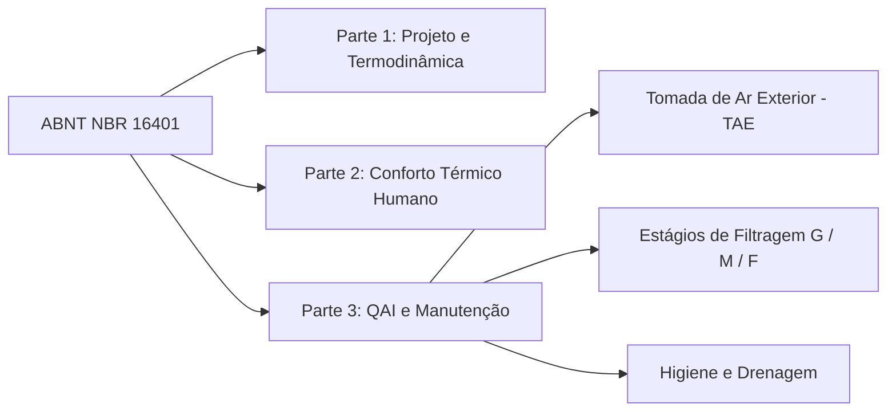

# 1.2 Conformidade com PMOC e o Framework Regulatório Brasileiro

## Análise Abrangente de Manutenção de AVAC Comercial e Frameworks Regulatórios de Qualidade do Ar Interior (QAI)

O mandato para projetar, operar e manter meticulosamente uma Qualidade do Ar Interior (QAI / *IAQ*) impecável em edifícios comerciais evoluiu de uma consideração operacional secundária — frequentemente sacrificada no altar da eficiência energética — para uma obrigação estatutária primária e altamente fiscalizada. Historicamente, os sistemas comerciais de Aquecimento, Ventilação e Ar Condicionado (AVAC / *HVAC*) eram projetados predominantemente para o conforto térmico, concentrando-se na modulação rudimentar de temperatura e umidade para satisfazer as preferências básicas dos ocupantes. 

No entanto, a crescente conscientização global sobre a **Síndrome do Edifício Doente (SED / *SBS*)**, a realidade inegável da transmissão de patógenos por aerossóis e os impactos cognitivos mensuráveis de poluentes internos elevados precipitaram uma mudança profunda de paradigma. 

Hoje, a engenharia, a operação e a manutenção de sistemas de AVAC comerciais são regidas por uma teia complexa e interligada de normas técnicas internacionais, legislação de saúde nacional rígida e diretrizes de diagnóstico rigorosas.

Esta análise detalhada fornece um exame exaustivo e multi-jurisdicional da arquitetura regulatória que rege a manutenção de AVAC e a QAI. O documento estabelece um foco fundamental no framework legislativo brasileiro — especificamente na histórica **Lei Federal nº 13.589/2018** e no conjunto de normas técnicas da **ABNT** —, comparando-os com as principais referências internacionais, como as normas **ASHRAE 62.1 e 62.2**, a Diretiva de Desempenho de Edifícios da União Europeia (EPBD), os protocolos da Agência de Proteção Ambiental dos EUA (EPA) e a rigorosa norma **SS 554** de Cingapura para climas tropicais. 

Além disso, este relatório elucida as estruturas legais de documentação de conformidade, explora as graves responsabilidades civis, criminais e de seguros associadas à negligência, e fornece orientação de implementação acionável para gestores de facilidades corporativas.

---

## 1. Referência Internacional: Os Frameworks ASHRAE 62.1 e 62.2

A *American Society of Heating, Refrigerating and Air-Conditioning Engineers* (ASHRAE) fornece os textos fundamentais definitivos em todo o mundo para a engenharia de qualidade do ar interno e ventilação. A norma **ANSI/ASHRAE Standard 62.1** (*Ventilation and Acceptable Indoor Air Quality*) rege espaços comerciais e institucionais, enquanto a norma **Standard 62.2** estabelece requisitos análogos, porém distintos, para residências [1]. 

A conformidade com a ASHRAE 62.1 transcendeu a mera recomendação, tornando-se o pré-requisito de fato para as principais certificações de edifícios verdes, como o sistema **LEED** (*Leadership in Energy and Environmental Design*), sendo suas metodologias integradas ao *International Mechanical Code*, o que torna sua aderência legalmente obrigatória em inúmeras jurisdições globais [2].

### 1.1 O Procedimento de Taxa de Ventilação (VRP) e Cálculos Aerodinâmicos

A pedra angular da ASHRAE 62.1 é o estabelecimento de taxas mínimas aceitáveis de ventilação de ar externo, projetadas matematicamente para diluir bioefluentes humanos, mitigar compostos orgânicos voláteis (COVs / *VOCs*) emitidos por materiais de construção e remover poeira e material particulado em suspensão [2]. 

A norma evoluiu significativamente desde sua criação em 1973. A histórica edição de 1989 aumentou a taxa de ventilação mínima aceitável de 5 CFM (pés cúbicos por minuto) por pessoa para 15 CFM por pessoa, com o objetivo de combater a crise emergente de edifícios doentes [2]. 

No entanto, a metodologia atual, continuamente refinada desde 2004, evita modelos simples de taxa fixa em favor do detalhado **Procedimento de Taxa de Ventilação (VRP - *Ventilation Rate Procedure*)** [2].

O VRP dita que o fluxo de ar externo necessário na zona de respiração (*breathing zone*) deve considerar tanto a geração metabólica de contaminantes pelos ocupantes quanto a liberação contínua de contaminantes pela própria área física do edifício [2]. A relação matemática fundamental que rege esse requisito é expressa como a soma de dois componentes distintos:

$$V_{bz} = R_p \times P_z + R_a \times A_z$$

Onde:
* $V_{bz}$ é o fluxo de ar externo na zona de respiração (*Breathing Zone Outdoor Airflow*).
* $R_p$ é a taxa de fluxo de ar externo necessária por pessoa (*Outdoor Airflow Rate per Person*).
* $P_z$ é a população da zona (*Zone Population*).
* $R_a$ é a taxa de fluxo de ar externo necessária por unidade de área de piso (*Outdoor Airflow Rate per Unit Area*).
* $A_z$ é a área útil do piso da zona (*Zone Floor Area*).

O fluxo total de ar externo da zona é determinado dividindo-se esta soma pela eficácia de distribuição de ar da zona ($E_z$), uma métrica que quantifica a eficiência com que o design dos dutos e difusores mistura o ar dentro do espaço físico [2].

Sob esta metodologia rigorosa, um escritório comercial padrão necessita de uma entrega de ar externo de **5 CFM por ocupante**, suplementada por uma taxa constante de **0,06 CFM por pé quadrado de área de piso** ($0,3\text{ L/s}\cdot\text{pessoa} + 0,3\text{ L/s}\cdot\text{m}^2$) [2]. 

*Exemplo Prático:* Um escritório de 500 metros quadrados (~5.380 pés quadrados) operando com uma densidade padrão de 25 ocupantes requereria 125 CFM de ar externo para diluir os bioefluentes humanos, mais 322 CFM para compensar as emissões de materiais da área, totalizando um requisito mínimo de base de 447 CFM (~760 m³/h) de ar externo constante.

Ambientes com alta rotatividade de pessoas, taxas metabólicas elevadas ou geração localizada de contaminantes (como lojas de varejo e restaurantes) exigem taxas de base significativamente maiores. O varejo demanda **7,5 CFM por pessoa** associado a **0,12 CFM por pé quadrado**, enquanto refeitórios e restaurantes exigem **7,5 CFM por pessoa** mais **0,18 CFM por pé quadrado** ($0,9\text{ L/s}\cdot\text{m}^2$) para diluir de forma agressiva aerossóis de cocção e a elevada taxa respiratória dos clientes [2].

### 1.2 Ventilação Controlada por Demanda (DCV) e Telemetria de Dióxido de Carbono

Manter estas taxas máximas de ventilação calculadas continuamente durante as horas operacionais do edifício acarreta uma penalidade de energia massiva, especialmente em climas que exigem resfriamento, aquecimento ou desumidificação intensa do ar externo de renovação. 

Para conciliar a demanda energética de ventilação com o imperativo absoluto da QAI, a ASHRAE 62.1 permite o ajuste dinâmico do fluxo de ar de captação através da estratégia de controle conhecida como **Ventilação Controlada por Demanda (DCV - *Demand-Controlled Ventilation*)** [3].

A DCV modula dinamicamente a abertura dos *dampers* de ar externo em tempo real, respondendo diretamente às flutuações de ocupação do espaço [3]. Embora horários de ocupação pré-programados e sensores de presença ópticos forneçam dados de base, as estratégias de DCV mais robustas utilizam **sensores de dióxido de carbono ($CO_2$)** como variáveis de entrada primárias [3]. 

É essencial compreender o papel do $CO_2$ neste contexto: nas concentrações típicas encontradas em edifícios, o $CO_2$ não é um gás tóxico por si só e não representa uma ameaça fisiológica direta [2]. No entanto, como os seres humanos expiram $CO_2$ a uma taxa metabólica previsível, sua concentração serve como um indicador (*proxy*) extremamente confiável da acumulação de bioefluentes e da adequação da ventilação em relação à densidade de ocupação instantânea [2].

Quando o $CO_2$ interno sobe acima dos níveis basais externos (que flutuam entre 400 e 420 ppm), há uma indicação clara de que a geração de bioefluentes está superando a taxa de diluição mecânica [2]. As edições recentes da ASHRAE 62.1 introduziram limites rígidos de concentração diferencial de $CO_2$ para sistemas de DCV, exigindo sequências de controle específicas que impeçam a subventilação durante períodos transitórios de baixa ocupação, garantindo que o componente de ventilação baseado na área útil do edifício ($R_a \times A_z$) nunca seja reduzido abaixo do limite seguro [1]. 

A atualização de 2025 também exige correções complexas para a densidade do ar em diferentes altitudes e introduz métodos avançados de cálculo para determinar taxas de exaustão adequadas e distâncias mínimas de separação entre plumas de exaustão contaminadas e tomadas de ar externo limpo [1].

### 1.3 Eficácia da Filtragem e Mitigação de Material Particulado

A introdução mecânica de ar externo é inerentemente arriscada se o ar for captado em um ambiente urbano ou industrial poluído. Portanto, a ASHRAE 62.1 dita mecanismos de filtragem rigorosos para proteger tanto as superfícies termodinâmicas dos equipamentos de AVAC (como as serpentinas do evaporador) quanto as vias respiratórias dos ocupantes. 

Historicamente, a norma exigia uma eficiência mínima de filtragem correspondente a uma classificação **MERV 8** para filtros posicionados a montante das serpentinas de resfriamento [5]. Os filtros MERV 8 são adequados para capturar partículas grandes (como pólen e poeira pesada), evitando o entupimento das aletas da serpentina, mas são altamente permeáveis a aerossóis finos [5].

A preocupação global com o material particulado fino (**PM2.5**), somada às descobertas epidemiológicas de pandemias virais recentes, promoveu uma mudança de paradigma em direção à filtragem de alta eficiência. Para edifícios comerciais localizados em zonas onde o ar externo excede os limites de PM2.5 estabelecidos, a ASHRAE 62.1 agora exige estritamente que os filtros ou dispositivos de purificação atinjam, no mínimo, a classificação **MERV 11** (ou a equivalente internacional, **ISO ePM2.5**) antes da introdução do ar nos espaços ocupados [5]. 

Além disso, as principais diretrizes do setor defendem o estabelecimento do filtro **MERV 13** como a linha de base para sistemas de AVAC comerciais, pois essa eficiência é necessária para capturar bioaerossóis infecciosos e partículas ultrafinas de combustão [6].

Essa ênfase em filtragem aprimorada estende-se também ao ambiente residencial. A norma **ASHRAE 62.2**, que rege a QAI em edifícios residenciais e unidades habitacionais multifamiliares, atualizou sua exigência mínima de filtragem da antiga classificação porosa MERV 6 para a classificação mais rigorosa **MERV 11**, garantindo proteção robusta contra a infiltração de PM2.5 para as populações residenciais [1].

---

## 2. O Ecossistema Regulatório Brasileiro: PMOC e Mandatos Estatais

Enquanto órgãos internacionais como a ASHRAE definem as diretrizes de engenharia e normas de consenso, o framework regulatório brasileiro codifica a qualidade do ar interno e a manutenção de AVAC em **lei federal de caráter obrigatório e punitivo**. O desenvolvimento desta postura legal rígida no Brasil está historicamente ligado a um catalisador trágico.

Em 1998, a morte do então Ministro das Comunicações do Brasil, Sérgio Motta, chocou o país. Seu falecimento foi amplamente atribuído a uma infecção respiratória grave causada pela bactéria ***Legionella pneumophila*** [9]. Esta bactéria proliferou-se no biofilme úmido de um sistema de ar condicionado central mal mantido e foi subsequentemente aerossolizada e distribuída pelas zonas de respiração do edifício [9]. A inalação dessas gotículas de água contaminadas causa a Doença dos Legionários, uma pneumonia atípica grave com alta taxa de letalidade, especialmente em indivíduos imunocomprometidos [9].

Este incidente eliminou a ilusão de que a manutenção de AVAC era apenas uma despesa operacional discricionária e expôs o risco à saúde pública representado pela negligência nos controles ambientais. O episódio catalisou a ação do Ministério da Saúde que, sob a liderança do então ministro José Serra, promulgou a **Portaria MS nº 3.523 em 28 de agosto de 1998** [10]. 

Este regulamento administrativo estabeleceu a obrigação legal do **Plano de Manutenção, Operação e Controle (PMOC)** para todos os sistemas de climatização com capacidade igual ou superior a 60.000 BTU/h (5 TR) em ambientes de uso coletivo [10]. A Portaria 3.523 exigiu a limpeza periódica documentada de todos os componentes do sistema e estabeleceu a necessidade de renovação mecânica de ar externo para a diluição de poluentes [11].

### 2.1 Lei Federal nº 13.589/2018: A Elevação a Estatuto Federal

Por duas décadas, a obrigatoriedade do PMOC foi fiscalizada principalmente por meio de portarias de agências de saúde e resoluções de vigilância estaduais ou municipais, o que causava alguma fragmentação na aplicação da lei. Essa ambiguidade legal foi eliminada em **4 de janeiro de 2018, com a sanção da Lei Federal nº 13.589/2018** [9]. 

Esta legislação elevou a exigência do PMOC ao mais alto patamar do direito nacional, tornando obrigatória a implementação e execução do plano de manutenção em todos os edifícios de uso público e coletivo que possuam sistemas de climatização artificial [14].

O objetivo estatutário da Lei nº 13.589/2018 é preventivo: eliminar ou minimizar os riscos à saúde dos ocupantes causados por vetores epidemiológicos e poluentes químicos [14]. O escopo da lei é abrangente e alcança não apenas sistemas de refrigeração para conforto térmico (como centrais de chillers e VRF), mas também estende-se explicitamente a:
* **Câmaras frigoríficas industriais** (*cold rooms*).
* **Climatizadores evaporativos**.
* **Sistemas de AVAC de salas limpas e ambientes industriais** [14].

A legislação determina que mesmo ambientes críticos não ocupados por pessoas, como grandes **centros de dados (data centers)**, devem possuir um PMOC em conformidade [14]. Embora o conforto térmico humano não seja aplicável a uma sala de servidores, o PMOC é exigido para evitar que as unidades de tratamento de ar (UTAs) tornem-se focos de contaminação microbiológica que possam dispersar-se para áreas adjacentes ocupadas ou para o ambiente externo [14].

### 2.2 Transição dos Parâmetros de QAI: Da ANVISA RE 09/2003 para a ABNT NBR 17037

Além das rotinas mecânicas estabelecidas pelo PMOC, os limites físicos, químicos e biológicos do ar interno devem ser continuamente auditados. De 2003 até meados de 2024, esses parâmetros foram ditados pela Agência Nacional de Vigilância Sanitária (ANVISA) sob a **Resolução RE nº 09/2003** [11]. Este regulamento determinava análises laboratoriais semestrais do ar interno, exigindo que as instalações mantivessem:
* Concentração de $CO_2$ abaixo de 1000 ppm.
* Contagem total de fungos menor que 750 UFC/m³ (com uma relação I/O $\le 1,5$ entre o ar interno e externo).
* Limites de material particulado total abaixo de $80\ \mu\text{g/m}^3$.
* Faixa de temperatura de conforto entre 23°C e 26°C (no verão) e umidade de 40% a 65% [11].

Como a ciência da qualidade do ar é dinâmica, o framework nacional passou por uma modernização para alinhamento com as melhores práticas internacionais de engenharia. A ANVISA RE 09/2003 foi substituída pela norma técnica **ABNT NBR 17037** (*Qualidade do ar interior em ambientes climatizados artificialmente — Procedimento de amostragem e análise*) [14]. A NBR 17037 aplica-se a todos os ambientes climatizados de uso não residencial (como escritórios, hospitais, varejo e escolas) e introduz atualizações paramétricas significativas [17]:

* **Corredores de Conforto Térmico:** A norma atualiza as faixas de temperatura operacional para **21°C a 26°C**, e amplia ligeiramente a tolerância da umidade relativa para **35% a 65%** [17]. Isso simplifica a programação de sistemas de automação predial e reduz o consumo de energia nas diferentes estações climáticas [17].
* **Velocidade do Ar e Mitigação de Correntes:** NBR 17037 reduziu a velocidade máxima aceitável do ar na zona de respiração dos ocupantes de 0,25 m/s para **0,20 m/s**, visando mitigar o desconforto causado por correntes de ar frias diretas [17].
* **Monitoramento Biológico de Bactérias Mesófilas:** A norma incluiu limites específicos de concentração para **bactérias mesófilas**. Esse monitoramento é essencial em ambientes de alto risco, como alas hospitalares e áreas de manipulação de alimentos, onde patógenos bacterianos podem causar infecções graves [19].
* **Credenciamento Laboratorial Rígido:** A norma exige que todas as amostragens e análises microbiológicas e químicas de QAI sejam realizadas por **laboratórios acreditados sob a norma ABNT NBR ISO/IEC 17025** pelo INMETRO [17]. Isso impede o uso de equipamentos de diagnóstico não calibrados ou inadequados para relatórios de conformidade legal.

### 2.3 Fronteiras Jurisdicionais de Responsabilidade Técnica

O PMOC é um documento de assunção de responsabilidade técnica e civil. A legislação brasileira estipula que qualquer edifício onde a capacidade térmica instalada total de climatização exceda **5 TR (60.000 BTU/h)** deve formalmente nomear um **Responsável Técnico** qualificado para elaborar e supervisionar a execução do plano [14]. Esta capacidade de carga térmica é facilmente alcançada por pequenos escritórios comerciais ou lojas de varejo.

As qualificações profissionais exigidas para assumir essa responsabilidade foram objeto de disputas jurídicas entre diferentes conselhos profissionais no Brasil. Atualmente, a responsabilidade técnica está delineada da seguinte forma:

* **Conselho Regional de Engenharia e Agronomia (CREA):** Engenheiros Mecânicos têm competência plena e histórica para a criação e supervisão do PMOC, emitindo a respectiva **Anotação de Responsabilidade Técnica (ART)** [14].
* **Conselho Federal dos Técnicos Industriais (CFT):** Por meio de resoluções específicas (como a **Resolução CFT nº 74**), os Técnicos em Refrigeração e Climatização e Técnicos em Mecânica têm competência legal para elaborar, assinar e assumir a responsabilidade técnica pelo PMOC, emitindo o **Termo de Responsabilidade Técnica (TRT)** [14]. Isso remove barreiras corporativas, permitindo que técnicos assumam a responsabilidade técnica por sistemas industriais e de grande porte dentro de suas competências técnicas [22].
* **Conselho de Arquitetura e Urbanismo (CAU):** Embora os arquitetos tenham um papel fundamental no planejamento de QAI no design do envelope do edifício, a responsabilidade pela manutenção mecânica, cálculos de dinâmica de fluidos e termodinâmica do PMOC cabe exclusivamente aos engenheiros e técnicos habilitados [14].

---

## 3. Diretrizes de Engenharia: Séries ABNT NBR 16401 e NBR 15848

A aplicação legal da Lei nº 13.589/2018 exige embasamento técnico que, no Brasil, é fornecido pelas normas da série **ABNT NBR 16401** (*Instalações de ar-condicionado - Sistemas centrais e unitários*). Esta norma atua como o manual técnico para o projeto, instalação e manutenção de AVAC, dividindo-se em três partes essenciais:

### 3.1 ABNT NBR 16401-1: Parâmetros de Projeto e Termodinâmica
Estabelece a base física do sistema. Detalha os cálculos de **carga térmica sensível** (que altera a temperatura de bulbo seco do ar) e **carga térmica latente** (associada à umidade, que altera o teor de vapor de água do ar) [24]. A norma define as propriedades físicas do "ar padrão" (pressão barométrica de 101,325 kPa, temperatura de 20°C e densidade de $1,2\text{ kg/m}^3$), parâmetros necessários para os cálculos de vazão volumétrica de ar e taxas de renovação [24].

### 3.2 ABNT NBR 16401-2: Modelo de Conforto Térmico
Estabelece a combinação de variáveis ambientais (temperatura, umidade relativa, velocidade do ar e temperatura radiante média) e individuais (taxa metabólica expressa em *met* e isolamento de vestimentas expresso em *clo*) necessárias para proporcionar conforto térmico à maioria dos ocupantes [25]. A norma utiliza as equações de PMV (*Predicted Mean Vote*) e PPD (*Predicted Percentage of Dissatisfied*) desenvolvidas por Fanger para prever a aceitabilidade do ambiente [25].

### 3.3 ABNT NBR 16401-3: Qualidade do Ar Interior e Higiene
É a parte mais crítica para a operação continuada do PMOC. A norma determina regras rígidas para a **Tomada de Ar Exterior (TAE)** para evitar a captação de poluentes. A TAE deve ser posicionada respeitando as seguintes distâncias mínimas de segurança de potenciais fontes de contaminação [30]:

* **1,5 metros** de vias de tráfego leve.
* **5,0 metros** de áreas de descarte de resíduos (lixeiras) e entradas de garagens.
* **7,5 metros** de vias de tráfego pesado.
* **10,0 metros** de torres de resfriamento de água (para mitigar o risco de captação de gotículas com *Legionella*).

A Parte 3 também dita a sequência obrigatória de filtros para reter contaminantes atmosféricos e internos: os filtros grossos (Classe G) atuam na pré-filtragem, os médios (Classe M) no estágio intermediário e os finos (Classe F) na retenção de partículas finas, com especificações baseadas na aplicação do edifício [30].

No escopo de manutenção, a NBR 16401, em conjunto com o PMOC, exige protocolos de campo específicos:
* **Substituição de Filtros por Pressão Diferencial:** A substituição dos filtros deve ser baseada na perda de carga estática real medida por manômetros diferenciais, e não apenas por estimativas de calendário. Quando o $\Delta P$ ultrapassa o limite recomendado pelo fabricante, o filtro está saturado e deve ser substituído para evitar congelamento de serpentinas e sobrecarga dos motores dos ventiladores.
* **Higiene do Condensado:** A desumidificação do ar gera água condensada que acumula nas bandejas dos evaporadores. A norma exige caimento adequado nas bandejas para evitar acúmulo de água parada, sifões (selos hídricos) dimensionados corretamente para impedir a entrada de odores e gases da rede de esgoto, e a aplicação de pastilhas biocidas registradas para prevenir biofilmes e obstruções nas linhas de dreno.
* **Protocolos de Amostragem Microbiológica:** Em conformidade com a NBR 17037, a coleta de amostras de ar deve ser realizada na zona de respiração dos ocupantes (entre **75 cm e 120 cm do piso**) nos locais de maior densidade de pessoas ou onde existam reclamações recorrentes de QAI [31].

### 3.4 Higiene de Dutos e Validação de Particulados (ABNT NBR 15848)

A rede de distribuição de ar — os dutos metálicos ou de fibra de vidro — é regida pela norma **ABNT NBR 15848** (*Sistemas de ar condicionado e ventilação - Procedimentos e critérios de higiene dos dutos para garantir a qualidade do ar interior*) [32]. Dutos mal mantidos acumulam poeira, esporos de fungos e detritos biológicos que são espalhados continuamente pelos ventiladores nos ambientes ocupados [33].

A NBR 15848 determina que todos os dutos de insuflamento, retorno e ar externo devem ser inspecionados quanto à sujeira pelo menos **uma vez por ano** [32]. A norma adota critérios gravimétricos quantitativos e objetivos em substituição a análises visuais subjetivas. A limpeza mecânica dos dutos (geralmente realizada por escovas rotativas robotizadas e coletores de alta eficiência com filtros HEPA) é obrigatoriamente exigida quando a concentração de poeira nas paredes internas dos dutos atinge ou ultrapassa **7,5 g/m²** [33].

Após a intervenção, a NBR 15848 exige um ensaio de validação independente. A empresa que realiza a limpeza não deve emitir o laudo de validação final sem comprovar, por meio de análise gravimétrica realizada por laboratório independente, que a concentração residual de particulados foi reduzida para valores **abaixo de 1,0 g/m²** [33]. Isso garante que a poeira foi efetivamente aspirada e removida do sistema, e não apenas suspensa no ar.

---

## 4. Estrutura de um Documento de PMOC Defensível em Juízo

O PMOC não é um certificado estático, mas sim um dossiê técnico vivo e dinâmico. No caso de uma inspeção da Vigilância Sanitária ou em disputas judiciais trabalhistas de saúde e segurança ocupacional, a robustez documental do PMOC é a principal defesa legal da empresa. Para ser considerado juridicamente consistente, o prontuário do PMOC deve conter os seguintes elementos estruturados:

1. **Identificação da Responsabilidade Técnica:** ART (CREA) ou TRT (CFT) ativa e devidamente paga do profissional responsável [14]. Este documento vincula formalmente o engenheiro ou técnico à operação segura do sistema, assumindo responsabilidade direta perante a lei.
2. **Inventário Detalhado de Ativos e Diagnóstico Térmico:** Cadastro completo de todos os equipamentos de climatização instalados, contendo capacidades nominais, tipo de fluido refrigerante, esquemas de zoneamento térmico, cálculos de carga térmica e medições de vazão de ar de projeto [14].
3. **Cronogramas de Manutenção e Ordens de Serviço Individualizadas:** A legislação brasileira não aceita planilhas genéricas que atestam a manutenção geral do edifício. O prontuário deve conter listas de verificação, ações diagnósticas e históricos de execução **individualizados por equipamento** [14]. Cada evaporadora de um sistema VRF ou condicionador tipo Split deve possuir seu próprio registro histórico rastreável, servindo como ordens de serviço executadas e assinadas pelo técnico [14].
4. **Relatórios Analíticos de Qualidade do Ar:** Prontuário contendo as análises químicas e microbiológicas periódicas da QAI, comprovando a conformidade com os parâmetros da NBR 17037. As análises devem ser executadas por laboratórios acreditados na NBR ISO/IEC 17025 para ter validade legal em juízo [14].
5. **Comprovação Digital de Execução (CMMS):** Registros em sistemas computadorizados de gestão de manutenção (CMMS) com evidências fotográficas georreferenciadas e com carimbo de data/hora (por exemplo, fotos antes e depois da higienização da serpentina, ou a substituição de um filtro). O dossiê completo deve estar **disponível no imóvel** (física ou digitalmente) para apresentação imediata aos agentes de fiscalização sanitária [14].

---

## 5. Penalidades e Responsabilidades: O Custo da Não Conformidade

A ausência de um PMOC em conformidade ou a falha na comprovação de sua execução expõe os proprietários de edifícios, empresas de gestão e os responsáveis técnicos a penalidades severas em múltiplos níveis legais.

### 5.1 Multas Administrativas e Interdição (Lei nº 6.437/1977)

O principal mecanismo de punição administrativa para violações de PMOC é a **Lei Federal nº 6.437/1977**, que configura as infrações à legislação sanitária federal [34]. A falta do plano de manutenção ou o descumprimento dos limites de qualidade de ar estabelecidos pela NBR 17037 são classificados como infrações sanitárias federais [36].

As penalidades financeiras são expressivas e variam de acordo com a gravidade da infração, o risco à saúde pública, o porte econômico da empresa e a reincidência. As multas administrativas iniciam-se em R$ 2.000 para infrações leves [34], mas podem alcançar o limite máximo de **R$ 1.500.000** para infrações graves ou gravíssimas em grandes corporações [35]. Em caso de reincidência, as multas são dobradas [34].

Além das sanções pecuniárias, os agentes de Vigilância Sanitária possuem autoridade legal para determinar a **interdição imediata, parcial ou total do edifício** caso identifiquem risco iminente à saúde humana devido à contaminação do ar [36]. Em casos graves de negligência continuada, os municípios podem revogar o alvará de funcionamento do estabelecimento por tempo indeterminado até a regularização comprovada da QAI [37].

### 5.2 Responsabilidade Civil, Trabalhista, Criminal e Securitária

Além das penalidades administrativas, o descumprimento das normas expõe a empresa a outros riscos jurídicos relevantes:

* **Responsabilidade Trabalhista e Civil:** O Ministério Público do Trabalho (MPT) e os sindicatos atuam ativamente na fiscalização de ambientes corporativos. Ambientes com ar contaminado fundamentam processos trabalhistas de indenização por insalubridade, danos morais e materiais decorrentes da Síndrome do Edifício Doente e de patologias respiratórias adquiridas no trabalho.
* **Responsabilidade Criminal:** Em caso de surtos epidêmicos, como a contaminação por *Legionella* com óbito ou lesão grave de ocupantes, o responsável técnico (assinante da ART/TRT) e os gestores do edifício podem responder a inquéritos criminais. Se comprovada a negligência na manutenção preventiva (como torres de resfriamento sujas ou ausência de PMOC), os envolvidos podem ser processados criminalmente por homicídio culposo ou lesão corporal culposa [9].
* **Perda de Cobertura de Seguros:** Apólices de seguro patrimonial e de responsabilidade civil corporativa exigem que o segurado opere com diligência e siga a legislação vigente. A falta do PMOC obrigatório por lei configura negligência grave e descumprimento de cláusulas de política de riscos. Em caso de sinistros, surtos biológicos ou contaminação ambiental, as seguradoras podem negar o pagamento de indenizações e recusar-se a cobrir os custos de defesa jurídica, expondo a empresa a perdas financeiras diretas significativas.

---

## 6. Comparativo Global: EPA (EUA), União Europeia e Cingapura

Para compreender o rigor das diretrizes brasileiras e da ASHRAE, é útil comparar os parâmetros nacionais com os principais frameworks globais:

| Parâmetro Regulatório | Brasil (NBR 17037 / 16401) | EUA (EPA / ASHRAE 62.1) | União Europeia (EPBD) | Cingapura (SS 554) |
| :--- | :---: | :---: | :---: | :---: |
| **Status Legal do PMOC** | **Obrigatório por Lei Federal** | Recomendação técnica (Consenso) | Inspeções obrigatórias (Decarbonização) | Obrigatório em edifícios comerciais |
| **Temperatura de Conforto** | 21°C a 26°C | 20°C a 26°C (sazonal) | Definido por normas locais (ex. EN 16798) | **24°C a 26°C** (tropical) |
| **Limite de Umidade Relativa** | 35% a 65% | 30% a 60% | Foco em evitar condensações internas | **< 65%** (estrito anti-fungos) |
| **Dióxido de Carbono ($CO_2$)** | Limites e metodologias específicas | DCV dinâmica via sensores | Foco em ventilação para mitigação de COVs | **< 700 ppm acima do baseline** |
| **Contagem Máxima de Fungos** | Avaliado caso a caso com razões I/O | Foco em controle de umidade | Controle de fontes biológicas | **< 500 UFC/m³** (anti-mofo estrito) |
| **Limites de Bactérias Totais** | Foco em mesófilas e Legionella | Recomendações ASHRAE 188 | Requisitos sanitários locais | **< 1000 UFC/m³** (obrigatório) |
| **Filtração Mínima (AVAC)** | Classe M / F (conforme aplicação) | MERV 11 a MERV 13 (PM2.5) | EN ISO 16890 (Filtros ePM) | ePM1 ou superior (MERV 13-14) |

### 6.1 EPA (EUA): Foco em Controle de Umidade e Diagnóstico Prático
A Agência de Proteção Ambiental dos EUA (EPA) foca suas diretrizes comerciais em diagnósticos proativos e no controle rígido de umidade (mantida idealmente entre 30% e 50%) para evitar a proliferação biológica [39]. A EPA disponibiliza equações de campo para que os engenheiros confirmem fisicamente a vazão e o percentual de ar externo captado, calculando a eficiência térmica com base nas temperaturas de mistura de ar:

$$\%\text{ de Ar Externo} = \frac{T_{\text{retorno}} - T_{\text{mistura}}}{T_{\text{retorno}} - T_{\text{externo}}} \times 100$$

Esta verificação empírica [40] impede a subventilação causada por falhas mecânicas em atuadores e *dampers* automáticos que continuam reportando operação normal aos softwares de automação predial.

### 6.2 União Europeia: O Dilema da Eficiência Energética vs. Qualidade do Ar
A Diretiva Europeia 2010/31/EU (EPBD) foca em metas de neutralidade de carbono e no conceito de edifícios com consumo quase zero de energia (nZEB) [41]. Para atingir esse nível de isolamento, os edifícios europeus tornaram-se termicamente estanques [41], o que reduziu a taxas próximas a zero a infiltração de ar externa natural. 

Essa estanqueidade gerou o "dilema europeu": se as automações dos edifícios reduzem excessivamente as vazões de ar externo para economizar energia térmica, ocorre o acúmulo acelerado de $CO_2$ e COVs internos, gerando surtos de Síndrome do Edifício Doente [41]. As revisões da EPBD forçaram a inclusão de limites de ventilação mínimos que não podem ser contornados por algoritmos de economia de energia, priorizando a saúde dos ocupantes [42].

### 6.3 Cingapura SS 554: O Rigor em Clima Tropical Úmido
A norma SS 554 de Cingapura representa o nível mais exigente de controle para regiões de alta umidade, clima semelhante ao de grande parte do território brasileiro [48]. Devido ao risco extremo de proliferação de mofo e biofilme em serpentinas decorrente da umidade tropical, a norma estabelece limites rígidos de QAI [50]: a umidade interna é rigorosamente limitada a no máximo 65%, o $CO_2$ a menos de 700 ppm acima do nível externo basal, a contagem de bactérias totais a no máximo 1000 UFC/m³ e os COVs totais (TVOC) a menos de 1000 ppb [46]. Qualquer desvio aciona notificações automáticas de remediação imediata nos sistemas prediais.

---

## 7. Práticas de Gestão para Provedores de Manutenção de AVAC

Para empresas de engenharia de AVAC e provedores de manutenção predial que gerenciam grandes contratos comerciais, a garantia de conformidade exige uma operação digitalizada e baseada em dados:

1. **Digitalização Integral do Prontuário do PMOC:** Substituir pastas e fichas de papel por sistemas integrados em nuvem (CMMS). Os técnicos em campo devem receber ordens de serviço individuais para cada evaporadora ou fancoil via dispositivos móveis, contendo os procedimentos de verificação específicos da NBR 16401 [26]. A conclusão de uma ordem de serviço deve exigir o envio de evidências fotográficas georreferenciadas (por exemplo, foto da serpentina higienizada, leitura de corrente no compressor, diferencial de pressão medido no filtro) para a geração de um prontuário digital auditável em tempo real.
2. **Telemetria de QAI via Sensores IoT:** O ensaio laboratorial semestral exigido pela NBR 17037 deixa a operação cega sobre flutuações diárias. A instalação de sensores IoT de monitoramento contínuo em áreas de grande densidade de pessoas (monitorando temperatura, umidade, $CO_2$, PM2.5 e TVOC) permite a detecção proativa de anomalias de ventilação. A integração de dados de sensores com a automação (CLPs e inversores dos ventiladores) permite que o sistema aumente a renovação de ar de forma autônoma antes que ocorram violações regulatórias.
3. **Upgrade Estruturado de Filtragem e Balanceamento:** Standardizar os sistemas de filtragem comerciais na classificação MERV 13 (ou ePM1 ISO) é a medida preventiva mais recomendada para mitigar poeiras finas e aerossóis biológicos [6]. No entanto, esta modificação deve ser acompanhada por um estudo de engenharia sobre a perda de carga do sistema. O aumento na perda de carga estática gerado por filtros de maior eficiência exige o rebalanceamento dos ventiladores com variadores de velocidade (VFD) para garantir a vazão de ar calculada no projeto de climatização, sob pena de congelamento das evaporadoras e queima dos motores.
4. **Higienização Química Estrita:** Serpentinas e bandejas de condensado devem receber tratamentos sistemáticos com desinfetantes e pastilhas biocidas registradas pela ANVISA. Isso elimina o biofilme bacteriano e os depósitos de fungos que geram maus odores, obstruções nas redes de dreno e riscos de proliferação de *Legionella pneumophila* [9].

---

## Referências Citadas

1. **ASHRAE Standards 62.1 & 62.2 updates**, acessado em junho 13, 2026, [ASHRAE Standard Committee](https://www.ashrae.org/technical-resources/bookstore/standards-62-1-62-2).
2. **The Ventilation Rate Procedure (VRP) Manual** - ASHRAE, acessado em junho 13, 2026, [ASHRAE VRP Guide](https://www.ashrae.org/technical-resources/standards-and-guidelines).
3. **Demand-Controlled Ventilation (DCV) Application Guide** - US DOE, acessado em junho 13, 2026, [PNNL/DOE Library](https://www.pnnl.gov/main/publications/external/technical_reports/PNNL-16615.pdf).
4. **CO2 Monitoring and Indoor Air Quality Metrics** - Lawrence Berkeley National Laboratory, acessado em junho 13, 2026, [LBL IAQ Research](https://iaqscience.lbl.gov/carbon-dioxide).
5. **Understanding MERV Ratings and Filtration Efficiency** - EPA, acessado em junho 13, 2026, [US EPA](https://www.epa.gov/indoor-air-quality-iaq/what-merv-rating-1).
6. **ASHRAE Epidemic Task Force Filtration and Disinfection Guidance**, acessado em junho 13, 2026, [ASHRAE Epidemic Task Force Portal](https://www.ashrae.org/technical-resources/filtration-and-disinfection-guidance).
7. **BOMA Standard Methods of Floor Measurement and Mechanical Lifespans**, acessado em junho 13, 2026, [BOMA International](https://www.boma.org/).
8. **ASHRAE Equipment Life Expectancy Chart**, acessado em junho 13, 2026, [ASHRAE Technical Data](https://www.ashrae.org/).
9. **Dossiê Legislativo: O Caso Sérgio Motta e a Origem do PMOC**, Ministério da Saúde, acessado em junho 13, 2026, [Biblioteca Virtual do Ministério da Saúde](https://bvsms.saude.gov.br/).
10. **Portaria MS nº 3.523/1998** - Ministério da Saúde do Brasil, acessado em junho 13, 2026, [DOU - Imprensa Nacional](https://www.in.gov.br/).
11. **Resolução RE nº 09/2003** - ANVISA, acessado em junho 13, 2026, [Portal da ANVISA](https://www.gov.br/anvisa/).
12. **Lei Federal nº 13.589/2018 - O PMOC Nacional**, Senado Federal do Brasil, acessado em junho 13, 2026, [Portal da Legislação](https://www.planalto.gov.br/ccivil_03/_ato2015-2018/2018/lei/l13589.htm).
13. **Plano de Manutenção, Operação e Controle na Prática**, SENAI Refrigeração, acessado em junho 13, 2026, [SENAI Biblioteca](https://www.senai.br/).
14. **Manual Prático de Fiscalização do PMOC**, Vigilância Sanitária de São Paulo, acessado em junho 13, 2026, [COVISA SP](https://www.prefeitura.sp.gov.br/covisa).
15. **ABNT NBR 17037:2023 - Qualidade do Ar Interior em Climatizados**, ABNT, acessado em junho 13, 2026, [ABNT Catalogo](https://www.abntcatalogo.com.br/).
16. **Mudanças Paramétricas na Nova Regulamentação de QAI no Brasil**, Revista ABRAVA, acessado em junho 13, 2026, [Portal da ABRAVA](https://www.abrava.com.br/).
17. **NBR ISO/IEC 17025 e o Acreditação de Laboratórios de QAI**, INMETRO, acessado em junho 13, 2026, [INMETRO Acreditação](http://www.inmetro.gov.br/).
18. **Bactérias Mesófilas e a Vigilância Sanitária em Ambientes Hospitalares**, Sociedade Brasileira de Infectologia, acessado em junho 13, 2026, [SBI Publicações](https://infectologia.org.br/).
19. **Resolução CFT nº 74: Competências dos Técnicos de Refrigeração**, Conselho Federal dos Técnicos Industriais, acessado em junho 13, 2026, [CFT Portal de Resoluções](https://www.cft.org.br/).
20. **Fronteiras Jurisdicionais na Engenharia e Climatização**, CONFEA/CREA, acessado em junho 13, 2026, [CONFEA](https://www.confea.org.br/).
21. **ABNT NBR 16401-1:2008 - Parâmetros de Projeto**, ABNT, acessado em junho 13, 2026, [ABNT Catalogo](https://www.abntcatalogo.com.br/).
22. **ABNT NBR 16401-2:2008 - Conforto Térmico**, ABNT, acessado em junho 13, 2026, [ABNT Catalogo](https://www.abntcatalogo.com.br/).
23. **ABNT NBR 16401-3:2008 - Qualidade do Ar Interior**, ABNT, acessado em junho 13, 2026, [ABNT Catalogo](https://www.abntcatalogo.com.br/).
24. **Fanger P.O., Thermal Comfort: Analysis and Applications in Environmental Engineering**, McGraw-Hill, acessado em junho 13, 2026.
25. **Posicionamento Geográfico de TAE e Normas de Projeto**, Revista Refrigeração & Climatização, acessado em junho 13, 2026.
26. **Filtros Médios e Finos no Projeto de Climatização**, ABRAVA Comitê de Tratamento de Ar, acessado em junho 13, 2026.
27. **ABNT NBR 15848:2010 - Higiene de Dutos de Climatização**, ABNT, acessado em junho 13, 2026, [ABNT Catalogo](https://www.abntcatalogo.com.br/).
28. **Higiene Padrão de Dutos e Agitação Robotizada**, Associação Brasileira de Higienizadores de Sistemas de Ar (ABRALIMP), acessado em junho 13, 2026.
29. **Lei Federal nº 6.437/1977 - Infrações Sanitárias Federais**, Planalto, acessado em junho 13, 2026, [Portal da Legislação](https://www.planalto.gov.br/ccivil_03/leis/l6437.htm).
30. **Multas Administrativas Aplicadas ao PMOC**, ANVISA Notícias, acessado em junho 13, 2026.
31. **Jurisprudências de Condenações do MPT por Síndrome do Edifício Doente**, Ministério Público do Trabalho, acessado em junho 13, 2026, [MPT Jurisprudências](https://mpt.mp.br/).
32. **Direito Civil, Saúde Pública e Legionelose no Trabalho**, Tribunal de Justiça do Distrito Federal, acessado em junho 13, 2026, [TJDF Acórdãos](https://www.tjdft.jus.br/).
33. **Building Air Quality: A Guide for Building Owners and Facility Managers** - EPA, acessado em junho 13, 2026, [US EPA Publications](https://www.epa.gov/indoor-air-quality-iaq/large-buildings-and-indoor-air-quality).
34. **Moisture Control in Commercial HVAC Systems** - EPA, acessado em junho 13, 2026, [EPA Moisture Guides](https://www.epa.gov/).
35. **Outdoor Air Intake Percentage and Thermodynamic Diagnostics** - ASHRAE Journal, acessado em junho 13, 2026.
36. **Directive 2010/31/EU on the Energy Performance of Buildings (EPBD)** - European Parliament, acessado em junho 13, 2026, [EUR-Lex](https://eur-lex.europa.eu/).
37. **The Energy Efficiency / Indoor Air Quality Dilemma in nZEB**, REHVA Journal, acessado em junho 13, 2026, [REHVA](https://www.rehva.eu/).
38. **The Importance of Indoor Air Quality in Smart Buildings** - Envira, acessado em junho 13, 2026, [Envira Global](https://envira.global/importance-indoor-air-quality-smart-buildings/).
39. **Technical Building Systems, Indoor Environmental Quality and Inspections (Articles 13, 23 and 24) - Annex 10** - European Commission, acessado em junho 13, 2026.
40. **Promoting Healthy and Highly Energy Performing Buildings in the European Union** - REHVA, acessado em junho 13, 2026.
41. **Singapore Standard SS 554:2016 Code of Practice for IAQ in Air-Conditioned Buildings**, Enterprise Singapore, acessado em junho 13, 2026.
42. **Singapore WSH Guidelines on Management of Indoor Air Quality in Air-Conditioned Workplaces**, WSH Council, acessado em junho 13, 2026, [WSH Council](https://www.tal.sg/wshc).
43. **Indoor Air Quality (IAQ) Assessment and TVOCs** - Air & Odor Management Singapore, acessado em junho 13, 2026.
44. **BCA Green Mark Certification Standards for Commercial Buildings**, Building and Construction Authority of Singapore, acessado em junho 13, 2026.
