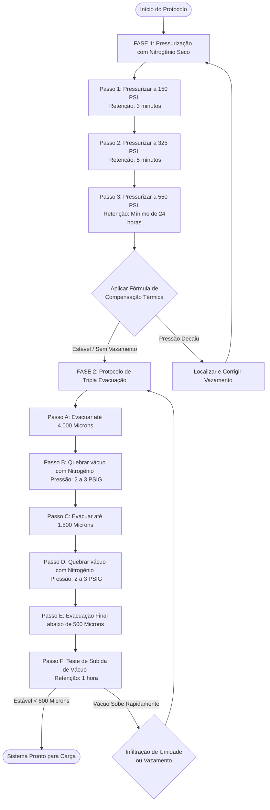

# Manual Abrangente de Manutenção e Diagnóstico para Sistemas de Fluxo de Refrigerante Variável (VRF)

O surgimento dos sistemas de Fluxo de Refrigerante Variável (VRF) e Volume de Refrigerante Variável (VRV) transformou fundamentalmente o cenário do controle climático em edifícios comerciais e residências de alto padrão. Ao utilizar o próprio refrigerante como meio de transferência térmica primário e implantar uma rede altamente sofisticada de microprocessadores, Válvulas de Expansão Eletrônicas (EEVs) e compressores inverter de velocidade variável, esses sistemas alcançam uma eficiência termodinâmica sem precedentes e um controle de zona extremamente preciso. [^1] 

No entanto, essa engenharia complexa exige uma mudança total nos paradigmas de diagnóstico e manutenção. As técnicas de solução de problemas aplicadas a sistemas de expansão direta (DX) convencionais são frequentemente inadequadas — e, ocasionalmente, destrutivas — quando aplicadas a uma arquitetura VRF. [^2] Este manual fornece uma estrutura de nível especialista para a manutenção, diagnóstico e otimização de sistemas VRF multizona.

---

## 1. Arquitetura do Sistema VRF para Manutenção

Para realizar a manutenção de um sistema VRF de forma eficaz, o técnico deve compreender as implicações práticas de sua arquitetura de fluxo. Diferente dos sistemas descentralizados onde um único compressor atende a um único evaporador, um sistema VRF opera como um ecossistema termodinâmico massivo e interdependente. Um único arranjo modular de condensadoras externas pode alimentar mais de 64 unidades evaporadoras internas distribuídas por múltiplos pavimentos de uma estrutura comercial. [^3]

### 1.1 Implicações da Tubulação de Refrigerante Compartilhada

A consequência de manutenção mais crítica deste projeto é a rede compartilhada de tubulações de refrigerante. Em um sistema convencional, um evento catastrófico como a queima de um compressor ou a formação de ácidos por umidade fica isolado em uma única zona. No sistema VRF, todo o edifício compartilha o mesmo fluxo. 

Se um instalador negligenciar a purga contínua das linhas de cobre com nitrogênio seco livre de oxigênio durante a brasagem, carepas de óxido cúprico e óxido cuproso formarão depósitos nas paredes internas dos tubos. [^4] Na partida do sistema, o fluxo de refrigerante sob alta velocidade arrastará essa fuligem abrasiva, espalhando-a pela rede, onde ela obstruirá os orifícios micrométricos de dezenas de EEVs e riscará os mancais e superfícies dos compressores inverter de alto custo. [^4] Portanto, manter a pureza química absoluta da rede de tubulações é a regra fundamental da manutenção de sistemas VRF.

### 1.2 Arquitetura de Recuperação de Calor e Caixas Seletoras de Fluxo (BS Boxes)

Sistemas VRF são categorizados amplamente em modelos do tipo **Bomba de Calor (Heat Pump - HP)**, que fornecem aquecimento ou resfriamento uniforme para todas as zonas, e modelos de **Recuperação de Calor (Heat Recovery - HR)**, que realizam aquecimento e resfriamento simultâneos em zonas distintas. [^1] Os sistemas com recuperação de calor elevam drasticamente a complexidade mecânica: utilizam uma rede de distribuição de três tubos (gás de descarga em alta pressão, gás de sucção em baixa pressão e líquido subresfriado em alta pressão) ou um arranjo avançado de separador de fases de duas tubulações. [^5]

O roteamento desse fluxo de fluido é gerenciado por **Caixas Seletoras de Fluxo (Branch Selector / BS Boxes)** ou controladores de distribuição multi-portas instalados nos entreforros acima das zonas ocupadas. [^6] Esses dispositivos contêm arranjos de válvulas solenoides e EEVs. Do ponto de vista de eficiência:
- A caixa BS permite capturar o calor rejeitado por uma sala em modo de resfriamento (como uma sala de servidores) e bombeá-lo diretamente para uma sala que solicita aquecimento (como um escritório periférico), ignorando totalmente a condensadora externa. [^1]
- Embora proporcione uma enorme economia de energia, a falha de um solenoide na caixa BS pode desestabilizar termicamente múltiplas zonas, gerando um cenário onde o sintoma (um escritório quente) está geograficamente distante da falha mecânica real (uma válvula de desvio de gás quente travada em um corredor distante). [^9]

### 1.3 Complexidade no Diagnóstico de Falhas

A natureza interdependente do VRF impede o uso de tabelas simples de pressão-temperatura para o diagnóstico de problemas localizados. [^2] Os compressores inverter variam constantemente sua frequência de rotação (Hertz) em resposta à demanda agregada das evaporadoras ativas. [^1] Consequentemente, as pressões de sucção e descarga são dinâmicas, oscilando continuamente de acordo com o perfil de carga térmica. [^1] 

Além disso, uma avaria simples em uma evaporadora — como um termistor de ar de retorno com desvio de calibração informando um valor falso de alta temperatura — pode forçar o compressor da unidade externa a acelerar desnecessariamente, superresfriando as outras zonas ativas e elevando o consumo elétrico global. [^2] Por esta razão, a manutenção moderna de sistemas VRF depende da análise de dados de telemetria digital, varredura da rede de comunicação e interpretação de softwares de diagnóstico proprietários para identificar a causa raiz de qualquer desvio operacional.

---

## 2. Gerenciamento de Refrigerante em Sistemas VRF

Como as redes VRF utilizam o refrigerante como o único vetor de transporte térmico por longas distâncias, a precisão volumétrica e a pureza química da carga total de fluido são cruciais. Os sistemas VRF utilizam carga crítica; qualquer variação de massa em relação ao projeto original afeta severamente a capacidade e pode danificar os compressores por falta de retorno de óleo ou golpe de líquido. [^2]

### 2.1 Verificação da Carga Total do Sistema

Diferente de sistemas split comuns, onde a carga pode ser ajustada em campo monitorando o superaquecimento do evaporador e o subresfriamento do condensador nas válvulas de serviço, o sistema VRF altera dinamicamente seu volume ativo de fluido refrigerante por meio do controle de suas EEVs e acumuladores de líquido. [^2] Medir pressões nas condensadoras externas fornece apenas o comportamento sob a carga momentânea, não sendo um indicador confiável da massa total de fluido contida no ciclo. [^12]

A carga total necessária é um valor matemático absoluto, calculado pela somatória da carga de fábrica da unidade condensadora externa e a **Carga Adicional de Refrigerante**, determinada pela geometria exata da linha de líquido instalada em campo. [^5] Durante o comissionamento ou após a correção de um vazamento grave, o comprimento linear de cada trecho de tubo de líquido deve ser medido e multiplicado pelos respectivos fatores de peso:

#### Fatores de Peso para Linhas de Líquido (R-410A):

| Diâmetro Nominal da Linha de Líquido | Multiplicador de Carga Adicional (Imperial) | Multiplicador de Carga Adicional (Métrico) |
| :--- | :--- | :--- |
| **$1/4\text{ polegada}$** | Comprimento ($\text{ft}$) $\times 0.015\text{ lbs/ft}$ | Comprimento ($\text{m}$) $\times 22\text{ g/m}$ [^5] |
| **$3/8\text{ polegada}$** | Comprimento ($\text{ft}$) $\times 0.040\text{ lbs/ft}$ | Comprimento ($\text{m}$) $\times 60\text{ g/m}$ [^5] |
| **$1/2\text{ polegada}$** | Comprimento ($\text{ft}$) $\times 0.081\text{ lbs/ft}$ | Comprimento ($\text{m}$) $\times 120\text{ g/m}$ [^5] |
| **$5/8\text{ polegada}$** | Comprimento ($\text{ft}$) $\times 0.121\text{ lbs/ft}$ | Comprimento ($\text{m}$) $\times 180\text{ g/m}$ [^5] |
| **$3/4\text{ polegada}$** | Comprimento ($\text{ft}$) $\times 0.175\text{ lbs/ft}$ | Comprimento ($\text{m}$) $\times 260\text{ g/m}$ [^5] |
| **$7/8\text{ polegada}$** | Comprimento ($\text{ft}$) $\times 0.249\text{ lbs/ft}$ | Comprimento ($\text{m}$) $\times 370\text{ g/m}$ [^5] |

Após calcular a carga volumétrica das linhas de líquido, aplicam-se correções adicionais:
1. Em sistemas com Recuperação de Calor, um multiplicador de compensação (tipicamente **$1.02$**) é aplicado sobre o somatório das linhas de líquido. [^5]
2. Cargas adicionais suplementares são adicionadas com base na taxa de combinação final (capacidade total das evaporadoras conectadas dividida pela capacidade nominal da condensadora externa). [^5]

A massa total calculada deve ser introduzida em estado líquido utilizando balanças eletrônicas de alta precisão enquanto o sistema estiver sob vácuo profundo. [^5] Se o vácuo não for suficiente para puxar toda a carga adicional, o técnico deve ativar os modos de carga de serviço (como o *Auto Charge Mode*) na PCB da condensadora para que o compressor succione o restante da massa necessária de forma segura. [^5]

### 2.2 Protocolo de Teste de Estanqueidade e Tripla Evacuação

Devido à extensão da tubulação e à grande quantidade de conexões soldadas e flangeadas, a detecção de vazamentos exige um método rigoroso de pressurização com nitrogênio seco (OFDN), seguido de desidratação por tripla evacuação.



Durante o teste de retenção de 24 horas a $550\text{ PSIG}$, as flutuações de temperatura ambiente alteram a pressão interna do nitrogênio nas tubulações. Para diferenciar variações térmicas de vazamentos reais, aplica-se a seguinte **Fórmula de Compensação de Temperatura**:

Em Unidades Métricas (MPa e °C):
$$P_{\text{corr}} = P_{m} + 0.02 \times (T_{p} - T_{m})$$ [^5]

Em Unidades Imperiais (PSI e °F):
$$P_{\text{corr}} = P_{m} + 0.8 \times (T_{p} - T_{m})$$ [^5]

Onde:
- $P_{\text{corr}}$: Pressão corrigida (MPa ou PSI).
- $P_{m}$: Pressão lida no manômetro no final do teste (MPa ou PSI).
- $T_{p}$: Temperatura do ar ambiente no momento da pressurização inicial (°C ou °F).
- $T_{m}$: Temperatura do ar ambiente no momento da verificação final (°C ou °F).

Se $P_{\text{corr}}$ for inferior à pressão de pressurização inicial, há vazamento na rede. Se forem iguais, a variação manométrica ocorreu apenas por contração térmica do nitrogênio.

### 2.3 Técnicas de Isolamento Seccional

Para evitar o recolhimento de centenas de quilos de refrigerante de todo um edifício comercial para reparar um vazamento localizado, as boas práticas de instalação exigem o **isolamento seccional**. [^14] A instalação de válvulas de esfera de fluxo total na linha principal de subida e nas ramificações imediatamente anteriores às caixas seletoras BS permite isolar zonas físicas do prédio. [^16] Se o sistema indicar perda de pressão, o fechamento sequencial dessas válvulas permite monitorar a queda de pressão em um setor específico, isolando o vazamento a uma fração da tubulação total. [^19]

### 2.4 Ajuste de Carga para Modificações de Rede

Em reformas de *layout* comercial (tenant fit-outs), evaporadoras são comumente adicionadas ou removidas. O técnico não deve estimar a carga por aproximação. O comprimento e o diâmetro das tubulações novas ou removidas devem ser medidos para recalcular a carga adicional. [^2] Se novas unidades forem inseridas, a massa correspondente deve ser adicionada com balança. Se tubulações forem removidas, a massa equivalente calculada deve ser recolhida em cilindro de recuperação para evitar sobrecarga de refrigerante, que elevaria as pressões e temperaturas de descarga, danificando o compressor inverter. [^20]

### 2.5 Dinâmica de Retorno de Óleo e Balanço de Lubrificante

Os compressores inverter utilizam óleos sintéticos PVE ou POE. Como o arraste do óleo lubrificante pelas tubulações depende da velocidade do gás refrigerante, períodos de operação em carga parcial reduzem a velocidade do fluxo, gerando acúmulo de óleo em evaporadores inativos e linhas de vapor. [^22]

Para evitar a falta de lubrificação no cárter do compressor, os algoritmos do VRF acionam **Ciclos de Recuperação de Óleo**:
1. Quando os registros de tempo e frequência indicam migração excessiva de óleo, as EEVs de todas as evaporadoras são totalmente abertas.
2. O compressor principal acelera até sua frequência máxima por $3\text{ a } 6\text{ minutos}$. [^22] [^24]
3. O fluxo de refrigerante de alta velocidade arrasta o óleo acumulado de volta para o separador de óleo e acumulador de sucção da condensadora externa. [^22]

Sistemas VRF antigos invertiam o ciclo para modo resfriamento para recuperar o óleo, gerando correntes de ar frio indesejadas nas zonas ocupadas durante o inverno. [^26] Tecnologias avançadas, como o *Daikin VRV*, utilizam linhas de bypass internas para manter o aquecimento contínuo durante o retorno de óleo. [^26] O *LG Multi V* emprega sistemas de controle dinâmico de óleo e tecnologia *HiPOR™* (retorno de óleo em alta pressão), que coleta o óleo do separador e o reinjeta diretamente na câmara de compressão por uma linha dedicada, reduzindo drasticamente a necessidade de ciclos de recuperação programados. [^7]

#### Diagnóstico do Sistema de Óleo
O estado de retorno de óleo é monitorado através da temperatura do fundo da carcaça do compressor (cárter). Para evitar que o fluido refrigerante líquido dilua o óleo do cárter, o sistema deve operar com um **Superaquecimento do Cárter (Sump Superheat)** mínimo:

$$\text{Superaquecimento do Cárter} = T_{\text{carcaça}} - T_{\text{saturação}}$$ [^30]

Onde:
- $T_{\text{carcaça}}$: Temperatura na base do compressor (medida aproximadamente $30\text{ mm}$ acima da solda de base da carcaça). [^30]
- $T_{\text{saturação}}$: Temperatura de saturação de vapor correspondente à pressão de sucção (obtida via sensores da condensadora).

Este valor deve ser mantido **acima de $10\text{ K}$ ($10^\circ\text{C}$)**. [^30] Se o superaquecimento cair abaixo deste limite, o refrigerante líquido condensará no óleo, diluindo-o e comprometendo a integridade mecânica dos mancais. O técnico pode verificar a saúde do sensor NTC de base do compressor medindo sua resistência (valores típicos variam de **$15\text{ k}\Omega$ a $0^\circ\text{C}$** a **$3.1\text{ k}\Omega$ a $40^\circ\text{C}$**). [^29]

---

## 3. Manutenção de Rede de Comunicação

A rede de comunicação digital é o sistema nervoso do VRF. Sem a troca contínua de pacotes de dados entre as evaporadoras, caixas seletoras e a condensadora mestre, o funcionamento físico é interrompido e códigos de erro de comunicação são ativados.

### 3.1 Integridade física da Rede RS-485 Daisy-Chain

A maioria das fabricantes adota o padrão físico RS-485 para a transmissão de sinais de controle. A comunicação Daikin *DIII-Net* (terminais F1/F2) opera com um sinal pulsado de $16\text{VDC}$ a $24\text{VDC}$ sem polaridade. [^36] O sistema *M-Net* da Mitsubishi opera em aproximadamente $30\text{VDC}$. [^39]

A topologia da rede deve seguir estritamente o padrão de **ligação em série (daisy chain)**. Topologias em estrela ou derivações em T (T-taps) não são permitidas. [^35] De acordo com a teoria de linhas de transmissão de alta frequência:
- Derivações ou emendas criam descasamentos de impedância na linha.
- Quando os pulsos de dados encontram uma ramificação, parte da energia eletromagnética reflete de volta ao transmissor, colidindo com os pacotes de dados subsequentes.
- Essa colisão causa interferência destrutiva, resultando em erros de comunicação e perda de comunicação com as evaporadoras. [^42]

```
Correto (Daisy Chain):
[Condensadora] ---- [Evaporadora 1] ---- [Evaporadora 2] ---- [Evaporadora 3] ---- [Resistor Terminação 120Ω]

Incorreto (Star Topology / T-Tap):
                    +--- [Evaporadora 1]
                    |
[Condensadora] -----+--- [Evaporadora 2]
                    |
                    +--- [Evaporadora 3] (Gera reflexão de dados e falha de pacotes)
```

Para evitar essas reflexões de sinal, as extremidades físicas do barramento devem ser terminadas com resistores que casem com a impedância característica do cabo de comunicação. Utilizando cabos blindados de par trançado de alta qualidade (como o padrão *Belden 9841* de $120\Omega$ de impedância característica), um resistor de **$120\Omega$** deve ser posicionado no primeiro nó (condensadora ou centralizador) e outro no último nó físico da linha de comunicação. [^3] A instalação incorreta de resistores em nós intermediários atenuará a amplitude do sinal elétrico, impedindo a leitura dos dados pelos transceptores das placas. [^42] Com a rede desenergizada, a medição de resistência nos bornes de comunicação deve registrar aproximadamente **$60\Omega$** (dois resistores de $120\Omega$ em paralelo). [^3]

A blindagem (*shield*) do cabo de comunicação deve possuir continuidade elétrica em todas as conexões intermediárias, sendo aterrada em **apenas uma das extremidades** (geralmente no chassi da condensadora mestre). Aterrar a blindagem em múltiplos pontos cria laços de terra (ground loops), transformando a blindagem em uma antena receptora de ruídos eletromagnéticos gerados por cabos de potência adjacentes. [^34]

### 3.2 Resolução de Conflitos de Endereçamento

Cada placa eletrônica conectada ao barramento de controle do VRF deve possuir um endereço de identificação exclusivo. Conflitos de endereçamento (endereços duplicados) ocorrem frequentemente durante o comissionamento inicial ou após a substituição de placas de evaporadoras sem a devida configuração dos seletores de endereço.

Quando duas unidades compartilham o mesmo endereço na rede, os pacotes de resposta colidem no receptor da condensadora, gerando dados corrompidos. Os protocolos modernos realizam varreduras automáticas para detectar respostas de múltiplos identificadores de hardware sob um mesmo endereço lógico. Em campo, o endereçamento pode ser configurado de forma manual (via chaves seletoras rotativas DIP switches na PCB) ou atribuído de forma automática na inicialização do sistema. [^39]

Quando falhas de endereçamento são exibidas (ex.: erro **CH07** na LG ou **U5** na Daikin), o procedimento recomendado consiste em: [^21]
1. Seccionar a linha de comunicação dividindo o barramento físico ao meio.
2. Reiniciar o sistema e verificar qual metade da rede mantém o código de erro ativo.
3. Repetir o processo de divisão sucessiva (busca binária) até localizar a placa com configuração duplicada ou o componente com falha na gravação do endereço em sua memória EEPROM. [^7]

### 3.3 Integração com Protocolos Open (BMS)

Em automações prediais, a rede proprietária do VRF é integrada ao Sistema de Gerenciamento Predial (BMS) através de gateways de comunicação. Estes dispositivos atuam como tradutores de protocolo, convertendo os dados seriais do VRF em protocolos abertos como **BACnet/IP, LonWorks ou Modbus TCP**. [^38]

A manutenção destes gateways envolve tarefas de configuração de rede lógica e TI:
- Deve-se assegurar que os endereços IP estáticos, máscaras de subrede e rotas de gateway estejam configurados de forma consistente com a rede de dados do edifício. Por exemplo, o Gateway BACnet de fábrica da Lennox possui o endereço padrão configurado na interface Eth0 como `192.168.1.8`, cujas credenciais de acesso padrão devem ser alteradas na entrega da obra para fins de segurança cibernética. [^52]
- Atualizações periódicas de firmware disponibilizadas pelos fabricantes devem ser aplicadas para corrigir vulnerabilidades ou melhorar o mapeamento dos pontos de dados dos sensores. [^54] O processo de atualização (como o instalador de firmware `vrfsgsetup-1.2.0.exe` em gateways Johnson Controls) requer conexão direta via Ethernet, uso de fontes de alimentação ininterruptas (nobreaks) e liberação de portas de firewall no computador de serviço. Interrupções na gravação do firmware podem danificar permanentemente a memória flash do gateway (efeito bricking). [^55]

---

## 4. Manutenção de Caixa de Distribuição (BS Box)

Nas arquiteturas de Recuperação de Calor, a caixa BS (ou MCU - Unidade de Controle de Modo) realiza a distribuição das linhas de fluido refrigerante, direcionando gás quente para as evaporadoras em modo de aquecimento ou líquido subresfriado para as evaporadoras em resfriamento. [^5] Devido à sua instalação em áreas de entreforro e à operação sob amplas faixas de pressão e temperatura, a inspeção deste componente é fundamental.

### 4.1 Diagnóstico de Válvulas Solenoides e Comportamento Térmico

O direcionamento do fluido dentro da caixa BS é controlado por um arranjo de válvulas solenoides. A queima da bobina elétrica ou o travamento mecânico do êmbolo interno do solenoide são falhas comuns nestes módulos. [^13]

#### Teste Prático de Funcionamento:
- Ao alternar o modo de operação de uma evaporadora de resfriamento para aquecimento, deve-se ouvir um estalo metálico característico na caixa BS, correspondente ao deslocamento físico do êmbolo da válvula solenoide piloto por ação do campo magnético da bobina. [^9]
- A ausência deste estalo metálico indica bobina sem alimentação elétrica ou travamento mecânico do êmbolo por resíduos e óxidos de cobre presentes no circuito de refrigerante. [^4]
- Uma bobina energizada e funcional dissipa calor por Efeito Joule, tornando-se quente ao toque.
- A passagem de refrigerante em restrição por uma válvula com abertura parcial provoca expansão adiabática local (Efeito Joule-Thomson), gerando uma visível diferença de temperatura entre a entrada e a saída da tubulação de cobre da válvula.
- Para verificar a parte elétrica da bobina, desenergize a caixa BS, desconecte o terminal da bobina na PCB e meça a resistência ôhmica das espiras. Conforme o fabricante, valores normais para bobinas de $24\text{VDC}$ situam-se em torno de **$26\Omega$ ou $47\Omega$**; leituras de circuito aberto ($\text{OL}$) confirmam a interrupção da bobina, exigindo sua troca imediata. [^57]

### 4.2 Verificação de Motores de Passo de EEVs nas Caixas de Distribuição

As caixas BS também contêm EEVs auxiliares para dosar e regular o fluxo de fluido subresfriado. O teste das EEVs nas caixas BS segue o padrão de medição de resistência nos enrolamentos do motor de passo. Com a bobina desconectada da placa controladora, os enrolamentos devem ser testados: os valores típicos variam entre **$26\Omega$ e $750\Omega$** de acordo com a potência da EEV. Valores infinitos indicam queima da fase de acionamento.

A agulha da EEV é movida pelo rotor magnético interno em micropassos. O teste de integridade é realizado medindo a resistência elétrica entre o pino comum e os quatro pinos de fase de controle (1 a 4) em conectores de 5 ou 6 vias. [^23] Leituras equilibradas atestam a saúde elétrica da bobina. Em casos de travamento mecânico da agulha por contaminantes com bobina elétrica saudável, dispositivos portáteis de teste (como o *EEVMate*) podem ser conectados diretamente ao terminal do motor de passo para forçar pulsos de alta frequência (modo overdrive/turbo), liberando o rotor e limpando a sede da válvula sem necessidade de intervenção física no circuito frigorífico. [^23]

### 4.3 Integridade Eletrônica e Isolamento Térmico

O monitoramento do status da placa eletrônica interna da caixa BS é realizado por meio de seus LEDs de sinalização: o funcionamento correto exibe o LED verde piscando em frequência constante, enquanto anomalias ativam sequências específicas de piscadas (códigos de piscadas). [^13]

Como a caixa BS opera simultaneamente com linhas de gás superaquecido ($82^\circ\text{C}$ / $180^\circ\text{F}$) adjacentes a linhas de líquido subresfriado ($4^\circ\text{C}$ / $40^\circ\text{F}$), o risco de condensação e corrosão ácida por umidade externa é elevado. É imperativo inspecionar a integridade do isolamento térmico elastomérico que reveste as linhas internas de cobre:
- As emendas do isolamento devem ser seladas com adesivo apropriado, sem vãos ou fendas abertas.
- É estritamente proibido isolar as linhas de gás quente e de líquido sob o mesmo revestimento térmico. O contato físico direto provoca transferência indesejada de calor entre as linhas, reduzindo o subresfriamento do líquido e desestabilizando os cálculos do algoritmo de controle de fluxo. [^63]

> [!IMPORTANT]
> Durante a inspeção predial, o técnico deve certificar-se de que os alçapões de acesso no teto gesso possuem as dimensões adequadas de passagem livre recomendadas pelo fabricante. A falta de espaço adequado impede a remoção de placas eletrônicas, bobinas solenoides ou a realização de soldas de novas válvulas em caso de manutenção corretiva, exigindo a quebra de estruturas do teto do cliente. [^6]

---

## 5. Manutenção de Unidade Externa Multi-Compressor

As condensadoras externas concentram a maior carga mecânica e elétrica do sistema. Em arranjos modulares de grande porte, até três módulos são interligados para atuar em paralelo como um único circuito, combinando compressores inverter de velocidade variável com compressores slave de rotação fixa. [^7]

### 5.1 Rodízio e Relação de Staging dos Compressores

A placa de controle mestre realiza o rodízio do compressor principal entre os módulos disponíveis para igualar as horas de operação e distribuir o desgaste mecânico de forma uniforme pelos mancais de rolagem. [^65] Quando a carga de climatização no edifício aumenta:
1. O compressor inverter acelera até sua frequência máxima operacional.
2. Caso a capacidade máxima do inverter não atenda à demanda, a placa aciona o compressor slave de velocidade fixa para suprir a vazão mássica base.
3. O compressor inverter reduz sua frequência temporariamente para atuar no controle de sintonia fina da carga (modo *trim*). [^7]

#### Diagnóstico Elétrico e Térmico do Compressor
O monitoramento do compressor correlaciona a corrente (amperagem) consumida com os dados de frequência operacional em Hertz e a temperatura de descarga fornecidos pelo software de diagnóstico do fabricante. [^11] Se um compressor inverter operando em baixas frequências (ex.: $30\text{ Hz}$) apresentar consumo elétrico próximo à corrente máxima admissível, indica sobrecarga por atrito mecânico interno nas espirais do scroll, retorno de fluido líquido para a câmara de compressão ou alta pressão de descarga causada por excesso de refrigerante no condensador. [^11]

A temperatura do gás superaquecido na descarga do compressor deve ser monitorada para evitar degradação térmica: ela deve ser mantida **abaixo de $107^\circ\text{C}$ a $115^\circ\text{C}$ ($225^\circ\text{F}$ a $239^\circ\text{F}$)** de acordo com os limites de projeto. [^7] Temperaturas de descarga excessivas carbonizam o lubrificante POE/PVE, formando resíduos ácidos e sludges que bloqueiam dutos internos e causam a quebra do compressor por travamento mecânico. [^20] Temperaturas elevadas de descarga são geradas por:
- Falta de refrigerante no ciclo (vazamentos). [^2]
- Evaporadora com fluxo restrito por EEV travada fechada, reduzindo o resfriamento das bobinas elétricas por gás de retorno. [^2]
- Condensadora obstruída por sujeira, elevando a pressão e a temperatura de condensação. [^2]

### 5.2 Teste do Inversor da Placa do Compressor (IGBT)

A placa do inversor chaveia a tensão elétrica retificada para gerar as ondas de frequência modulada destinadas ao motor do compressor. Falhas nos transistores semicondutores IGBTs são causas comuns de paradas elétricas severas. [^69] 

O procedimento de teste de diodo em 12 passos para validar os IGBTs da placa inversora, após garantir a descarga total dos capacitores para $0\text{VDC}$ para evitar choques elétricos e com os cabos do compressor ($U, V, W$) desconectados, é realizado conforme a sequência abaixo:

1. **Teste Reverso Positivo:** Posicione a ponta Vermelha (+) do multímetro (escala de Diodo) no barramento positivo **$P+$** da placa e a ponta Preta (-) sequencialmente nos bornes **$U$**, **$V$** e **$W$**. As leituras devem ser **$\text{OL}$ (Open Line)** em todos os três bornes. [^67]
2. **Teste Reverso Negativo:** Posicione a ponta Preta (-) do multímetro no barramento negativo **$N-$** da placa e a ponta Vermelha (+) nos bornes **$U$**, **$V$** e **$W$**. As leituras devem ser **$\text{OL}$** em todos os três bornes. [^67]
3. **Teste Direto Negativo:** Posicione a ponta Vermelha (+) no barramento negativo **$N-$** e a ponta Preta (-) nos bornes **$U$**, **$V$** e **$W$**. O multímetro deve registrar uma queda de tensão típica de diodo de aproximadamente **$0.4\text{V}$ a $0.5\text{V}$** em cada terminal. [^67]
4. **Teste Direto Positivo:** Posicione a ponta Preta (-) no barramento positivo **$P+$** e a ponta Vermelha (+) nos bornes **$U$**, **$V$** e **$W$**. O multímetro deve registrar a queda de tensão de diodo de aproximadamente **$0.4\text{V}$ a $0.5\text{V}$** em cada terminal. [^67]

> [!WARNING]
> Se qualquer uma das leituras de teste direto registrar queda de tensão zero ($0\text{V}$), indica curto-circuito interno na junção de silício do transistor IGBT. Caso registre circuito aberto ($\text{OL}$) nos passos de polarização direta, indica que o canal semicondutor está rompido. Em ambos os casos, a placa inversora deve ser substituída antes de religar a condensadora externa. [^67]

### 5.3 Diagnóstico de Acumuladores, Separadores e Ventilador DC Externa

O circuito frigorífico da condensadora é composto por vasos de pressão e ventiladores modulares:
- **Acumulador de Sucção:** Retém o fluido líquido não evaporado para que apenas vapor entre no compressor, evitando golpe de líquido. [^70] O técnico deve inspecionar os visores de líquido instalados na linha de retorno (se equipados) para garantir o fluxo adequado e certificar-se de que o acumulador não está operando inundado além da capacidade volumétrica.
- **Separador de Óleo:** Instalado na linha de descarga do compressor para capturar o óleo e reinjetá-lo diretamente no cárter. [^70] O correto funcionamento do separador é monitorado avaliando o diferencial de temperatura através do seu corpo físico (com termômetros de contato ou câmeras térmicas). Um correto diferencial térmico atesta o retorno contínuo de óleo; a ausência de queda de temperatura indica entupimento no capilar interno de retorno ou travamento do mecanismo da boia interna do separador de óleo. [^70]
- **Ventiladores com Motor BLDC:** Modulam a velocidade de rotação para manter a pressão de condensação estável sob variações de temperatura externa. O técnico deve utilizar o software de diagnóstico para validar a varredura e modulação dos ventiladores em resposta à elevação da pressão de alta. Vibrações anormais ou paradas bruscas com códigos de erro de motor travado (ex.: erro **CH67** na LG) indicam bobinado estatórico queimado ou travamento físico nos rolamentos do motor do ventilador. [^51]

---

## 6. Comissionamento Sazonal e Otimização

Inspeções sistemáticas sazonais devem ser realizadas duas vezes ao ano para preparar os equipamentos para os períodos de maior estresse térmico, otimizando o consumo de energia da instalação comercial.

### 6.1 Protocolos de Preparação para Verão e Inverno

#### Preparação para o Verão
O objetivo principal é assegurar a máxima capacidade de rejeição de calor da condensadora:
- As serpentinas de alumínio externas devem ser lavadas para eliminar poeira e detritos acumulados. Como as condensadoras VRF possuem trocadores de alta densidade e designs microcanalizados, deve-se evitar lavadoras de alta pressão e produtos químicos ácidos que possam danificar as finas aletas de alumínio. [^2]
- Após a limpeza, o sistema deve ser testado sob condições de pico térmico externo, ativando o modo de resfriamento forçado em todas as evaporadoras. [^2]
- O técnico deve monitorar os subresfriamentos nas linhas principais de líquido, a capacidade total entregue e as correntes operacionais dos compressores inverter para registrar os parâmetros de referência da temporada. [^2]

#### Preparação para o Inverno
O foco é a eficiência no ciclo de aquecimento e proteção elétrica dos componentes:
- Os aquecedores de cárter, instalados na base dos compressores, devem ser inspecionados. Uma resistência de aquecimento típica do tipo PTC de $40\text{W}$ / $265\text{V}$ deve apresentar leitura de resistência a frio de aproximadamente **$1.800\Omega$**. [^56] Esta resistência mantém o cárter aquecido durante os desligamentos do compressor para evaporar qualquer refrigerante líquido que migre para o lubrificante. [^56]
- O funcionamento dos ciclos de degelo automático deve ser simulado através do software de serviço.
- Em regiões frias com temperaturas próximas ou abaixo de zero, a resistência da bandeja da base da condensadora deve ser avaliada para certificar-se de que a água do degelo escoe livremente e não congele na base, o que danificaria as fileiras inferiores da serpentina externa. [^25]
- Defletores de vento externos e telas anticongelamento (como os módulos *Lennox V1LACB* e *V1BPNH*) devem ser checados para garantir que ventos gelados não impeçam a condensadora de alcançar a pressão mínima de trabalho necessária para o ciclo. [^24]

### 6.2 Otimização Logística via Automação Predial

O gerenciamento de programações horárias e setpoints através do controlador central otimiza o consumo do sistema VRF. Ao configurar setback térmico de recuo em zonas desocupadas de escritórios comerciais, a demanda global da condensadora externa diminui, permitindo que os compressores inverter trabalhem em baixas rotações, onde o seu Coeficiente de Desempenho (COP) alcança o nível máximo de eficiência energética. [^1]

Oscilações bruscas de temperatura ou baixa capacidade de refrigeração em evaporadoras específicas apontam para falhas de leitura ou restrições de fluxo na zona. [^10] Se uma sala não atinge o setpoint, deve-se avaliar as leituras dos seguintes quatro sensores NTC da unidade evaporadora correspondente:
1. Temperatura do Ar de Retorno. [^2]
2. Temperatura do Ar Insuflado.
3. Temperatura de Entrada da Linha de Líquido.
4. Temperatura de Saída da Linha de Gás. [^2]

Calculando a diferença entre as temperaturas do Sensor de Saída de Gás e o Sensor de Entrada de Líquido da serpentina interna, o técnico obtém o superaquecimento local da evaporadora:
- Um superaquecimento excessivamente elevado (ex.: acima de $15\text{ K}$ / $30^\circ\text{F}$) indica falta de fluxo de refrigerante na serpentina.
- Se o monitor de telemetria mostrar que a EEV correspondente está aberta a $100\%$ ($480+$ pulsos) e o superaquecimento permanece alto, a EEV está travada mecanicamente fechada. [^2]
- Se o sensor de temperatura do Ar de Retorno apresentar desvio de calibração para baixo (lendo uma temperatura inferior à real da sala), a placa lógica fechará a EEV precocemente por entender que o setpoint foi alcançado, deixando o ambiente sem refrigeração. [^10]

---

## 7. Códigos de Falhas de Fabricantes e Checklists

Quando a eletrônica de controle detecta parâmetros operacionais fora da faixa segura de projeto, o sistema bloqueia o funcionamento e exibe códigos de erro nos painéis de controle e displays das placas.

### 7.1 Códigos de Erro - Daikin VRV

A Daikin organiza os erros pela letra inicial do código: 'A' e 'C' indicam falhas nas evaporadoras; 'E', 'F', 'H', 'J' e 'L' referem-se a falhas nas condensadoras externas; 'U' indica erros de comunicação ou incompatibilidade de software do sistema. [^21]

| Código de Erro | Classificação do Componente | Significado Técnico e Causa Provável |
| :---: | :--- | :--- |
| **A1** | Placa Eletrônica Interna | Falha de processamento na PCB da evaporadora; interferência de ruído elétrico. |
| **A3** | Sistema de Condensado Interno | Nível crítico de água na bandeja; falha na bomba de dreno ou boia de nível travada. |
| **A9** | EEV Interna | Falha de posicionamento da EEV; bobina queimada ou quebra de fases na PCB da evaporadora. |
| **C4 / C5** | Sensores Internos | C4: Sensor de temperatura da serpentina aberto/curto. C5: Falha no sensor de tubo de sucção. |
| **E3** | Proteção Externa | Atuação do pressostato de alta pressão; serpentina externa suja ou excesso de refrigerante. |
| **E4** | Proteção Externa | Atuação do sensor de baixa pressão; indica falta grave de refrigerante por vazamento. |
| **J3** | Sensores Externos | Sensor de temperatura do tubo de descarga quebrado, desconectado ou descalibrado. |
| **L5** | Inversor Externo | Sobrecorrente instantânea no inversor (saída DC); curto nas bobinas do compressor ou rotor travado. |
| **U1** | Configuração Elétrica | Inversão de fases de alimentação ou perda de fase elétrica na entrada da condensadora. |
| **U4** | Comunicação Geral | Perda de comunicação entre as evaporadoras e a condensadora; falha no cabo RS-485. |
| **U5** | Comunicação Interna | Erro de comunicação com o controle remoto; placas com seletores mestre/escravo duplicados. |

### 7.2 Códigos de Erro - Mitsubishi City Multi

A Mitsubishi adota códigos numéricos de quatro dígitos: a série 1xxx indica falhas no ciclo frigorífico, 2xxx refere-se a falhas no fluxo de condensado, 4xxx/5xxx a erros de placas e sensores e 6xxx a quedas de comunicação no barramento M-Net. [^32]

| Código de Erro | Classificação do Componente | Significado Técnico e Causa Provável |
| :---: | :--- | :--- |
| **1102** | Ciclo Frigorífico | Temperatura de descarga do compressor acima de $110^\circ\text{C}$; indica falta de refrigerante. |
| **1301** | Ciclo Frigorífico | Falha por baixa pressão; vazamento de fluido ou restrição de fluxo por válvula fechada. |
| **1302** | Ciclo Frigorífico | Falha por alta pressão; restrição de fluxo nas tubulações ou trocador externo sujo. |
| **2500** | Sistema de Condensado | Transbordamento da bandeja de dreno; sensor de nível de água submerso. |
| **5101** | Sensores Internos | Sensor de temperatura do ar de retorno da evaporadora (TH21) aberto ou em curto. |
| **5201** | Sensores Externos | Sensor de alta pressão da condensadora (63HS1) com leitura incorreta ou danificado. |
| **6607** | Comunicação M-Net | Falha de recebimento de sinal com um endereço específico na rede de comunicação. |

### 7.3 Códigos de Erro - LG Multi V

A LG utiliza o prefixo "CH" seguido de números de identificação. O sistema tenta reiniciar a operação de forma automática em determinadas falhas de nível 3 antes de gerar o bloqueio de segurança manual (hard lockout). [^78]

| Código de Erro | Classificação do Componente | Significado Técnico e Causa Provável |
| :---: | :--- | :--- |
| **CH01** | Unidade Evaporadora | Sensor de temperatura de retorno de ar da evaporadora quebrado ou em curto-circuito. |
| **CH04** | Unidade Evaporadora | Falha no sensor de nível ou bomba de dreno da evaporadora por linha de escoamento obstruída. |
| **CH05** | Linha de Comunicação | Falha de comunicação de dados entre evaporadoras e condensadoras por tempo superior a 5 minutos. |
| **CH47** | Unidade Condensadora | Falha na válvula de expansão eletrônica (EEV) externa; bobina queimada ou agulha travada. |
| **CH53** | Comunicação Modulares | Perda de comunicação de dados entre a condensadora mestre e as condensadoras escravas. |
| **CH61** | Temperatura Externa | Temperatura da serpentina da condensadora muito alta; pressostato de alta ativado por sujeira. |
| **CH62 / CH65** | Inversor Externo | Temperatura do dissipador do IPM muito alta; pasta térmica danificada ou ventilador inativo. |
| **CH67** | Ventilador Externo | Falha de travamento no motor BLDC do ventilador da condensadora externa; motor impedido de girar. |

---

### Checklist de Manutenção Preventiva para Sistemas VRF

| Domínio de Inspeção | Ação de Manutenção Exigida | Meta de Diagnóstico / Valor Técnico de Referência |
| :--- | :--- | :--- |
| **Termodinâmica do Refrigerante** | Coletar dados operacionais históricos conectando software de diagnóstico (LGMV, Service Checker). | Temperatura de descarga $< 107^\circ\text{C}$ ($225^\circ\text{F}$). Superaquecimento do cárter do compressor $> 10\text{ K}$. |
| **Termodinâmica do Refrigerante** | Avaliar o diferencial térmico no vaso separador de óleo por termografia. | Queda de temperatura perceptível entre a entrada superior e a saída inferior do separador. |
| **Termodinâmica do Refrigerante** | Validar a carga adicional de refrigerante inserida em campo contra o memorial de cálculo. | Carga registrada na placa da caixa de controle deve bater com a medição de todas as linhas de líquido. |
| **Alimentação e Comunicação** | Medir a tensão de entrada nos bornes principais da condensadora externa sob carga plena. | Desequilíbrio entre fases de alimentação elétrica não deve exceder $2\%$. |
| **Alimentação e Comunicação** | Inspecionar fisicamente os cabos e conexões da rede RS-485 / M-Net e blindagem do cabo. | Blindagem trançada aterrada exclusivamente no chassi da condensadora mestre (sem loops de terra). |
| **Alimentação e Comunicação** | Medir a resistência do barramento de comunicação nos terminais das placas. | Resistores de $120\Omega$ montados apenas nas duas extremidades físicas; leitura em paralelo de aprox. $60\Omega$. |
| **Caixas BS e Distribuição** | Forçar trocas de ciclo via termostatos para avaliar o acionamento de solenoides. | Ruído mecânico de comutação metálica audível; queda de temperatura na expansão da EEV interna. |
| **Caixas BS e Distribuição** | Medir resistências das bobinas de motores de passo das EEVs e válvulas solenoides. | Resistência nominal entre fios de fase da EEV na faixa de $26\Omega$ a $750\Omega$. |
| **Mecânica da Condensadora** | Limpar as aletas de alumínio da condensadora com hidrojateamento de baixa pressão. | Eliminação de bloqueios de poeira e recuperação da rejeição térmica sem entortar aletas. |
| **Mecânica da Condensadora** | Realizar medições de teste de diodo nos terminais do inversor IGBT do compressor. | Queda de tensão entre $0.4\text{V}$ e $0.5\text{V}$ em polarização direta; leitura aberta ($\text{OL}$) em reverso. |
| **Mecânica da Condensadora** | Medir a resistência a frio da resistência elétrica de cárter e bandeja externa. | Leitura ôhmica estável próxima a $1.800\Omega$ para resistências de aquecimento do tipo PTC de $40\text{W}$ / $265\text{V}$. |
| **Mecânica da Condensadora** | Inspecionar visores do acumulador de sucção e rotação livre de ventiladores BLDC. | Ausência de líquido espumante no retorno de sucção; hélice gira livre sem ruídos metálicos. |

---

## Referências citadas

[^1]: *Variable Refrigerant Flow Heat Pumps: Engineering Reference - Big Ladder Software*, acessado em junho 13, 2026, https://bigladdersoftware.com/epx/docs/8-7/engineering-reference/variable-refrigerant-flow-heat-pumps.html
[^2]: *Why VRF Diagnostics Demand a Systems-Level Approach - Trade Agent*, acessado em junho 13, 2026, https://www.thetradeagent.com/blog/advanced-vrf-system-diagnostics-guide
[^3]: *Get Connected: How to Operate Your RS-485 Links without Termination - Texas Instruments*, acessado em junho 13, 2026, https://www.ti.com/document-viewer/lit/html/SSZTBA4
[^4]: *Variable Refrigerant Flow (VRF) Installation and Commissioning - The Vertex Companies*, acessado em junho 13, 2026, https://vertexeng.com/insights/variable-refrigerant-flow-vrf-installation-and-commissioning/
[^5]: *Daikin VRV Commissioning Guide Participant Guide*, acessado em junho 13, 2026, https://apps.goodmanmfg.com/training/files/54aeaf8f0ecccTB-VRV107-VRV-Commissioning-Only.pdf
[^6]: *INSTALLATION INSTRUCTIONS - Lennox*, acessado em junho 13, 2026, https://www.lennox.com/dA/b1114b8a07/507886-04.pdf
[^7]: *OPERATION AND MAINTENANCE MANUAL - LG Electronics*, acessado em junho 13, 2026, https://media.us.lg.com/m/532a1f0c47275b65/original/OM_MULTI-V-5-OPERATION-MAINTENANCE-MANUAL_06_24-pdf.pdf
[^8]: *A Novel Variable Refrigerant Flow (VRF) Heat Recovery System Model: Development and Validation*, acessado em junho 13, 2026, https://eta-publications.lbl.gov/sites/default/files/t._hong_a_novel_variable_refrigerant_flow_vrf_heat_recovery_system.pdf
[^9]: *How to rectify VRF air conditioner Control PCB no power light - YouTube*, acessado em junho 13, 2026, https://www.youtube.com/watch?v=arC2zW1hCeU
[^10]: *Understanding and Troubleshooting VRF System Issues - Sarli Mechanical Services*, acessado em junho 13, 2026, https://sarlimechanicalservices.com/blog/troubleshooting-vrf-system-issues
[^11]: *LG VRF - Help a brotha one more time? : r/HVAC - Reddit*, acessado em junho 13, 2026, https://www.reddit.com/r/HVAC/comments/1s24ckh/lg_vrf_help_a_brotha_one_more_time/
[^12]: *Trouble determining lack of refrigerant on VRV and Inverter Systems : r/HVAC - Reddit*, acessado em junho 13, 2026, https://www.reddit.com/r/HVAC/comments/16ebg6v/trouble_determining_lack_of_refrigerant_on_vrv/
[^13]: *Daikin VRV Service & Troubleshooting Participant Guide*, acessado em junho 13, 2026, https://apps.goodmanmfg.com/training/files/54aeaf37b9064TB-VRV104-VRVIII-S-T.pdf
[^14]: *VRF Air Conditioning System Specifications | PDF | Pipe (Fluid Conveyance) - Scribd*, acessado em junho 13, 2026, https://www.scribd.com/document/967648603/Part-3-04B-ACMV-Specifications
[^15]: *houston airport system - design standards manual*, acessado em junho 13, 2026, https://downloads.ctfassets.net/fwldykjthzos/55yVy5F8V5k1O9nMaLzEwv/4e72d921f4f9af6cec9b81d1d71084ff/HAS_Design_Manual.pdf
[^16]: *Small Animal (Rodent) Vivarium Design Standards | PDF | Water Heating - Scribd*, acessado em junho 13, 2026, https://www.scribd.com/document/373971684/Small-Animal-Rodent-Vivarium-Design-Standards-1
[^17]: *Isolation Ball Valves - Parker EBVP Series*, acessado em junho 13, 2026, https://ph.parker.com/us/en/product-list/ebv-ball-valves-isolation-ball-valves
[^18]: *Isolation Valves for HVAC Pipework Systems - Crane Fluid Systems*, acessado em junho 13, 2026, https://www.cranefs.com/isolation-valves-hvac/
[^19]: *Best way to make a VRF service friendly is to have ball valves before on your mains and after on your branch lines on BC box : r/HVAC - Reddit*, acessado em junho 13, 2026, https://www.reddit.com/r/HVAC/comments/tqjodp/best_way_to_make_a_vrf_service_friendly_is_to/
[^20]: *Compressor Discharge Temperature Reflects How Equipment is Operating - ACHR News*, acessado em junho 13, 2026, https://www.achrnews.com/articles/142619-compressor-discharge-temperature-reflects-how-equipment-is-operating
[^21]: *Service Manual | Daikin*, acessado em junho 13, 2026, https://www.daikinbahrain.com/content/dam/DameaWebsite/ProductGroups/VRV/VRV-X/RXQ-ARYFK%20Service%20Manual.pdf
[^22]: *Energy Conservation Program: Test Procedure for VRF Multi-Split Systems*, acessado em junho 13, 2026, https://www.federalregister.gov/documents/2021/12/10/2021-26288/energy-conservation-program-test-procedure-for-vrf-multi-split-systems
[^23]: *Electronic Expansion Valve Troubleshooting - HVAC School*, acessado em junho 13, 2026, http://www.hvacrschool.com/electronic-expansion-valve-troubleshooting/
[^24]: *SUBMITTAL DATA - VPD072S6M-5G VRF Heat Pump 460V - Lennox*, acessado em junho 13, 2026, https://www.lennox.com/dA/58fc2fe28f/VPD072S6M-5G.pdf
[^25]: *SUBMITTAL DATA - VRD240S6M-5G VRF Heat Recovery 460V - Lennox*, acessado em junho 13, 2026, https://www.lennox.com/dA/6d709b72f5/VRD240S6M-5G.pdf
[^26]: *Daikin VRV III Ductless & Ducted advanced Heating & Air conditioning systems*, acessado em junho 13, 2026, https://pacificairconditioner.com/files/Daikin_VRVIII_Brochure.pdf
[^27]: *VRF Systems - Commercial Technology - LG Air Conditioning Technologies*, acessado em junho 13, 2026, https://lghvac.com/commercial/technology/
[^28]: *City Multi error code.xlsx - Mitsubishi Electric Asia*, acessado em junho 13, 2026, https://www.mitsubishielectric.com.sg/getmedia/1e62eab7-7520-4a01-8f94-a9f0bebd0f7d/CityMultiErrorCode.pdf
[^29]: *CITY MULTI Fault Code Troubleshooting Guide | PDF | Power Supply - Scribd*, acessado em junho 13, 2026, https://www.scribd.com/document/833402840/CityMultierrorCode
[^30]: *V3 INVERTER SINGLE SCROLL - JE Hall*, acessado em junho 13, 2026, https://commercial.jehall.co.uk/files/ww/ccu%20-%20technical-manuals/V3%20Inverter%20Single%20Scroll%20Technical%20Manual%2001.09.2021.pdf
[^31]: *R407C Heat Pump Installation Manual | PDF | Air Conditioning | Pipe (Fluid Conveyance)*, acessado em junho 13, 2026, https://www.scribd.com/document/564989758/puhp8ye
[^32]: *Mitsubishi Fault Codes PDF | PDF | Power Inverter | Power Supply - Scribd*, acessado em junho 13, 2026, https://www.scribd.com/document/363198215/Mitsubishi-Fault-Codes-pdf
[^33]: *RS-485 Termination - NI - National Instruments*, acessado em junho 13, 2026, https://www.ni.com/docs/en-US/bundle/ni-serial/page/rs-485-termination.html
[^34]: *RS485 Daisy-Chain Wiring: Termination Resistor Requirements - Industrial Monitor Direct*, acessado em junho 13, 2026, https://industrialmonitordirect.com/blogs/knowledgebase/rs485-daisy-chain-topology-why-termination-resistors-matter
[^35]: *INSTALLATION MANUAL WITH - LG HVAC*, acessado em junho 13, 2026, https://lghvac.com/resource-service?filename=IM_MultiV5_LGRED_OutdoorUnits.pdf
[^36]: *Daikin D-Bus F1 & F2 Wiring Guide | PDF | Electromagnetic Interference - Scribd*, acessado em junho 13, 2026, https://www.scribd.com/document/896242003/Daikin-D-Bus-Communication
[^37]: *Daikin Basic Control Wiring - DXS - Direct Expansion Solutions*, acessado em junho 13, 2026, https://dxseng.com/daikin-basic-control-wiring/
[^38]: *Daikin VRV Installation & Commissioning Participant Guide*, acessado em junho 13, 2026, https://apps.goodmanmfg.com/training/files/54aeaea25242bTB-VRV101-VRVIII-I-C-16.pdf
[^39]: *Mitsubishi Electric's M-Net Adaptors - Knowledge Base - Rfwel Engineering*, acessado em junho 13, 2026, https://support.rfwel.com/portal/en/kb/articles/mitsubishi-electric-s-m-net-adaptors
[^40]: *Mitsubishi Electric Building Air Conditioning Control System*, acessado em junho 13, 2026, http://www.mitsubishitech.co.uk/Data/Accessories/Controls/PAC-SF46EPA/PAC-SF46EPA_IM.pdf
[^41]: *Common problems and solutions of RS485 - Ebyte*, acessado em junho 13, 2026, https://www.cdebyte.com/news/662
[^42]: *Termination resistor creating communication problem in RS485 MODBUS/TCP*, acessado em junho 13, 2026, https://electronics.stackexchange.com/questions/242011/termination-resistor-creating-communication-problem-in-rs485-modbus-tcp
[^43]: *RS-485 Basics: When Termination Is Necessary, and How to Do It Properly*, acessado em junho 13, 2026, https://www.ti.com/document-viewer/lit/html/SSZTB23
[^44]: *Fixing RS-485 Communication Errors: Termination Resistor Guide - Industrial Monitor Direct*, acessado em junho 13, 2026, https://industrialmonitordirect.com/blogs/knowledgebase/rs-485-termination-resistor-troubleshooting-for-plc-networks
[^45]: *Mitsubishi Electric PAC-SF46EPA-G Installation Manual*, acessado em junho 13, 2026, https://mitsubishi.kh.ua/wp-content/uploads/2021/11/Mitsubishi_Electric_PAC-SF46EPA-G_Installation_Manual_Eng.pdf
[^46]: *M-NET Interface*, acessado em junho 13, 2026, https://www.mitsubishitechinfo.ca/sites/default/files/MAC-399IF-E%28M-net_Interface%29.pdf
[^47]: *Troubleshoot Duplicate IP Address 0.0.0.0 Error Messages - Cisco*, acessado em junho 13, 2026, https://www.cisco.com/c/en/us/support/docs/ios-nx-os-software/8021x/116529-problemsolution-product-00.html
[^48]: *Duplicate IPs in the same VRF · netbox-community netbox · Discussion #17910 - GitHub*, acessado em junho 13, 2026, https://github.com/netbox-community/netbox/discussions/17910
[^49]: *How to Resolve City Multi VRF 6607 Communications Error | Mitsubishi Electric - YouTube*, acessado em junho 13, 2026, https://www.youtube.com/watch?v=Q749ppWGN4I
[^50]: *Service Manual - Daikin Comfort*, acessado em junho 13, 2026, https://daikincomfort.com/docs/default-source/vrv-iv-x-heat-pump/sm-rxyq_xatja_xayda-(sius34200.pdf
[^51]: *LG Air Conditioning Error Codes – What They Mean - Be Cool Refrigeration*, acessado em junho 13, 2026, https://becoolrefrigeration.co.uk/lg-air-conditioning-error-codes/
[^52]: *BACnet Gateway - Lennox*, acessado em junho 13, 2026, https://www.lennox.com/dA/020b57558a/507951-02.pdf
[^53]: *BACnet Interface | Building Management Integration - Daikin Comfort*, acessado em junho 13, 2026, https://daikincomfort.com/products/commercial-systems/commercial-controls/interface-for-use-bacnet
[^54]: *Controls Software & Firmware Downloads | Trane Commercial HVAC*, acessado em junho 13, 2026, https://www.trane.com/commercial/north-america/us/en/products-systems/smart-building-technology/building-controls-solutions/trane-controls-software-downloads.html
[^55]: *Installing the VRF Smart Gateway 1.2.0 firmware upgrade file - Metasys - LIT-12013562*, acessado em junho 13, 2026, https://docs.johnsoncontrols.com/bas/r/Metasys/en-US/VRF-Smart-Gateway-MUT-User-Guide/Release-1.2.1/Installing-the-VRF-Smart-Gateway-1.2.0-firmware-upgrade-file
[^56]: *Service and Troubleshooting - Daikin Comfort*, acessado em junho 13, 2026, https://daikincomfort.com/docs/default-source/amst/sm-rs6200301.pdf
[^57]: *Solenoid Operated Proportional Directional Control Valve (with Pressure Compensation, Multiple Valve Series) - Daikin hydraulic*, acessado em junho 13, 2026, https://www.hyd.daikin.com/-/media/Project/Daikin/hyd_daikin_co_jp/common/products00/cataloge/en/GK247D_J-072-pdf.pdf?rev=4712a0b7fe1c4fa4b97462012ead593b&sc_lang=en
[^58]: *Troubleshooting Hydraulic Solenoid Valves - All World Machinery Supply*, acessado em junho 13, 2026, https://www.allworldmachinery.com/blog/943/hydraulic-valves
[^59]: *How to check Motorized Valve Coil reading |Daikin inverter - YouTube*, acessado em junho 13, 2026, https://www.youtube.com/watch?v=YzkVKWhM_3E
[^60]: *EEVMate Tool: Testing Electronic Expansion Valves (EEVs) in Mini Splits & VRF Systems*, acessado em junho 13, 2026, https://www.youtube.com/watch?v=-IlL-60pjyg&vl=en
[^61]: *Electronic Expansion Valve (EEV) Coil Testing - (Fujitsu) General Australia and New Zealand*, acessado em junho 13, 2026, https://assist.fujitsugeneral.com.au/support/solutions/articles/6000276914-electronic-expansion-valve-eev-coil-testing
[^62]: *EEVMate Tool: Testing Electronic Expansion Valves (EEVs) in Mini Splits & VRF Systems*, acessado em junho 13, 2026, http://www.hvacrschool.com/videos/eevmate-tool-testing-electronic-expansion-valves-eevs-in-mini-splits-vrf-systems/
[^63]: *Variable Refrigerant Flow System - Outdoor Unit Series / Installation, Operation, and Maintenance - Trane*, acessado em junho 13, 2026, https://www.trane.com/content/dam/Trane/Commercial/global/products-systems/equipment/ductless/variable-refrigerant-volume/vrf-svn34a-en.pdf
[^64]: *– Your Daily Guide to Reliable VRF Operation - Hitachi Air Conditioning*, acessado em junho 13, 2026, https://www.hitachiaircon.com/my/resources/vrf-systems/vrf/vrf-maintenance-guidelines
[^65]: *Service Manual - Daikin Comfort*, acessado em junho 13, 2026, https://daikincomfort.com/docs/default-source/vrv-iv-heat-pump/sm-hp-sius341615e--final.pdf
[^66]: *The Professor: Understanding Compressor Amperage Curves | 2016-02-01 | ACHRNEWS*, acessado em junho 13, 2026, https://www.achrnews.com/articles/131665-the-professor-understanding-compressor-amperage-curves
[^67]: *Troubleshooting Inverter Boards - HVAC School*, acessado em junho 13, 2026, http://www.hvacrschool.com/troubleshooting-inverter-boards/
[^68]: *How to Diagnose A Daikin VRV Inverter Board - YouTube*, acessado em junho 13, 2026, https://www.youtube.com/watch?v=Fgx1_n1GeQE
[^69]: *VRV VRF Inverter PCB Failure Resolving - YouTube*, acessado em junho 13, 2026, https://www.youtube.com/watch?v=U26Iwwozj9Q
[^70]: *Understanding the Oil Return Circuit on VRV/F - YouTube*, acessado em junho 13, 2026, https://www.youtube.com/watch?v=tF6nWEifUOY
[^71]: *DEFINING COMMON ERROR CODES - LG HVAC*, acessado em junho 13, 2026, https://legacy.lghvac.com/resource-service?filename=DFS-TP-AH-001-US_012H10_LGTechPaper_ErrorCodes_LS_091-121_HSV.pdf
[^72]: *Evaluation of Variable Refrigerant Flow Systems Performance on Oak Ridge National Laboratory's Flexible Research Platform*, acessado em junho 13, 2026, https://info.ornl.gov/sites/publications/files/Pub69040.pdf
[^73]: *Cooling season full and part load performance evaluation of Variable Refrigerant Flow (VRF) system using an occupancy simulated research building - Purdue e-Pubs*, acessado em junho 13, 2026, https://docs.lib.purdue.edu/cgi/viewcontent.cgi?article=2787&context=iracc
[^74]: *Daikin Air Conditioner Fault Codes - Parts Town*, acessado em junho 13, 2026, https://www.partstown.com/cm/resource-center/guides/gd2/daikin-air-conditioner-fault-codes
[^75]: *Simple Self-Diagnosis by Malfunction Code | Daikin*, acessado em junho 13, 2026, https://www.daikin.com/-/media/Project/Daikin/daikin_com/products/ac/services/error_codes/pdf/sm-ts3_p1-6_errorcode-pdf.pdf?rev=-1&hash=EB9A47B35985182BC51091ECC254E40F
[^76]: *Daikin Trouble Shooting Guide - The Star Supply Company*, acessado em junho 13, 2026, https://www.star-supply.com/content/Daikin-Troubleshooting%20Codes.pdf
[^77]: *Fault Code Check List - OrionAir*, acessado em junho 13, 2026, https://orionair.co.uk/PDF/Mitsubishi_elec_Fault_codes.pdf
[^78]: *SERVICE MANUAL - Parts Town*, acessado em junho 13, 2026, https://www.partstown.com/modelManual/LGAP-SM-MultiV-S-OutdoorUnits_spm.pdf?v=1729271452491
[^79]: *SERVICE MANUAL - Rackcdn.com*, acessado em junho 13, 2026, https://a1ac1dcb67cc9f847a73-0b6da349d0197cd2922796e57d5f1d84.ssl.cf5.rackcdn.com/CMSFiles/PMAssets/PMAssets/Resource/general/1916/SM_MultiV_5_OutdoorUnits-%20Service%20manual%20208460V.pdf
