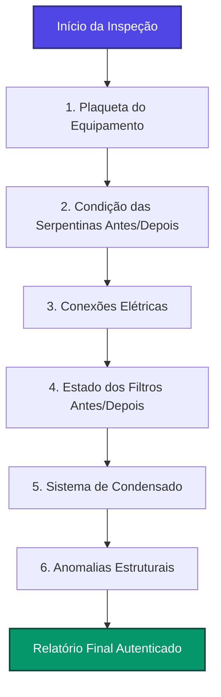
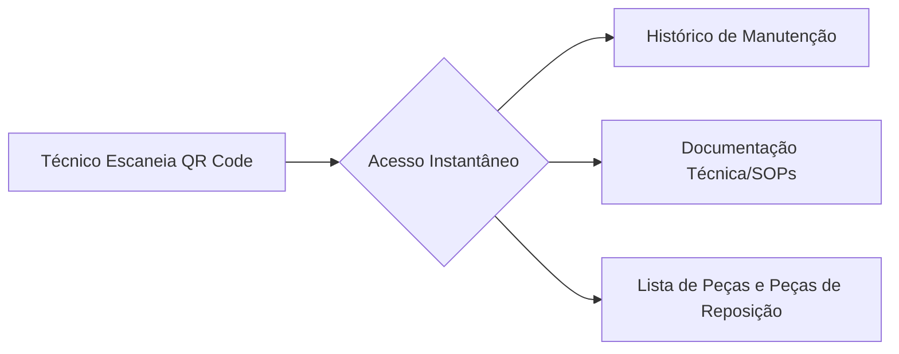

# A Anatomia Estratégica do Relatório de Manutenção de AVAC Moderno: Da Conformidade ao Desenvolvimento de Negócios

O relatório moderno de manutenção de Aquecimento, Ventilação e Ar Condicionado (AVAC/HVAC) evoluiu muito além de um simples checklist em papel de tarefas concluídas. No ecossistema contemporâneo de gerenciamento de facilidades, o relatório de manutenção funciona como um ponto de conexão crítico onde se cruzam dados de engenharia mecânica, conformidade legal rigorosa, previsão financeira e desenvolvimento estratégico de negócios. Para proprietários de imóveis comerciais, gestores de facilidades e stakeholders corporativos, o relatório fornece os dados empíricos necessários para justificar despesas de capital (CapEx), otimizar orçamentos operacionais (OpEx) e evitar severas penalidades regulatórias. Concomitantemente, para o prestador de serviços de AVAC, atua como o principal veículo para retenção de clientes, mitigação de responsabilidade civil, vendas adicionais (*upselling*) transparentes e diferenciação competitiva.

Esta análise detalhada desconstrói a arquitetura de um relatório de manutenção de AVAC de nível especialista, explorando a integração de medições termodinâmicas, metadados espaciais, visualização de dados em tempo real, protocolos rigorosos de conformidade regulatória e a psicologia de vendas proativa. Ao fazer a transição da documentação reativa para relatórios preditivos e orientados por dados, as organizações de serviços podem transformar uma despesa operacional rotineira em um ativo financeiro quantificável.

---

## 1. Estrutura do Relatório e Framework de Conteúdo

Um relatório de manutenção de AVAC profissional deve se comunicar com sucesso com múltiplos públicos simultaneamente: o engenheiro de facilidades tecnicamente proficiente, que exige dados termodinâmicos brutos, e o gestor de ativos focado no aspecto financeiro, que exige resumos do impacto nos resultados financeiros. Alcançar essa dupla utilidade requer uma arquitetura de informação hierárquica e rigorosa, que guie o leitor desde resumos econômicos de alto nível até diagnósticos mecânicos granulares.

### O Resumo Executivo: Traduzindo Engenharia em Economia

O resumo executivo serve como a porta de entrada para o relatório e é adaptado especificamente para gestores e proprietários de edifícios. Ele deve traduzir condições eletromecânicas complexas em uma linguagem simples, focada nos pilares fundamentais da gestão de facilidades. Em vez de simplesmente listar códigos operacionais brutos, o resumo executivo deve traduzir ações mecânicas em seus resultados operacionais e econômicos diretos. 

> [!TIP]
> **Exemplo de Redação Profissional:**
> *   **Abordagem Inadequada (Apenas Técnica):** *"Substituídos filtros MERV 8 obstruídos e limpo o dreno de condensado principal."*
> *   **Abordagem de Alto Nível (Técnico-Econômica):** *"Restaurado o fluxo de ar ideal na unidade de tratamento de ar principal, reduzindo a corrente do motor do ventilador em 12% para diminuir o consumo de energia, e eliminados os riscos iminentes de proliferação biológica no dreno para garantir a conformidade estrita com os padrões de qualidade do ar interno."*

Essa abordagem demonstra imediatamente o retorno sobre o investimento ao stakeholder não técnico, estabelecendo um tom colaborativo para o restante do documento.

### Inventário de Equipamentos e Avaliação de Condição de Linha de Base

A gestão precisa de ativos começa com um inventário de equipamentos abrangente e meticulosamente detalhado. O relatório deve estabelecer a condição de linha de base (*baseline*) do equipamento na chegada, observando o status operacional, códigos de erro ativos, assinaturas acústicas incomuns e quaisquer reclamações pré-existentes do cliente. [^1] Esta seção serve como o livro de registro fundamental para todas as comparações diagnósticas subsequentes.

| Parâmetro do Inventário | Padrão de Documentação Exigido | Valor Diagnóstico |
| :--- | :--- | :--- |
| **Identificação do Ativo** | Tipo de sistema, fabricante (OEM), número do modelo, número de série e localização física exata. | Garante a aquisição correta de peças e evita que o trabalho seja registrado no ativo incorreto. |
| **Status Inicial do Sistema** | Estado operacional na chegada, códigos de erro ativos, reclamações do usuário e condições ambientais. | Estabelece a condição de linha de base antes de qualquer intervenção do técnico. |
| **Condição Física** | Presença de corrosão, integridade do gabinete, estabilidade da montagem estrutural e degradação do isolamento térmico. | Destaca passivos estruturais que operam de forma independente do desempenho eletromecânico. |

*Tabela 1: Padrões de Inventário e Avaliação de Linha de Base* [^1]

### Trabalho Realizado e Checklists Detalhados

Para garantir o rastreamento preciso do inventário e uma cobrança transparente e defensável, o relatório deve incluir checklists detalhados e discriminados de todo o trabalho realizado. [^2] Isso inclui itens de linha específicos para ações executadas, tais como limpeza química das serpentinas do condensador, calibração de termostatos ou lubrificação dos conjuntos de rolamentos. Além disso, o relatório deve conter uma lista precisa de peças e materiais utilizados, completa com os números de peça do fabricante original (OEM) e as quantidades consumidas. [^1] Os softwares modernos de relatórios utilizam menus suspensos digitais e caixas de seleção interativas para acelerar significativamente esse processo de documentação no campo, mantendo uma padronização rigorosa. [^2]

### Medições Críticas e Leituras Termodinâmicas

A validade técnica central do relatório baseia-se em dados objetivos e quantitativos. O relatório deve documentar medições críticas antes e depois do serviço para comprovar a melhoria do desempenho do sistema. [^2]

#### Divisão de Temperatura ($\Delta T$ - Temperature Split)
Em termos de sistemas de AVAC e ar condicionado, o $\Delta T$ representa a mudança na temperatura do ar de bulbo seco interno conforme ele cruza a serpentina do evaporador. [^3] É calculado usando a fórmula termodinâmica básica:

$$\Delta T = T_{\text{Retorno}} - T_{\text{Insuflamento}}$$ [^3]

Onde:
*   $T_{\text{Retorno}}$ é a temperatura do ar que entra no evaporador (retorno).
*   $T_{\text{Insuflamento}}$ é a temperatura do ar climatizado que sai da unidade (insuflamento).

Embora não exista uma medição de temperatura fixa única aplicável a todos os tipos de equipamentos, os diagnósticos da indústria frequentemente dependem de uma regra prática geral de **20°F (aproximadamente 11°C)** para sistemas de resfriamento de conforto padrão sob condições normais de projeto. [^4] A maioria das metas de $\Delta T$ projetadas pelos fabricantes varia entre **16°F e 20°F (9°C a 11°C)** com base em configurações de fluxo de ar de **400 CFM por tonelada de refrigeração (TR)**. [^4] 

Os técnicos devem observar que o $\Delta T$ é uma medição de calor sensível e é fortemente influenciado pelo calor latente (umidade relativa do ar), restrições de fluxo de ar e condições de carga térmica interna. [^3] Documentar um $\Delta T$ corrigido comprova que o sistema está absorvendo com sucesso o calor sensível do espaço condicionado.

#### Superaquecimento e Subresfriamento
O superaquecimento (Superheat) e o subresfriamento (Subcooling) são medições críticas que ditam a eficiência, capacidade e longevidade do ciclo de refrigeração por compressão de vapor. [^5]

*   **Superaquecimento:** Mede a temperatura adicional ganha pelo refrigerante após ele ter evaporado completamente (passado do estado de mistura bifásica para vapor saturado) na serpentina do evaporador. Ele garante que apenas vapor puro retorne ao compressor. [^5] Isso evita o golpe de líquido (*liquid slugging*), um evento catastrófico que pode destruir instantaneamente as válvulas e componentes mecânicos do compressor.
*   **Subresfriamento:** Determina a queda de temperatura do refrigerante líquido abaixo da sua temperatura de condensação (saturação) no condensador. Ele garante que uma coluna sólida de líquido sem bolhas de vapor chegue ao dispositivo de expansão (como a válvula de expansão termostática ou eletrônica), permitindo uma queda de pressão ideal e capacidade máxima de refrigeração. [^5]

Um relatório profissional utiliza as pressões e temperaturas lidas por meio de analisadores digitais (*manifolds* digitais) para calcular esses valores instantaneamente com base nas tabelas de Pressão-Temperatura (P-T) dos refrigerantes específicos, registrando essas métricas para corrigir ineficiências na raiz antes que evoluam para falhas completas do sistema. [^6]

#### Leituras de Corrente (Amperagem) e Tensão Elétrica
O registro da corrente elétrica (amperagem) e da tensão aplicada aos motores dos ventiladores, sopradores e compressores fornece uma janela direta para o desgaste mecânico e a saúde elétrica do sistema. Um componente elétrico que consome uma corrente de carga operacional (RLA - Running Load Amps) superior à nominal indica falha iminente de rolamento, degradação do isolamento do enrolamento do motor ou resistência mecânica severa. Documentar esses valores juntamente com os dados de linha de base do fabricante permite que o prestador de serviços transicione a conversa com o cliente de um reparo de emergência reativo para uma substituição preditiva e programada de componentes. [^2]

### Matriz de Priorização de Descobertas e Recomendações

Quando uma inspeção abrangente é concluída, os dados resultantes frequentemente revelam uma infinidade de descobertas acionáveis. Apresentar uma lista desorganizada de reparos sobrecarrega o gestor de facilidades e frequentemente resulta na rejeição de todas as recomendações. Um relatório profissional categoriza e prioriza as descobertas usando uma hierarquia estrita e lógica de quatro níveis: Segurança, Confiabilidade, Eficiência e Conforto.

| Nível de Prioridade | Definição e Escopo | Exemplo Prático de Descoberta | Cronograma Recomendado para Ação |
| :---: | :--- | :--- | :--- |
| **1. Segurança (Safety)** | Condições que apresentam perigo imediato à vida, à saúde humana ou à integridade física da propriedade. | Trocador de calor trincado vazando monóxido de carbono; contatores elétricos severamente carbonizados com risco de incêndio. | Reparo imediato ou desligamento do equipamento necessário. |
| **2. Confiabilidade (Reliability)** | Componentes que exibem desgaste avançado que causará falha operacional catastrófica se não for resolvido. | Motor do soprador consumindo amperagem acima do limite nominal (over-amping); capacitores de partida/marcha severamente degradados. | Reparo programado dentro de 7 a 14 dias. |
| **3. Eficiência (Efficiency)** | Problemas que fazem o sistema consumir energia excessiva ou operar fora das especificações do fabricante. | Serpentinas do condensador severamente obstruídas elevando a pressão de descarga; vazamentos de dutos em espaços não condicionados. | Reparo programado durante o ciclo de faturamento atual ou no próximo. |
| **4. Conforto (Comfort)** | Fatores que afetam a experiência do ocupante, níveis de ruído ou controle preciso de temperatura, sem risco de falha do sistema. | Pequena estratificação de temperatura entre zonas; termostatos programáveis antigos, mas ainda funcionais. | Melhorias eletivas durante períodos orçamentários favoráveis. |

*Tabela 2: Matriz de Priorização de Recomendações* [^7]

### Estimativas de Custos e Próxima Manutenção Programada

A conclusão do relatório estruturado deve direcionar de forma natural o cliente para a próxima ação. O documento deve fornecer estimativas de custos transparentes e detalhadas para todos os reparos ou melhorias recomendados, categorizados de acordo com a matriz de priorização. Além disso, o relatório deve definir claramente o cronograma e o escopo da próxima visita de manutenção preventiva. Ao estabelecer a expectativa para a próxima interação, o prestador de serviços reforça a natureza contínua e proativa do relacionamento, impedindo que o cliente trate a manutenção como uma despesa esporádica e opcional.

---

## 2. Padrões de Documentação Fotográfica

A integração de documentação fotográfica de alta resolução alterou fundamentalmente o padrão de atendimento nos relatórios de AVAC. Uma descrição escrita de um contator severamente degradado ou de um biofilme na serpentina do evaporador depende inteiramente da imaginação do cliente e da confiança cega; uma fotografia nítida e bem iluminada fornece uma prova objetiva e inegável. [^2] Padrões fotográficos consistentes são a base da documentação técnica moderna.

### A Auditoria Fotográfica Exigida de Seis Pontos

Para garantir uma documentação abrangente, os procedimentos operacionais padrão das empresas líderes de AVAC exigem um conjunto específico de fotos por visita de manutenção, independentemente da condição do sistema. Essa rotina garante que nenhum elemento crítico seja negligenciado e fornece um histórico visual completo do ativo ao longo do tempo.



*   **1. Plaqueta de Identificação do Equipamento:** Captura o número do modelo do fabricante (OEM), número de série, especificações elétricas e data de fabricação para garantir o fornecimento correto de peças e a verificação de garantias.
*   **2. Condição das Serpentinas (Antes e Depois):** Documenta o estado das serpentinas do evaporador interno e do condensador externo. Comprova a necessidade de limpeza química e verifica visualmente a remoção de detritos que restringem o fluxo de ar.
*   **3. Conexões Elétricas:** Foca em contatores, capacitores e blocos de terminais. Destaca contatos oxidados ou desgastados, capacitores estufados ou fiações descoloridas pelo calor, que indicam alta resistência elétrica.
*   **4. Condição dos Filtros (Antes e Depois):** Fornece justificativa visual para a substituição de filtros. Uma comparação lado a lado de um filtro saturado contra um novo valida instantaneamente a taxa do serviço.
*   **5. Sistema de Condensado:** Documenta a bandeja de drenagem primária, o sifão (*P-trap*) e a linha de dreno. Verifica a ausência de proliferação biológica, água parada e condições de transbordamento iminente.
*   **6. Anomalias Estruturais:** Captura quaisquer danos inesperados, como danos causados por granizo nas aletas do condensador, parafusos ausentes no gabinete ou isolamento de dutos deteriorado.

### Técnica Fotográfica e Documentação de Defeitos

O ambiente em que os equipamentos de AVAC operam — salas mecânicas escuras, entreforros de tetos rebaixados mal iluminados e telhados sob luz solar intensa — apresenta desafios fotográficos significativos. Os técnicos devem ser treinados em técnicas básicas de fotografia para garantir que as imagens sejam úteis para o diagnóstico. Isso inclui o uso obrigatório de flash ou luzes de trabalho magnéticas auxiliares em salas mecânicas para eliminar sombras profundas. Ao documentar defeitos, os técnicos devem utilizar configurações macro (primeiro plano) para capturar a erosão em um contator ou a trinca em um trocador de calor, seguidas por uma foto de ângulo mais amplo para fornecer contexto espacial, mostrando exatamente onde o defeito está localizado no equipamento.

### Formatação de Comparações Antes/Depois

As fotos de "antes e depois" fornecem uma resposta visual instantânea à pergunta fundamental do cliente: *"Esta equipe realmente realizou o trabalho pelo qual estou pagando?"*. [^8] As plataformas avançadas de documentação apresentam tecnologia de sobreposição translúcida (*ghost overlay*), que exibe uma versão semitransparente da foto "antes" diretamente na tela do dispositivo móvel do técnico enquanto ele tira a foto "depois". [^8] Isso garante que a equipe corresponda exatamente ao ângulo da câmera, distância focal e ponto de vista, criando uma comparação visual perfeita que destaca a transformação. [^8] Essa precisão é altamente útil para documentar a evolução das condições ao longo do tempo, onde retornar semanas depois e tirar fotos exatamente no mesmo ângulo seria difícil sem assistência de software. [^8]

### Autenticidade Criptográfica: Metadados de GPS e Carimbo de Data/Hora

Para servir como um documento legalmente defensável em reivindicações de garantia, disputas de seguros ou auditorias regulatórias, as fotografias devem ser inalteráveis e ligadas de forma criptográfica a um momento e local específicos. Os sistemas profissionais de documentação incorporam automaticamente metadados no formato EXIF (*Exchangeable Image File Format*) em cada imagem capturada.

*   **Geolocalização (Geotagging):** O software incorpora as coordenadas geográficas precisas de GPS (latitude, longitude e altitude) no arquivo de imagem. [^9] Esse metadado fornece prova geográfica verificável de que o técnico estava fisicamente presente na unidade de cobertura ou instalação específica. [^8]
*   **Carimbo de Data/Hora (Timestamping):** Carimbos de data/hora automáticos gerados pelo servidor criam um registro cronológico indiscutível de quando as condições foram observadas e quando o trabalho foi concluído. [^9] Isso é crítico para comprovar a conformidade com prazos regulatórios estritos ou demonstrar que riscos severos à segurança foram mitigados prontamente após a descoberta. [^9]

Como esses metadados são incorporados na própria estrutura do arquivo da foto, eles permanecem com a imagem mesmo se ela for movida entre servidores ou baixada, garantindo a preservação total de seu valor probatório. [^10]

### Sistemas de Armazenamento e Organização em Nuvem

Uma fotografia só tem valor se puder ser recuperada instantaneamente. Os relatórios de manutenção modernos dependem de arquiteturas de armazenamento baseadas em nuvem, onde as fotos são sincronizadas automaticamente do dispositivo móvel no campo para um servidor centralizado. Esses sistemas organizam e marcam as fotos por projeto, endereço do cliente, equipamento e data antes mesmo de o técnico guardar o telefone. [^8] Isso elimina a prática caótica de armazenar milhares de imagens não triadas na galeria local do dispositivo móvel, garantindo acesso simultâneo e remoto aos dados visuais para orçamentistas, gerentes de escritório e equipes de suporte. [^8] Além disso, esses sistemas devem suportar captura offline robusta, permitindo que as equipes documentem condições em subsolos profundos ou locais sem cobertura de rede celular, sincronizando os dados automaticamente assim que a conectividade for restaurada. [^8]

---

## 3. Visualização de Dados para Públicos Não Técnicos

Gestores de facilidades, diretores de suprimentos e proprietários de edifícios frequentemente são sobrecarregados com dados operacionais complexos. Os relatórios de manutenção mais eficazes sintetizam esses dados mecânicos brutos em formatos visuais intuitivos que orientam decisões financeiras e operacionais imediatas.

### Gráficos de Tendência de Temperatura e Desempenho do Sistema

Enquanto uma leitura única de temperatura fornece apenas um retrato momentâneo, um gráfico de tendência de temperatura revela a saúde operacional dinâmica do sistema. Ao traçar as temperaturas de retorno e insuflamento ao longo de uma linha do tempo contínua, os relatórios podem demonstrar visualmente como um sistema luta para manter os setpoints durante picos de carga térmica. Gráficos de séries temporais mostrando uma lacuna gradualmente crescente entre o setpoint e a temperatura real do espaço ao longo de semanas servem como prova empírica de vazamentos lentos de refrigerante ou degradação constante da capacidade do compressor, justificando a intervenção muito antes de ocorrer uma falha total.

### Scorecards de Saúde do Equipamento: O Paradigma do Semáforo

Adaptado dos sistemas de classificação de inspeção de saúde pública, o paradigma visual Verde/Amarelo/Vermelho é um método eficaz para comunicar instantaneamente o risco dos ativos em um grande portfólio de equipamentos. [^12] Utilizando uma interface de painel (*dashboard*), cada ativo de AVAC na planta do edifício pode ser codificado por cores com base no seu status de saúde: [^14]

*   **Verde (Saudável):** O ativo está operando dentro dos parâmetros ideais de projeto e eficiência. Possui zero não conformidades, passa em todas as verificações termodinâmicas de linha de base e não apresenta risco de falha iminente. [^12]
*   **Amarelo (Condicional/Atenção Necessária):** O ativo exibe desempenho minimamente aceitável ou degradação mecânica leve. [^15] Requer monitoramento ativo ou ação corretiva programada dentro de uma janela definida (por exemplo, 7 dias) para garantir a melhoria do desempenho e evitar a evolução para uma falha crítica. [^14]
*   **Vermelho (Falha Ativa/Risco Crítico):** O ativo sofreu uma falha ativa, possui manutenção preventiva severamente atrasada colocando garantias em risco, ou apresenta um risco grave de segurança que exige desligamento imediato até a correção. [^12]

### Referências de Desempenho AVAC de Classe Mundial vs. Médias da Indústria

Apresentar dados comparativos ajuda a contextualizar a eficiência da operação de manutenção de AVAC. A tabela a seguir compara as médias da indústria padrão com as melhores práticas (Classe Mundial) em quatro KPIs críticos de manutenção de AVAC.

| Métrica de Desempenho (KPI) | Média da Indústria | Alvo de Classe Mundial | Impacto Financeiro e Operacional |
| :--- | :---: | :---: | :--- |
| **MTTR (Tempo Médio de Reparação)** | 4,5 Horas | < 2,0 Horas | Reduz o tempo de inatividade operacional e reclamações de ocupantes. |
| **Conformidade de PM (Manutenção Preventiva)** | 62,5% | > 85,0% | Reduz custos de reparo de emergência em até 40% através da prevenção. |
| **Rácio de Trabalho Reativo / Preventivo** | 37,5% | < 20,0% | Reduz significativamente as despesas com serviços não planejados. |
| **Desvio de Energia por Negligência de Limpeza** | 30,0% | < 5,0% | Representa economia direta nas faturas de eletricidade da instalação. |

*Tabela 3: KPIs de Manutenção de AVAC — Média da Indústria vs. Classe Mundial* [^1] [^14] [^19]

*Nota: Atingir o status de Classe Mundial requer o gerenciamento rigoroso das rotas de manutenção, conformidade rigorosa com checklists digitais e monitoramento de tendências de dados.*

```mermaid
gantt
    title Desempenho de Manutenção de AVAC
    dateFormat  X
    axisFormat %s
    section MTTR (Horas)
    Média da Indústria (4.5h) : active, 0, 45
    Classe Mundial (<2.0h) : sharp, 0, 20
    section Conformidade de MP (%)
    Média da Indústria (62.5%) : active, 0, 62
    Classe Mundial (>85%) : sharp, 0, 85
```



### Estimativas Preditivas de Vida Útil Restante (RUL - Remaining Useful Life)

O planejamento de despesas de capital (CapEx) depende de previsões precisas do ciclo de vida dos equipamentos. Os relatórios de manutenção devem utilizar dados históricos combinados com benchmarks padrão da indústria para prever visualmente quando um ativo exigirá substituição total. A Sociedade Americana de Engenheiros de Aquecimento, Refrigeração e Ar Condicionado (ASHRAE) define as expectativas globais para esses ciclos de vida por meio de pesquisas extensas e estudos de campo cobrindo milhares de sistemas. [^16]

| Classificação do Equipamento de AVAC | Expectativa de Vida Útil Mediana ASHRAE (Anos) |
| :--- | :---: |
| **Unidades Rooftop Comerciais (RTU - AC Packaged)** | 15 Anos [^17] |
| **Bombas de Calor Comerciais (Ar-Ar)** | 14 - 15 Anos [^17] |
| **Fornos a Gás ou Óleo** | 18 - 20 Anos [^17] |
| **Caldeiras (Tubos de Aço / Ferro Fundido)** | 24 - 35 Anos [^17] |
| **Chillers de Refrigeração (Centrífugos)** | 23 Anos [^18] |
| **Torres de Resfriamento (Metal Galvanizado)** | 20 Anos [^18] |
| **Ventiladores Centrífugos e Motores** | 18 - 25 Anos [^18] |

*Tabela 4: Vida Útil Mediana de Equipamentos de AVAC segundo a ASHRAE* [^17] [^18]

Ao traçar a idade atual do equipamento em relação à vida útil mediana definida pela ASHRAE, os prestadores de serviços podem demonstrar graficamente aos clientes que um ativo está entrando em seu último quartil de vida útil. Isso estimula discussões proativas de substituição muito antes de ocorrer uma falha catastrófica e dispendiosa que interrompa as operações comerciais.

### Modelagem de Consumo de Energia e ROI da Manutenção

Talvez a visualização mais poderosa em um relatório de AVAC seja o modelo econômico que comprova que a manutenção preventiva gera um fluxo de caixa positivo. Os gestores de facilidades sabem que a falta de manutenção degrada o desempenho, mas frequentemente lutam para comprovar isso à diretoria em números. [^14] O retorno financeiro da manutenção é calculado usando a fórmula padrão de ROI:

$$ROI = \left( \frac{\text{Economia Total} - \text{Custo da Manutenção}}{\text{Custo da Manutenção}} \right) \times 100$$ [^19]

Onde a "Economia Total" é uma composição de quatro fluxos de valor distintos: [^19]
1.  **Tempo de Inatividade Evitado (Avoided Downtime):** O custo horário da paralisação da instalação ou da perda de produtividade multiplicado pelo número estimado de falhas evitadas através do monitoramento preditivo. [^19]
2.  **Economia em Reparos (Repair Savings):** A manutenção planejada reduz a necessidade de reparos emergenciais reativos caros, que tipicamente custam **três a cinco vezes mais** do que o trabalho programado. [^14]
3.  **Redução de Consumo de Energia (Energy Reduction):** A manutenção regular (como limpeza de serpentinas e ajuste de carga de refrigerante) restaura a eficiência de troca térmica, resultando em uma redução de **5% a 20% no consumo anual de eletricidade**. [^14] Dados do Departamento de Energia dos EUA (DOE) e do NIST apontam para desperdícios de energia não detectados de até **30%** em sistemas sem manutenção. [^14]
4.  **Prolongamento da Vida Útil do Ativo (Extended Asset Life):** A manutenção adequada pode adiar a substituição de capital (CapEx) de grandes chillers e equipamentos em **5 a 8 anos**, diluindo o impacto financeiro da depreciação no balanço patrimonial do cliente. [^19]

```mermaid
%%{init: {'theme': 'neutral'}}%%
xychart-beta
    title "A Economia da Prevenção: ROI de 545% na Manutenção de AVAC"
    x-axis [Investimento, Energia, Reparos, Uptime, Vida Útil, ROI Líquido]
    y-axis "Impacto Financeiro (%)" -200 to 600
    bar [-100, 150, 200, 100, 195, 545]
```

*Figura 2: Desdobramento financeiro do ROI da manutenção preventiva com base em dados de Jones Lang LaSalle.* [^19] O investimento inicial de 100% é rapidamente recuperado por meio da redução de custos operacionais e da extensão do ciclo de vida dos ativos.

---

## 4. Entrega Digital e Acessibilidade

O mecanismo de entrega do relatório de AVAC é tão vital quanto o seu conteúdo. O setor migrou decisivamente das pranchetas físicas e faturas em papel carbono para Sistemas Computadorizados de Gestão de Manutenção (CMMS) e softwares de Gestão de Serviços de Campo (FSM) que centralizam os dados dos ativos e automatizam a distribuição dos relatórios. [^20]

### Geração Automatizada de PDF e Identidade Visual Profissional

O valor percebido do trabalho de engenharia começa com a primeira impressão. Os softwares de serviço modernos processam os dados brutos inseridos em tempo real no campo pelo técnico — medições, checklists de tarefas e fotos — e geram instantaneamente um relatório em PDF profissional e altamente estruturado. [^21] Esses relatórios incluem o logotipo do prestador de serviços, informações de contato corporativo e uma formatação limpa e padronizada, garantindo consistência estética independentemente de qual equipe técnica realizou o atendimento. [^21]

### Acesso ao Portal do Cliente e Visualização Responsiva

O envio de arquivos PDF por e-mail é apenas o padrão básico. As organizações líderes do setor fornecem aos clientes portais de autoatendimento online seguros, funcionando como um repositório centralizado de todo o histórico de manutenção dos ativos do edifício. Os gestores de facilidades podem fazer login e auditar o histórico de qualquer máquina ao longo de anos de operação. Além disso, como os relatórios são frequentemente revisados em movimento (no campo ou em reuniões de diretoria), a visualização dos dados deve ser totalmente otimizada para dispositivos móveis, garantindo que tabelas complexas e fotos de alta resolução se ajustem a telas de smartphones e tablets sem perda de legibilidade.

### Identificação de Ativos por QR Code: Conectando o Físico ao Digital

O maior avanço na acessibilidade de manutenção é a implementação de etiquetas com QR codes resistentes ao tempo nos ativos físicos do edifício. Em fluxos de trabalho tradicionais, os técnicos perdem em média **5 minutos por ordem de serviço** pesquisando manualmente o registro correto do ativo no banco de dados, resultando em uma taxa de erro de **23%** de ordens de serviço registradas na unidade incorreta. [^22] Isso corrompe o histórico do ativo e invalida análises financeiras de CapEx. [^22]

Ao afixar um QR code exclusivo no gabinete físico do equipamento (chillers, evaporadoras, torres, etc.), cria-se um fluxo de trabalho instantâneo de escaneamento. [^20] A leitura do QR code por meio da câmera do dispositivo móvel do técnico puxa instantaneamente a "gêmea digital" da máquina diretamente do CMMS, reduzindo o tempo de busca em **80%** e garantindo precisão total de registro. [^22]



1.  **Histórico de Manutenção:** Acesso às datas de manutenções preventivas anteriores, ordens de serviço pendentes e diagnósticos de falhas anteriores. [^23]
2.  **Documentação Técnica:** Manuais originais do fabricante (OEM), diagramas elétricos e de tubulações, procedimentos operacionais padrão (SOPs) e status de garantia ativa. [^22]
3.  **Rastreamento de Inventário:** Vinculação de peças sobressalentes recomendadas ao modelo exato da máquina, atualizando o estoque em tempo real conforme os materiais são consumidos no campo durante o atendimento. [^24]

---

## 5. Proteção Legal e de Responsabilidade Civil

As empresas de AVAC operam em um ambiente de alto risco técnico, com exposição legal significativa em relação a acidentes de trabalho e saúde ocupacional. [^25] Equipamentos com manutenção deficiente ou inadequada podem resultar em sinistros catastróficos, incluindo danos à propriedade por vazamentos de água, perdas financeiras por paralisação de sistemas em data centers e surtos biológicos graves transmitidos pelo ar (como monóxido de carbono ou *Legionella*). [^26] Portanto, o relatório de manutenção deve ser tratado fundamentalmente como um documento legal projetado para limitar riscos e comprovar a conformidade regulatória estrita.

### Documentação de Condições Pré-Existentes e Conformidade com Garantias

Ao assumir o serviço de um sistema em uma nova instalação, documentar meticulosamente as condições pré-existentes é crucial para isolar a responsabilidade do novo prestador de serviços contra negligências de empresas anteriores. Se um sistema exibir sinais de instalação original inadequada, modificações não autorizadas ou falta de manutenção histórica, o técnico deve registrar tais fatos detalhadamente com fotos e carimbos de data/hora antes de iniciar qualquer reparo ou alteração. 

Além disso, o relatório serve como o registro oficial de conformidade exigido pelos fabricantes de equipamentos para manter as garantias de fábrica de grandes compressores e componentes ativos. Os contratos de locação comercial frequentemente exigem que os inquilinos mantenham contratos de manutenção de AVAC ativos e apresentem relatórios detalhados contendo a substituição regular de filtros e correias para proteger a validade dessas garantias. [^27] A falha em documentar tais ações rotineiras pode invalidar garantias valiosas de equipamentos, expondo o cliente e o prestador de serviços a prejuízos financeiros substanciais em caso de falha do sistema. [^27]

### Documentação de Recomendações Recusadas e Termos de Isenção de Responsabilidade

Quando um técnico identifica um componente em estado crítico de falha iminente — como um trocador de calor de caldeira trincado com risco de vazamento de gases tóxicos ou contatores elétricos com risco de curto-circuito — e o cliente opta por recusar ou adiar o reparo devido a restrições orçamentárias imediatas, a empresa de manutenção assume um risco jurídico extremo caso a falha ocorra e resulte em sinistros físicos ou materiais. [^25]

Para mitigar essa exposição de responsabilidade civil, o relatório de manutenção digital deve conter um fluxo integrado e automatizado de **Isenção de Responsabilidade por Recusa de Serviço**. [^28] Esta seção deve registrar formalmente e exigir a assinatura do cliente nos seguintes pontos:

*   **O Risco Identificado:** A descrição detalhada e técnica da falha iminente encontrada. [^30]
*   **A Solução Recomendada:** O procedimento prescrito pelo técnico para eliminar o risco. [^30]
*   **Assunção Expressa do Risco:** Uma declaração de consentimento onde o cliente declara compreender claramente os riscos à segurança e integridade física associados à recusa do reparo, assumindo total responsabilidade pelas consequências. [^31]
*   **Cláusula de Isenção de Responsabilidade (Hold Harmless):** Um termo contratual de proteção legal declarando o prestador de serviços e seus técnicos isentos de qualquer responsabilidade civil, criminal ou financeira decorrente de acidentes, incêndios, vazamentos ou lesões físicas causados pelo componente cuja substituição ou desligamento de segurança foi recusado pelo cliente. [^30]

Ao coletar a assinatura eletrônica do gestor ou responsável da instalação nesta cláusula específica diretamente no dispositivo móvel do técnico antes de fechar o relatório, a empresa de AVAC estabelece uma trilha de auditoria juridicamente sólida, transferindo integralmente o ônus do risco de volta para o proprietário ou administrador do edifício. [^30]

### Benchmarks de Conformidade Global: O Padrão PMOC no Brasil

Para compreender a extensão máxima da responsabilidade regulatória em relatórios de AVAC, o mercado brasileiro apresenta um dos marcos legislativos mais rigorosos do mundo: a obrigatoriedade do **Plano de Manutenção, Operação e Controle (PMOC)**. [^32]

Regulamentado em âmbito federal pela **Lei Federal nº 13.589/2018** e fiscalizado ativamente pela Agência Nacional de Vigilância Sanitária (ANVISA), o PMOC é obrigatório para todos os edifícios de uso público e coletivo que possuam sistemas de climatização com capacidade instalada total superior a **60.000 BTU/h (aproximadamente 5 TR)**. [^32] Essa exigência legal abrange desde grandes arranha-céus corporativos e hospitais até pequenas lojas de varejo, escritórios comerciais, restaurantes e áreas comuns de condomínios residenciais. [^32]

Os requisitos de conformidade do PMOC exigem relatórios de manutenção extremamente rigorosos:

1.  **Responsabilidade Técnica Habilitada:** Ao contrário de mercados onde os relatórios de serviço podem ser autodeclaratórios por técnicos instaladores, o PMOC brasileiro exige a assinatura de um **Responsável Técnico legalmente habilitado no conselho profissional correspondente** (Engenheiro Mecânico registrado no CREA ou Técnico em Climatização registrado no CFT). [^32] Todo plano deve ser respaldado pela emissão da respectiva **ART (Anotação de Responsabilidade Técnica)** ou **TRT (Termo de Responsabilidade Técnica)**; sem este selo de engenharia mecânica, o relatório de manutenção não possui validade legal perante os órgãos de fiscalização sanitária e do trabalho. [^34]
2.  **Análise Semestral de Qualidade Biológica do Ar:** A fiscalização sanitária municipal e estadual exige o cumprimento das diretrizes de amostragem de ar descritas na resolução **RE-09/2003 da ANVISA**. Isso obriga a contratação periódica de laboratórios químicos independentes para coletar amostras físicas do ar interno para testar poluentes físicos, químicos e biológicos (incluindo contagem de colônias de fungos, bactérias, partículas suspensas totais, níveis de dióxido de carbono e taxas de renovação do ar). [^32] A ausência dos laudos laboratoriais de qualidade do ar vinculados diretamente ao livro de registros do PMOC é uma das infrações mais autuadas pelas vigilâncias sanitárias locais. [^37]
3.  **Sanções Legais e Multas de Alta Gravidade:** O não cumprimento das normas do PMOC ou a falha em apresentar os relatórios de manutenção de conformidade exigidos durante inspeções surpresa pode acarretar multas de natureza grave. De acordo com a **Lei Federal nº 6.437/1977** (que disciplina as infrações à legislação sanitária federal), as penalidades financeiras variam de **R$ 2.000,00 a R$ 1.500.000,00**, dependendo do tamanho da instalação, reincidência e severidade do descaso operacional. [^33] Além disso, sob as leis civis e criminais brasileiras (especificamente o **Artigo 132 do Código Penal** — expor a vida ou a saúde de outrem a perigo direto e iminente), os gestores prediais, diretores corporativos e síndicos de condomínios podem ser responsabilizados civil e criminalmente de forma pessoal caso a negligência comprovada na manutenção dos sistemas de climatização resulte em surtos de Legionelose ou infecções respiratórias graves entre os ocupantes do edifício. [^38]

Nesse contexto altamente regulamentado, o relatório de manutenção periódica e o PMOC não são meros trâmites administrativos; eles funcionam como uma apólice de seguro jurídico e de conformidade essencial para blindar as operações das empresas clientes contra multas e processos criminais. [^38]

---

## 6. O Relatório como Ferramenta de Desenvolvimento de Negócios

Historicamente, os relatórios de manutenção eram vistos como burocracias pós-serviço, arquivados e raramente lidos. Hoje, eles são reconhecidos como as ferramentas de vendas de maior conversão à disposição de um prestador de serviços comercial. Como o técnico já está no local, atuando como um consultor técnico de confiança em vez de um vendedor comissionado, a atrito associado à venda adicional (*upselling*) é reduzido drasticamente. [^39] Um relatório altamente profissional e rico em dados diferencia radicalmente uma empresa de concorrentes que dependem de resumos verbais informais e faturas manuscritas de baixa clareza.

### Construindo Confiança através da Transparência e Upselling

Os dados objetivos coletados durante as inspeções — especificamente as fotos detalhadas dos defeitos e as leituras termodinâmicas comprovadas — formam a base irrefutável para vendas orientadas pela transparência.

*   **Consumíveis de Baixo Atrito:** Quando um técnico documenta um filtro de ar severamente colmatado e com biofilme usando uma fotografia de alta resolução e anota uma queda de pressão associada no evaporador (com perda no $\Delta T$), a recomendação de substituição deixa de ser percebida pelo cliente como uma "proposta comercial empurrada". Ela se apresenta como a solução lógica e imediata para proteger a saúde física do sistema e a qualidade do ar interno. [^39] O cliente visualiza o problema com clareza, gerando um cenário de atrito quase nulo para a autorização rápida do reparo. [^39]
*   **Conversão para Planos de Manutenção Preventiva Periódica:** As melhores oportunidades de upsell ocorrem imediatamente após a execução de um reparo corretivo emergencial e dispendioso causado pela falta de manutenção periódica. [^39] Ao apresentar o relatório pós-serviço que demonstra claramente como a falha catastrófica poderia ter sido prevista e evitada através do monitoramento de KPIs de desgaste mecânico (como amperagem crescente nos rolamentos ou desvios na pressão de óleo), o consultor técnico pode propor a contratação de um contrato de manutenção programada contínua. [^39] A psicologia de vendas aqui se baseia em reformular o contrato de uma despesa recorrente de "assinatura" para um veículo preventivo essencial contra prejuízos não planejados, no momento exato em que a dor financeira da conta do reparo emergencial ainda está fresca na mente do gestor. [^39]

### Transição para Propostas de Melhoria de Capital (Orçamentos Vivos)

Quando um equipamento atinge o fim de sua vida útil (de acordo com as tabelas da ASHRAE) ou quando os custos de um reparo necessário excedem **50% do valor de depreciação do ativo**, o relatório de manutenção serve como a plataforma de transição perfeita para uma proposta formal de substituição de equipamentos (CapEx). Os softwares integrados de campo permitem a geração dos chamados "Orçamentos Vivos" (Living Estimates) criados a partir dos dados do ativo coletados na visita. [^40]

Em vez de enviar por e-mail um orçamento PDF estático e engessado dias depois, o técnico ou engenheiro apresenta uma proposta digital interativa diretamente em um tablet ou terminal web para o gestor. [^40] Esses orçamentos vivos apresentam opções estruturadas no formato "Bom / Muito Bom / Excelente" (Good / Better / Best), permitindo que o cliente compare instantaneamente as opções de refrigeração. Por exemplo, a proposta pode comparar a aquisição de um sistema split padrão SEER 14 contra sistemas de alta eficiência SEER 18 inverter ou sistemas VRF modulares, detalhando a economia de eletricidade projetada a longo prazo de cada opção de eficiência. [^40]

Conforme o gestor interage com as opções na tela, selecionando acessórios como filtragem biológica UV-C e módulos de automação integrados, uma calculadora financeira integrada atualiza as projeções de custos, prazos de amortização e opções de parcelamento ou financiamento em tempo real. [^40] Essa autonomia concedida ao tomador de decisão, baseada em dados reais de campo, eleva os tíquetes médios de instalação em até **28%** e acelera a assinatura de propostas CapEx sem quebrar a cadeia de custódia da documentação. [^40]

A adoção de uma estrutura de relatórios de manutenção de AVAC de alta qualidade representa uma mudança estratégica na operação de campo. Ao respaldar cada recomendação operacional com medições físicas precisas, evidências fotográficas criptográficas, modelagens financeiras de ROI e rigor regulatório baseado no PMOC, as empresas de climatização elevam seu posicionamento de simples resolvedoras de problemas para parceiras fundamentais na gestão de ativos de alta complexidade do cliente.

---

## Referências citadas

[^1]: *HVAC Service Report Template: Free PDF Download*, ServiceTitan. Acessado em 13 de junho de 2026. Disponível em: https://www.servicetitan.com/templates/hvac-service-report
[^2]: *Build the Ultimate HVAC Service Report Template*, ResQ. Acessado em 13 de junho de 2026. Disponível em: https://www.getresq.com/nora/nora-blog/hvac-service-report-template
[^3]: *HVAC DELTA T ($\Delta T$) Explained for Air Conditioners!*, AC Service Tech. Acessado em 13 de junho de 2026. Disponível em: https://www.acservicetech.com/post/hvac-delta-t-%CE%B4t-explained-for-air-conditioners
[^4]: *Solving Delta T*, HVAC School. Acessado em 13 de junho de 2026. Disponível em: http://www.hvacrschool.com/solving-delta-t/
[^5]: *HVAC Superheat & Subcooling: Pro Diagnostic Guide*, Ferguson. Acessado em 13 de junho de 2026. Disponível em: https://www.ferguson.com/content/ideas-and-learning-center/trade-talk/hvac-superheat-subcooling/
[^6]: *Simplified Guide To Superheat and Subcool*, r/HVAC - Reddit. Acessado em 13 de junho de 2026. Disponível em: https://www.reddit.com/r/HVAC/comments/1hgd7la/simplified_guide_to_superheat_and_subcool/
[^7]: *How to Read SUPERHEAT and SUBCOOLING*, YouTube - AC Service Tech. Acessado em 13 de junho de 2026. Disponível em: https://www.youtube.com/watch?v=pUYLmxOrfo0
[^8]: *The Best Before & After Photo Tool for Contractors*, CompanyCam. Acessado em 13 de junho de 2026. Disponível em: https://companycam.com/resources/blog/best-before-after-photo-tool-for-contractors
[^9]: *Best Guide to Geotagged Timestamped Photo Documentation 2026*, PHOTO iD by U Scope. Acessado em 13 de junho de 2026. Disponível em: https://photoidapp.net/geotagged-and-timestamped-photo-documentation/
[^10]: *Construction Photo Documentation: Standards Guide*, CrewCam. Acessado em 13 de junho de 2026. Disponível em: https://www.crewcamapp.com/post/construction-photo-documentation-standards-guide
[^11]: *Photo Documentation for Contractors*, KaamCam. Acessado em 13 de junho de 2026. Disponível em: https://https://kaamcam.com/features/photo-documentation
[^12]: *Restaurant health inspection posters and what they mean*, SF.gov. Acessado em 13 de junho de 2026. Disponível em: https://www.sf.gov/information--restaurant-health-inspection-posters-and-what-they-mean
[^13]: *General Health Inspection Grading*, Markel Insurance. Acessado em 13 de junho de 2026. Disponível em: https://www.markelinsurance.com/-/media/specialty/risk-management/small-business/fc-policyholder-training-series/general-health-inspection-grading.pdf?la=en
[^14]: *Smart HVAC Maintenance Dashboard for Facility Managers*, Oxmaint. Acessado em 13 de junho de 2026. Disponível em: https://oxmaint.com/industries/hvac/smart-hvac-maintenance-dashboard-facility-managers
[^15]: *GRADING SYSTEM FOR RETAIL FOOD FACILITIES*, Environmental Health Department. Acessado em 13 de junho de 2026. Disponível em: https://deh.acgov.org/operations-assets/docs/foodsafety/GRADING%20POLICY.pdf
[^16]: *ASHRAE: Service Life and Maintenance Cost Database*, American Society of Heating, Refrigerating and Air-Conditioning Engineers. Acessado em 13 de junho de 2026. Disponível em: https://weblegacy.ashrae.org/publicdatabase/
[^17]: *Average Service Life of Residential HVAC Equipment*, EGIA Contractor University. Acessado em 13 de junho de 2026. Disponível em: https://library.mycontractoruniversity.com/wp-content/uploads/2025/10/EGIA-AverageServiceLife.pdf
[^18]: *ASHRAE Equipment Life Expectancy chart*, the Natural Handyman. Acessado em 13 de junho de 2026. Disponível em: https://www.naturalhandyman.com/iip/infhvac/ASHRAE_Chart_HVAC_Life_Expectancy.pdf
[^19]: *How to Calculate HVAC Maintenance ROI (Commercial Guide)*, Oxmaint. Acessado em 13 de junho de 2026. Disponível em: https://oxmaint.com/industries/hvac/calculate-hvac-maintenance-roi-commercial
[^20]: *QR Code Based Asset Tracking for Facility Management: The Complete Guide*, Cryotos. Acessado em 13 de junho de 2026. Disponível em: https://www.cryotos.com/blog/qr-code-asset-tracking-for-facility-management
[^21]: *Commercial HVAC Preventive Maintenance Checklist Template*, Housecall Pro. Acessado em 13 de junho de 2026. Disponível em: https://www.housecallpro.com/hvac/templates-calculators/commercial-hvac-preventive-maintenance-checklist-template/
[^22]: *QR Code Asset Tagging with CMMS: Instant Access to Any Asset*, Oxmaint. Acessado em 13 de junho de 2026. Disponível em: https://oxmaint.com/blog/post/blog-post-cmms-qr-code-asset-tagging-guide
[^23]: *Asset Tagging and QR Codes: How to Physically Identify Every Asset and Connect It to Your CMMS*, eWorkOrders. Acessado em 13 de junho de 2026. Disponível em: https://eworkorders.com/asset-management/asset-tagging/
[^24]: *QR Code Inventory Tracking in CMMS: A Game-Changer for Maintenance Teams*, Maintainly. Acessado em 13 de junho de 2026. Disponível em: https://maintainly.com/articles/qr-code-inventory-tracking-in-cmms-a-game-changer-for-maintenance-teams
[^25]: *Top Employee Liability Risks for HVAC Companies*, Oberman Law Firm. Acessado em 13 de junho de 2026. Disponível em: https://obermanlaw.com/top-employee-liability-risks-for-hvac-companies/
[^26]: *Risk Management: How to Protect Your HVAC Business*, Goodway Technologies. Acessado em 13 de junho de 2026. Disponível em: https://www.goodway.com/hvac-blog/2012/05/risk-management-how-to-protect-your-hvac-business/
[^27]: *HVAC Maintenance Sample Clauses*, Law Insider. Acessado em 13 de junho de 2026. Disponível em: https://www.lawinsider.com/clause/hvac-maintenance
[^28]: *HVAC Service Liability Waiver Form Template*, Jotform. Acessado em 13 de junho de 2026. Disponível em: https://www.jotform.com/form-templates/hvac-service-liability-waiver-form
[^29]: *Free Release of Liability (Waiver) Forms (14) - PDF | Word*, eForms. Acessado em 13 de junho de 2026. Disponível em: https://eforms.com/release/
[^30]: *Decline of Service Customer Waiver Template — Document Refusals*, MangoApps. Acessado em 13 de junho de 2026. Disponível em: https://www.mangoapps.com/templates/forms/decline-of-service-customer-waiver
[^31]: *Waiver and Release Language*, Rancho Santiago Community College District. Acessado em 13 de junho de 2026. Disponível em: https://rsccd.edu/Departments/Risk-Management/Pages/Waiver-and-Release-Language.aspx
[^32]: *HVAC Inspection & PMOC in Brazil*, Proton Engenharia. Acessado em 13 de junho de 2026. Disponível em: https://www.protoncd.com.br/en/hvac-inspection-brazil
[^33]: *PMOC em São Paulo: quem precisa, multa e como regularizar*, Watts Soluções. Acessado em 13 de junho de 2026. Disponível em: https://www.wattsolucoes.com.br/blog/pmoc-obrigatorio-sao-paulo-lei-13589
[^34]: *Mechanical Engineering Services in Brazil*, Proton Engenharia. Acessado em 13 de junho de 2026. Disponível em: https://www.protoncd.com.br/en/
[^35]: *What is PMOC?*, YouTube - Watts Soluções. Acessado em 13 de junho de 2026. Disponível em: https://www.youtube.com/watch?v=zL9gzpfX6_8
[^36]: *Análise da Qualidade do Ar em Ambientes Climatizados RE 09 ANVISA — São Paulo*, ES Engenharia. Acessado em 13 de junho de 2026. Disponível em: https://esengenharia.com/analise-da-qualidade-do-ar/sao-paulo
[^37]: *Análise da Qualidade do Ar em Ambientes Climatizados RE 09 ANVISA - ES*, ES Engenharia. Acessado em 13 de junho de 2026. Disponível em: https://esengenharia.com/analise-da-qualidade-do-ar/sao-paulo/
[^38]: *A obrigatoriedade do PMOC (plano de manutenção, operação e controle)*, Revista Científica Multidisciplinar O Saberes (RCMOS). Publicado em 06/09/2025. Acessado em 13 de junho de 2026. Disponível em: https://submissoesrevistarcmos.com.br/rcmos/article/download/2122/4765
[^39]: *HVAC Upsell Scripts That Actually Convert (2026)*, LeadDuo ServiceHub. Acessado em 13 de junho de 2026. Disponível em: https://www.leadduo.io/en/blog/hvac-upsell-scripts-2026
[^40]: *Best HVAC Contractor Software: AI Quoting + Profit Tracking*, BuildFolio. Acessado em 13 de junho de 2026. Disponível em: https://build-folio.com/hvac-contractor-software/
