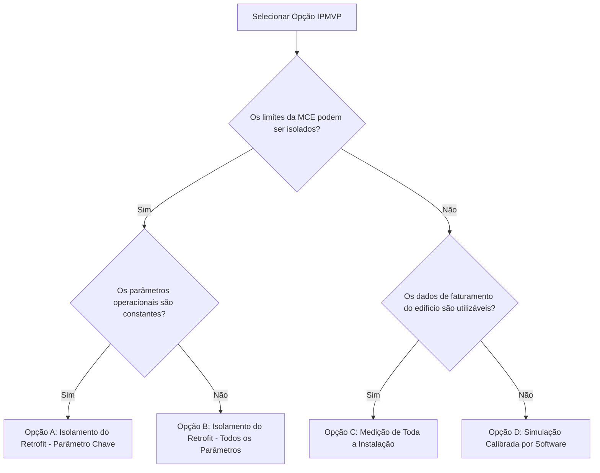

# Guia Abrangente de Auditoria Energética e Otimização de AVAC Durante o Serviço de Manutenção

O ambiente construído é um dos maiores consumidores de energia global, e os sistemas de aquecimento, ventilação e ar condicionado (AVAC/HVAC) são consistentemente os subsistemas mais intensivos em energia nessas estruturas. De acordo com dados de pesquisas setoriais extensas, as operações de AVAC normalmente representam de **40% a 60% do consumo total de energia de edifícios comerciais**, superando vastamente outros usos finais, como iluminação, aquecimento de água sanitária e tomadas. [^1] Apesar dos avanços contínuos nos padrões de eficiência de equipamentos, automação digital de edifícios e projetos arquitetônicos de alto desempenho, permanece uma lacuna de desempenho significativa entre os limites termodinâmicos teóricos dos equipamentos de AVAC e sua eficiência operacional real no campo. [^1]

Esta lacuna de desempenho sistêmica é predominantemente impulsionada por práticas inadequadas de instalação, desvios operacionais inevitáveis (*operational drift*) e manutenção negligenciada, que se manifestam como penalidades energéticas substanciais e cumulativas ao longo do ciclo de vida dos equipamentos. Para gestores de facilidades, técnicos de manutenção e engenheiros de energia, os serviços de manutenção de rotina apresentam uma oportunidade inestimável, embora frequentemente negligenciada, de conduzir auditorias energéticas rigorosas de forma concomitante. Ao alavancar princípios termodinâmicos fundamentais, medições psicrométricas de campo avançadas e protocolos de diagnóstico direcionados, os profissionais podem identificar, quantificar e retificar desperdícios ocultos de energia.

Este relatório fornece um framework de nível especialista para a execução de auditorias energéticas de AVAC durante o serviço mecânico de rotina. Ele cobre as métricas fundamentais de consumo de energia, diagnósticos exaustivos de desperdício, técnicas avançadas de medição de campo, Medidas de Conservação de Energia (MCEs/ECMs) acionáveis, metodologias detalhadas de análise financeira e os rigorosos protocolos de Medição e Verificação (M&V) exigidos para comprovar as economias de energia aos stakeholders.

---

## 1. Fundamentos do Consumo de Energia em AVAC

Um pré-requisito obrigatório para identificar e quantificar o desperdício de energia é estabelecer uma compreensão robusta dos padrões de consumo de linha de base (*baseline*), métricas de eficiência dos equipamentos e limites teóricos de desempenho. Sem uma linha de base precisa e uma compreensão completa das métricas de desempenho ideal, torna-se impossível quantificar o impacto financeiro da degradação do sistema ou avaliar a eficácia de uma intervenção de engenharia proposta.

### Linhas de Base de Energia e Benchmarking

O *Commercial Buildings Energy Consumption Survey* (CBECS), administrado pela Administração de Informação de Energia dos EUA (EIA), fornece dados empíricos sobre o uso de energia em diversos tipos de edifícios comerciais. [^3] As organizações que utilizam os dados do CBECS podem facilitar o benchmarking da Intensidade de Uso de Energia (EUI - Energy Use Intensity) de uma instalação, que normaliza o consumo total de energia em relação à área construída bruta do edifício. O EUI é tipicamente expresso nas seguintes unidades:

$$\text{EUI} = \frac{\text{kBtu}}{\text{ft}^2\text{/ano}} \quad \text{ou} \quad \frac{\text{kWh}}{\text{m}^2\text{/ano}}$$ [^5]

O benchmarking revela que a intensidade de energia de AVAC varia significativamente dependendo da atividade principal do edifício e dos controles ambientais exigidos. Por exemplo, os requisitos de energia em hospitais e instalações de saúde são impulsionados por códigos de ventilação rigorosos, operação contínua 24 horas por dia, 7 dias por semana, mandatos estritos de qualidade do ar interno (QAI) e controle rigoroso de umidade. Isso leva a um EUI mediano muito maior comparado a instalações educacionais ou depósitos, que apresentam ocupação intermitente e parâmetros térmicos mais flexíveis. [^6]

```mermaid
%%{init: {'theme': 'neutral'}}%%
xychart-beta
    title "Intensidade de Uso de Energia (EUI Font Median) por Tipo de Edifício Comercial"
    x-axis [Armazém, Habitação, Escola K-12, Varejo, Escritório, Hotel, Consultório, Hospital]
    y-axis "EUI Fonte Mediano (kBtu/ft²/ano)" 0 to 500
    bar [80, 124, 153, 160, 167, 208, 237, 426.9]
```

*Figura 1: Valores medianos de EUI de fonte (kBtu/ft²/ano) por tipologia predial com base em dados de referência do ENERGY STAR.* [^6] [^8]

A tabela a seguir fornece o contexto para o que constitui um desempenho bom, médio ou insatisfatório para várias classificações de edifícios:

| Tipo de Edifício | EUI de Fonte Mediano ($\text{kBtu/ft}^2\text{/ano}$) | Características e Direcionadores de Carga de AVAC |
| :--- | :---: | :--- |
| **Hospital (Geral)** | $426,9$ | Operação contínua 24h, 100% de ar externo em zonas críticas, controle estrito de umidade, alta carga térmica interna de equipamentos médicos. [^6] |
| **Consultório Médico** | $232,8$ | Alta carga térmica interna, taxas de ventilação elevadas comparadas a escritórios padrão, horário de operação estendido. [^6] |
| **Hotel / Alojamento** | $208,0$ | Ocupação variável, operação contínua, alta carga de água quente sanitária e sistemas de resfriamento descentralizados (ex: PTACs) suscetíveis a manutenção deficiente. [^6] |
| **Escritório (Geral)** | $167,0$ | Horários diurnos previsíveis, favorável ao uso de economizadores (*free cooling*), períodos distintos de ocupação/desocupação, carga moderada de equipamentos. [^6] |
| **Varejo (Não Refrigerado)** | $160,0$ | Alta carga de iluminação, ocupação transitória variável, grande exposição da envoltória (fachadas envidraçadas e abertura frequente de portas). [^6] |
| **Escola (K-12)** | $153,0$ | Cronogramas intermitentes (férias escolares), alta densidade de ocupação e requisitos rigorosos de ventilação durante as horas letivas. [^6] |
| **Armazém / Depósito** | $\sim 80,0$ | Climatização mínima, baixa densidade de ocupação, grande volume físico, mas baixa demanda térmica por metro quadrado. [^6] |

*Tabela 1: EUI de Fonte Mediano por Tipologia Predial* [^6]

Quando um auditor se depara com um edifício de escritórios padrão operando com um EUI de $250\text{ kBtu/ft}^2\text{/ano}$, os dados sugerem imediatamente anomalias operacionais graves, tais como economizadores travados, aquecimento e resfriamento simultâneos ou infiltração excessiva de ar externo, exigindo uma investigação mecânica aprofundada. [^9]

### Métricas de Eficiência de Equipamentos de AVAC

Avaliar o desempenho de equipamentos no campo requer fluência total em métricas de eficiência padronizadas. Estas métricas definem o rendimento termodinâmico do sistema em relação à sua entrada elétrica. [^11]

*   **Demanda (kW) e Consumo (kWh):** A demanda em quilowatts (kW) refere-se à taxa de pico de energia elétrica consumida pelo equipamento em um momento específico, impactando diretamente as cobranças de demanda das concessionárias. O consumo em quilowatt-hora (kWh) mede a energia elétrica total consumida ao longo do tempo.
*   **Coeficiente de Desempenho (COP - Coefficient of Performance):** Uma razão adimensional da saída de aquecimento ou resfriamento útil em relação à entrada de energia elétrica total. É calculado como:

$$COP = \frac{P_c}{P_w}$$ [^11]

Onde:
*   $P_c$ é a potência térmica de refrigeração fornecida (em Watts).
*   $P_w$ é a potência elétrica ativa consumida (em Watts).

Um COP mais alto indica maior eficiência. Por exemplo, um sistema com COP de $3,52$ move $3,52$ unidades de energia térmica para cada $1$ unidade de energia elétrica consumida.

*   **Razão de Eficiência Energética (EER - Energy Efficiency Ratio):** A razão da capacidade de refrigeração (em BTU/h) em relação à entrada elétrica (em Watts) em uma condição operacional de pico específica (tipicamente **95°F / 35°C** externo). O EER é calculado como:

$$EER = \frac{\text{Capacidade (BTU/h)}}{\text{Potência (W)}}$$ [^11]

Considerando que $1\text{ kW} = 3.412\text{ BTU/h}$, as métricas EER e COP estão matematicamente relacionadas da seguinte forma:

$$EER = 3,412 \times COP$$ [^11]

*   **Razão de Eficiência Energética Sazonal (SEER / SEER2):** Uma evolução do EER que contabiliza as variações sazonais de temperatura, representando a saída total de resfriamento ao longo de uma estação de resfriamento típica dividida pelo consumo elétrico total em watt-hora. O SEER é crítico para equipamentos residenciais e comerciais de pequeno porte porque considera condições de carga parcial sob diferentes climas. [^11]
*   **Valor de Carga Parcial Integrado (IPLV) e Valor de Carga Parcial Não Padronizado (NPLV):** Cruciais para grandes sistemas centrais, como plantas de água gelada (chillers). O IPLV é definido pela norma AHRI 550/590. Os chillers raramente operam a 100% da capacidade de projeto; na verdade, operam em carga parcial em mais de 99% do tempo de operação. [^12] O IPLV pondera a eficiência em quatro condições de carga parcial (100%, 75%, 50% e 25%) para refletir a operação real do edifício. [^12] A fórmula do IPLV é:

$$IPLV = \frac{1}{\frac{0,01}{A} + \frac{0,42}{B} + \frac{0,45}{C} + \frac{0,12}{D}}$$ [^12]

Onde $A, B, C \text{ e } D$ representam a eficiência (expressa em kW/ton ou COP) a 100%, 75%, 50% e 25% de carga, respectivamente. [^12] O NPLV é utilizado quando o chiller é projetado para temperaturas de entrada de água de condensação não padronizadas.
*   **kW/ton (ou kW/TR):** Comum em sistemas de chillers de grande porte, esta métrica indica a demanda elétrica ativa (kW) necessária para produzir uma tonelada de refrigeração (TR ou ton, equivalente a $12.000\text{ BTU/h}$ ou $3,517\text{ kW}$ térmicos). Valores mais baixos denotam eficiência superior. Chillers centrífugos de mancal magnético refrigerados a água de alta eficiência podem alcançar valores de IPLV **$\le 0,500\text{ kW/TR}$**, enquanto chillers alternativos mais antigos refrigerados a ar podem exceder **$1,2\text{ kW/TR}$**. [^15]

### Cálculo da Eficiência Real do Sistema a partir de Medições de Campo

As classificações de plaqueta refletem as condições de laboratório de fábrica sob parâmetros de instalação ideais. A eficiência real em campo degrada devido a desvios na instalação, envelhecimento e incompatibilidades de carga. O cálculo em campo da capacidade térmica entregue baseia-se em medições psicrométricas e de fluxo de ar. [^17]

Para calcular a capacidade de resfriamento **sensível** ($Q_s$ em BTU/h) de uma unidade de tratamento de ar, o auditor utiliza a seguinte equação termodinâmica:

$$Q_s = 1,08 \times CFM \times \Delta T$$ [^17]

Onde:
*   $CFM$ é o fluxo volumétrico de ar real medido em pés cúbicos por minuto.
*   $\Delta T$ é a diferença de temperatura de bulbo seco entre o retorno e o insuflamento (°F).
*   A constante $1,08$ é derivada do produto do calor específico do ar padrão ($0,24\text{ Btu/lb}\cdot^\circ\text{F}$) pela densidade do ar padrão ($0,075\text{ lb/ft}^3$), multiplicado por $60\text{ min/h}$ para conversão de tempo. [^18]

Para a capacidade de resfriamento **latente** ($Q_l$ em BTU/h), que representa a remoção de umidade por condensação:

$$Q_l = 0,68 \times CFM \times \Delta W$$ [^19]

Onde:
*   $\Delta W$ é a diferença na razão de umidade absoluta do ar (expressa em grãos de umidade por libra de ar seco, *grains/lb*).
*   A constante $0,68$ é a constante de calor latente derivada do calor de vaporização da água. [^19]

Para a capacidade de resfriamento **total** ($Q_t$ em BTU/h), que contabiliza tanto a queda de temperatura sensível quanto a desumidificação latente, a entalpia do ar ($\Delta h$, expressa em BTU/lb de ar seco) deve ser obtida por meio de medições de bulbo úmido e uso de carta psicrométrica:

$$Q_t = 4,5 \times CFM \times \Delta h$$ [^19]

Onde:
*   $\Delta h$ é a diferença de entalpia entre o ar de retorno e de insuflamento.
*   A constante $4,5$ é derivada da densidade do ar padrão ($0,075\text{ lb/ft}^3$) multiplicada por $60\text{ min/h}$. [^19]

Dividindo a capacidade total calculada ($Q_t$ em BTU/h) por **$12.000\text{ BTU/h/TR}$**, obtém-se a tonelagem de refrigeração real entregue pelo sistema em campo. [^18] Comparar esta capacidade térmica entregue contra a potência elétrica ativa consumida (medida por um analisador de energia True RMS) fornece o COP ou EER real de campo, permitindo quantificar a degradação da capacidade e o desperdício financeiro associado. [^17]

---

## 2. Identificação de Desperdícios Comuns de Energia

Os sistemas de AVAC são altamente suscetíveis à entropia e a desvios operacionais. Identificar esses modos de falha transforma a manutenção mecânica de rotina em uma auditoria energética de alto valor.

### A Penalidade Energética de Serpentinas Sujas

O acúmulo de sujeira nas serpentinas do evaporador e do condensador representa uma das fontes mais comuns de desperdício energético. Uma fina camada de poeira ou biofilme atua como um isolante térmico, reduzindo a taxa de transferência de calor e obstruindo o fluxo de ar. [^21]

Em serpentinas de condensadores, a sujeira restringe o fluxo de ar de resfriamento, forçando o compressor a operar com pressões de descarga (cabeça) elevadas e temperaturas de condensação mais altas para rejeitar o calor do ciclo. Pesquisas empíricas indicam que elevar a temperatura de condensação de **95°F para 105°F (35°C para 40°C)** devido à sujeira reduz a capacidade de refrigeração em 7%, enquanto aumenta o consumo elétrico do compressor em 10%. [^23]

```mermaid
%%{init: {'theme': 'neutral'}}%%
xychart-beta
    title "Impacto da Carga Insuficiente de Refrigerante na Eficiência: TXV vs. Orifício Fixo (FXO)"
    x-axis ["100% Carga", "90% Carga", "80% Carga", "70% Carga", "60% Carga"]
    y-axis "Eficiência Relativa (COP %)" 30 to 110
    line [100, 99, 98, 95, 75]
    line [100, 85, 70, 55, 40]
```

*Figura 2: Curvas de degradação da eficiência (COP %) em função do nível de carga de refrigerante.* [^26] A linha superior representa os sistemas com Válvula de Expansão Termostática (TXV), que compensam a subcarga até o limite crítico; a linha inferior representa os sistemas com Orifício Fixo (FXO), que sofrem perda linear imediata.

Dependendo do ambiente, uma serpentina com apenas **0,042 polegada (1,07 mm) de espessura de sujeira** pode elevar o consumo anual de energia do equipamento em até **21%**. [^24] O desperdício tipicamente aumenta em 5% a 25% para cada ano de negligência na limpeza das serpentinas. [^24] Da mesma forma, a sujeira no evaporador reduz a pressão de ebulição do refrigerante e restringe o fluxo de ar interno, reduzindo a capacidade do sistema e elevando o risco de congelamento da serpentina. Testes laboratoriais demonstram que a combinação de um evaporador 20% bloqueado e um condensador 30% obstruído pode reduzir a eficiência do sistema de refrigeração em 3% a 9% adicionais devido ao efeito cumulativo da manutenção diferida. [^25]

### Carga Incorreta de Refrigerante: O Dreno Oculto

A carga incorreta de refrigerante — seja subcarga por vazamentos lentos ou sobrecarga por manutenções inadequadas — prejudica drasticamente o ciclo termodinâmico. Segundo a Nota Técnica 1848 do NIST, a carga inadequada é uma das falhas mais frequentes no setor de AVAC. [^26] A severidade do desperdício de energia depende do dispositivo de expansão utilizado: Orifício Fixo (FXO) ou Válvula de Expansão Termostática (TXV). [^28]

*   **Subcarga (Carga Insuficiente):** Reduz o fluxo de massa do refrigerante, resultando em baixas pressões de sucção, superaquecimento elevado e altas temperaturas de descarga do compressor. [^29] Em sistemas FXO, a subcarga causa uma queda rápida e linear na capacidade de refrigeração e na eficiência energética. Em contrapartida, as válvulas TXV modulam a abertura para manter o superaquecimento constante, mascarando os sintomas de subcarga. Nesses sistemas, a eficiência e o COP não sofrem reduções severas até que a carga caia abaixo de **70% do valor nominal de fábrica**. A partir desse limite crítico, a válvula se abre totalmente, perde a capacidade de regulação e o sistema se comporta como um FXO sem refrigerante, sofrendo severa degradação de eficiência. [^28]
*   **Sobrecarga (Excesso de Carga):** Causa o acúmulo de refrigerante líquido no condensador, reduzindo a área útil de troca térmica de condensação. Isso eleva a pressão de alta (head pressure) e o subresfriamento, forçando o compressor a consumir energia elétrica excessiva para vencer a contrapressão elevada. [^29] Uma sobrecarga de 30% pode reduzir o COP em cerca de 4%, enquanto uma subcarga de 30% pode reduzir a eficiência em até 15% devido à perda de capacidade térmica. [^26]

### Tempo de Operação Excessivo: Falhas de Controle e de Economizadores

Os economizadores de ar (*air-side economizers*) são projetados para fornecer resfriamento gratuito (*free cooling*) admitindo ar externo quando a temperatura e entalpia externas estão favoráveis, desligando o compressor mecânico. No entanto, os amortecedores mecânicos (*dampers*) frequentemente falham em posição aberta ou fechada devido a hastes quebradas, atuadores pneumáticos travados ou sensores descalibrados. [^21]

Um *damper* travado na posição aberta durante picos de verão ou inverno introduz cargas térmicas externas massivas, gerando severas penalidades energéticas, pois o sistema tenta climatizar 100% de ar externo sem recirculação. Inversamente, um *damper* travado na posição fechada elimina completamente os benefícios do resfriamento gratuito, forçando a operação do compressor em condições amenas e inflando as horas de runtime. Além disso, os sensores de temperatura de sistemas de automação predial (BAS) frequentemente sofrem desvios de **2°F a 4°F (1,1°C a 2,2°C) ao ano** se a calibração for negligenciada, resultando em runtimes excessivos e perda de controle térmico das zonas. [^24]

### Vazamento de Dutos: Perda Aerodinâmica Silenciosa

Em sistemas de dutos, os vazamentos de ar geram uma penalidade dupla: perda de energia térmica condicionado e desperdício de trabalho aerodinâmico realizado pelo ventilador. O ar condicionado que escapa para espaços não condicionados (como forros, sótãos e poços de serviço) representa energia desperdiçada diretamente para fora da envoltória do edifício.

O vazamento de dutos é quantificado por meio de testes de pressurização, medindo o fluxo de ar que escapa quando a rede de dutos é pressurizada a 25 Pascals (expresso em $CFM_{25}$). [^31] A taxa de vazamento é expressa como uma porcentagem do fluxo de ar nominal. Estudos do Departamento de Energia dos EUA indicam que redes de dutos sem vedação adequada podem desperdiçar de **10% a 30% da energia de aquecimento e resfriamento**. [^33] Se um sistema de $80.000\text{ BTU/h}$ com vazão de $2.000\text{ CFM}$ perder **$300\text{ CFM}$** para um entreforro, sofrerá uma perda direta de 15% na capacidade entregue, prolongando o runtime do compressor. [^31] Além disso, vazamentos na linha de retorno em áreas não condicionadas puxam ar com temperaturas extremas e alta umidade para o evaporador, forçando a serpentina a gastar até 30% de sua capacidade térmica apenas na remoção de umidade latente, reduzindo a capacidade de resfriamento sensível do ambiente. [^32]

### Aquecimento e Resfriamento Simultâneos (Desperdício por Reaquecimento)

O resfriamento e aquecimento simultâneos de ar é uma ineficiência severa comum em sistemas de Volume de Ar Variável (VAV) com reaquecimento terminal (*terminal reheat*). Nestas configurações, as unidades de tratamento de ar centrais resfriam o ar de retorno misturado até uma temperatura fixa de insuflamento (tipicamente **55°F / 13°C**) para garantir a desumidificação adequada do edifício. [^23] Quando uma zona periférica específica não necessita de resfriamento máximo, a caixa VAV estrangula o fluxo de ar até a posição mínima. Se a temperatura da zona continuar a cair, a unidade terminal ativa uma serpentina de reaquecimento (elétrica ou de água quente) para aquecer o ar frio antes que ele entre no ambiente. [^23]

O desperdício energético aqui é duplo: consome-se energia na planta central de água gelada para resfriar o ar e, em seguida, consome-se energia local na caixa VAV para reaquecê-lo. Esse problema é agravado quando as configurações de fluxo de ar mínimo das caixas VAV estão programadas com valores muito altos. A norma ASHRAE 90.1 ataca esse desperdício exigindo que os fluxos mínimos das caixas VAV sejam reduzidos para o limite mínimo de ventilação de ar externo exigido (frequentemente **20% do fluxo de projeto**) antes que o reaquecimento seja ativado. [^36] Identificar fluxos de VAV mínimos desregulados ou setpoints de água gelada desnecessariamente baixos é um dos principais objetivos de uma auditoria de AVAC.

### Envoltória Predial Inadequada e Infiltração

A eficiência da planta de AVAC está ligada à integridade térmica da envoltória do edifício. Isolamentos térmicos deficientes e infiltrações de ar aumentam a carga térmica de base que o sistema de climatização deve atender. A transferência de calor através da envoltória é calculada por:

$$Q = U \times A \times \Delta T$$ [^19]

Onde:
*   $U$ é o coeficiente de transmitância térmica da parede/vidro (inverso da resistência térmica $R$).
*   $A$ é a área física da envoltória ($m^2$ ou $ft^2$).
*   $\Delta T$ é a diferença de temperatura entre os ambientes interno e externo.

A infiltração de ar externo (induzida por pressão do vento e efeito chaminé) introduz ar não condicionado através de frestas em janelas, portas e juntas estruturais. Em climas quentes e úmidos, a infiltração introduz cargas latentes elevadas, sobrecarregando a serpentina do evaporador e favorecendo problemas de umidade e bolor no edifício.

### Equipamentos Superdimensionados e Penalidades de Carga Parcial

Uma prática comum no setor de AVAC é o superdimensionamento intencional de equipamentos durante o projeto, visando evitar reclamações de falta de capacidade em dias de calor extremo. No entanto, equipamentos superdimensionados sofrem severas penalidades operacionais. [^26]

Uma unidade de ar condicionado superdimensionada atinge o setpoint de temperatura sensível rapidamente e desliga (ciclo curto - *short-cycling*). Como o processo de desumidificação latente exige que a serpentina do evaporador permaneça fria e ativa por períodos contínuos para condensar a umidade do ar, o ciclo curto impede a remoção eficaz da umidade, resultando em um ambiente interno frio e úmido. [^28] Além disso, os maiores picos de corrente elétrica e desgastes mecânicos ocorrem durante a partida do compressor; uma unidade superdimensionada que liga e desliga constantemente consome significativamente mais energia elétrica ao longo de sua vida útil do que uma unidade dimensionada corretamente operando ciclos mais longos e estáveis. Por fim, o excesso de capacidade de um equipamento superdimensionado mascara falhas graves, como grandes vazamentos de dutos ou perda de carga de refrigerante, pois o sistema consegue atender ao termostato mesmo operando com eficiência severamente comprometida. [^26]

---

## 3. Técnicas de Medição de Campo para Avaliação Energética

Uma auditoria energética de AVAC robusta depende de medições empíricas para diagnosticar falhas elétricas, aerodinâmicas e termodinâmicas. Depender apenas de inspeção visual ou de leituras de sensores não calibrados do BAS gera conclusões incorretas. [^37]

### Medição de Potência Elétrica

A medição de potência de motores elétricos de indução e compressores trifásicos requer analisadores True RMS. Como os motores operam com fatores de potência (PF) variáveis de acordo com a carga mecânica aplicada, a simples leitura de amperagem com alicate amperímetro comum e multiplicação pela tensão nominal resulta em valores incorretos de potência ativa. A potência ativa real (kW) consumida por equipamentos trifásicos é calculada como:

$$P(\text{kW}) = \frac{V \times I \times PF \times \sqrt{3}}{1000}$$ [^11]

Onde:
*   $V$ é a tensão de linha média medida entre as fases (Volts).
*   $I$ é a corrente média medida nas fases (Amperes).
*   $PF$ é o fator de potência real medido (fator adimensional entre 0 e 1).

A instalação de registradores de dados (*data loggers*) de corrente com TC (transformadores de corrente) nos circuitos dos compressores e ventiladores por vários dias fornece dados de ciclo de trabalho, identificando ciclos curtos ocultos, estágios de capacidade operando incorretamente e runtimes excessivos que indicam falhas de controle. [^38]

### Perfil Aerodinâmico: Fluxo de Ar e Pressões

A verificação do fluxo de ar é fundamental, pois fluxos deficientes reduzem a temperatura do evaporador, geram congelamento da serpentina e reduzem a capacidade térmica entregue. [^26]

*   **Travesia com Anemômetro:** Utilização de anemômetros de fio quente ou de hélice para realizar uma malha de medições de velocidade em seções transversais de dutos. A velocidade média do ar (em pés por minuto, FPM) multiplicada pela área transversal do duto (em $ft^2$) fornece o fluxo volumétrico total em CFM. [^18]
*   **Perfil de Pressão Estática:** Medição da Pressão Estática Total Externa (TESP - Total External Static Pressure) através da unidade de tratamento de ar utilizando manômetros digitais e sondas de pressão estática instaladas antes e depois do ventilador. Pressões estáticas elevadas (geradas por filtros obstruídos ou redes de dutos estranguladas) forçam motores comutados eletronicamente (ECM) a elevar a rotação (RPM) para manter a vazão, aumentando exponencialmente o consumo de energia em Watts, ou causam escorregamento severo em motores do tipo capacitor dividido permanente (PSC), reduzindo drasticamente a vazão de ar. [^21]

### Perfil Termodinâmico e Psicrométrico

Avaliar o estado do ciclo de refrigeração e das correntes de ar exige leituras precisas de pressão e temperatura.

*   **Superaquecimento e Subresfriamento:** O cálculo do superaquecimento (temperatura da linha de sucção menos a temperatura de saturação do evaporador) e do subresfriamento (temperatura de saturação do condensador menos a temperatura da linha de líquido) são diagnósticos definitivos para a carga de refrigerante e a operação da válvula de expansão. [^30] Níveis altos de subresfriamento associados a baixo superaquecimento indicam sobrecarga de refrigerante ou restrições severas na linha de líquido (como filtro secador obstruído); baixo subresfriamento e alto superaquecimento indicam vazamento e falta de refrigerante. [^29]
*   **Avaliação de Entalpia:** O uso de psicrômetros digitais para medir as temperaturas de bulbo seco e bulbo úmido nas correntes de ar de retorno e insuflamento permite traçar os pontos termodinâmicos em softwares psicrométricos. Isso identifica a Razão de Calor Sensível (SHR - Sensible Heat Ratio), determinando quanta capacidade é dedicada ao resfriamento sensível do ar versus a remoção de umidade por calor latente. [^42]

### Verificação da Operação do Economizador

Para verificar matematicamente se um economizador de ar está modulando e misturando as correntes de ar de retorno e externo corretamente, calcula-se a Fração de Ar Externo (OAF - Outdoor Air Fraction) usando as diferenças de temperatura de bulbo seco:

$$\text{OAF} = \frac{T_{\text{Retorno}} - T_{\text{Mistura}}}{T_{\text{Retorno}} - T_{\text{Externo}}}$$ [^45] [^46]

Onde:
*   $T_{\text{Retorno}}$ é a temperatura do ar de retorno do edifício.
*   $T_{\text{Mistura}}$ é a temperatura do ar misturado medida após os *dampers*, antes da serpentina.
*   $T_{\text{Externo}}$ é a temperatura do ar externo.

Para maior precisão sob condições de umidade variável, substitui-se a temperatura de bulbo seco pelas entalpias correspondentes ($h$) obtidas psicrometricamente:

$$\text{OAF} = \frac{h_{\text{Retorno}} - h_{\text{Mistura}}}{h_{\text{Retorno}} - h_{\text{Externo}}}$$ [^45] [^46]

As medições devem ser feitas evitando erros de estratificação térmica do ar: o ar de retorno deve ser medido imediatamente antes do *damper* de retorno, e o ar misturado deve ser medido após os *dampers* de mistura, mas antes de passar pela serpentina fria para garantir a homogeneidade aerodinâmica da mistura. [^46] Um OAF calculado que divirja do sinal de comando enviado pelo BAS indica falha mecânica nos atuadores, ligações soltas ou sensores descalibrados.

---

## 4. Medidas de Conservação de Energia (MCEs)

Ao diagnosticar desperdícios por meio de medições, a auditoria deve prescrever Medidas de Conservação de Energia (MCEs) acionáveis, categorizadas por custos de implementação e complexidade. [^48]

### Medidas de Baixo Custo e Sem Custo

Exigem investimentos mínimos de capital, dependendo do trabalho de manutenção de rotina para restaurar o desempenho original de projeto. [^21]

*   **Remediação de Serpentinas e Sopradores:** Execução de limpeza química profunda das serpentinas do condensador e evaporador, e lavagem técnica das pás do rotor do soprador. A eliminação de uma camada fina de sujeira de serpentina de **0,042 polegada** pode restaurar até 21% da eficiência de troca térmica e eliminar a penalidade de 10% de consumo do compressor por pressões de descarga elevadas. [^23]
*   **Otimização de Filtros:** Transição da substituição de filtros baseada em calendário rígido para substituição baseada em condição, utilizando sensores de pressão diferencial instalados nos bancos de filtros. Isso evita quedas de pressão severas que sobrecarregam os ventiladores, garantindo que os filtros não sejam descartados prematuramente. [^21]
*   **Ajuste de Setpoints e Cronogramas:** Correção das programações horárias no BAS para alinhar com a ocupação real do edifício, implementação de rotinas de partida/parada otimizadas para evitar pré-resfriamentos excessivos e ampliação das bandas mortas (*deadbands*) de temperatura para evitar disputas térmicas de aquecimento e resfriamento simultâneos em zonas adjacentes. [^24]

### Medidas de Médio Custo: Instalação de VFDs e Leis de Afinidade

Uma das MCEs de médio custo mais rentáveis em sistemas comerciais é a instalação de Inversores de Frequência (VFDs) em bombas de água gelada e ventiladores que operam com rotação constante. A economia gerada pelos VFDs baseia-se nas **Leis de Afinidade**, que ditam que a potência elétrica consumida por cargas centrífugas varia com o cubo da rotação do motor: [^49]

$$\frac{P_2}{P_1} = \left( \frac{N_2}{N_1} \right)^3$$ [^49]

Onde:
*   $P_1 \text{ e } P_2$ representam a potência elétrica consumida antes e depois da redução de velocidade.
*   $N_1 \text{ e } N_2$ representam a rotação do motor (RPM ou frequência em Hz) antes e depois.

> [!NOTE]
> **Exemplo Prático de Cálculo:**
> Considere uma bomba centrífuga de água gelada de **100 HP** (que consome **$79,36\text{ kW}$** de potência ativa de entrada, assumindo eficiência do motor de 94%) operando continuamente a uma frequência fixa de **60 Hz**.
> Se for instalado um VFD e a velocidade da bomba for reduzida em apenas 30%, operando a **70% de rotação (42 Hz)** em períodos de baixa carga térmica, a nova demanda elétrica ativa não será de 70% do consumo original. Ela seguirá a lei cúbica:
> 
> $$P_2 = 79,36\text{ kW} \times (0,7)^3 = 79,36\text{ kW} \times 0,343 = 27,22\text{ kW}$$ [^51]
> 
> Portanto, uma redução de **30% na velocidade** resulta em uma redução de **65,7% no consumo de energia elétrica**! [^51]

*Aviso Importante:* As Leis de Afinidade aplicam-se estritamente a cargas centrífugas (ventiladores axiais/centrífugos e bombas centrífugas). Bombas de deslocamento positivo possuem relação linear entre potência e rotação. Além disso, os técnicos devem auditar os limites de pressão estática do sistema hidráulico/aerodinâmico; reduzir excessivamente a rotação pode fazer a bomba operar abaixo da perda de carga da rede de tubulações (estolar), cessando o fluxo de água e gerando quebras térmicas nos selos mecânicos por falta de refrigeração. [^49]

```mermaid
%%{init: {'theme': 'neutral'}}%%
xychart-beta
    title "Leis de Afinidade de Bombas Centrífugas: O Poder da Velocidade Variável"
    x-axis ["50% Vel.", "60% Vel.", "70% Vel.", "80% Vel.", "90% Vel.", "100% Vel."]
    y-axis "Porcentagem do Nominal (%)" 0 to 110
    line [50, 60, 70, 80, 90, 100]
    line [25, 36, 49, 64, 81, 100]
    line [12.5, 21.6, 34.3, 51.2, 72.9, 100]
```

*Figura 3: Comportamento das variáveis operacionais de bombas centrífugas sob rotação variável.* [^49] A curva superior representa a vazão (linear); a curva intermediária representa a pressão estática (quadrática); a curva inferior demonstra a potência elétrica consumida (cúbica), destacando o potencial de economia de energia (ex: a 80% da rotação, consome-se apenas 51,2% da potência nominal).

### Recomendações de Alto Custo (Investimento de Capital - CapEx)

Quando os equipamentos de AVAC chegam ao fim de sua vida útil operacional útil ou quando reformas parciais não são viáveis economicamente, o auditor deve propor a substituição por novas tecnologias de alta eficiência. [^48]

*   **Substituição por Sistemas Inverter ou VRF:** Substituição de sistemas de expansão direta antigos com compressores de velocidade fixa por sistemas de Fluxo de Refrigerante Variável (VRF/VRV) inverter, ou substituição de chillers antigos por unidades de mancal magnético refrigeradas a água com IPLV inferior a **$0,500\text{ kW/TR}$**. [^15]
*   **Ventilação com Recuperação de Energia (ERV - Energy Recovery Ventilation):** Instalação de rodas entálpicas na rede de dutos de renovação de ar para realizar a transferência de calor sensível (temperatura) e latente (umidade) entre o ar condicionado rejeitado pelo exaustor e o ar externo novo admitido no edifício. No verão, o exaustor pré-resfria e desumidifica o ar externo; no inverno, realiza o pré-aquecimento, reduzindo drasticamente a carga térmica imposta ao evaporador. [^23]

---

## 5. Cálculo e Apresentação de Economias de Energia

Uma auditoria energética de AVAC não possui valor prático se as recomendações técnicas não convencerem a diretoria financeira (CFO) a investir nas ações propostas. Traduzir o desperdício termodinâmico medido em métricas financeiras claras é o caminho para aprovar os projetos. [^51]

### Período de Retorno Simples (Payback) e Custos Evitados

A métrica financeira primária utilizada em auditorias de manutenção é o Período de Retorno Simples (Payback Simples), que define o tempo necessário para recuperar o investimento inicial por meio da economia financeira gerada nas faturas de utilidades: [^50]

$$\text{Payback (Anos)} = \frac{\text{Investimento Total da MCE}}{\text{Economia Anual de Energia}}$$ [^50]

> [!TIP]
> **Exemplo Prático de Modelagem Financeira:**
> Utilizando o motor de **100 HP** do VFD mencionado na Seção 4.2, assuma que a bomba de água gelada opera **$6.000\text{ horas/ano}$** a uma tarifa média de energia de **$0,12\text{ USD/kWh}$** (equivalente a tarifas locais brasileiras convertidas com taxas de demanda inclusas).
> 
> *   **1. Custo Anual de Linha de Base:**
> 
> $$\text{Custo} = 79,36\text{ kW} \times 6.000\text{ horas} \times 0,12\text{ USD/kWh} = 57.139\text{ USD/ano}$$ [^51]
> 
> *   **2. Consumo Projetado com VFD:**
> Assuma que a redução para 70% de rotação (consumindo $27,22\text{ kW}$) é mantida por $3.000\text{ horas}$ de carga parcial, e a bomba opera a 100% de velocidade ($79,36\text{ kW}$) por outras $3.000\text{ horas}$ de pico de carga:
>     *   Consumo a 100%: $79,36\text{ kW} \times 3.000\text{ h} = 238.080\text{ kWh}$
>     *   Consumo a 70%: $27,22\text{ kW} \times 3.000\text{ h} = 81.660\text{ kWh}$
>     *   Consumo Anual Projetado: $238.080 + 81.660 = 319.740\text{ kWh}$
>     *   Custo Anual Projetado: $319.740\text{ kWh} \times 0,12\text{ USD/kWh} = 38.368\text{ USD/ano}$ [^51]
> 
> *   **3. Economia Anual de Energia:**
> 
> $$\text{Economia} = 57.139\text{ USD} - 38.368\text{ USD} = 18.771\text{ USD/ano}$$
> 
> *   **4. Retorno Simples (Payback):**
> Se a instalação turnkey do inversor VFD (equipamento, montagem de painel, cabos e comissionamento) custar **$25.000\text{ USD}$**:
> 
> $$\text{Payback} = \frac{25.000\text{ USD}}{18.771\text{ USD/ano}} = 1,33\text{ Anos (aproximadamente 16 meses)}$$ [^51]

### Alavancando Financiamentos e Subsídios de Eficiência Energética

Para acelerar o payback e melhorar a Taxa Interna de Retorno (TIR), o auditor deve integrar incentivos locais aos modelos financeiros.

No Brasil, a Agência Nacional de Energia Elétrica (ANEEL) regulamenta o **Programa de Eficiência Energética (PEE)**. [^53] Sob este marco regulatório, as distribuidoras de energia elétrica (como CPFL, Enel, Neoenergia e Light) são obrigadas por lei a aplicar uma porcentagem de sua receita operacional líquida anual em projetos voltados a melhorar a eficiência no uso de energia de instalações de consumidores de grande porte. [^53]

Essas concessionárias realizam periodicamente **Chamadas Públicas de Projetos (CPP)**. [^55] Através destas chamadas públicas, indústrias, shoppings, hospitais e edifícios comerciais podem submeter projetos de engenharia para substituição de chillers antigos e retrofit de sistemas de iluminação e AVAC. Se aprovados, os projetos podem receber subsídios não reembolsáveis de até 100% do valor do investimento (a fundo perdido) ou financiamentos de baixo custo sob contratos de desempenho, utilizando ESCOs (*Energy Service Companies*) credenciadas para intermediar a elaboração técnica e as medições de conformidade exigidas pelo programa. [^54] Incorporar esses incentivos no relatório de auditoria aumenta a viabilidade de MCEs de alto custo e gera valor estratégico para o cliente.

---

## 6. Medição e Verificação de Energia (M&V)

Uma vez implementada a Medida de Conservação de Energia, as economias geradas devem ser comprovadas de forma empírica para satisfazer os financiadores prediais e garantir a conformidade dos contratos de desempenho. O **Protocolo Internacional de Medição e Verificação de Desempenho (IPMVP)** fornece o framework de referência global para quantificar as economias de energia. [^48] As economias reais não podem ser medidas diretamente; elas são calculadas como a diferença entre a energia que teria sido consumida (linha de base ajustada) e a energia real consumida após a intervenção: [^52]

$$\text{Economia} = (\text{Energia de Linha de Base}) - (\text{Energia Pós-Retrofit}) \pm \text{Ajustes Rotineiros e Não Rotineiros}$$ [^52]

Os ajustes rotineiros cobrem variações previsíveis de carga, como mudanças climáticas (temperatura externa), enquanto os ajustes não rotineiros cobrem alterações estruturais na instalação, como acréscimo de novas alas de escritórios ou alteração nos horários de funcionamento do edifício. [^52]

### As Quatro Opções do IPMVP

O auditor deve selecionar a estratégia de M&V apropriada com base na complexidade da MCE, variabilidade da carga e disponibilidade de dados de faturamento históricos. [^60]



*   **Opção A: Isolamento do Retrofit com Medição de Parâmetro Chave:** Aplicado a sistemas onde o potencial de desempenho pode ser verificado por medições pontuais antes e depois, mas estimando variáveis previsíveis. Exemplo: retrofit de motor de velocidade constante de ventilador de exaustão por modelo de alta eficiência. Mede-se a potência ativa (kW) antes e depois, e estima-se as horas de operação com base nas rotinas de funcionamento do edifício. [^48]
*   **Opção B: Isolamento do Retrofit com Medição de Todos os Parâmetros:** Indicado para sistemas onde as cargas variam continuamente e exigem registro contínuo. Exemplo: VFD instalado em motor de ventilador de torre de resfriamento. Utiliza-se medidores de potência ativos (kW) dedicados ao circuito do motor de forma contínua durante todo o período de avaliação para registrar o consumo real sob carga parcial. [^60]
*   **Opção C: Medição de Toda a Instalação:** Avalia as economias monitorando as leituras dos medidores de entrada da concessionária de energia elétrica do edifício comercial. É adequado para retrofits complexos e interativos (ex: substituição de chillers centrais associada a isolamento de fachadas e automação de iluminação), onde as economias projetadas excedem **10% da fatura total de energia**, evitando que o ganho seja mascarado por flutuações estatísticas menores de consumo. [^60]
*   **Opção D: Simulação Calibrada por Software:** Utiliza modelos de simulação termodinâmica computadorizada (como *EnergyPlus* ou *TRACE 3D Plus*) calibrados com base em dados de consumo reais do edifício. É empregado quando dados históricos de linha de base não estão disponíveis (como em ampliações prediais ou novas construções) ou quando alterações profundas nas operações inviabilizam o histórico de faturamento existente. [^60]

### Normalização Climática e Modelos de Regressão

Ao utilizar a Opção C do IPMVP, a simples comparação direta das faturas de energia de um ano para o outro é inválida porque as condições climáticas externas variam anualmente. Um verão mais ameno naturalmente reduzirá o consumo de refrigeração, gerando economias falsas que não decorrem das melhorias de engenharia. Portanto, a linha de base deve ser corrigida matematicamente para as condições climáticas reais do período pós-retrofit. [^52]

Esta normalização é realizada utilizando os conceitos de Graus-Dia de Resfriamento (CDD - Cooling Degree Days) e Graus-Dia de Aquecimento (HDD - Heating Degree Days) calculados em relação a uma temperatura de equilíbrio térmico do edifício (tipicamente **65°F / 18°C**). [^64]

*   Se a temperatura média externa de um dia for de **80°F (26,7°C)**, esse dia contribui com **$15\text{ CDD}$** para a contagem climática.
*   Se a temperatura média externa de um dia for de **40°F (4,4°C)**, esse dia contribui com **$25\text{ HDD}$** para o aquecimento. [^65]

Os auditores utilizam modelos de regressão linear para correlacionar o consumo histórico de energia do edifício (kWh/mês) contra os dados de CDD e HDD locais correspondentes a cada mês, gerando uma equação linear de linha de melhor ajuste ($y = mx + b$). A precisão estatística do modelo de regressão é validada por meio de indicadores matemáticos rigorosos, como o Erro de Polarização de Determinação Líquida (NDBE - Net Determination Bias Error) e o Coeficiente de Variação do Erro Quadrático Médio Root Mean Square (CV-RMSE). [^52] Uma vez validada, aplica-se a equação aos dados climáticos do período pós-retrofit para calcular o consumo normalizado da linha de base, garantindo que as economias declaradas decorram estritamente das medidas de manutenção e engenharia aplicadas. [^52]

---

## 7. Aplicação de Campo: Checklists e Planilhas de Auditoria

Para operacionalizar as diretrizes técnicas apresentadas, os profissionais utilizam planilhas e checklists padronizados em campo durante os serviços mecânicos periódicos.

### Checklist de Auditoria Energética de AVAC Comercial

A tabela a seguir consolida os principais parâmetros a serem avaliados pelo técnico de campo para identificar desperdícios de energia durante a manutenção periódica.

| Categoria do AVAC | Parâmetro de Avaliação | Método de Medição / Observação | Indicador de Desperdício Acionável |
| :--- | :--- | :--- | :--- |
| **Fluxo de Ar e Dutos** | Pressão Estática Total Externa (TESP) | Medição com manômetro digital e tubos de pitot estáticos; comparar com limite de placa. | Alta TESP indica filtros ou serpentinas obstruídos, ou dutos amassados, forçando aumento de rotação e consumo do motor. [^21] |
| **Fluxo de Ar e Dutos** | Vazamento de Dutos | Inspeção visual de juntas e teste de pressurização de rede ($CFM_{25}$). | Vazamentos fora da envoltória causam perda direta de ar climatizado e infiltrações de ar úmido no retorno. [^31] |
| **Transferência Térmica** | Divisão de Temperatura no Evaporador ($\Delta T$) | Leituras de bulbos secos no retorno e no insuflamento de ar. | $\Delta T$ abaixo de 16°F (9°C) sugere restrição de vazão de ar, carga insuficiente de refrigerante ou falhas nas válvulas do compressor. [^18] |
| **Transferência Térmica** | Temperatura de Aproximação do Condensador | Comparação da temperatura do ar ambiente externo com a temperatura de saturação da linha de líquido. | Aproximação elevada indica serpentinas de condensação obstruídas por sujeira ou gases não condensáveis na linha. [^30] |
| **Ciclo de Refrigeração** | Superaquecimento (SH) e Subresfriamento (SC) | Medição de pressões de sucção/descarga e temperaturas físicas das linhas. | SH alto associado a SC baixo aponta para vazamento de refrigerante; SH baixo e SC alto indica sobrecarga. [^29] |
| **Ciclo de Refrigeração** | Restrições na Linha de Líquido | Medição de diferencial de temperatura antes e depois do filtro secador. | Qualquer queda de temperatura perceptível indica obstrução parcial do filtro secador, restringindo o refrigerante. [^41] |
| **Controles e Amortecedores** | Operação do Economizador (OAF) | Cálculo de OAF usando leituras de temperaturas de retorno, misturado e externo. | OAF divergente do sinal do BAS indica dampers travados, motores atuadores queimados ou hastes de ligação soltas. [^46] |
| **Controles e Amortecedores** | Ciclos Curtos do Compressor | Monitoramento de runtime contínuo por meio de data loggers de amperagem. | Compressor operando ciclos liga/desliga excessivos indica sensores de temperatura BAS descalibrados ou máquina superdimensionada. [^26] |

*Tabela 2: Checklist de Auditoria Energética em Campo*

### Planilha de Viabilidade de Retrofit de Inversor VFD

Para avaliar a viabilidade financeira e técnica da instalação de inversores VFD em motores de indução de ventiladores ou bombas centrífugas, utiliza-se a seguinte planilha de coleta de dados de campo:

| Requisito de Dados | Parâmetro de Entrada de Campo | Objetivo da Coleta de Dados e Justificativa de Engenharia |
| :--- | :--- | :--- |
| **Especificações do Motor** | Potência nominal de plaqueta (HP ou kW), corrente de plena carga (FLA) e tensão de operação. | Estabelece os limites físicos de potência elétrica ativa e as referências de dimensionamento do VFD. [^51] |
| **Perfil de Carga Padrão** | Estimativa de horas de operação anual por níveis de demanda térmica da instalação. | Necessário para calcular a economia de consumo e converter kW reduzido em kWh/ano evitados na fatura. [^51] |
| **Restrições Físicas** | Altura manométrica estática mínima e limites de vazão mínima exigidos pelos processos hidráulicos. | Verificação de segurança: impede que a velocidade do motor seja reduzida abaixo do limite de estol do sistema. [^49] |
| **Custos de Energia** | Tarifa blended da concessionária local ($USD/kWh$ ou $R\$/kWh$). | Fator multiplicador para converter economias de kWh/ano e kW de demanda em retornos financeiros reais. [^51] |
| **Projeção de Afinidade** | Porcentagem recomendada de redução de velocidade média durante períodos de carga parcial. | Aplicação da fórmula $P_2 = P_1 \times (N_2/N_1)^3$ para calcular a nova demanda e ROI projetados. [^49] |

*Tabela 3: Parâmetros de Viabilidade para Retrofit com VFD*

A integração de análises de eficiência energética nas rotas de manutenção mecânica transforma as intervenções rotineiras de AVAC em estratégias de economia ativa. Ao normalizar o EUI de base predial contra benchmarks, diagnosticar ineficiências ocultas com instrumentos de alta precisão e modelar retornos simples e verificação por protocolos IPMVP, o profissional de refrigeração estabelece um nível diferenciado de parceria corporativa na gestão de facilidades e eficiência predial do cliente.

---

## Referências citadas

[^1]: *Full article: Exploring the theoretical minimum energy use in the U.S. office building sector*. Acessado em 13 de junho de 2026. Disponível em: https://www.tandfonline.com/doi/full/10.1080/23744731.2024.2421727
[^2]: *Comparison of Multiple Fault Impacts on a Heat Pump and an Air Conditioner in Cooling Mode*, Purdue e-Pubs. Acessado em 13 de junho de 2026. Disponível em: https://docs.lib.purdue.edu/cgi/viewcontent.cgi?article=3365&context=iracc
[^3]: *How CBECS Data Affects Standard 90.1 Development and Implementation*, ASHRAE. Acessado em 13 de junho de 2026. Disponível em: https://www.ashrae.org/technical-resources/ashrae-journal/how-cbecs-affects-90-1
[^4]: *Benchmarking Your Buildings with CBECS—an Easy Way*, EnergyCAP. Acessado em 13 de junho de 2026. Disponível em: https://www.energycap.com/blog/benchmarking-your-buildings-with-cbecs-an-easy-way/
[^5]: *Why Benchmarking Your Building's Energy Efficiency Is So Important*, Halff. Acessado em 13 de junho de 2026. Disponível em: https://halff.com/news-insights/insights/why-benchmarking-your-buildings-energy-efficiency-is-so-important/
[^6]: *US Energy Use Intensity by Property Type - Benchmark Your Building With Portfolio Manager*, ENERGY STAR. Acessado em 13 de junho de 2026. Disponível em: https://portfoliomanager.energystar.gov/pdf/reference/US%20National%20Median%20Table.pdf
[^7]: *Commercial Buildings Energy Consumption Survey (CBECS) building type*, EIA. Acessado em 13 de junho de 2026. Disponível em: https://www.eia.gov/consumption/commercial/building-type-definitions.php
[^8]: *ENERGY STAR Building Rating vs. Energy Use Intensity (EUI)*, MEP Academy. Acessado em 13 de junho de 2026. Disponível em: https://mepacademy.com/energy-star-building-rating-vs-energy-use-intensity-eui/
[^9]: *Building Energy Asset Score Program Overview and Technical Protocol (Version 1.2)*. Acessado em 13 de junho de 2026. Disponível em: https://buildingenergyscore.energy.gov/assets/energy_asset_score_technical_protocol.pdf
[^10]: *Effective Energy Benchmarking*, EnergyCAP. Acessado em 13 de junho de 2026. Disponível em: https://www.energycap.com/ebooks/effective-energy-benchmarking/
[^11]: *Air Conditioner Efficiency*, The Engineering ToolBox. Acessado em 13 de junho de 2026. Disponível em: https://www.engineeringtoolbox.com/air-conditioner-efficiency-d_442.html
[^12]: *IPLV, NPLV Explained, How to Calculate*, Chiltrix. Acessado em 13 de junho de 2026. Disponível em: https://www.chiltrix.com/documents/IPLV-NPLV-Explained-Comparison.pdf
[^13]: *AHRI Standards 550/590 (I-P)-2015 & 551/591 (SI)*, ResearchGate. Acessado em 13 de junho de 2026. Disponível em: https://www.researchgate.net/profile/Md_Washim_Akram/post/What-is-the-ASHRAE-standard-design-pressures-for-condenser-and-evaporater/attachment/5ab00bea4cde266d58926e78/AS%3A605973823631360%401521486826116/download/AHRI-550_590%26551_591-Presentation.pdf
[^14]: *AHRI Standard 550/590 Overview*, Scribd. Acessado em 13 de junho de 2026. Disponível em: https://www.scribd.com/document/484697377/AHRI-Standard-550-590-I-P-2011-pdf-pdf
[^15]: *ANSI/ASHRAE/IES Addendum x to ANSI/ASHRAE/IES Standard 90.1-2019*. Acessado em 13 de junho de 2026. Disponível em: https://www.ashrae.org/file%20library/technical%20resources/standards%20and%20guidelines/standards%20addenda/90_1_2019_x_20220204.pdf
[^16]: *Item Page PE Stamped Calculation Report 1 Calculation Summary 2 IPLV Calculation 3 Air-Cooled vs Water Cooled Energy Usage Calcu*, Portland.gov. Acessado em 13 de junho de 2026. Disponível em: https://www.portlandoregon.gov/bds/appeals/index.cfm?action=getfile&appeal_id=14762&file_id=16033
[^17]: *HVAC Efficiency Calculator (%)*, CalcEngineer. Acessado em 13 de junho de 2026. Disponível em: https://calcengineer.com/hvac/hvac-efficiency-calculator/
[^18]: *HVAC Formulas and Calculations Field Reference Guide for Technicians: CFM, BTU, Cv, GPM, $\Delta T$, and More*, Belimo. Acessado em 13 de junho de 2026. Disponível em: https://www.belimo.com/us/en_US/blog/hvac-formulas-and-calculations-guide
[^19]: *All In One HVAC Calculation Formulas*, HVAC Simplified. Acessado em 13 de junho de 2026. Disponível em: https://hvacsimplified.in/wp-content/uploads/2022/02/All-In-One-HVAC-Calculation-Formulas.pdf
[^20]: *HVAC – Practical Basic Calculations*, PDH Online. Acessado em 13 de junho de 2026. Disponível em: https://www.pdhonline.com/courses/m378/m378content.pdf
[^21]: *Operations & Maintenance Best Practices Guide: Release 3.0*, Department of Energy (DOE). Acessado em 13 de junho de 2026. Disponível em: https://www.energy.gov/sites/prod/files/2020/04/f74/omguide_complete_w-eo-disclaimer.pdf
[^22]: *Operations & Maintenance Guide*, The Building Energy Hub. Acessado em 13 de junho de 2026. Disponível em: https://www.buildinghub.energy/operations---maintenance-guide
[^23]: *Advanced Energy Retrofit Guide — Healthcare Facilities*, National Laboratory Research (NLR). Acessado em 13 de junho de 2026. Disponível em: https://docs.nlr.gov/docs/fy13osti/57864.pdf
[^24]: *Commercial HVAC Energy Efficiency Optimization Guide*, Oxmaint. Acessado em 13 de junho de 2026. Disponível em: https://oxmaint.com/industries/facility-management/commercial-hvac-energy-efficiency-optimization-guide
[^25]: *Laboratory Test Results of Commercial Packaged HVAC Maintenance Faults*, CALMAC.org. Acessado em 13 de junho de 2026. Disponível em: https://www.calmac.org/publications/RMA_Laboratory_Test_Report_2012-15_v3.pdf
[^26]: *Sensitivity Analysis of Installation Faults on Heat Pump Performance*, National Institute of Standards and Technology (NIST) Technical Note 1848. Acessado em 13 de junho de 2026. Disponível em: https://nvlpubs.nist.gov/nistpubs/TechnicalNotes/NIST.TN.1848.pdf
[^27]: *Common Faults and Their Prioritization in Small Commercial Buildings*, NLR Publications. Acessado em 13 de junho de 2026. Disponível em: https://docs.nlr.gov/docs/fy18osti/70136.pdf
[^28]: *Residential HVAC Installation Practices: A Review of Research Findings*, Department of Energy. Acessado em 13 de junho de 2026. Disponível em: https://www.energy.gov/sites/default/files/2018/06/f53/bto-ResidentialHVACLitReview-06-2018.pdf
[^29]: *Aux 2 Unit 9 Q1*, SVE Study. Acessado em 13 de junho de 2026. Disponível em: https://svestudy.com/?page_id=8644
[^30]: *Refrigerant Overcharge Troubleshooting and Prevention*, YouTube. Acessado em 13 de junho de 2026. Disponível em: https://www.youtube.com/watch?v=S2It3x3qGj0
[^31]: *Duct Leakage Tests*, JADE Learning. Acessado em 13 de junho de 2026. Disponível em: https://www.jadelearning.com/blog/duct-leakage-tests/
[^32]: *Duct Leakage Calculator*, Efficiency First California. Acessado em 13 de junho de 2026. Disponível em: https://efficiencyfirstca.org/resources/duct-leakage-calculator/
[^33]: *High Energy Bills | Crawlspace Duct Leakage and Loss*, Crawlspace Energy Institute. Acessado em 13 de junho de 2026. Disponível em: https://crawlspaceenergyinstitute.com/symptoms/high-energy-bills/
[^34]: *Duct Leakage and Retrofit Duct Sealing in Minnesota Commercial and Institutional Buildings*, Minnesota Department of Commerce. Acessado em 13 de junho de 2026. Disponível em: https://mn.gov/commerce-stat/pdfs/card-duct-leakage.pdf
[^35]: *Energy consumption analyses of frequently-used hvac system types in high performance office buildings*, Pennsylvania State University (PSU). Acessado em 13 de junho de 2026. Disponível em: https://etda.libraries.psu.edu/files/final_submissions/9398
[^36]: *Energy Savings Analysis: ANSI/ASHRAE/IES Standard 90.1-2019*, U.S. Department of Energy. Acessado em 13 de junho de 2026. Disponível em: https://www.energycodes.gov/sites/default/files/2021-07/Standard_90.1-2019_Final_Determination_TSD.pdf
[^37]: *Duct Leakage Testing: Methods, Standards, and Acceptable Rates*, Air Duct Authority. Acessado em 13 de junho de 2026. Disponível em: https://airductauthority.com/duct-leakage-testing/
[^38]: *Chapter 18: Variable Frequency Drive Evaluation Protocol*, Department of Energy. Acessado em 13 de junho de 2026. Disponível em: https://www.energy.gov/sites/prod/files/2015/01/f19/UMPChapter18-variable-frequency-drive.pdf
[^39]: *Detection of Rooftop Cooling Unit Faults Based on Electrical*, MIT. Acessado em 13 de junho de 2026. Disponível em: https://emsg.mit.edu/wp-content/uploads/2024/05/27_Detection-of-Rooftop-Cooling-Unit-Faults-Based-on-Electrical-Measurements.pdf
[^40]: *California Appliance Standards and Equipment Certification*, Energy Code Ace. Acessado em 13 de junho de 2026. Disponível em: https://energycodeace.com/content/1152-california-apple-standards-and-equipment-certifica
[^41]: *High Head Pressure & Low Suction Diagnosis (2026 Troubleshooting Guide)*, HVAC Pro Sales. Acessado em 13 de junho de 2026. Disponível em: https://hvacprosales.com/low-suction-pressure-diagnosis-guide
[^42]: *Navigating the Cooling process on the Psychrometric Chart*, CaptiveAire. Acessado em 13 de junho de 2026. Disponível em: https://www.captiveaire.com/catalogcontent/fans/sup_mpu/doc/navigating-the-psychrometric-chart.pdf
[^43]: *Air Conditioning Psychrometrics*, CEDengineering.com. Acessado em 13 de junho de 2026. Disponível em: https://www.cedengineering.com/userfiles/M05-005%20-%20Air%20Conditioning%20Psychrometrics%20-%20US.pdf
[^44]: *HVAC Made Easy - Overview of Psychrometrics*, PDH Online. Acessado em 13 de junho de 2026. Disponível em: https://pdhonline.com/courses/m135/m135content.pdf
[^45]: *Energy Conservation Potential of Economizer Controls Using Optimal Outdoor Air Fraction Based on Field Study*, MDPI. Acessado em 13 de junho de 2026. Disponível em: https://www.mdpi.com/1996-1073/13/19/5038
[^46]: *Percent Outdoor Air (%OA) Calculation and Its Use Application Note TI-138*, TSI. Acessado em 13 de junho de 2026. Disponível em: https://tsi.com/getmedia/5e5e04c6-f29d-4a92-80f6-2287f97c29db/Percent-Outdoor-Air-App-Note-(TI-138)-US
[^47]: *M&V Guidelines: Measurement and Verification for Performance-Based Contracts Version 4.0*, Department of Energy. Acessado em 13 de junho de 2026. Disponível em: https://www.energy.gov/documents/mvguide40pdf
[^48]: *How to Calculate VFD Energy Savings on Centrifugal Pumps*, Industrial Monitor Direct. Acessado em 13 de junho de 2026. Disponível em: https://industrialmonitordirect.com/blogs/knowledgebase/calculating-vfd-pump-energy-savings-affinity-laws-explained
[^49]: *Complete Guide to VFD Efficiency, Energy Savings, and ROI*, VFDS.com. Acessado em 13 de junho de 2026. Disponível em: https://vfds.com/blog/complete-guide-to-vfd-efficiency-energy-savings-and-roi/
[^50]: *A Practical Guide to VFD Energy Savings*, E&I Sales. Acessado em 13 de junho de 2026. Disponível em: https://eandisales.com/uncategorized/vfd-energy-savings/
[^51]: *A Facility Manager's Intro to Weather Correction for Utility Bill Tracking*, Abraxas Energy Consulting. Acessado em 13 de junho de 2026. Disponível em: https://www.abraxasenergy.com/articles/intro-weather-correction/
[^52]: *TJSP e CPFL Energia firmam parceria de eficiência energética*, Tribunal de Justiça do Estado de São Paulo. Acessado em 13 de junho de 2026. Disponível em: https://portal.tjsp.jus.br/Imprensa/Noticias/Noticia?codigoNoticia=20113&pagina=1692
[^53]: *Avaliação do Programa de Eficiência Energética das Distribuidoras de Energia Elétrica - PEE*, Energypedia. Acessado em 13 de junho de 2026. Disponível em: https://energypedia.info/images/0/07/Avalia%C3%A7%C3%A3o_do_Programa_de_Efici%C3%AAncia_Energ%C3%A9tica_das_Distribuidoras_de_Energia_El%C3%A9trica_-_PEE_-_e_Propostas_para_seu_Aprimoramento.pdf
[^54]: *CPFL nos Hospitais – O maior programa para eficiência energética em Hospitais do Brasil*, Governo do Estado de São Paulo (Semil). Acessado em 13 de junho de 2026. Disponível em: https://semil.sp.gov.br/sp-carbono-zero/wp-content/uploads/sites/27/2025/09/L45g6f98ep3d-CPFL-nos-hospitais_SP_v2.pdf
[^55]: *CHAMADA PÚBLICA SPF/PEE-CPFL ENERGIA_001/2025*, CPFL Energia. Acessado em 13 de junho de 2026. Disponível em: https://www.grupocpfl.com.br/sites/default/files/Mala_Direta_CPP2025-Pos_recurso.pdf
[^56]: *Prefeitura inicia elaboração de projeto de consumo eficiente de energia elétrica*, Prefeitura de Casimiro de Abreu. Acessado em 13 de junho de 2026. Disponível em: https://casimirodeabreu.rj.gov.br/prefeitura-inicia-elaboracao-de-projeto-de-consumo-eficiente-de-energia-eletrica/
[^57]: *CHAMADA PÚBLICA SPF/PEE-CPFL ENERGIA_001*, Grupo CPFL. Acessado em 13 de junho de 2026. Disponível em: https://www.grupocpfl.com.br/sites/default/files/Edital%20CHAMADA%20PUBLICAA%202026%20-%20CPFL%20ENERGIA.pdf
[^58]: *Chamada pública spf/pee-cpfl energia_001/2021*, CPFL Energia. Acessado em 13 de junho de 2026. Disponível em: https://www.grupocpfl.com.br/sites/default/files/2021-12/FAQ_Principais%20Perguntas%20e%20Respostas%20sobre%20CPP.pdf
[^59]: *IPMVP Options*, International Performance Measurement & Verification Protocol. Acessado em 13 de junho de 2026. Disponível em: https://www.energycap.com/blog/ipmvp-options/
[^60]: *Understanding IPMVP: The Cornerstone of Accurate Energy Savings Measurement*, AEPV. Acessado em 13 de junho de 2026. Disponível em: https://aepv.energicloud.com/blog/understanding-ipmvp-the-cornerstone-of-accurate-energy-savings-measurement/
[^61]: *Retrofit Program - M&V Guidelines*, Save on Energy. Acessado em 13 de junho de 2026. Disponível em: https://saveonenergy.ca/-/media/Files/SaveOnEnergy/Industry/Retrofit-Documents/Retrofit-M-V-Guidelines.pdf
[^62]: *M&V Guidelines: Measurement and Verification for Performance-Based Contracts Version 5.0*, U.S. Department of Energy. Acessado em 13 de junho de 2026. Disponível em: https://www.energy.gov/sites/default/files/2024-10/mv_guide_5_0.pdf
[^63]: *Building Energy Modeling API*, Schneider Electric Exchange. Acessado em 13 de junho de 2026. Disponível em: https://exchange.se.com/devportal/?api=analytics-building-energy-modeling-api&id=38969
[^64]: *BPA Regression for M&V: Reference Guide*, Bonneville Power Administration. Acessado em 13 de junho de 2026. Disponível em: https://www.bpa.gov/-/media/Aep/energy-efficiency/measurement-verification/3-bpa-mv-regression-reference-guide.pdf
[^65]: *Audit Template: Quick Start Guide*, Energy.gov. Acessado em 13 de junho de 2026. Disponível em: https://www.energy.gov/sites/default/files/2024-01/audit-template-quick-start-guide_012224.pdf
[^66]: *A GUIDEBOOK for PERFORMING WALK-THROUGH ENERGY AUDITs of INDUSTRIAL FACILITIES*, Oregon State University. Acessado em 13 de junho de 2026. Disponível em: http://eec.oregonstate.edu/sites/eec.oregonstate.edu/files/walkthrough_checklist.pdf
[^67]: *R-410A Operating Pressures: Normal Ranges, Symptoms of Issues & How to Read*, AC Direct. Acessado em 13 de junho de 2026. Disponível em: https://www.acdirect.com/blog/r410a-operating-pressures/
[^68]: *HVAC Compressor Overheating: 10 Causes and the Repair Sequence*, Oxmaint. Acessado em 13 de junho de 2026. Disponível em: https://oxmaint.com/industries/hvac/hvac-compressor-overheating-10-causes-repair-sequence
[^69]: *General Outdoor Air Economizer Fault Detection & Diagnostics Assessment Method*, Purdue e-Pubs. Acessado em 13 de junho de 2026. Disponível em: https://docs.lib.purdue.edu/cgi/viewcontent.cgi?article=2248&context=iracc
