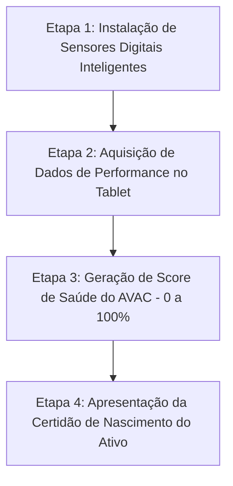
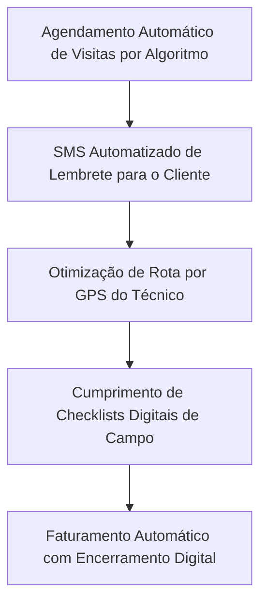

# Blueprint Estratégico para Escalar Receita Recorrente em AVAC: Contratos de Manutenção, Precificação e Excelência Operacional

O setor comercial e residencial de aquecimento, ventilação e ar condicionado (AVAC/HVAC) passa por uma profunda transformação estrutural e macroeconômica. Durante décadas, o modelo econômico dominante para os prestadores de serviços de AVAC foi inerentemente reativo, dependendo fortemente de serviços emergenciais de correção de falhas (*break-fix*), picos climáticos sazonais imprevisíveis e na instalação intensiva em capital de novos equipamentos. Esse modelo herdado resultava em fluxos de caixa altamente voláteis, saturação da utilização de mão de obra durante as estações de pico e ociosidade da força de trabalho nos períodos de transição climática (outono e primavera). No entanto, os participantes mais consolidados do mercado estão fazendo a transição para um modelo econômico preditivo e baseado em assinaturas, estruturado em fluxos de receita recorrente. Os contratos de manutenção preventiva representam a base absoluta desta transição.

Estudos empíricos e dados de gestão de facilidades indicam que a transição de um portfólio predial de um modelo de manutenção reativo para um preditivo gera **70% menos falhas catastróficas**, estende a vida útil operacional dos equipamentos mecânicos em **20% a 40%** e reduz os custos totais de manutenção predial em uma média de **50%**. [^1]

Construir, escalar e gerenciar uma base de receita recorrente por meio de contratos de manutenção preventiva exige muito mais esforço do que simplesmente imprimir planos de serviço padronizados. Exige uma reestruturação holística da arquitetura jurídica da empresa contratada, metodologias de precificação refinadas, processos estruturados de vendas, mecanismos de entrega operacional e protocolos de gestão financeira. Este guia fornece um framework estratégico para líderes de empresas de AVAC, diretores financeiros (CFOs) e diretores operacionais estruturarem, precificarem, venderem e gerenciarem com lucratividade um portfólio de manutenção preventiva otimizado.

---

## 1. Estrutura dos Contratos de Manutenção e Arquitetura Jurídica

A arquitetura de um contrato de manutenção dita tanto o ônus operacional imposto ao prestador de serviços quanto o valor percebido pelo cliente final. Um contrato mal estruturado expõe a empresa de AVAC a passivos financeiros ilimitados, desvios de escopo (*scope creep*) e severa erosão de margens, ao passo que um acordo de serviço rigorosamente definido protege a lucratividade da empresa e garante a confiabilidade dos ativos mecânicos do cliente. A estruturação desses contratos requer uma calibração cuidadosa dos níveis de serviço, duração dos acordos, modelos de precificação e limites explícitos de escopo.

### Níveis de Contrato e Acordos de Nível de Serviço (SLAs)

Uma estrutura de contrato em níveis (tiers) é essencial para capturar uma base de clientes diversa e segmentada. O mercado varia desde centros de processamento de dados (data centers) comerciais e instalações cirúrgicas sensíveis que exigem operação imediata e ininterrupta, até gestores de propriedades residenciais e pequenos comerciantes que buscam apenas conformidade regulatória básica e conservação simples. Para atender a este espectro, as empresas de AVAC devem implementar uma hierarquia rígida de Acordos de Nível de Serviço (SLAs).

*   **Nível Economy ou Apenas Inspeção (Inspection-Only):** Projetado para clientes altamente sensíveis ao preço, cobrindo apenas a mão de obra de manutenção preventiva e inspeções visuais semestrais. Os tempos de resposta para chamados de emergência são padronizados, geralmente garantindo atendimento no próximo dia útil sem prioridade de rota. Quaisquer peças de reposição consumíveis, materiais pesados ou chamados de emergência fora do escopo são faturados separadamente com base nos preços de lista padrão da empresa. [^2] No setor comercial, esse nível básico é frequentemente precificado entre **$0,12 e $0,25 de dólar por pé quadrado ao ano** (ou taxas equivalentes locais por metro quadrado). [^2] O objetivo estratégico deste nível não é gerar altas margens operacionais diretas, mas sim garantir o relacionamento com o cliente, estabelecer a linha de base de saúde do equipamento e posicionar a empresa como prestadora preferencial quando surgirem oportunidades de reparos lucrativos ou substituições inevitáveis de fim de vida útil.
*   **Nível Standard ou de Médio Porte (Manutenção Preventiva):** O núcleo do portfólio de contratos, equilibrando a transferência de riscos e a previsibilidade de custos para o cliente. Tipicamente inclui a mão de obra para manutenção preventiva abrangente, peças consumíveis de rotina (como filtros plissados padrão de 1 ou 2 polegadas, correias de transmissão básicas e lubrificantes), inspeções mecânicas trimestrais e taxas de emergência com desconto — oferecendo de **10% a 15% de redução** nas taxas de mão de obra e peças de reparos subsequentes. [^2] Fundamentalmente, este nível introduz um SLA prioritário, garantindo um tempo de resposta de **até 4 horas** para falhas críticas do sistema. [^2] A precificação comercial para este nível intermediário varia entre **$0,25 e $0,45 de dólar por pé quadrado ao ano**, dependendo das taxas de mão de obra regionais e da densidade de equipamentos da instalação. [^2]
*   **Nível Premium, Serviço Completo ou Tudo Incluso (All-Inclusive):** Projetado especificamente para instalações de missão crítica onde o tempo de inatividade operacional equivale a grandes perdas financeiras diretas. Este nível fornece cobertura exaustiva e integral, incluindo todas as peças de reposição e mão de obra para reparos, prioridade de resposta de emergência de **até 2 horas ou imediata**, inspeções mensais ou trimestrais detalhadas, relatórios anuais abrangentes de eficiência energética e insumos de alto custo (como produtos químicos de limpeza e carga de refrigerante virgem). [^2] Este nível possui um valor elevado, variando tipicamente de **$0,45 a $0,65 de dólar por pé quadrado ao ano**. [^2] Ao adquirir este nível de serviço, o cliente transfere integralmente o risco de falhas mecânicas do seu próprio balanço patrimonial para a empresa de AVAC. Consequentemente, as empresas prestadoras de serviço devem subscrever estes acordos com extrema precisão, exigindo uma inspeção inicial paga e uma sequência de reparos de conformidade para trazer todos os equipamentos aos padrões ideais antes que o contrato tudo incluso seja formalmente ativado. [^4]

### Duração do Contrato, Termos de Renovação e Cláusulas de Reajuste

A duração do contrato impacta a avaliação patrimonial da empresa prestadora de serviços. Enquanto os contratos anuais são padrão no setor residencial, os acordos comerciais devem visar durações plurianuais (geralmente de **três a cinco anos**). Os contratos plurianuais garantem a Receita Recorrente Mensal (MRR - Monthly Recurring Revenue) de longo prazo, afastam ciclos de concorrência e permitem à empresa amortizar o Custo de Aquisição de Clientes (CAC) sobre um horizonte temporal muito mais longo.

No entanto, contratos plurianuais introduzem riscos macroeconômicos significativos, como inflação e aumento de custos de mão de obra locais. Para mitigar esse impacto, os acordos comerciais devem apresentar **cláusulas obrigatórias de reajuste de preços**. Uma cláusula de reajuste permite contratualmente que a empresa de AVAC aumente o valor anual do contrato com base em um percentual especificado (frequentemente atrelado a índices oficiais de inflação, como o IPCA no Brasil ou índices regionais de custo de mão de obra), sem exigir uma renegociação contratual completa. [^4] Além disso, os contratos devem incluir cláusulas de **renovação automática**, detalhando os prazos exigidos para notificação de rescisão (como 60 dias antes da expiração). [^4] Sem a renovação automática, o ônus administrativo de buscar novas assinaturas anualmente paralisa a equipe de vendas e administração, resultando em perdas de cobertura e receitas.

### Definição de Escopo: Inclusões, Exclusões e Limites

A preservação das margens dentro de qualquer modelo de receita recorrente depende da aplicação rigorosa dos limites de escopo. A ambiguidade em um acordo de serviço comercial inevitavelmente resulta no desvio de escopo (*scope creep*), um fenômeno onde técnicos de campo, ansiosos por manter a satisfação do cliente, realizam serviços não cobrados ou utilizam materiais de estoque da van sem o faturamento correspondente.

Um contrato robusto deve delinear explicitamente todas as tarefas incluídas. O texto contratual não deve deixar espaço para interpretações subjetivas, listando ações de forma granular, tais como enxágue básico da serpentina do condensador, limpeza da linha de dreno, aplicação de pastilhas de tratamento da bandeja de condensado e substituição padrão de filtros de ar. [^3] De forma análoga, as **exclusões contratuais devem ser detalhadas de forma explícita**. O contrato deve conter uma seção destacando a exclusão de condições pré-existentes e de equipamentos mantidos em estado histórico de negligência. [^4] Deve ficar claro que substituições de grandes componentes (como compressores, trocadores de calor e serpentinas evaporadoras), vedação de dutos aerodinâmicos, manutenção de acessórios de qualidade do ar interno (QAI/IAQ) e os custos associados à recuperação de refrigerante ou detecção e reparo de vazamentos complexos estão excluídos da cobertura básica e serão orçados separadamente, a menos que o cliente tenha adquirido o nível de contrato Premium mais elevado. [^4]

### Estrutura Sugerida para Contratos Comerciais de AVAC

Para operacionalizar esses conceitos, as empresas prestadoras de serviço devem utilizar uma estrutura jurídica padronizada. A tabela a seguir descreve a estrutura de seções recomendada para um Contrato de Manutenção Preventiva comercial:

| Seção Contratual | Componente / Cláusula | Objetivo Estratégico e Detalhes Essenciais |
| :--- | :--- | :--- |
| **I. Partes e Jurisdição** | Identificação das Entidades | Identifica formalmente o prestador de serviços, a empresa cliente, o endereço físico da instalação atendida e a jurisdição legal que rege o contrato. [^4] |
| **II. Cronograma de Equipamentos** | Inventário de Ativos | Uma lista detalhada e serializada de todos os ativos mecânicos cobertos. Exclui explicitamente qualquer equipamento não listado para evitar manutenções informais (*shadow maintenance*) em unidades não contabilizadas. [^4] |
| **III. Escopo de Serviços** | Manutenções Inclusas | Detalhamento das ações preventivas executadas por visita (ex: trocas de filtros, tensionamento de correias, verificação de contatos elétricos, enxágue de serpentinas). [^3] |
| **IV. Exclusões** | Itens Não Cobertos | Lista explicitamente os itens excluídos da taxa padrão: compressores, negligências pré-existentes, fluidos refrigerantes adicionais, buscas de vazamentos e atos de vandalismo. [^4] |
| **V. SLA** | Tempo de Resposta | Garante as janelas de resposta emergencial com base no nível contratado (ex: 2 horas para Premium, 4 horas para Standard). Define as condições de chamados de urgência versus rotina. [^5] |
| **VI. Termos Financeiros** | Faturamento e Reajuste | Define a agenda de pagamentos (mensal, trimestral, anual antecipado), penalidades por atraso e a fórmula matemática para reajuste inflacionário anual. [^4] |
| **VII. Responsabilidade e Segurança** | Isenção e LOTO | Limita a responsabilidade da contratada por danos indiretos ou lucros cessantes por falhas de AVAC. Define responsabilidades sobre segurança no local de trabalho (LOTO e normas regulamentadoras). [^4] |
| **VIII. Vigência e Renovação** | Renovação Automática | Estipula o prazo de vigência inicial (ex: 36 meses) e as regras para renovação automática, exigindo notificação por escrito com 60 dias de antecedência para rescisão. [^4] |

*Tabela 2: Estrutura Contratual Recomendada*

---

## 2. Estratégia de Precificação e Arquitetura de Margens

Precificar contratos de manutenção preventiva é um dos desafios matemáticos e estratégicos mais complexos para os prestadores de serviços de AVAC. Se os contratos forem precificados abaixo da realidade, tornam-se geradores de prejuízos (*loss leaders*) que corroem a lucratividade líquida da empresa; se forem precificados acima do mercado sem a devida justificativa de valor, a velocidade de vendas cai e a carteira de contratos não escala. As empresas de AVAC comerciais de alto desempenho miram e alcançam uma **margem de lucro líquido consolidada de 10% a 20%** em toda a operação. [^7] Atingir este resultado financeiro exige metas de margem bruta estritas e segmentadas por divisão operacional.

### Limiares de Margem Bruta e a Falácia da Margem Mista

Para precificar contratos adequadamente, os diretores operacionais e financeiros devem distinguir claramente entre margem bruta e margem líquida. A margem bruta mede a receita retida após a subtração dos custos diretos da execução dos serviços — especificamente o Custo das Mercadorias Vendidas (COGS), que no setor de AVAC inclui salários diretos da equipe técnica de campo, impostos sobre a folha de pagamento técnica e materiais consumidos diretamente nos serviços. [^7] A margem líquida representa o lucro final restante após o pagamento de todas as despesas operacionais fixas e de suporte administrativo (*overhead*), tais como aluguel do escritório, salários da diretoria e equipe administrativa, seguros de responsabilidade, licenças de softwares operacionais, utilidades e despesas de marketing. [^7]

Um erro frequente e arriscado na gestão financeira de AVAC é confiar em "margens mistas" (blended margins). O painel executivo pode indicar uma margem bruta consolidada aparentemente saudável de 52% para toda a empresa. No entanto, este número consolidado frequentemente mascara realidades perigosas: a divisão de serviços e reparos residenciais pode estar gerando uma margem bruta de 62%, enquanto a divisão comercial de novas instalações opera com apenas 38% de margem. [^7] Nesse cenário, o trabalho de serviço altamente lucrativo está subsidiando de forma silenciosa as instalações comerciais mal orçadas e ineficientes.

Para evitar esse subsidio cruzado indesejado, metas de margem bruta setoriais rígidas devem ser aplicadas por divisão:

*   **Novas Construções e Projetos Comerciais:** Operam com as menores margens, tipicamente de **35% a 50%**, devido à concorrência agressiva de licitações, cronogramas estendidos e altos riscos de atraso de mão de obra. [^7]
*   **Substituições e Instalações de Equipamentos (Varejo/Comercial):** Devem visar a uma margem bruta de **45% a 55%**. [^7]
*   **Serviços de Manutenção Corretiva (Chamados e Reparos):** Sendo altamente intensivos em mão de obra e com baixo custo relativo de materiais, devem gerar as maiores margens, entre **55% e 65%**. [^7]
*   **Contratos de Manutenção Preventiva (PMOC):** Devem obrigatoriamente superar o **limite mínimo de 55% de margem bruta**, com uma faixa meta recomendada de **55% a 60%**. [^7]

Embora alguns manuais de referência do setor sugiram que margens brutas de 30% a 50% seriam aceitáveis para contratos sob o pretexto de servirem como isca (*loss leader*) para reparos futuros, o controle financeiro moderno demonstra que essa lógica é falha. Uma margem bruta inferior a 55% em um contrato de manutenção é insuficiente para cobrir o suporte administrativo exigido para programar, despachar e faturar as visitas recorrentes, resultando em rentabilidade líquida negativa para a carteira de contratos. Se os contratos de manutenção não estiverem atingindo o limite de 55%, a diretoria deve auditar imediatamente as fórmulas de precificação e os custos administrativos de entrega. [^7]

### Mecânica da Precificação Baseada em Custos

Para atingir as metas de margem bruta exigidas, a precificação não deve se basear em estimativas intuitivas ou na equiparação com tabelas de concorrentes. Ela deve se apoiar em fórmulas matemáticas e custos reais calculados de baixo para cima (*bottom-up*). A fórmula fundamental de precificação baseada em custos utilizada para serviços de taxa fixa é expressa como:

$$\text{Preço Final de Venda} = \frac{\text{Custos de Equipamentos} + \text{Custos de Materiais} + \text{Custos de Mão de Obra}}{1 - \text{Percentual da Margem Bruta Desejada}}$$

> [!NOTE]
> **Exemplo Prático de Cálculo de Precificação:**
> Considere que um contrato comercial exige visitas de manutenção preventiva trimestrais. A empresa de AVAC determina que o cumprimento anual deste contrato exigirá um total de **3 horas de mão de obra direta de campo** a um custo totalmente burdened de $100 por hora ($300 de mão de obra anual). Os materiais consumíveis previstos para o ano (filtros plissados, produtos químicos de serpentina e lubrificantes) custam **$65**. Adicionalmente, as despesas de logística e transporte alocadas à van (combustível, desgaste do veículo e tempo de deslocamento não faturado do técnico) equivalem a **$35**. Portanto, o custo de entrega direto de equilíbrio (*break-even*) para atender a este cliente é de **$400** ao ano. [^8]
> 
> *   Para atingir a margem bruta mínima obrigatória de **50%**, aplica-se o divisor $0,50$ ao custo:
> 
> $$\text{Preço de Venda} = \frac{400}{1 - 0,50} = \frac{400}{0,50} = 800\text{ USD/ano}$$ [^9]
> 
> *   Para atingir a margem bruta otimizada recomendada de **55%**, o divisor passa a ser $0,45$ ($1 - 0,55$):
> 
> $$\text{Preço de Venda} = \frac{400}{1 - 0,55} = \frac{400}{0,45} = 888\text{ USD/ano}$$ [^9]

Os divisores matemáticos para cálculo rápido de margens brutas comuns sobre o custo base de equilíbrio são:
*   Para margem de 40%: Divida o custo base por **$0,60$** [^9]
*   Para margem de 45%: Divida o custo base por **$0,55$** [^9]
*   Para margem de 50%: Divida o custo base por **$0,50$** [^9]
*   Para margem de 55%: Divida o custo base por **$0,45$**

### Metodologias Comerciais de Precificação: Escalonando Propostas

Embora cálculos de custo baseados de baixo para cima sejam adequados para contas residenciais ou pequenos comércios com poucas unidades, conduzir um estudo detalhado de tempos e materiais para uma grande planta industrial ou edifício de escritórios com centenas de ativos é proibitivamente trabalhoso. Por isso, a indústria de AVAC comercial utiliza modelos heurísticos para gerar propostas rápidas com margens protegidas:

1.  **Precificação por Área (Square-Foot Pricing):** O método de estimativa mais rápido. No mercado de referência comercial dos EUA, os edifícios gastam uma média de **$2,15 de dólar por pé quadrado ao ano** com manutenção geral e reparos de AVAC. [^2] Os estimadores aplicam multiplicadores em níveis por área para gerar propostas básicas. Um plano básico de inspeção pode ser precificado a $0,15/ft²$, enquanto um plano Premium tudo incluso para um ambiente hospitalar pode atingir $0,65/ft². [^2] Este método exige correções com base na densidade de carga térmica do edifício (uma cozinha industrial de alta densidade exige taxas maiores do que um depósito de baixa densidade).
2.  **Precificação por Capacidade Térmica (Per-Ton Pricing):** Baseia o preço na capacidade de refrigeração total do sistema predial (medida em TR ou toneladas de refrigeração), oferecendo um reflexo mais preciso da complexidade mecânica do que a simples área física. As taxas médias da indústria variam de **$50 a $120 de dólar por TR ao ano** para contratos preventivos comerciais básicos. [^2] Por exemplo, uma proposta para manutenção anual completa de um chiller central de $100\text{ TR}$ seria cotada entre **$6.000 e $12,000\text{ USD}**. [^2]
3.  **Taxa Fixa por Equipamento (Per-Unit Flat Rate):** Envolve a execução do inventário dos ativos e a aplicação de uma taxa fixa anual associada ao tipo específico de equipamento. As médias de preço indicam que a manutenção anual de um Rooftop comercial básico ($5 \text{ a } 15\text{ TR}$) varia de **$300 a $600**, enquanto uma caldeira comercial complexa varia de **$500 a $1,200** ao ano. [^2]
4.  **Porcentagem do Custo de Substituição (Percentage of Replacement Cost):** Um modelo focado na percepção de valor, onde a taxa de manutenção anual é calculada como uma fração (tipicamente **2% a 4%**) do investimento de capital necessário para a substituição total do sistema (CapEx). Esse modelo é útil em negociações comerciais porque ancora psicologicamente o baixo custo relativo da manutenção contra o alto valor de reposição total das máquinas em caso de quebra catastrófica.

Independentemente da metodologia de precificação selecionada, recomenda-se adicionar uma **taxa de contingência de risco de 15% a 20%** ao total para cobrir custos imprevistos de mão de obra de técnicos juniores ou dificuldades de acesso locais. [^2] Além disso, se a instalação estiver em locais com climas severos ou corrosivos (como regiões litorâneas expostas a névoa salina ou regiões com altas temperaturas o ano todo), deve-se adicionar um **adicional de severidade ambiental de 20% a 35%** para compensar a depreciação acelerada e os maiores tempos de operação mecânica. [^2]

### Matriz de Precificação Estratégica em Campo

A planilha a seguir demonstra a aplicação prática da precificação estruturada para um Rooftop comercial de 10 TR:

| Componente da Precificação | Metodologia de Cálculo Aplicada | Exemplo Prático (Rooftop Comercial de 10 TR) |
| :--- | :--- | :--- |
| **1. Custo de Mão de Obra Direta** | Horas anuais estimadas ($4\text{ horas}$) × Custo da hora burdened ($100\text{/hora}$). | $4\text{ horas} \times 100\text{ USD/hora} = 400\text{ USD}$ |
| **2. Custos de Materiais Diretos** | Filtros plissados ($40$) + Produtos químicos e lubrificantes ($20$). | $40\text{ USD} + 20\text{ USD} = 60\text{ USD}$ |
| **3. Custos Indiretos Alocados** | Custos de van, combustível e deslocamento não faturado. | Taxa fixa de $40\text{ USD}$ por visita de duto = $40\text{ USD}$ |
| **4. Subtotal do Custo de Entrega** | Soma direta de Mão de Obra + Materiais + Logística. | $400 + 60 + 40 = 500\text{ USD}$ |
| **5. Margem de Venda Aplicada** | Divisão do Custo pelo fator de margem meta de 55% ($0,45$). | $500 \div (1 - 0,55) = 1.111\text{ USD}$ |
| **6. Adicional de Contingência de Risco** | Aplicação de 15% de margem de risco para equipamentos antigos. | $1.111 \times 1,15 = 1.277\text{ USD}$ |
| **Preço Anual do Contrato** | Preço Final Anual Faturado para o Cliente Comercial. | **$1.277\text{ USD / Ano}$** |

*Tabela 3: Exemplo de Precificação de Contrato para Rooftop* [^8] [^9]

---

## 3. Metodologia de Vendas e Abordagem por Comissionamento

A capacidade técnica de entregar manutenções excelentes e o rigor financeiro para precificá-las são irrelevantes sem um processo comercial estruturado para adquirir esses contratos. Vender acordos de receita recorrente exige migrar o cliente de uma mentalidade de compra reativa e emergencial para um relacionamento de parceria preditiva de longo prazo.

### A Transição da Instalação para a Manutenção (Handover)

Estatisticamente, a oportunidade mais eficiente e com menor custo de aquisição para fechar um contrato de manutenção é vinculá-lo diretamente à venda e instalação de novos equipamentos. Transformar cada instalação em um contrato de recorrência exige a implementação de um processo formal de entrega (*handover*). [^10]

Após o término físico da instalação, a entrega com o cliente nunca deve ser tratada como mera formalidade para demonstrar o termostato. Ela deve ser o estágio final do funil de vendas. Esta visita de entrega deve incluir uma sessão de treinamento básica sobre o sistema, a explicação clara da tabela de manutenções exigidas pelo fabricante para preservar a validade da garantia de fábrica e a entrega de uma pasta de documentação contendo todos os manuais técnicos e a linha de base de desempenho. [^11] Apresentar a proposta de manutenção no momento psicológico em que o cliente está altamente focado em proteger seu recém-adquirido ativo de alto custo resulta em taxas de conversão de contratos elevadas.

### A Estratégia da "Certidão de Nascimento" do Equipamento

Para se diferenciar de concorrentes de baixo custo focado apenas em preço, as empresas líderes de AVAC utilizam a estratégia da "Certidão de Nascimento" do equipamento na entrega do serviço. [^12] Os instaladores tradicionais dependem de manômetros analógicos simples e observações subjetivas, deixando o gestor sem informações reais sobre a eficiência operacional real do sistema novo. A abordagem moderna utiliza sensores digitais inteligentes sem fio conectados a softwares de diagnóstico (como o *measureQuick*) para registrar dados termodinâmicos, elétricos e aerodinâmicos precisos no momento em que o sistema é ativado em campo. [^13]

Esta estratégia de comissionamento opera em quatro etapas:

Essa documentação tangível — a **Certidão de Nascimento** do sistema — é apresentada ao cliente no encerramento, comprovando a eficiência ideal verificada em campo (ex: 95%+). [^13] A proposta do contrato de manutenção recorrente é então estruturada como a única ferramenta disponível para evitar que esta eficiência ideal sofra desvios térmicos e de consumo (degradação) ao longo do ciclo de vida operacional, justificando o investimento. [^13]

### Abordagem por Personas de Compras Comerciais

No setor corporativo (B2B), a abordagem comercial deve ser altamente adaptável. Os gestores de compras corporativas não são homogêneos; os profissionais de vendas de AVAC devem adaptar suas propostas para três personas de compradores distintas, cada uma com motivadores psicológicos e indicadores de desempenho (KPIs) específicos:

1.  **Proprietários de Imóveis e Investidores Imobiliários:** Esta persona foca na proteção de ativos, maximização do valor de avaliação de mercado do portfólio predial e no diferimento de despesas de capital (CapEx). O discurso de vendas deve demonstrar como a manutenção preventiva estende a vida útil operacional de um chiller comercial de $200.000 para adiar o reinvestimento de capital por vários anos, melhorando o Lucro Operacional Líquido (NOI - Net Operating Income) do edifício.
2.  **Gestores de Facilidades e Diretores de Manutenção:** Uma persona estritamente focada no aspecto operacional, motivada por conformidade regulatória (PMOC), confiabilidade diária dos sistemas e mitigação de reclamações de ocupantes. Seu principal indicador é evitar chamados urgentes e interrupções em horários críticos. A proposta deve focar nos SLAs prioritários de resposta de emergência, garantia de equipe dedicada para reduzir seu volume pessoal de chamados e conformidade legal total perante a vigilância sanitária.
3.  **Diretores Financeiros (CFOs) e Compradores de Suprimentos:** Focam sob uma perspectiva matemática e orçamentária rígida. Buscam previsibilidade de custos, Retorno sobre o Investimento (ROI), prazos de payback curtos e a conversão de despesas variáveis imprevisíveis (reparos de emergência) em despesas operacionais fixas e previsíveis (OpEx). A venda deve destacar cálculos de payback, provando que as economias anuais de energia de 15% obtidas com serpentinas limpas e carga ajustada compensam integralmente o valor anual do contrato.

### O Framework da Apresentação de Vendas B2B

Para padronizar a abordagem comercial em campo pela equipe de vendas técnicas, utiliza-se o seguinte framework estruturado de apresentação:

| Etapa da Apresentação | Objetivo Estratégico | Conteúdo e Entregáveis Práticos |
| :---: | :--- | :--- |
| **1. Auditoria e Descoberta** | Identificar as dores operacionais e financeiras atuais do cliente. | Realizar vistoria técnica física da planta. Coletar marcas, idades, históricos de manutenção e custos de reparo anteriores. Identificar perdas óbvias de eficiência. |
| **2. Relatório de Baseline** | Estabelecer autoridade técnica e construir a base lógica para mudança. | Apresentar o relatório inicial de condições (equivalente à "Certidão de Nascimento" do parque instalado), evidenciando os riscos e desperdícios térmicos atuais. |
| **3. Proposta de Valor** | Customizar a solução com base na persona do comprador (FM vs. CFO). | Apresentar projeções detalhadas de economia de eletricidade, extensão do ciclo de vida das máquinas e custos de indisponibilidade evitados. |
| **4. Proposta em Níveis** | Evitar rejeições causadas por "choque de preços" apresentando opções. | Apresentar a matriz de opções em três níveis (Economy, Standard, Premium), permitindo ao cliente selecionar o nível de transferência de risco desejado. |
| **5. Justificativa de ROI** | Fechar a lacuna de custos comprovando o retorno econômico. | Demonstrar como a taxa periódica do contrato é neutralizada pelos ganhos de eficiência de energia e eliminação de chamados extras de emergência. |

*Tabela 4: Framework de Venda Comercial de AVAC*

---

## 4. Retenção de Clientes, Expansão e Gestão de KPIs

Adquirir contratos de recorrência é apenas o início do ciclo de vida do cliente. No modelo de receita recorrente, o custo de aquisição do cliente (CAC) é elevado e a rentabilidade real só é realizada ao longo do tempo. Para expandir a MRR com sucesso, as empresas de AVAC devem focar em altos níveis de retenção de clientes e na expansão estratégica da receita por meio de vendas cruzadas e adicionais (*cross-selling* e *upselling*), gerenciando indicadores operacionais específicos.

### KPIs Cruciais de Desempenho do Portfólio

Para monitorar a saúde financeira e operacional do portfólio de contratos recorrentes, a gerência da empresa de AVAC deve acompanhar quatro KPIs fundamentais:

*   **Taxa de Renovação de Contratos (Renewal Rate):** O indicador definitivo de satisfação do cliente e a métrica de base para previsões de receita futuras. [^16] Uma alta taxa de cancelamento (*churn*) anula os esforços comerciais de captação de novos clientes. Empresas de alta performance miram em taxas de renovação anuais superiores a **90%**.
*   **Valor do Ciclo de Vida do Cliente (CLV - Customer Lifetime Value):** Projeção do lucro líquido total esperado que um cliente trará ao longo de todo o relacionamento contratual. Rastrear o CLV auxilia no cálculo do Custo de Aquisição de Clientes (CAC) admissível e ajuda a priorizar segmentos de mercado (ex: hospitais versus escritórios gerais) que geram maior lucratividade histórica. [^16]
*   **Tempo de Resposta de Chamados de Serviço:** Um KPI operacional que impacta diretamente a retenção dos contratos. Respostas rápidas e em conformidade com as janelas dos SLAs reduzem as perdas operacionais do cliente e validam os custos elevados cobrados nas mensalidades dos níveis Premium. A falha no cumprimento do SLA é uma das maiores causas de cancelamento de contratos comerciais. [^16]
*   **Net Promoter Score (NPS) e Satisfação do Cliente (CSAT):** Auditorias de satisfação automatizadas enviadas após cada visita de campo técnica, permitindo classificar e monitorar os níveis de aprovação do cliente para intervir de forma proativa caso surjam descontentamentos pontuais.

### A Revisão de Negócios Trimestral (QBR)

No setor comercial de AVAC, os clientes (especialmente os CFOs) enxergam os custos com ar condicionado como um passivo financeiro recorrente e de grande porte. Se a empresa de manutenção realiza os serviços de forma silenciosa sem reportar os resultados ao cliente de forma frequente, o contrato passa a ser encarado como uma despesa invisível e descartável, abrindo brechas para que o cliente migre para concorrentes que ofertem preços menores na época de renovação.

Para consolidar o posicionamento de parceiro estratégico e justificar as renovações, as empresas de AVAC devem implementar a **Revisão de Negócios Trimestral (QBR - Quarterly Business Review)** com o cliente. Durante a reunião de QBR, o gestor de contas apresenta um relatório de desempenho que compara os KPIs reais do edifício em relação às linhas de base originais:

*   **Otimização do Tempo de Operação (Uptime):** Demonstrar com dados que o plano preditivo manteve o sistema de climatização operando com **mais de 98% de uptime**, reduzindo drasticamente as falhas catastróficas comparadas a sistemas sem manutenção (que apresentam médias de 85% a 90%). [^1]
*   **Evolução do MTBF e MTTR:** Demonstrar o aumento do Tempo Médio Entre Falhas (MTBF - provando que os equipamentos quebram menos) e a redução do Tempo Médio de Reparo (MTTR - comprovando que quando ocorrem falhas, os técnicos resolvem o problema mais rápido por estarem familiarizados com as máquinas). [^1]
*   **Rastreamento de Eficiência Energética:** Relatório de medições de vazão, temperaturas e correntes provando a economia de energia mantida pelas intervenções periódicas (limpeza de serpentinas e filtros). [^1]

Esta visibilidade periódica dos ganhos de eficiência e do valor gerado neutraliza propostas de concorrentes baseadas puramente em guerra de preços.

### Comunicação Proativa e Vendas Cruzadas (Cross-Selling)

A retenção é potencializada por fluxos de comunicação proativos. As empresas estruturadas não aguardam chamados do cliente; utilizam sistemas CRM para disparar lembretes de manutenções sazonais futuras (ex: "preparação para pico de verão"), atualizações regulatórias locais ou dicas de economia de energia. Além disso, a carteira de manutenção serve como público-alvo prioritário para novos serviços. Os técnicos e engenheiros de contas devem ser capacitados para identificar oportunidades de melhorias durante as rotinas de serviço, propondo atualizações tecnológicas de forma consultiva antes que falhas catastróficas ocorram (ex: instalação de lâmpadas UV-C para QAI, retrofit de VFDs ou automação integrada de setpoints).

---

## 5. Excelência Operacional e Entrega dos Contratos

A rentabilidade projetada nos contratos recorrentes é assegurada na etapa de precificação, mas pode ser totalmente destruída caso a execução de campo no dia a dia não conte com rigor operacional. Escalar um portfólio de contratos recorrentes para atender centenas de edifícios exige precisão logística integrada.

### Automação de Serviços de Campo com Softwares FSM/CMMS

Processos administrativos manuais em papel são os principais geradores de perda de rentabilidade em contratos recorrentes. [^7] Se a empresa de AVAC depende de funcionários para controlar datas de vencimento em planilhas ou quadros físicos, realizar ligações manuais para agendamento de rotinas e emitir faturas manuais em papel, o custo administrativo de suporte (*overhead*) absorve toda a margem de lucro operacional do contrato. [^7] Estudos de campo indicam que a gestão manual de apenas 20 contratos pode demandar mais de 10 horas administrativas por mês de assistentes no escritório. [^7]

Para manter a rentabilidade, é obrigatório implementar softwares integrados de Gestão de Serviços de Campo (FSM - Field Service Management) e CMMS (como *ServiceTitan*, *BuildOps* ou *Oxmaint*). [^2] Estas plataformas automatizam integralmente os processos:

O uso integrado dessas plataformas reduz o custo administrativo de suporte a patamares muito baixos. [^7] O benchmark para operações otimizadas e automatizadas é manter uma relação de **apenas 1 profissional administrativo no escritório para cada 10 técnicos operando no campo**. [^7]

### Densidade de Rotas e Logística de Inventário

A excelência operacional busca maximizar o tempo produtivo com ferramenta na mão (*wrench time*) dos técnicos de campo, minimizando as horas ociosas gastas no trânsito das cidades (*windshield time*). Os algoritmos dos softwares FSM realizam o agrupamento geográfico de visitas por CEP e proximidade, construindo rotas densas. Em vez de deslocar um técnico para pontos distantes a cada dia, o sistema organiza os atendimentos preventivos da carteira de forma concentrada, reduzindo custos de combustível e elevando a produtividade diária por profissional de campo.

Simultaneamente, a logística de estoque deve ser otimizada. Um técnico que chega a uma instalação e constata não possuir os filtros, correias ou consumíveis corretos na van perde tempo produtivo precioso deslocando-se para buscar peças em distribuidores comerciais. Empresas líderes utilizam sistemas de "estoque móvel avançado", garantindo que os veículos de serviços técnicos sejam reabastecidos e conferidos semanalmente com os kits exatos de peças e materiais exigidos pelas rotas preventivas agendadas para a semana subsequente, elevando a Taxa de Resolução no Primeiro Atendimento (FTFR - First-Time Fix Rate) e mantendo a conformidade com as janelas dos SLAs.

### Combate à Manutenção Informal (Checklists Mobile e Fotos)

Manter altos padrões de qualidade técnica com equipes distribuídas é desafiador. Sem padrões de auditoria digital rígidos, os serviços preventivos de campo frequentemente degeneram em rápidas visitas informais focadas apenas em trocas superficiais de filtros, pulando inspeções eletromecânicas complexas prometidas nos contratos. No setor de AVAC, essa prática é conhecida como "pencil whipping" (marcar o checklist como concluído no papel sem de fato executar os testes físicos).

Para combater essa ineficiência operacional, as empresas exigem a conformidade obrigatória com checklists digitais móveis sequenciais através do aplicativo celular do técnico no campo. O software impede o avanço de etapas até que dados reais de medição física sejam inseridos (amperagem, pressões, temperaturas). Crucialmente, exige-se o carregamento de fotos obrigatórias das principais etapas da visita: a serpentina limpa após a limpeza química, o dreno limpo e fluindo e o filtro novo com etiqueta de data instalada. O técnico não consegue encerrar o chamado digital e avançar para o próximo atendimento até que as imagens carregadas sejam registradas com as coordenadas GPS e carimbo de data/hora correspondentes, eliminando manutenções parciais.

### Cultura Organizacional e Gestão da Força de Trabalho

A transição de operações baseadas em ordens de serviço em papel e ferramentas analógicas antigas para fluxos de trabalho digitais e monitoramento térmico e de vibrações exige gestão de cultura organizacional de forma focada. Há uma barreira geracional na adoção de tecnologia entre profissionais de campo. [^13] Técnicos juniores mais jovens adaptam-se facilmente a aplicativos móveis e sensores digitais Bluetooth, pois não possuem hábitos herdados e atalhos operacionais antigos consolidados. [^13]

Inversamente, técnicos experientes seniores frequentemente oferecem resistência à digitalização e ao controle rígido de checklists. A gestão da empresa não deve tentar impor a transição de forma abrupta de um dia para o outro. Recomenda-se implementar a digitalização de forma gradual, equipando os técnicos mais jovens e dispostos primeiro. À medida que os profissionais experientes observam a eliminação de retrabalhos, a facilidade de encerramento de chamados pelos juniores e a valorização de suas contribuições de campo pelas informações coletadas, a transição para os novos padrões operacionais ocorre de forma orgânica e por engajamento mútuo. [^13]

---

## 6. Gestão Financeira e Mecânica Contábil

À medida que uma empresa de AVAC expande sua carteira para centenas ou milhares de contratos recorrentes de manutenção, ela atinge complexidades financeiras, fiscais e contábeis que exigem controle especializado. Gerenciar receitas de forma incorreta ou falhar no controle detalhado de custos diretos pode criar ilusões de alta lucratividade no papel, enquanto a empresa sofre com problemas de fluxo de caixa operacional e corre riscos de insolvência financeira.

### Prevenção de Perdas de Margem e Custos de Retorno (Callbacks)

A perda de margem operacional em contratos de recorrência raramente ocorre por falhas graves de alta visibilidade; ela ocorre de forma lenta e oculta, acumulando pequenas ineficiências em nível de chamados individuais. Os principais direcionadores dessa perda são:

*   **Estouro de Tempo de Atendimento:** Prever que um atendimento preventivo padrão de Rooftop demore $1,5\text{ hora}$ e o técnico de campo demorar $3,0\text{ horas}$ sem justificativa registrada ou sem faturar a mão de obra adicional, consumindo a margem bruta estimada da visita. [^7]
*   **Materiais Não Lançados:** Técnicos que utilizam peças e materiais sobressalentes valiosos da van (como filtros plissados especiais de alto MERV ou quilos de fluido refrigerante) durante uma inspeção preventiva de rotina sem registrá-los na fatura digital final do chamado, gerando perdas ocultas de estoque. [^7]
*   **Custos de Retorno (Callbacks):** Deslocar um técnico sênior de alto custo de volta a um edifício para refazer um serviço preventivo mal executado na semana anterior representa custo puro de retrabalho. Exige novos custos de deslocamento da van e consome horas que poderiam gerar novas receitas operacionais. Se os custos de callback ultrapassarem **2% do faturamento semanal da empresa**, apontam para falhas sistêmicas na capacitação da equipe de campo ou na execução operacional que destroem as margens brutas. [^7]

Para conter essas perdas de margem, as empresas devem aplicar controle de estoque por código de barras em tempo real em todas as vans e conduzir auditorias semanais de desempenho comparando as horas estimadas versus horas reais trabalhadas em campo em cada visita contratual preventiva. [^7]

### Contabilidade GAAP e Reconhecimento de Receita Diferida

Ao gerenciar contratos com grandes clientes comerciais, as empresas de AVAC devem transicionar da contabilidade básica de regime de caixa para a contabilidade de regime de competência, em conformidade com as normas contábeis estabelecidas (como o IFRS global ou as diretrizes GAAP nos EUA). O foco contábil reside no tratamento de **Receita Diferida** (também classificada como receita não ganha ou unearned revenue). [^22]

Considere a mecânica financeira: quando um cliente comercial paga antecipadamente **$1.200** em janeiro por um contrato de manutenção anual contendo quatro visitas preventivas trimestrais previstas, a empresa de AVAC recebe o dinheiro em conta, mas ainda não entregou os serviços correspondentes. [^22] Sob as regras de regime de competência, este valor total de $1.200 não pode ser reconhecido como receita de vendas realizada na demonstração de resultados daquele mês, embora esteja depositado na conta bancária corporativa. Em vez disso, deve ser registrado provisoriamente como um **passivo de curto prazo no balanço patrimonial, sob a rubrica de Receita Diferida**. [^22]

Conforme o prestador realiza as visitas de manutenção programadas ao longo do ano — por exemplo, executando a primeira inspeção e troca de filtros em março —, a empresa "conquista" de forma proporcional uma parcela desse pagamento antecipado. Assumindo que as quatro visitas de campo representem valores iguais, a equipe de contabilidade realiza um lançamento de diário debitando (reduzindo) a conta de passivo de Receita Diferida em **$300** e creditando (aumentando) a conta de Receita Realizada na demonstração de resultados após a conclusão de cada visita. [^22] Esse mecanismo contábil garante que os demonstrativos financeiros corporativos reflitam o desempenho operacional real da empresa e as obrigações contratuais pendentes perante os clientes da carteira. [^23] De forma complementar, sob regulamentações fiscais específicas, a contabilidade baseada em regime de competência permite diferir os impostos sobre as receitas de serviços recebidas antecipadamente até que as obrigações sejam formalmente executadas em campo, oferecendo vantagens de capital de giro e fluxo de caixa corporativo. [^24]

No entanto, em conformidade com os frameworks contábeis de reconhecimento de receitas (como o IFRS 15 / ASC 606), os diretores financeiros devem avaliar de forma contínua as obrigações de desempenho contratuais pendentes da carteira de contratos ativos. [^25] Embora pequenas empresas apliquem simplificações práticas para evitar o controle rigoroso em contratos menores de curta duração (inferior a um ano), o princípio central permanece: dinheiro recebido antecipadamente por serviços futuros representa uma obrigação financeira pendente no balanço patrimonial. [^25] A falha em gerenciar a receita diferida de forma técnica é uma falha grave de gestão; leva proprietários de empresas de AVAC a superestimar sua lucratividade real no papel, gastar reservas de caixa destinadas a custos operacionais futuros de serviços e enfrentar problemas de insolvência quando os custos de entrega dos serviços preventivos pré-pagos começarem a vencer no campo de forma massiva.

### Gestão de Capital de Giro e Riscos de Concentração de Clientes

A gestão financeira busca otimizar o capital de giro manipulando os prazos de faturamento e recebimento. Ofertar pequenos descontos por pagamento antecipado anual (como **5% de desconto** caso o cliente pague o valor total do contrato anual à vista no fechamento em vez de parcelar trimestralmente) atrai capital de giro não dilutivo e sem juros para o caixa da empresa, que pode ser aplicado na compra de ferramentas avançadas, veículos para a frota mecânica ou investimentos de marketing.

Por fim, a diretoria deve monitorar continuamente a carteira de contratos contra o **risco de concentração de clientes**. O portfólio de contratos recorrentes deve ser diversificado. Se uma única grande conta comercial ou grupo de administração de condomínios responder por **mais de 30% da receita recorrente mensal (MRR) total** da empresa de AVAC, a operação estará exposta a riscos de concentração. Caso esse cliente decida mudar de fornecedor por pressões internas, decrete falência corporativa ou decida internalizar a equipe de manutenção de facilidades, a perda súbita deste cliente compromete a sobrevivência financeira da empresa prestadora de serviços. Um portfólio otimizado distribui as receitas recorrentes por centenas de clientes residenciais e comerciais de pequeno e médio porte, garantindo que o encerramento ou perda de qualquer conta represente um impacto mínimo no faturamento, protegendo o crescimento de longo prazo da empresa.

---

## Referências citadas

[^1]: *HVAC Maintenance KPIs and Metrics | Measure Performance & Efficiency*, Oxmaint. Acessado em 13 de junho de 2026. Disponível em: https://oxmaint.com/industries/hvac/hvac-maintenance-kpis-and-metrics
[^2]: *HVAC Maintenance Plan Pricing Calculator*, Oxmaint. Acessado em 13 de junho de 2026. Disponível em: https://oxmaint.com/industries/hvac/hvac-maintenance-plan-pricing-calculator
[^3]: *HVAC Maintenance Contract Template: Secure High-Value Local Customers*, Transactional.net. Acessado em 13 de junho de 2026. Disponível em: https://transactional.net/hvac-maintenance-contract-template/
[^4]: *HVAC Service Contract Template: Build Plans That Hold Margin*, Relay Financial. Acessado em 13 de junho de 2026. Disponível em: https://relayfi.com/blog/hvac-service-contract-template/
[^5]: *Free Commercial HVAC Maintenance Contract Template*, Field Service Software. Acessado em 13 de junho de 2026. Disponível em: https://fieldservicesoftware.io/blog/free-commercial-hvac-maintenance-contract-template/
[^6]: *Commercial HVAC Maintenance Contract : Tips - Costs & Template*, R10 Heat & Air. Acessado em 13 de junho de 2026. Disponível em: https://r10heatandair.com/commercial-hvac-maintenance-contract/
[^7]: *Master HVAC Profit Margins: The Complete Strategy Guide*, Simpro. Acessado em 13 de junho de 2026. Disponível em: https://www.simprogroup.com/blog/hvac-profit-margins
[^8]: *HVAC Maintenance Agreement Template + Pricing*, EstimateKit. Acessado em 13 de junho de 2026. Disponível em: https://estimatekit.com/blog/hvac-maintenance-agreement-template-pricing-2026
[^9]: *How to Price HVAC Jobs: Markup Formulas & Calculator*, EstimateKit. Acessado em 13 de junho de 2026. Disponível em: https://estimatekit.com/blog/how-to-price-hvac-jobs-complete-guide-2026
[^10]: *From Planning to Performance: What Happens During a Commercial AC Install*, HMH Mechanical. Acessado em 13 de junho de 2026. Disponível em: https://hmhmechanical.com/from-planning-to-performance-what-happens-during-a-commercial-ac-install/
[^11]: *HVAC Final Inspection Checklist Before Customer Handover*, HVAC Pro Sales. Acessado em 13 de junho de 2026. Disponível em: https://hvacprosales.com/hvac-quality-control/hvac-final-inspection-checklist-before-customer-handover/
[^12]: *Top HVAC Sales Commission Structure Examples*, Everstage. Acessado em 13 de junho de 2026. Disponível em: https://www.everstage.com/sales-commission/hvac-sales-commission-structure
[^13]: *Selling HVAC Commissioning: Contractor Guide*, MeasureQuick. Acessado em 13 de junho de 2026. Disponível em: https://measurequick.com/selling-hvac-commissioning-a-contractors-guide-to-delivering-quality-through-measurequick/
[^14]: *Using BIM to Manage HVAC Systems Long After Handover*, Hysopt. Acessado em 13 de junho de 2026. Disponível em: https://www.hysopt.com/software-blog/using-bim-to-manage-hvac-systems-long-after-handover
[^15]: *HALP! About to do a roleplay for an HVAC sales job for the last stage of my interview*, Reddit r/sales. Acessado em 13 de junho de 2026. Disponível em: https://www.reddit.com/r/sales/comments/17sw1ni/halp_about_to_do_a_roleplay_for_an_hvac_sales_job/
[^16]: *Measure What Matters: The Key KPIs for Growing Your Commercial*, ServiceTrade. Acessado em 13 de junho de 2026. Disponível em: https://servicetrade.com/resources/guides/kpis-for-hvac-business/
[^17]: *5 Key Maintenance KPIs You Need to Be Tracking*, City Facilities Management. Acessado em 13 de junho de 2026. Disponível em: https://www.cityfm.us/blog/maintenance-kpis/
[^18]: *ServiceTitan Pricing: Full Cost Breakdown*, Projul. Acessado em 13 de junho de 2026. Disponível em: https://projul.com/blog/servicetitan-pricing-analysis-2026/
[^19]: *HVAC PM Contract Templates That Trigger Work Orders*, BuildOps. Acessado em 13 de junho de 2026. Disponível em: https://buildops.com/resources/hvac-pm-contract
[^20]: *HVAC Changeover Installation Checklist (Electrical)*, SafetyCulture. Acessado em 13 de junho de 2026. Disponível em: https://safetyculture.com/library/construction/changeover-air-conditioning-installation-checklist-electrical-p01nal5oyi3gyg48
[^21]: *Commercial HVAC Maintenance Agreement Working Copy*, City of Costa Mesa. Acessado em 13 de junho de 2026. Disponível em: http://ftp.costamesaca.gov/costamesaca/council/agenda/2020/2020-07-21/CC-11-Attach-1.pdf
[^22]: *Deferred Revenue | Definition + Journal Entry Examples*, Wall Street Prep. Acessado em 13 de junho de 2026. Disponível em: https://www.wallstreetprep.com/knowledge/deferred-revenue/
[^23]: *What is Deferred Revenue: Its Liability Risks and Examples*, MPES Learning. Acessado em 13 de junho de 2026. Disponível em: https://www.mpeslearning.com/blog/deferred-revenue-definition-liability-risks-examples-explained
[^24]: *The cost of deferred revenue*, The Tax Adviser. Acessado em 13 de junho de 2026. Disponível em: https://www.thetaxadviser.com/issues/2019/jul/cost-deferred-revenue/
[^25]: *FINANCIAL STATEMENTS, SCHEDULES, AND DISCLOSURES FOR THE CONSTRUCTION INDUSTRY*, CICPAC. Acessado em 13 de junho de 2026. Disponível em: https://www.kmco.com/wp-content/uploads/CICPAC-Financial-Statements-Whitepaper.pdf
[^26]: *Revenue for the engineering and construction industry*, KPMG International. Acessado em 13 de junho de 2026. Disponível em: https://kpmg.com/kpmg-us/content/dam/kpmg/frv/pdf/2016/us-revenue-engineering-construction.pdf
