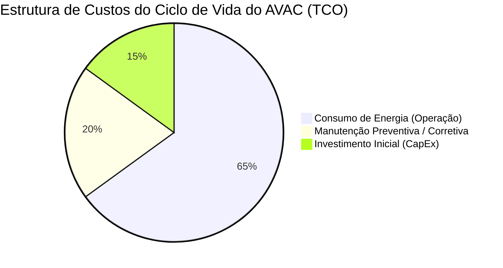
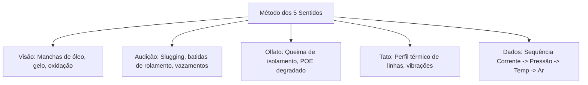

# 📘 Guia Prático e Apostila de Treinamento em Manutenção Avançada de AVAC: O Padrão Simon Climatização

Este documento serve como a apostila e guia prático central de treinamento em manutenção avançada de sistemas de climatização (AVAC/HVAC) para a **Simon Climatização**. Ele consolida os conceitos fundamentais, as dores reais do campo, as oportunidades de mercado e as rotinas práticas para transformar instaladores comuns em especialistas em gestão de ativos e receita recorrente.

---

## 🚀 Introdução Geral: O Novo Paradigma da Manutenção (Abordagem BAB)

### 1️⃣ O Cenário Atual - O Antes (*Before*)
Para a maioria dos técnicos e empresas de climatização, a rotina de trabalho é um ciclo exaustivo e estressante de **"apagar incêndios"** (manutenção reativa ou break-fix). [^1]
*   **A Instabilidade Financeira:** Faturamento volátil que depende exclusivamente de chamados de emergência ou de picos climáticos de calor extremo. Nos meses de clima ameno (outono/primavera), a receita despenca e a equipe fica ociosa.
*   **O Estresse Operacional:** Clientes ligando furiosos às duas horas da manhã porque o sistema falhou, gerando pressões insustentáveis, custos elevados de hora extra e desgastes na equipe técnica.
*   **A Desvalorização Profissional:** Ser percebido pelo cliente apenas como "mais um prestador de serviços de troca de peças", forçando a empresa a competir em uma guerra de preços destrutiva com concorrentes informais.
*   **A Negligência Regulatória:** Assumir a responsabilidade de sistemas de climatização sem respaldo técnico adequado, correndo riscos de multas graves da vigilância sanitária por falta de cumprimento do PMOC.

### 2️⃣ O Estado Desejado - O Depois (*After*)
Imagine fazer a transição para uma operação de alta performance, baseada em **receita previsível, inteligência preditiva e autoridade de engenharia**. [^2]
*   **Previsibilidade e Estabilidade:** Receita Recorrente Mensal (MRR) sólida garantida por contratos de manutenção preventiva e PMOCs de longo prazo (3 a 5 anos), permitindo planejar o crescimento e manter a equipe 100% produtiva o ano inteiro. [^4]
*   **Controle Preditivo:** Detectar falhas eletromecânicas semanas ou meses antes de ocorrer a paralisação do sistema, programando os reparos em horários comerciais planejados e eliminando chamados emergenciais caóticos. [^1]
*   **Parceria Estratégica:** Ser reconhecido pelo cliente como um gestor de ativos e consultor de eficiência energética, cujo serviço se paga por meio da redução direta na fatura de eletricidade e da extensão da vida útil do sistema. [^14]
*   **Blindagem Jurídica e Regulatória:** Garantir conformidade total perante a fiscalização e proteger a saúde física dos ocupantes do edifício, eliminando riscos de passivos trabalhistas e sanitários. [^38]

### 3️⃣ A Ponte (*The Bridge*)
Este guia prático é a sua ponte para cruzar essa linha de transição. Através de um treinamento estruturado que une a **ciência termodinâmica do AVAC, a regulamentação técnica nacional e a modelagem financeira de valor**, este programa capacita você a dominar a gestão completa de sistemas Split Inverter, VRF/VRV, Chillers e Câmaras Frias sob a bandeira de excelência da **Simon Climatização**.

---

## 📂 Módulo 1: O Mindset de Manutenção e o Framework Regulatório

### 1.1 A Filosofia do Custo Total de Propriedade (TCO)
A manutenção preditiva e preventiva de AVAC não é uma despesa operacional descartável; ela é um investimento financeiro de alto retorno para o proprietário do edifício. Para demonstrar isso de forma indiscutível ao cliente, o profissional deve dominar a economia do ciclo de vida dos ativos.

*   **A Divisão do TCO:** O custo de aquisição inicial do equipamento (CapEx) representa apenas cerca de **15% do custo total** que o proprietário gastará com o sistema ao longo de sua vida útil operacional. Os restantes **85% (OpEx)** correspondem a custos operacionais de energia elétrica e manutenção. [^1]
*   **A Economia da Degradação:** Sem manutenção regular, os sistemas sofrem um desvio de desempenho severo devido ao acúmulo de sujeira nas serpentinas e filtros, gerando uma perda contínua de eficiência energética. O COP (Coeficiente de Desempenho) degrada de forma silenciosa, resultando em desperdícios elétricos que equivalem a faturas de eletricidade **5% a 30% maiores** comparadas a sistemas com manutenção ideal. [^14]
*   **ROI da Manutenção:** Cada real investido em manutenção preventiva estruturada retorna ao cliente na forma de redução da demanda elétrica ativa (kW), aumento do tempo médio entre falhas (MTBF) e adiamento da substituição do compressor (CapEx) em até 5 a 8 anos. [^19]

#### 🔍 Mineração de Dores do Campo (*Pain Points*)
*   *"O cliente não quer pagar a mensalidade do contrato porque acha que o sistema está funcionando e que manutenção é custo inútil."*
*   **Como Resolver (Gap de Mercado):** Pare de vender "limpeza de filtro". Apresente relatórios de modelagem financeira comparando o custo de um contrato de manutenção anual contra o custo de um compressor queimado em regime de emergência adicionado ao desperdício silencioso de energia na fatura de luz. [^14]

---

### 1.2 Conformidade com o PMOC e Framework Regulatório Brasileiro
O cumprimento das normas de qualidade do ar interno (QAI) no Brasil é uma obrigação legal amparada por legislações federais rigorosas.

*   **Lei Federal nº 13.589/2018:** Torna obrigatório o Plano de Manutenção, Operação e Controle (PMOC) para todos os edifícios de uso público e coletivo que disponham de sistemas de climatização artificial com capacidade instalada total superior a **60.000 BTU/h (5 TR)**. [^32]
*   **Parâmetros de Qualidade do Ar (ANVISA RE-09/2003):**
    *   **Dióxido de Carbono ($CO_2$):** Limite máximo recomendável de **1000 ppm** como indicador de taxa de renovação de ar adequada. [^32]
    *   **Poluentes Biológicos:** Contagem de colônias de fungos inferior a **750 UFC/m³** (Unidades Formadoras de Colônias) na relação ar interno/externo. [^32]
    *   **Temperatura de Conforto:** Ajustada entre **23°C e 26°C** no verão (com umidade relativa do ar recomendada entre **40% e 65%**). [^32]
*   **Responsabilidade Técnica:** O PMOC exige a assinatura de um Engenheiro Mecânico registrado no CREA (ou técnico legalmente habilitado no CFT) com a emissão da respectiva Anotação de Responsabilidade Técnica (ART) ou TRT. Sem este selo profissional, o documento não possui validade perante fiscalizações trabalhistas ou sanitárias. [^34]
*   **Sanções e Penalidades:** A ausência de um PMOC adequado ou laudos microbiológicos vencidos em fiscalizações surpresa sujeita a empresa cliente a multas que variam de **R$ 2.000,00 a R$ 1.500.000,00** (de acordo com a Lei Federal nº 6.437/1977), além de passivos civis e criminais pessoais aos gestores e síndicos em casos de doenças transmitidas pelo ar (como surtos de *Legionella*). [^33] [^38]

#### 🔍 Mineração de Dores do Campo (*Pain Points*)
*   *"Tenho medo de assumir contratos de PMOC por não saber como organizar a documentação exigida pela fiscalização ou por não possuir parcerias com laboratórios de ar."*
*   **Como Resolver (Gap de Mercado):** A Simon Climatização automatiza a gestão do PMOC. Desenvolva checklists digitais integrados que geram o livro de registros com um clique, e estabeleça parcerias pré-configuradas com laboratórios de análise microbiológica credenciados pela ANVISA para terceirizar a coleta e emissão de laudos de forma integrada. [^20]

---

### 1.3 Protocolos de Segurança Operacional
A segurança durante o serviço de AVAC protege a vida dos técnicos e resguarda a empresa de passivos trabalhistas graves.

*   **Bloqueio e Etiquetagem (LOTO - Lock-Out / Tag-Out):** Antes de iniciar qualquer intervenção física em painéis elétricos de condensadoras de grande porte ou motores de UTAs, é obrigatório desenergizar o circuito no disjuntor principal, aplicar o cadeado de bloqueio físico e afixar a etiqueta de identificação com o nome do técnico e horário de início da atividade, prevenindo reenergizações acidentais por terceiros.
*   **Segurança em Circuitos Inverter de Alta Tensão:** Os compressores inverter operam com tensões de barramento CC elevadas no circuito interno da placa eletrônica (frequentemente superiores a **300 Vcc**). Mesmo após desligar a alimentação CA principal do disjuntor, os capacitores de potência da placa retificadora retêm a carga elétrica por vários minutos. O técnico deve obrigatoriamente aguardar o tempo de descarga especificado pelo fabricante e testar a tensão do barramento CC com um multímetro de categoria adequada (CAT III ou CAT IV) antes de manusear os componentes físicos da placa.
*   **Segurança no Manuseio de Fluidos Refrigerantes:**
    *   **A2L (Fluidos Levemente Inflamáveis, como R-32 e R-454B):** Exigem ferramentas homologadas anti-faiscamento (bombas de vácuo e recolhedoras com motores sem escovas), ventilação forçada em ambientes confinados e detectores de vazamentos eletrônicos calibrados para gases inflamáveis.
    *   **Alta Pressão (R-410A):** Opera com pressões de trabalho cerca de 60% maiores do que o legacy R-22. Exige mangueiras de manifold com classificação mínima de **800 PSI de ruptura** para evitar acidentes por estouro.
*   **Trabalho em Altura e Espaços Confinados:**
    *   Uso obrigatório de cintos de segurança tipo paraquedista fixados em linha de vida ao intervir em condensadoras instaladas em fachadas ou coberturas prediais sem guarda-corpo de proteção.
    *   Medição atmosférica (oxigênio e limite de explosividade) antes de entrar em salas de máquinas subterrâneas ou plenums fechados de grandes unidades de tratamento de ar.

#### 🔍 Mineração de Dores do Campo (*Pain Points*)
*   *"Técnicos de campo pulam etapas de segurança (como o uso de LOTO ou óculos de proteção) para terminar o serviço mais rápido, gerando riscos de acidentes e multas trabalhistas para a empresa."*
*   **Como Resolver (Gap de Mercado):** Condicione o encerramento da ordem de serviço no aplicativo à comprovação fotográfica obrigatória. O técnico deve enviar uma foto no aplicativo mostrando o cadeado LOTO instalado e o multímetro indicando 0V no circuito antes de ter acesso ao checklist de reparo. [^8]

---

### Checklist Prático de Campo: Auditoria de Linha de Base e PMOC (Módulo 1)

O checklist a seguir deve ser executado obrigatoriamente na primeira visita técnica em um novo cliente comercial sob o padrão da Simon Climatização:

- [ ] **[ ]** Registrar modelo, número de série e fabricante de todas as unidades climatizadoras.
- [ ] **[ ]** Tirar foto legível da plaqueta de identificação de cada ativo (EXIF e metadados ativos).
- [ ] **[ ]** Medir o $\Delta T$ (temperatura de retorno - insuflamento) de todas as evaporadoras.
- [ ] **[ ]** Verificar se há acúmulo visível de biofilme ou ferrugem nas bandejas de condensado.
- [ ] **[ ]** Inspecionar se o dreno possui sifão (*P-trap*) instalado em conformidade com as pressões estáticas.
- [ ] **[ ]** Medir a corrente elétrica (A) nominal de compressores e ventiladores, comparando com a plaqueta.
- [ ] **[ ]** Verificar a existência de disjuntores de bloqueio dedicados e prontos para aplicação de LOTO.
- [ ] **[ ]** Avaliar se a espessura de sujeira nas serpentinas excede o limite crítico de $0,042\text{ polegada}$.
- [ ] **[ ]** Identificar se a área atende aos limites regulamentares de $CO_2$ ($< 1000\text{ ppm}$) e renovação de ar.
- [ ] **[ ]** Gerar o scorecard de saúde Verde/Amarelo/Vermelho de cada unidade no sistema digital da Simon.

---

## 📂 Módulo 2: Maestria Diagnóstica — Lendo os Sinais Vitais do Sistema

### 2.1 O Método Diagnóstico dos 5 Sentidos
Antes de conectar manômetros e instrumentos eletrônicos nas válvulas de serviço, o técnico de alta performance da Simon Climatização deve ser capaz de interrogar a máquina utilizando seus próprios sentidos. Este método não invasivo reduz a chance de liberação acidental de fluido refrigerante e acelera o isolamento da falha.

*   **Visão (Diagnóstico Visual):** 
    *   **Manchas de óleo:** Indicam vazamentos ativos de refrigerante, pois o óleo lubrificante (POE ou mineral) viaja dissolvido no fluido. [^1]
    *   **Padrão de gelo no evaporador:** Um congelamento parcial logo após o dispositivo de expansão aponta para falta de refrigerante; um congelamento completo e espesso indica falta de fluxo de ar (ventilador parado ou filtro obstruído).
    *   **Contatos elétricos:** Verificar visualmente a presença de fuligem preta (arcos elétricos) nos contatores e placas.
*   **Audição (Diagnóstico Acústico):**
    *   **Compressor:** Ruído estridente metálico pode ser falta de óleo ou desgaste de rolamentos; um som de chocalho indica batida interna de pistão ou quebra de espiras do scroll (*liquid slugging*). [^1]
    *   **Sopros/Vazamentos:** Ruído de assobio indica vazamentos de alta pressão ou fluxo de gás através do bypass de segurança do compressor.
*   **Olfato (Diagnóstico Olfativo):**
    *   **Cheiro de queimado/verniz:** Indica queima de enrolamento elétrico do motor ou do compressor (*burnout*).
    *   **Cheiro doce de óleo POE quente:** Indica vazamento importante na linha de descarga.
*   **Tato (Diagnóstico Táctil):**
    *   **Perfil térmico das linhas:** A linha de sucção deve estar fria e com condensação (suando); a linha de líquido deve estar morna. Se a linha de líquido estiver fria ou com orvalho, há restrição física na linha (como filtro secador entupido). [^29]
    *   **Vibrações excessivas:** Sentir com a palma da mão se o compressor ou motor do ventilador vibra fora do padrão normal (indicando desbalanceamento ou folgas).
*   **A Abordagem Baseada em Dados:** Medir sempre na sequência lógica: **Corrente Elétrica (A) ➔ Pressões do Sistema ➔ Temperaturas ➔ Fluxo de Ar**. Nunca tente adivinhar uma falha baseando-se apenas em um dos parâmetros isolados.

#### 🔍 Mineração de Dores do Campo (*Pain Points*)
*   *"O técnico conecta o manifold imediatamente ao chegar na máquina, perdendo gás refrigerante e sujando o sistema sem antes fazer uma inspeção visual simples."*
*   **Como Resolver (Gap de Mercado):** Padronize a rota de atendimento Simon Climatização: o checklist digital bloqueia o acesso à leitura de pressões até que o técnico preencha os campos de inspeção visual do evaporador, bandeja e ruídos anômalos.

---

### 2.2 Análise Avançada de Pressão e Temperatura (P-T) e Diagrama P-H
A física do refrigerante rege a operação do AVAC. O técnico deve compreender a fundo o estado termodinâmico do fluido nas diferentes partes do circuito.

#### Fórmulas de Superaquecimento e Subresfriamento
*   **Superaquecimento (SH):** Mede a quantidade de calor adicionada ao vapor do refrigerante após a evaporação completa. É a diferença entre a temperatura física da linha de sucção e a temperatura de saturação (ebulição) lida no manifold para a pressão correspondente.

$$SH = T_{\text{sucção}} - T_{\text{sat\_sucção}}$$ [^5]

*   **Subresfriamento (SC):** Mede a quantidade de calor removida do refrigerante líquido abaixo de sua temperatura de condensação. É a diferença entre a temperatura de saturação (condensação) correspondente à pressão de descarga e a temperatura física medida na linha de líquido.

$$SC = T_{\text{sat\_líquido}} - T_{\text{linha\_líquido}}$$ [^5]

#### A Matriz de Diagnóstico dos Quatro Quadrantes (SH vs. SC)

Para diagnosticar o circuito de forma definitiva em sistemas equipados com válvulas de expansão termostática (TXV/EEV), utilize esta tabela em campo:

| Combinação | Superaquecimento (SH) | Subresfriamento (SC) | Diagnóstico Provável do Circuito |
| :---: | :---: | :---: | :--- |
| **Quadrante 1** | **ALTO** | **BAIXO** | **Carga Insuficiente (Subcarga):** Falta de refrigerante por vazamento lento. [^29] |
| **Quadrante 2** | **BAIXO** | **ALTO** | **Excesso de Carga (Sobrecarga):** Excesso de fluido acumulado no condensador. [^29] |
| **Quadrante 3** | **ALTO** | **ALTO** | **Restrição na Linha de Líquido:** Filtro secador entupido ou entupimento na TXV/EEV. [^41] |
| **Quadrante 4** | **BAIXO** | **BAIXO** | **Inoperância do Compressor:** Válvulas com vazamento ou bypass de gás quente aberto. [^29] |

*Tabela 1: Matriz SH vs SC para Diagnósticos Rápidos* [^29] [^41]

*   **Temperatura de Glide em Misturas Zeotrópicas:** Ao trabalhar com refrigerantes como o R-407C ou misturas de nova geração (R-454B), o técnico deve lembrar que esses fluidos fervem e condensam sob temperaturas variáveis para uma mesma pressão. O superaquecimento deve ser calculado utilizando a temperatura de **ponto de orvalho (dew point)**, e o subresfriamento usando a temperatura de **ponto de bolha (bubble point)**. [^29]

#### 🔍 Mineração de Dores do Campo (*Pain Points*)
*   *"O técnico acha que a pressão baixa sempre significa falta de gás e adiciona refrigerante direto, agravando casos de congelamento por falta de fluxo de ar."*
*   **Como Resolver (Gap de Mercado):** A Simon Climatização exige o preenchimento simultâneo de Pressão, SH e SC. O aplicativo de campo calcula os valores e gera um alerta automático: *"Aviso: Pressão baixa com Superaquecimento baixo indica falta de fluxo de ar no evaporador, NÃO adicione gás!"*

---

### 2.3 Diagnósticos Elétricos para Manutenção
A eletricidade é o sistema nervoso do AVAC. Diagnosticar enrolamentos, capacitores e placas eletrônicas de controle evita quebras de compressores caros.

#### RLA, FLA e LRA
*   **RLA (Running Load Amps):** Corrente nominal de operação do compressor sob carga de projeto.
*   **FLA (Full Load Amps):** Corrente máxima do motor do ventilador sob carga total.
*   **LRA (Locked Rotor Amps):** Corrente de rotor travado, indicando a corrente instantânea de partida (tipicamente **5 a 7 vezes maior** do que a RLA). Amperagem de operação próxima da LRA indica travamento mecânico.

#### Teste de Capacitores (EIA-456)
Capacitores fora da tolerância danificam motores e compressores monofásicos.
*   **Tolerância:** Capacitores de marcha devem estar dentro de **$\pm 6\%$** do valor nominal em microfarads ($\mu F$). Capacitores de partida devem estar dentro de **$\pm 20\%$**.
*   **Teste físico:** Medir a capacitância com capacímetro com o sistema desenergizado e o capacitor descarregado. Substituir imediatamente se estiver fora da especificação.

#### Teste de Motores e Enrolamentos (IEEE 43)
Para diagnosticar compressores e motores elétricos suspeitos de queima ou fuga para a carcaça:
*   **Equilíbrio de Fases (Trifásicos):** Medir a resistência ôhmica entre as três bobinas do motor ($U-V, V-W, W-U$). O desbalanceamento não deve exceder **5%**:

$$\% \text{Desbalanceamento} = \left( \frac{\text{Desvio Máximo em Relação à Média}}{\text{Resistência Média}} \right) \times 100$$

*   **Resistência de Isolamento (Megohmetro):** Medir a isolação de terra usando um megohmetro a 500Vcc ou 1000Vcc. A isolação mínima aceitável segundo a norma IEEE 43 é:

$$R_{\text{isolamento}} \ge 1\text{ M}\Omega\text{ por kV de operação} + 1\text{ M}\Omega$$

Se o motor opera a 380V, a isolação mínima é de **1,38 M$\Omega$**. Valores inferiores indicam contaminação por umidade/ácido ou queima iminente.

#### Diagnóstico em Placas Inverter (IGBT / IPM)
Os compressores inverter são acionados por módulos de energia inteligentes (IPM). O teste da integridade do IPM é feito com multímetro na escala de diodo com o sistema desenergizado:
*   **Teste de Diodo do IPM:** Testar o fluxo de corrente entre o barramento CC ($+$ e $-$) e as três saídas do motor compressor ($U, V, W$). Cada medição deve apresentar queda de tensão de diodo estável (tipicamente **0,4V a 0,6V**). Se indicar curto (0V) ou circuito aberto, a placa inverter está queimada e deve ser substituída.

---

### Checklist Prático de Campo: Lendo os Sinais Vitais (Módulo 2)

Execute este checklist durante qualquer chamada de diagnóstico corretivo ou preventivo estruturado:

- [ ] **[ ]** Realizar a inspeção olfativa e auditiva do compressor antes de conectar instrumentos.
- [ ] **[ ]** Medir e registrar a tensão de alimentação CA na chegada (fase-fase e fase-terra).
- [ ] **[ ]** Descarregar e medir a capacitância ($\mu F$) de todos os capacitores de marcha.
- [ ] **[ ]** Conectar manifolds digitais e clamps de temperatura nas linhas de sucção e líquido.
- [ ] **[ ]** Aguardar **15 minutos** de operação estável do sistema antes de registrar as pressões.
- [ ] **[ ]** Anotar o Superaquecimento ($SH$) e Subresfriamento ($SC$) calculados automaticamente.
- [ ] **[ ]** Medir a corrente de operação do compressor (A), comparando com a corrente nominal RLA.
- [ ] **[ ]** Verificar a queda de tensão ($< 0,1\text{V}$) através dos contatos fechados do contator.
- [ ] **[ ]** Testar o isolamento das bobinas do compressor com megohmetro contra a carcaça de terra.
- [ ] **[ ]** Realizar o teste de diodo nos terminais do IPM das placas inverter em caso de códigos de erro.

---

## 📂 Módulo 3: Manutenção Preventiva — A Abordagem Sistemática

### 3.1 Manutenção de Serpentinas do Evaporador
A serpentina do evaporador opera sob condições úmidas devido à desumidificação do ar (calor latente), tornando-se o ambiente ideal para a formação de biofilme (bactérias, fungos e algas). [^21] Esse acúmulo obstrui a transferência térmica (reduzindo o coeficiente U) e aumenta a perda de carga do ar. [^21]

*   **Química de Limpeza:**
    *   **Limpadores Alcalinos (Base de Hidróxido de Sódio):** Excelentes para desengordurar serpentinas em cozinhas ou locais com gordura. Devem ser diluídos conforme fabricante e enxaguados abundantemente para evitar a corrosão do alumínio.
    *   **Limpadores Ácidos (Base de Ácido Fosfórico/Cítrico):** Removem incrustações minerais e oxidam a sujeira, mas atacam quimicamente as aletas de alumínio se não forem totalmente enxaguados. **Devem ser evitados em serpentinas microchannel.**
    *   **Biodegradáveis/Enzimáticos:** Seguros para o técnico e o meio ambiente. Ideais para limpezas frequentes de manutenção preventiva, agindo na quebra de biofilmes orgânicos sem danificar os metais.
*   **Procedimento de Lavagem:** A pressão da água da lavadora portátil deve ser limitada a **menos de 200 PSI** para evitar o dobramento físico das aletas de alumínio. O jato deve ser aplicado sempre em sentido perpendicular e contrário ao fluxo de ar (de trás para frente) para expulsar a sujeira.
*   **Restauração de Aletas:** Aletas dobradas restringem o fluxo de ar e geram congelamento localizado. Use um **pente de aletas** ajustado para o número correto de FPI (Fins Per Inch / Aletas por Polegada) do equipamento para realinhá-las.
*   **Tratamento do Dreno:** Sanitizar a bandeja de condensado e aplicar pastilhas biocidas de liberação lenta para prevenir a formação de lodo (slime) que entope os drenos.

#### 🔍 Mineração de Dores do Campo (*Pain Points*)
*   *"Ao limpar o evaporador de um Split Hi-Wall instalado, a água escorre pela parede, sujando a pintura e estragando o piso de madeira do cliente."*
*   **Como Resolver (Gap de Mercado):** Simon Climatização exige o uso obrigatório de bolsas coletoras de limpeza com drenagem integrada e protetores plásticos de parede durante a lavagem química do evaporador. Nunca realize a lavagem por spray sem a bolsa de proteção selada.

---

### 3.2 Manutenção de Serpentinas do Condensador
As condensadoras operam expostas ao tempo, acumulando poeira, folhas, insetos e poluição urbana/industrial, o que eleva a temperatura de condensação e o consumo de energia do compressor. [^23]

*   **Diferentes Ambientes e seus Contaminantes:**
    *   **Litorâneos:** Contaminação por salitre (cloreto), gerando corrosão galvânica na junção tubo de cobre/aleta de alumínio. Exige lavagem frequente com água doce e aplicação de revestimentos de proteção (como *BlueFin* ou *GoldFin* de fábrica, ou epóxi de campo).
    *   **Urbanos/Comerciais:** Fuligem de tráfego pesado e poeira de construção. Exige limpeza química com detergente desengraxante.
*   **O Perigo em Microchannel:** Serpentinas do tipo microchannel (100% alumínio) possuem canais de fluxo extremamente finos. Elas são altamente sensíveis à corrosão por limpadores ácidos e alcalinos fortes. **Utilize exclusivamente detergentes de pH neutro específicos para microchannel** e enxágue com baixa pressão de água.
*   **Motores dos Ventiladores:** Limpar as pás do ventilador axial para evitar desbalanceamento vibratório. Trendar a corrente elétrica do motor e verificar a folga nos rolamentos.

#### 🔍 Mineração de Dores do Campo (*Pain Points*)
*   *"O técnico aplica limpador ácido forte (como Limpa-Alumínio comum) em condensadora microchannel, destruindo a serpentina por corrosão química em poucos meses."*
*   **Como Resolver (Gap de Mercado):** Proibição estrita de limpadores ácidos não homologados na frota Simon Climatização. Toda condensadora microchannel deve ser identificada com etiqueta amarela de aviso e limpa apenas com água ou detergente de pH neutro aprovado.

---

### 3.3 Gestão de Filtros de Ar e Qualidade do Ar Interno (QAI)
A filtragem do ar protege tanto a saúde dos ocupantes (QAI) quanto a limpeza da serpentina do evaporador.

*   **Métricas de Filtragem (MERV - Minimum Efficiency Reporting Value):**
    *   **MERV 1 a 4:** Filtros grossos descartáveis (fibra de vidro ou tela plástica). Retêm apenas partículas grandes ($>10\,\mu\text{m}$). Proteção básica de máquina. [^21]
    *   **MERV 5 a 8:** Filtros plissados comuns. Retêm partículas médias ($3,0 \text{ a } 10\,\mu\text{m}$), como poeira fina e esporos de mofo. Recomendado para escritórios comerciais padrão.
    *   **MERV 13 a 16:** Filtros de alta eficiência. Capturam vírus, bactérias e partículas finas ($0,3 \text{ a } 3,0\,\mu\text{m}$). Obrigatórios em hospitais e salas limpas.
    *   **HEPA (High-Efficiency Particulate Air):** Filtros absolutos com eficiência mínima de **99,97%** na captura de partículas de até **$0,3\,\mu\text{m}$**.
*   **A Relação Vazão vs. Filtro (O Perigo da Alta Restrição):** Filtros com maior classificação MERV possuem menor espaçamento entre as fibras, o que aumenta a perda de carga estática. Instalar um filtro MERV 13 em um sistema projetado para MERV 5 restringe o fluxo de ar de forma crítica se o motor do ventilador não for redimensionado, levando ao congelamento da serpentina e sobreaquecimento do compressor. [^21]
*   **Triggers de Substituição:** O parâmetro correto para substituição é a medição de pressão diferencial ($\Delta P$) através do banco de filtros por manômetro digital. Substituir imediatamente quando o $\Delta P$ exceder **$0,5\text{ polegada de coluna de água (125 Pa)}$** para filtros plissados padrão. [^21]

#### 🔍 Mineração de Dores do Campo (*Pain Points*)
*   *"O cliente exige a troca por filtros de hospital (MERV 13) para melhorar o ar, mas o ar condicionado começa a congelar e queima o motor do ventilador por falta de vazão."*
*   **Como Resolver (Gap de Mercado):** Antes de elevar a classificação do filtro, meça a TESP (Pressão Estática Total) e compare com a curva de desempenho do ventilador. Explique ao cliente que a eficiência do ar exige vazão constante e que filtros restritivos exigem motores eletrônicos adequados. [^21]

---

### 3.4 Manutenção do Sistema de Drenagem de Condensado
A drenagem inadequada gera vazamentos com danos estruturais ao edifício (forros gesso, fiações, móveis) e proliferação de mofo.

*   **Inclinação Física e Ventilação:**
    *   Drenos por gravidade devem possuir inclinação mínima de **1% (1/8 de polegada por pé)** de descida linear. [^21]
    *   Instalar um **sifão (P-trap)** dimensionado para a pressão estática do ventilador. Em evaporadoras de pressão negativa (onde o dreno fica antes do ventilador), a falta de sifão impede a saída de água por sucção aerodinâmica, gerando transbordamento da bandeja. [^21]
    *   Instalar um respiro (vent) após o sifão para evitar o vácuo de arraste na tubulação de esgoto.
*   **Serviço em Bombas de Condensado:**
    *   Limpar o reservatório da bomba para eliminar sedimentos biológicos.
    *   **Instalação do Interruptor de Segurança:** O flutuador de nível alto de segurança da bomba deve ser obrigatoriamente ligado em série com o cabo de controle **Y** (comando de partida do compressor do termostato). Se a bomba falhar ou entupir, o flutuador desarma o circuito Y, parando o resfriamento e evitando o transbordamento de água na sala mecânica.
*   **Câmaras Frias e Congeladores:** Linhas de dreno que cruzam ambientes abaixo de zero devem possuir **cabos de aquecimento elétrico (heat trace)** instalados ao longo do tubo e isolamento térmico adequado para evitar o congelamento da água de degelo dentro da tubulação.

---

### Checklist Prático de Campo: Manutenção Preventiva Sistemática (Módulo 3)

Execute este checklist em todas as visitas preventivas mensais ou trimestrais:

- [ ] **[ ]** Limpar quimicamente as serpentinas de evaporadores e condensadores (pH neutro para microchannel).
- [ ] **[ ]** Medir a pressão diferencial ($\Delta P$) através do banco de filtros de ar.
- [ ] **[ ]** Substituir os filtros de ar se $\Delta P > 0,5\text{ pol. H}_2\text{O}$ ou se a integridade mecânica estiver comprometida.
- [ ] **[ ]** Escovar e sanitizar a bandeja de dreno de condensado, aplicando pastilhas biocidas.
- [ ] **[ ]** Verificar a inclinação da linha de dreno (mínimo de 1%) e a desobstrução do sifão.
- [ ] **[ ]** Testar o funcionamento do interruptor de segurança da bomba de condensado (desarme do compressor).
- [ ] **[ ]** Inspecionar as aletas de alumínio das serpentinas, penteando seções danificadas.
- [ ] **[ ]** Medir as pressões operacionais, superaquecimento e subresfriamento após a limpeza das serpentinas.
- [ ] **[ ]** Verificar a integridade e fixação física dos isolamentos térmicos das linhas de sucção.
- [ ] **[ ]** Trendar e documentar com fotos as leituras finais e o estado das serpentinas (Antes/Depois).

---

## 📂 Módulo 4: O Circuito de Refrigerante — Manutenção e Integridade

### 4.1 Detecção, Localização e Reparo de Vazamentos
O fluido refrigerante é o elemento vital do sistema de climatização. Vazamentos causam perda imediata de capacidade, aumento no consumo elétrico e quebra de compressores por perda de refrigeração do motor e falta de retorno de óleo. [^26]

*   **A Física dos Vazamentos:**
    *   **Fadiga por Vibração:** Ocorre em tubulações sem suporte adequado ou próximas ao compressor, gerando trincas por fadiga nas conexões soldadas.
    *   **Corrosão Formícica (Formicary Corrosion):** Corrosão química microscópica que ataca o cobre, causada por ácidos orgânicos presentes no ar interno (derivados de tintas, carpetes e produtos de limpeza). Apresenta-se como furos do tamanho de agulhas.
*   **Tecnologias de Detecção:**
    *   **Detetores Eletrônicos (Diodo Aquecido / Infravermelho):** Altamente sensíveis (até $3\,\text{g/ano}$). O sensor infravermelho é superior pois não sofre contaminação por vapores de solventes ou umidade (falsos positivos).
    *   **Gás de Formação (Forming Gas - 95% $N_2$ / 5% $H_2$):** A melhor alternativa para grandes sistemas (VRF). O hidrogênio possui moléculas menores do que o nitrogênio e o refrigerante, escapando mais rápido. É detectado com sensores específicos para hidrogênio.
    *   **Standing Pressure Test (Nitrogênio):** Pressurizar o sistema isolado com nitrogênio seco e monitorar o decaimento por manômetro digital com compensação de temperatura (lei dos gases ideais de Gay-Lussac).
*   **Boas Práticas de Reparo:**
    *   **Brasagem com Nitrogênio Passante:** Durante a soldagem com oxiacetileno, é **obrigatório purgar nitrogênio seco sob baixa pressão ($1 \text{ a } 2\,\text{PSI}$)** por dentro do tubo. Isso desloca o oxigênio e evita a formação de fuligem de óxido de cobre (carepa). Sem a purga de nitrogênio, a fuligem interna se solta e obstrui as delicadas EEVs (válvulas eletrônicas), filtros secadores e orifícios de óleo do compressor.
    *   **Conexões Flangeadas:** Utilizar ferramentas de flangeamento de qualidade com o cone polido. Aplicar uma gota de óleo sintético específico (como *Nylog*) na face do flange para melhorar a vedação microscópica e apertar com **torquímetro** conforme especificação de torque para cada diâmetro de tubo de cobre para evitar trincas por excesso de aperto.

#### 🔍 Mineração de Dores do Campo (*Pain Points*)
*   *"O técnico solda os tubos de cobre secos sem passar nitrogênio por dentro. Meses depois, a válvula de expansão eletrônica do VRF trava fechada por causa da carepa de solda que entupiu o filtro interno."*
*   **Como Resolver (Gap de Mercado):** Simon Climatização exige o uso de reguladores de nitrogênio específicos para brasagem (com fluxômetro integrado) na van de cada técnico. Fotos da purga de nitrogênio ativa e do regulador devem ser anexadas na O.S. antes da liberação do pagamento.

---

### 4.2 Verificação e Ajuste da Carga de Refrigerante
A verificação correta da carga assegura a eficiência energética de projeto do sistema. [^26]

*   **Método Gravimétrico (Pesagem):** O método mais preciso. Consiste em recolher o fluido antigo, realizar vácuo profundo ($< 500\,\text{mícrons}$) e pesar a carga exata recomendada pelo fabricante com balança digital, adicionando a compensação por metro de tubulação instalada. É obrigatório para sistemas VRF e compressores inverter. [^29]
*   **Método do Superaquecimento (Sistemas com Orifício Fixo):**
    *   Mede-se a temperatura de bulbo úmido interna ($T_{\text{bu\_interno}}$) e a temperatura de bulbo seco externa ($T_{\text{bs\_externo}}$). O superaquecimento alvo é calculado pela fórmula:

$$SH_{\text{alvo}} = \frac{3 \times T_{\text{bu\_interno}} - 80 - T_{\text{bs\_externo}}}{2}$$ [^29]

*   Se o $SH$ real medido na linha de sucção for superior ao $SH_{\text{alvo}}$, o sistema está subcarregado (adicionar fluido); se for inferior, está sobrecarregado (recolher fluido). [^29]
*   **Método do Subresfriamento (Sistemas com TXV/EEV):**
    *   Garante que o condensador possua líquido suficiente para alimentar a válvula de expansão. Comparar o subresfriamento medido contra a especificação de placa do fabricante (tipicamente **8°F a 12°F / 4,5°C a 6,5°C**). [^30]
*   **O Cuidado com Misturas Zeotrópicas (R-410A / R-407C):**
    *   **Proibição de Carga em Fase de Vapor:** Esses fluidos são misturas de refrigerantes com diferentes pontos de ebulição. Carregar o sistema em fase de vapor altera a composição química da mistura (fracionamento), inutilizando a performance do fluido restante no cilindro. **Carregue sempre com o cilindro de cabeça para baixo, inserindo refrigerante em fase líquida de forma lenta através da linha de líquido** (ou usando restritores na linha de sucção com o compressor ligado para evitar golpes de líquido). [^30]

#### 🔍 Mineração de Dores do Campo (*Pain Points*)
*   *"O técnico carrega R-410A em fase de vapor pela linha de sucção para ser mais rápido, alterando a composição do gás e gerando perda permanente de capacidade de refrigeração."*
*   **Como Resolver (Gap de Mercado):** Treinamento obrigatório e auditoria de campo. Todos os cilindros de carga de misturas na Simon Climatização devem utilizar válvulas restritoras de fluxo líquidas (*chargers*) quando acopladas à sucção.

---

### 4.3 Análise de Óleo e Diagnóstico de Saúde do Compressor
O óleo lubrificante do compressor deve estar em perfeitas condições para evitar o desgaste mecânico dos mancais e camisas de compressão.

*   **Degradação do Óleo Polioléster (POE):**
    *   O óleo POE (utilizado com R-410A e R-32) é extremamente **higroscópico** (absorve umidade do ar com rapidez).
    *   **Hidrólise:** A umidade em contato com o óleo POE gera uma reação química irreversível que chebra o éster, formando álcool e **ácidos carboxílicos**. Esses ácidos atacam o isolamento elétrico (verniz) do enrolamento do estator, levando ao curto-circuito e queima do motor (*burnout*), além de causar deposição de cobre nos rolamentos (*copper plating*).
*   **Testes de Óleo em Campo:**
    *   **Kits de Teste de Acidez:** Utilizam reagentes químicos que mudam de cor para indicar o nível de acidez (TAN - Total Acid Number). Óleos escurecidos ou com resultado ácido exigem substituição ou instalação de filtros secadores antiácidos na linha de sucção.
*   **Problemas de Retorno de Óleo:**
    *   Velocidades de gás insuficientes na linha de sucção (comum em compressores inverter em carga parcial) fazem o óleo ficar acumulado (retido) no evaporador.
    *   **Sifões em Linhas Verticais:** Linhas de sucção verticais (tirantes) de altura superior a $3\,\text{m}$ exigem a instalação de sifões de óleo na base para permitir o arraste e retorno do lubrificante ao compressor.
*   **Procedimento de Limpeza Pós-Queima (Burnout):**
    *   Em caso de queima do compressor, o ácido e a fuligem contaminam todo o circuito de cobre. A instalação de um compressor novo sem a limpeza profunda resultará em nova queima em poucas semanas.
    *   Exige lavagem completa do circuito com solvente biodegradável de evaporação rápida (como o substituto do R-141b), purga com nitrogênio seco e instalação obrigatória de um **filtro secador de sucção antiácido** temporário, que deve ser retirado após 72 horas de operação estável.

---

### Checklist Prático de Campo: Circuito de Refrigerante (Módulo 4)

Execute este checklist em chamados de carga ou diagnóstico de refrigeração:

- [ ] **[ ]** Verificar manchas de óleo nas conexões e curvas antes de instalar manifolds.
- [ ] **[ ]** Pressurizar o circuito isolado com nitrogênio seco a $450\,\text{PSI}$ para testes de estanqueidade.
- [ ] **[ ]** Realizar a brasagem de tubos sempre sob purga contínua de nitrogênio a $1,5\,\text{PSI}$.
- [ ] **[ ]** Executar vácuo profundo nas linhas, atingindo e estabilizando abaixo de $500\,\text{mícrons}$.
- [ ] **[ ]** Utilizar balança digital para carregar o refrigerante de forma gravimétrica em fase líquida.
- [ ] **[ ]** Medir o superaquecimento real nas linhas de sucção e comparar com o $SH_{\text{alvo}}$ calculado.
- [ ] **[ ]** Medir o subresfriamento na linha de líquido antes da válvula de expansão.
- [ ] **[ ]** Testar a acidez do óleo lubrificante em compressores com histórico de superaquecimento.
- [ ] **[ ]** Verificar se as linhas de sucção verticais acima de $3\,\text{m}$ possuem sifões de retorno de óleo.
- [ ] **[ ]** Instalar filtro de sucção temporário em sistemas que sofreram queima de motor (*burnout*).

---

## 📂 Módulo 5: Manutenção do Sistema Elétrico

### 5.1 Inspeção e Reaperto de Conexões Elétricas
As conexões elétricas de potência em compressores, ventiladores e painéis de distribuição estão sujeitas a falhas progressivas devido ao aquecimento cíclico e à vibração constante dos equipamentos. [^7]

*   **A Física da Degradação das Conexões:**
    *   **Ciclagem Térmica:** O ciclo de liga/desliga aquece e resfria os condutores. Como o cobre, o alumínio e o latão possuem coeficientes de expansão térmica diferentes, a conexão afrouxa mecanicamente ao longo do tempo.
    *   **Ciclo de Resistência Progressiva:** Uma conexão frouxa gera uma resistência elétrica localizada. Pela lei de Joule ($P = R \cdot I^2$), essa resistência gera calor. O calor acelera a oxidação do metal, o que aumenta ainda mais a resistência elétrica, gerando mais calor até que o terminal sofra fusão ou pegue fogo.
    *   **Corrosão Galvânica:** Ocorre quando metais dissimilares (como cobre e alumínio) são conectados diretamente sem conectores bimetálicos adequados, gerando corrosão por diferença de potencial galvânico na presença de umidade.
*   **Inspeção Termográfica (Termografia):**
    *   Deve ser realizada com o painel elétrico sob carga real (mínimo de **40% de carga operacional**).
    *   **Critérios de Severidade ($\Delta T$ - Diferencial de Temperatura entre conexões):**
        *   **$\Delta T$ de 1°C a 10°C:** Defeito nascente. Agendar inspeção técnica na próxima manutenção periódica.
        *   **$\Delta T$ de 10°C a 30°C:** Defeito crítico. Programar reaperto e limpeza imediata dos contatos fora do horário comercial.
        *   **$\Delta T$ acima de 30°C:** Emergência grave. Risco iminente de incêndio ou quebra do equipamento. Desligamento e reparo imediatos obrigatórios.
*   **Verificação de Queda de Tensão:** Medir a queda de tensão através de contatos de contatores e disjuntores sob carga. Qualquer queda de tensão superior a **0,5Vca** indica contatos severamente oxidados ou oxidação pesada no terminal, exigindo a substituição do componente. [^7]
*   **Torque de Conexão:** O reaperto dos terminais elétricos deve ser feito utilizando uma **chave de torque (torquímetro) isolada**, seguindo rigorosamente as especificações do fabricante baseadas na bitola do cabo (AWG/$mm^2$) e tipo de terminal para evitar espanar os parafusos ou esmagar excessivamente os filamentos de cobre.

#### 🔍 Mineração de Dores do Campo (*Pain Points*)
*   *"O técnico faz o reaperto de contatores e bornes usando uma chave de fenda comum sem limite de força, acabando por espanar as roscas dos contatores ou deixando parafusos frouxos que geram aquecimento e derretem a fiação."*
*   **Como Resolver (Gap de Mercado):** Simon Climatização exige o uso de chaves de torque dinâmicas isoladas na maleta de testes elétricos de cada técnico. Fotos do processo de torqueamento e da termografia pós-reaperto devem ser anexadas ao relatório.

---

### 5.2 Manutenção de Circuitos de Controle e Termostatos
Os circuitos de controle de baixa tensão (24Vca) e as redes de comunicação serial regem a lógica operacional dos sistemas inverter e VRF.

*   **Termostatos e Linha de Controle 24Vca:**
    *   A fiação padrão de controle de 24Vca utiliza conexões normalizadas: **R** (alimentação 24Vca), **C** (comum de retorno), **Y** (comando do compressor), **G** (comando do ventilador) e **W** (comando do aquecimento).
    *   Flutuações na tensão de 24Vca acima de $\pm 10\%$ indicam problemas no transformador de comando ou sobrecarga de solenoides/bobinas de contatores, levando a desligamentos erráticos do sistema de controle.
*   **Verificação e Calibração de Sensores (NTC e RTD):**
    *   Os sensores de temperatura do evaporador e condensador são termistores NTC (Coeficiente de Temperatura Negativo, tipicamente **$10\,\text{k}\Omega$ a 25°C**). Conforme a temperatura sobe, a resistência ôhmica cai.
    *   **Teste de Calibração:** Desconectar o sensor da placa, medir sua temperatura física com termômetro calibrado de referência e medir sua resistência com o multímetro. Comparar a leitura com a **tabela R-T (Resistência-Temperatura)** do fabricante. Sensores descalibrados (desvios $>1^\circ\text{C}$) devem ser substituídos imediatamente pois geram leituras de congelamento ou superaquecimento falsas, forçando a parada do sistema.
*   **Redes de Comunicação Serial (RS-485 / VRF):**
    *   Os sistemas VRF se comunicam através de rede de barramento serial RS-485 (comunicação de dados bidirecional de alta velocidade).
    *   **O Perigo de Interferência Eletromagnética:** Ruídos induzidos nas linhas de comunicação são a maior causa de erros de comunicação (como erro U4 em sistemas Daikin ou CH05 em LG).
    *   **Boas Práticas de Instalação e Manutenção:**
        *   **Cabo Blindado:** Utilizar obrigatoriamente cabos de par trançado blindados (Shielded) de 2 condutores com malha de aterramento.
        *   **Separação Física:** Cabos de comunicação nunca devem passar dentro do mesmo eletroduto ou calha que os cabos de potência elétrica de CA de alta tensão. Manter separação física de pelo menos **30 cm** para evitar induções magnéticas.
        *   **Aterramento da Blindagem (Shield):** A malha de blindagem do cabo deve ser aterrada em apenas **um ponto da rede** (normalmente na placa da unidade condensadora externa) para evitar loops de corrente de terra. Se aterrada em vários pontos, criam-se correntes induzidas que corrompem a transmissão de dados.

---

### Checklist Prático de Campo: Sistemas Elétricos e Controle (Módulo 5)

Execute este checklist em rotinas preventivas semestrais ou inspeções corretivas:

- [ ] **[ ]** Realizar inspeção termográfica com câmera de infravermelho em contatores, disjuntores e bornes elétricos sob carga.
- [ ] **[ ]** Desenergizar o painel e realizar o reaperto técnico de conexões com chave de torque isolada.
- [ ] **[ ]** Verificar visualmente indícios de arcos elétricos (fuligem, trincas ou soldagem de contatos) nos contatores.
- [ ] **[ ]** Medir a tensão do circuito de controle de 24Vca sob carga de solenoides e contatores.
- [ ] **[ ]** Testar a queda de tensão através de contatos fechados de contatores e disjuntores (limite $< 0,5\text{Vca}$).
- [ ] **[ ]** Testar a isolação e resistência ôhmica de sensores de temperatura (NTC), comparando com tabelas R-T.
- [ ] **[ ]** Verificar se a blindagem (shield) dos cabos de comunicação RS-485 está aterrada em apenas um ponto.
- [ ] **[ ]** Medir a tensão de comunicação CC nas linhas de dados do VRF para verificar se há ruídos ou quedas na rede.
- [ ] **[ ]** Inspecionar se fiações elétricas expostas ao sol possuem eletrodutos de proteção UV intactos.
- [ ] **[ ]** Testar o funcionamento de relés de proteção de sobrecarga térmica e contatores auxiliares.

---

## 📂 Módulo 6: Protocolos de Manutenção Específicos por Sistema

### 6.1 Splits e Multi-Splits Inverter
Os sistemas inverter operam com modulação contínua de velocidade de rotação do compressor e de motores de ventiladores, o que altera as abordagens clássicas de manutenção diagnóstica.

*   **A Importância do Tempo de Estabilização:** Como os compressores inverter variam a frequência de trabalho (Hz) de acordo com a carga térmica instantânea, leituras feitas logo após a inicialização do sistema são enganosas. **O técnico deve aguardar obrigatoriamente de 15 a 20 minutos** de operação contínua com setpoint no mínimo (ex: 18°C) em modo de teste manual para garantir que o compressor atinja a rotação estável máxima de projeto antes de registrar pressões, superaquecimento ou subresfriamento.
*   **Válvulas de Expansão Eletrônicas (EEV):**
    *   Funcionam por motores de passo pulsados eletronicamente ($0 \text{ a } 480\,\text{pulsos}$).
    *   **Diagnóstico de Travamento:** Testar o motor de passo na placa controladora medindo a resistência ôhmica das bobinas (tipicamente **$46\,\Omega \pm 10\%$** entre pinos comuns e de fase). Se a resistência estiver normal e o duto de refrigerante após a EEV não sofrer alteração térmica no ciclo liga/desliga, a agulha mecânica interna da válvula está travada fisicamente (fuligem ou gelo interno).
*   **Inspeção das Placas Eletrônicas (PCBs):**
    *   Verificar a integridade do **revestimento conformal (conformal coating)** que protege a placa contra umidade e insetos.
    *   Medir as tensões nas linhas reguladas da PCB: **$5\,\text{Vcc}$** (sensores e lógica), **$12\,\text{Vcc}$ / $15\,\text{Vcc}$** (relés, EEV e drivers de motor de passo) e **$300\,\text{Vcc}$** (barramento CC para alimentação do IPM do compressor).
    *   **Manutenção de Dissipadores de Calor:** O IPM (módulo de potência inverter) gera calor intenso. É mandatório limpar o dissipador de calor de alumínio e **substituir a pasta térmica (composto condutor de calor)** entre o módulo e o dissipador a cada 2 anos para evitar a queima do IPM por estresse térmico.

#### 🔍 Mineração de Dores do Campo (*Pain Points*)
*   *"O compressor inverter do Split queima repetidamente no verão por falha térmica do IPM, porque o técnico limpou a condensadora mas não trocou a pasta térmica ressecada do dissipador."*
*   **Como Resolver (Gap de Mercado):** Simon Climatização inclui a verificação e troca da pasta térmica do dissipador de calor no checklist preventivo anual de todas as unidades split inverter de grande porte.

---

### 6.2 Sistemas VRF/VRV
Os sistemas de Fluxo de Refrigerante Variável conectam dezenas de unidades internas a uma única central externa compartilhada, multiplicando a complexidade lógica e hidráulica.

*   **Gerenciamento de Óleo e Rerretorno:**
    *   Como a tubulação de cobre é extensa (pode superar $1000\,\text{m}$ de comprimento de linha total), o óleo lubrificante tende a ficar retido nas evaporadoras desligadas.
    *   O VRF executa ciclos eletrônicos automáticos de recuperação de óleo (*oil recovery cycles*) em intervalos regulares de funcionamento. O técnico deve conhecer estes ciclos para evitar diagnosticar pressões erráticas durante a recuperação.
    *   Inspecionar o funcionamento dos **separadores de óleo eletromagnéticos** nas condensadoras centrais.
*   **Caixas Seletoras de Fluxo (Branch Selector / BS Boxes):**
    *   Em sistemas de recuperação de calor (que realizam resfriamento e aquecimento simultâneos), as caixas BS alternam as linhas físicas através de solenoides.
    *   **Teste de Solenoides:** Energizar e desenergizar manualmente as bobinas via modo de serviço, verificando o ruído metálico de abertura (click) e a mudança de temperatura nos tubos adjacentes.
*   **Endereçamento de Unidades:**
    *   Erros de comunicação ocorrem frequentemente por duplicidade de endereços físicos ou configurações incorretas de DIP switches nas placas das evaporadoras.
    *   O endereçamento deve seguir um plano rigoroso registrado no projeto do edifício. A substituição de placas deve ser acompanhada do registro fotográfico e replicação das configurações exatas de chaves seletoras da placa antiga.

#### 🔍 Mineração de Dores do Campo (*Pain Points*)
*   *"Após substituir a placa eletrônica de uma evaporadora de cassete VRF, toda a rede de comunicação do andar cai com código de erro de endereçamento duplicado, porque o técnico esqueceu de configurar os DIP switches da placa nova."*
*   **Como Resolver (Gap de Mercado):** Padronização Simon Climatização: a substituição de qualquer placa de circuito interno VRF exige o upload de fotos lado a lado da placa antiga e nova com DIP switches visíveis antes de realizar o autocomissionamento da rede.

---

### 6.3 Chillers (Centrais de Água Gelada)
Chillers são compressores industriais (parafuso, centrífugo ou scroll modular) que produzem água gelada ($4^\circ\text{C}$ a $7^\circ\text{C}$) para alimentar fancoils de grandes edifícios e indústrias.

*   **Limpeza e Manutenção de Tubos de Condensadores:**
    *   Chillers refrigerados a água utilizam condensadores do tipo casco e tubos (*shell and tube*). A água da torre de resfriamento gera depósitos de calcário e biológicos (incrustações) dentro dos tubos.
    *   **Limpeza Mecânica:** Limpeza técnica interna dos tubos de cobre usando escovas rotativas de nylon ou cuproníquel e hidrojateamento integrado (sistemas Goodway ou Conco). Recomendado a cada 6 meses ou se a temperatura de aproximação (*approach*) do condensador subir.
    *   **Limpeza Química:** Circulação de ácido inibido para descalcificar as paredes de cobre, seguido por neutralização e passivação dos metais.
    *   **Ensaios de Correntes Parasitas (Eddy Current Testing - ECT):** Inspeção eletromagnética interna não destrutiva dos tubos realizada a cada 2 ou 3 anos para avaliar o desgaste e perda de espessura de parede por erosão/corrosão, determinando o tamponamento de tubos ou a necessidade de retubagem preventiva do casco.
*   **Manutenção de Compressores:**
    *   **Centrífugo:** Monitorar a calibração e funcionamento das palhetas de guia de entrada (*inlet guide vanes*) e sistemas de controle eletrônico contra surto (surge).
    *   **Parafuso:** Testar e ajustar as válvulas deslizantes (*slide valves*) de controle de capacidade variável ($25\% \text{ a } 100\%$) e o nível do separador de óleo mecânico.
*   **Análise do Óleo Lubrificante:**
    *   O óleo de chillers deve ser coletado e enviado semestralmente a laboratórios certificados. Os parâmetros críticos analisados são: viscosidade cinemática, índice de acidez total (TAN), teor de água (Karl Fischer em ppm), contagem de partículas metálicas de desgaste (cobre, ferro, alumínio, chumbo) e presença de contaminantes.
*   **Vibração e Alinhamento:**
    *   Linhas de base de vibração em chillers e bombas de água gelada (BAGs) devem ser monitoradas de acordo com os limites da norma **ISO 10816** (Zoneamento de gravidade de vibração).
    *   **Alinhamento a Laser:** Motores de chillers acoplados diretamente e bombas de água gelada devem sofrer alinhamento a laser preventivo anual de eixos para evitar cargas térmicas e quebras de mancais.

#### 🔍 Mineração de Dores do Campo (*Pain Points*)
*   *"O chiller centrífugo desliga por alta pressão no pico do verão porque as torres de resfriamento foram negligenciadas, acumulando lama e algas que entupiram os tubos do condensador."*
*   **Como Resolver (Gap de Mercado):** Integração Simon Climatização: o contrato de manutenção de chillers comerciais deve abranger a coordenação direta das rotinas de tratamento de água química da torre de resfriamento, monitorando condutividade e ciclos de concentração semanalmente. [^14]

---

### 6.4 Câmaras Frias e Congeladores
Módulos específicos para conservação e congelamento de produtos alimentares, químicos ou farmacêuticos.

*   **Manutenção de Sistemas de Degelo (Defrost):**
    *   Como as evaporadoras operam abaixo de zero, a umidade do ar se solidifica como gelo nas aletas, bloqueando o fluxo de ar em poucas horas.
    *   **Degelo Elétrico:** Testar a resistência ôhmica das resistências elétricas inseridas no bloco do evaporador e na bandeja de drenagem. Verificar a calibração do termostato de fim de degelo (*defrost termination thermostat*), que para as resistências quando o gelo derrete, evitando picos de temperatura na câmara.
    *   **Degelo por Gás Quente (Hot Gas Defrost):** Utiliza válvulas de desvio para direcionar o gás de descarga quente do compressor diretamente para o evaporador. Exige testes regulares nas válvulas solenoides e de retenção piloto.
*   **Integridade do Painel e Portas:**
    *   **Dollar-Bill Test (Teste da Nota de Dinheiro):** Fechar a porta da câmara pressionando uma tira de papel contra a borracha de vedação magnética. Se o papel deslizar sem resistência, a borracha está gasta ou desalinhada, gerando infiltração contínua de umidade e ar quente.
    *   **Resistência de Porta:** Câmaras de congelamento exigem cabos de aquecimento elétrico instalados sob o batente da porta para evitar que a umidade congele e solde a borracha da porta fechada, rasgando-a ao abrir.
    *   **Cortinas de Tiras de PVC:** Inspecionar e higienizar as cortinas plásticas para garantir a barreira térmica e de umidade durante aberturas.
*   **Conformidade de Monitoramento de Alimentos (HACCP):**
    *   As manutenções de câmaras frias comerciais devem garantir o funcionamento e calibração anual de sensores e data loggers de temperatura para registros contínuos em conformidade com as normas regulatórias de vigilância sanitária.

---

### Checklist Prático de Campo: Protocolos Específicos (Módulo 6)

Execute este checklist com base no tipo de sistema atendido:

#### Splits Inverter:
- [ ] **[ ]** Aguardar **15 minutos** de operação contínua em modo de teste manual antes de registrar dados de pressão e temperatura.
- [ ] **[ ]** Inspecionar o estado físico e reaplicar pasta térmica nova de alta condutividade no dissipador do IPM.
- [ ] **[ ]** Medir as tensões de controle ($5\,\text{Vcc}, 12\,\text{Vcc}, 15\,\text{Vcc}, 300\,\text{Vcc}$) nas placas eletrônicas.

#### VRF/VRV:
- [ ] **[ ]** Auditar o plano de endereçamento DIP switches nas evaporadoras em caso de manutenção ou substituição de placas.
- [ ] **[ ]** Verificar e registrar a corrente de operação individual dos compressores escravos e mestre (Lead/Slave).
- [ ] **[ ]** Testar o acionamento de solenoides das caixas seletoras de fluxo (BS) em modo manual.

#### Chillers:
- [ ] **[ ]** Medir e registrar a temperatura de aproximação (*approach*) do evaporador e condensador (limite máximo de $3^\circ\text{C}$).
- [ ] **[ ]** Escovar e limpar mecanicamente os tubos do condensador casco e tubos usando máquina Goodway/Conco.
- [ ] **[ ]** Coletar amostra de óleo lubrificante do compressor e enviar para laboratório certificado.
- [ ] **[ ]** Executar medições de vibração em bomba de água gelada (BAG) e compressores, comparando com limites ISO 10816.

#### Câmaras Frias:
- [ ] **[ ]** Testar a integridade e corrente elétrica consumida pelas resistências de degelo e aquecedores de batente de porta.
- [ ] **[ ]** Executar o teste da nota de papel em todas as vedações magnéticas de portas de câmaras.
- [ ] **[ ]** Calibrar e testar os sensores de temperatura de alarmes térmicos integrados (conformidade sanitária/HACCP).

---

## 📂 Módulo 7: Manutenção Preditiva e Ferramentas Digitais

A transição da manutenção preventiva por calendário para a manutenção baseada na condição do ativo representa o ápice da maturidade operacional. A Simon Climatização utiliza ferramentas digitais e sensoriamento avançado para prever falhas eletromecânicas antes do colapso do sistema, maximizando o tempo de atividade dos clientes.

### 7.1 Análise de Vibração em Sistemas de AVAC
A vibração mecânica é a oscilação de um componente em torno de sua posição de repouso. O monitoramento contínuo ou periódico dessas oscilações permite identificar folgas, desalinhamentos e falhas estruturais em compressores centrífugos, parafusos, ventiladores de grande porte e bombas de água gelada (BAGs). [^52]

*   **Grandezas Físicas da Vibração:**
    *   **Deslocamento ($d$, medido em $\mu\text{m}$ ou mils):** Representa a amplitude total do movimento. Utilizado principalmente para baixas frequências (máquinas com rotação inferior a $600\,\text{RPM}$, como grandes exaustores de fluxo axial).
    *   **Velocidade ($v$, medida em $\text{mm/s}$ ou $\text{in/s}$ RMS):** A taxa de variação do deslocamento no tempo. É a grandeza padrão para avaliar a severidade vibratória em equipamentos na faixa de $600\,\text{RPM}$ a $120.000\,\text{RPM}$ (motores elétricos, compressores scroll e bombas centrífugas).
    *   **Aceleração ($a$, medida em $g$ ou $\text{m/s}^2$):** A taxa de variação da velocidade no tempo. Indicada para altas frequências ($> 120.000\,\text{RPM}$ ou $2\,\text{kHz}$), ideal para a detecção precoce de defeitos nos elementos rolantes de rolamentos (pistas e esferas) e engrenagens de compressores parafuso.
*   **Relação Matemática entre Grandezas:**
    Para uma oscilação senoidal simples na frequência $f$ (em $\text{Hz}$):

$$v = 2\pi f \cdot d$$

$$a = (2\pi f)^2 \cdot d = 2\pi f \cdot v$$

*   **Identificação de Assinaturas de Falha na FFT (Fast Fourier Transform):**
    A análise no domínio do tempo é convertida para o domínio da frequência (FFT), revelando picos de energia em frequências específicas:
    *   **Desbalanceamento de Rotor:** Pico proeminente na frequência fundamental de rotação ($1 \times \text{RPM}$) na direção radial (horizontal ou vertical), com defasagem de fase estável de aproximadamente 90° entre leituras radiais.
    *   **Desalinhamento de Eixos:** Pico dominante em duas vezes a frequência de rotação ($2 \times \text{RPM}$) e, ocasionalmente, em $1 \times \text{RPM}$ ou $3 \times \text{RPM}$, com forte componente de vibração na direção axial e diferença de fase de 180° através do acoplamento.
    *   **Defeitos em Rolamentos:** Picos de alta frequência e baixa amplitude que não são múltiplos diretos da rotação. As frequências de falha dependem da geometria do rolamento:
        *   **BPFO (Ball Pass Frequency Outer Race):** Falha na pista externa.
        *   **BPFI (Ball Pass Frequency Inner Race):** Falha na pista interna.
        *   **BSF (Ball Spin Frequency):** Defeito na esfera ou rolo.
        *   **FTF (Fundamental Train Frequency):** Defeito na gaiola.
    *   **Folga Mecânica:** Geração de múltiplos harmônicos da frequência de rotação ($1 \times, 2 \times, 3 \times, 4 \times \dots \text{RPM}$) e sub-harmônicos (como $0,5 \times \text{RPM}$ ou $1,5 \times \text{RPM}$).
    *   **Cavitação em Bombas de Água:** Ruído de espectro amplo (broadband) e aleatório em altas frequências, indicando a implosão de bolhas de vapor nas pás do rotor da bomba.
*   **Limites de Severidade (ISO 10816-3):**
    A norma classifica as máquinas em classes de potência e fundações (rígidas ou flexíveis). Para a maioria dos motores e bombas de AVAC (Classe II, de $15\,\text{kW}$ a $75\,\text{kW}$):
    *   **Até $1,12\,\text{mm/s RMS}$:** Excelente.
    *   **$1,12$ a $2,8\,\text{mm/s RMS}$:** Satisfatório.
    *   **$2,8$ a $7,1\,\text{mm/s RMS}$:** Alerta (planejar intervenção).
    *   **Acima de $7,1\,\text{mm/s RMS}$:** Inaceitável (parada imediata para evitar quebra catastrófica). [^52]

#### 🔍 Mineração de Dores do Campo (*Pain Points*)
*   *"O compressor parafuso do chiller de 200 TR quebrou os rolamentos internos sem aviso prévio. A parada forçada parou o ar-condicionado de todo o hospital por 4 dias. Ninguém monitorava a vibração, que já estava subindo há meses."*
*   **Como Resolver (Gap de Mercado):** A Simon Climatização implementa rotas mensais de análise de vibração preditiva com coletores de dados portáteis Bluetooth conectados ao smartphone do técnico em todos os chillers e bombas de água gelada (BAGs), gerando relatórios de tendência de desgaste de rolamento que prevêem a quebra com até 3 meses de antecedência.

---

### 7.2 Termografia Aplicada ao Diagnóstico de AVAC
A termografia infravermelha capta a radiação térmica emitida pelos corpos e a converte em imagens de temperatura (termogramas). É uma técnica não invasiva essencial para identificar anomalias elétricas, mecânicas e de fluxo de fluido com o sistema operando em carga máxima. [^53]

*   **O Conceito Crítico de Emissividade ($\epsilon$):**
    *   A emissividade mede a eficiência com que uma superfície emite radiação térmica em comparação a um corpo negro ideal ($\epsilon = 1,0$).
    *   **O Erro Comum do Cobre Nu:** Metais polidos e brilhantes, como barramentos de cobre nu ou tubos de cobre novos, possuem emissividade extremamente baixa ($\epsilon \approx 0,07$). Isso significa que eles refletem a radiação térmica do ambiente ao redor como um espelho. Se o técnico mirar a câmera diretamente em um barramento quente de cobre polido, a leitura registrará a temperatura refletida (fria) em vez da real temperatura do metal.
    *   **A Solução Técnico-Prática:** Para realizar medições termográficas precisas em conexões e metais nus, o técnico deve colar um pedaço de fita isolante preta fosca ($\epsilon = 0,95$) ou aplicar tinta fosca sobre o ponto de medição, permitindo que a câmera capte a temperatura correta da junta.
*   **Diagnóstico de Circuitos Elétricos (Critérios NETA/NFPA 70B):**
    As medições devem ser realizadas com o painel elétrico sob carga real (mínimo de $40\%$ de demanda de projeto) e com a compensação de temperatura ambiente ativa.
    *   **$\Delta T$ (Diferença entre o ponto quente e uma referência sob mesma carga):**
        *   **$\Delta T \le 3^\circ\text{C}$:** Estágio inicial. Manter sob monitoramento regular.
        *   **$3^\circ\text{C} < \Delta T \le 15^\circ\text{C}$:** Severidade média. Indício de alta resistência de contato (oxidação ou torque insuficiente). Programar manutenção corretiva (limpeza e aperto com torquímetro) na próxima rotina.
        *   **$\Delta T > 15^\circ\text{C}$:** Severidade alta/crítica. Risco de queima de cabo ou incêndio. Requer interrupção da operação e reparo imediato. [^53]
*   **Diagnósticos Mecânicos e Hidráulicos por Gradiente Térmico:**
    *   **Serpentinas de Evaporadores:** Termogramas revelam fluxos irregulares de refrigerante. Linhas obstruídas por sujeira interna ou válvulas com vazamento aparecem como faixas quentes comparadas aos tubos normais (frios).
    *   **Filtros Secadores:** Uma obstrução física parcial gera uma queda de pressão localizada. Pela termodinâmica, a queda de pressão gera uma expansão de fluido e consequente queda de temperatura. Se o termograma mostrar um diferencial térmico ($\Delta T > 1^\circ\text{C}$) entre a entrada e a saída do filtro secador, o componente está saturado e deve ser substituído.
    *   **Dutos de Ar:** Identificação instantânea de rasgos ou falhas na manta de isolamento térmico de dutos metálicos, visualizando a fuga de ar frio para o entreforro (áreas azuis frias no termograma).

#### 🔍 Mineração de Dores do Campo (*Pain Points*)
*   *"O técnico tirou foto térmica do barramento de cobre polido e achou que estava frio, mas na verdade a baixa emissividade do metal refletiu o ambiente e mascarou um ponto quente de 110°C que derreteu o cabo no dia seguinte."*
*   **Como Resolver (Gap de Mercado):** Simon Climatização treina seus técnicos na certificação Nível 1 de Termografia. É obrigatório colar fita isolante preta fosca de alta temperatura ($\epsilon = 0,95$) nos pontos de teste de barramentos nus de cobre/alumínio antes de realizar a medição térmica.

---

### 7.3 Gestão Digital de Manutenção e CMMS
A eficiência de uma equipe técnica de manutenção depende da organização de seus ativos através de softwares de CMMS (Computerized Maintenance Management System). A digitalização elimina ordens de serviço em papel e gera dados estruturados para análise estatística de desempenho. [^14]

*   **Hierarquia de Ativos e Rastreamento por QR Code:**
    *   Cada equipamento de AVAC deve ser cadastrado seguindo uma árvore lógica: **Cliente ➔ Planta/Prédio ➔ Setor/Andar ➔ Sistema (ex: Condensadora VRF) ➔ Subsistema (ex: Compressor Inverter 1)**.
    *   A fixação de etiquetas de alumínio anodizado com gravação a laser de **QR Codes exclusivos** em cada máquina permite que o técnico leia o código com a câmera do celular em campo, tendo acesso instantâneo ao histórico completo de ordens de serviço, carga de refrigerante de projeto, modelos de peças sobressalentes e diagramas elétricos. [^20]
*   **Métricas e KPIs Fundamentais de Manutenção:**
    A Simon Climatização monitora a eficácia das rotinas preventivas através de três indicadores chaves de desempenho:
    *   **MTBF (Mean Time Between Failures - Tempo Médio Entre Falhas):** Mede a confiabilidade do equipamento. Quanto maior o MTBF, mais estável é a operação.
    
$$MTBF = \frac{\text{Tempo Operacional Total} - \text{Tempo de Inatividade}}{\text{Número de Falhas}}$$

    *   **MTTR (Mean Time To Repair - Tempo Médio de Reparo):** Mede a eficiência da equipe técnica na resolução de problemas.
    
$$MTTR = \frac{\text{Tempo Total de Reparo}}{\text{Número de Falhas}}$$

    *   **PMC (Preventive Maintenance Compliance - Conformidade da Manutenção Preventiva):** Mede a aderência ao cronograma planejado (PMOC). O objetivo deve ser sempre superior a $90\%$. [^14]
    
$$PMC = \left( \frac{\text{Ordens de Serviço Preventivas Executadas no Prazo}}{\text{Ordens de Serviço Preventivas Agendadas}} \right) \times 100$$

    *   **Razão Preventiva/Reativa:** Relação entre horas de trabalho preventivo e corretivo. O padrão Simon Climatização exige uma proporção de no mínimo **80% de trabalho preventivo/preditivo** contra no máximo **20% de trabalho corretivo reativo**. [^21]

#### 🔍 Mineração de Dores do Campo (*Pain Points*)
*   *"O cliente reclama que o ar-condicionado vive quebrando, mas não temos dados históricos para provar que a quebra ocorre porque o próprio cliente altera o setpoint para 16°C ou desliga o sistema fora do horário planejado, ou que a máquina já passou do tempo de vida útil."*
*   **Como Resolver (Gap de Mercado):** Simon Climatização fornece um portal do cliente integrado ao CMMS, onde cada ar-condicionado possui um QR Code. O cliente acompanha em tempo real o histórico de MTBF, MTTR e relatórios de auditoria energética, provando cientificamente quando vale a pena substituir o ativo em vez de investir em reparos corretivos.

---

### Checklist Prático de Campo: Manutenção Preditiva e Ferramentas Digitais (Módulo 7)

Execute este checklist durante as inspeções preditivas programadas:

- [ ] **[ ]** Realizar a medição de vibração (velocidade RMS em mm/s) nos mancais de motores de chillers e BAGs.
- [ ] **[ ]** Registrar as frequências de pico da FFT para analisar possíveis assinaturas de desalinhamento ou desbalanceamento.
- [ ] **[ ]** Aplicar fita preta fosca em conexões metálicas nuas antes de iniciar a medição com a câmera termográfica.
- [ ] **[ ]** Executar varredura térmica infravermelha em barramentos, fusíveis e bornes de contatores sob carga real de funcionamento.
- [ ] **[ ]** Verificar se há queda de temperatura anormal (gradiente térmico) indicando obstrução em filtros secadores.
- [ ] **[ ]** Escanear o QR Code de identificação do ativo para abrir a Ordem de Serviço digital no aplicativo CMMS da Simon.
- [ ] **[ ]** Registrar todas as leituras físicas de campo (temperaturas, pressões, correntes) diretamente na O.S. digital.
- [ ] **[ ]** Alimentar o histórico do ativo indicando o consumo de materiais, fluidos e horas de técnico alocadas.
- [ ] **[ ]** Atualizar o cálculo automático de MTBF e MTTR do ativo no painel de controle da engenharia.
- [ ] **[ ]** Anexar fotos dos termogramas com anotações de temperatura corrigida por emissividade no relatório do cliente.

---

## 📂 Módulo 8: Comunicação com o Cliente e Entrega da Manutenção

A excelência técnica na manutenção só gera valor comercial sustentável se for devidamente percebida pelo cliente. Este módulo aborda a transformação de medições de campo em relatórios profissionais de engenharia, a condução de auditorias energéticas para provar o retorno sobre o investimento (ROI) da manutenção, e a estruturação de propostas comerciais para conversão em contratos PMOC recorrentes de alta margem.

### 8.1 O Relatório de Manutenção — Documentando a Excelência Técnica
O relatório de manutenção é o documento legal e comercial que comprova a execução dos serviços contratados, protege a empresa contra passivos de garantia e justifica o investimento contínuo do cliente. [^1]

*   **A Estrutura de Elite de um Relatório Técnico:**
    *   **Sumário Executivo:** Resumo em linguagem simples e não técnica direcionado ao decisor financeiro (gerente de facilidades ou síndico), destacando a saúde geral dos ativos e o impacto operacional (redução de riscos ou ganho de eficiência).
    *   **Inventário de Ativos e Scorecard de Saúde:** Lista de todos os equipamentos inspecionados com indicação visual de status (Verde = Operação Normal; Amarelo = Defeito Leve, monitorar; Vermelho = Defeito Crítico, requer ação imediata). [^14]
    *   **Memorial de Medições de Campo:** Registro das grandezas físicas coletadas (correntes elétricas, tensões, pressões de trabalho, superaquecimento, subresfriamento, aproximação térmica e vibrações), comparadas com a linha de base original do fabricante.
    *   **Recomendações de Ação Priorizadas:** Divisão clara de propostas corretivas e preventivas ordenadas por prioridade técnica:
        1.  *Segurança e Legislação:* Risco à vida, incêndio ou descumprimento de PMOC (ex: vazamento de refrigerante ou disjuntor superaquecido).
        2.  *Confiabilidade:* Risco de parada do equipamento (ex: rolamento com alta vibração).
        3.  *Eficiência Energética:* Desperdício financeiro oculto (ex: serpentina do condensador obstruída por sujeira).
        4.  *Conforto:* Desvios de temperatura de conforto ou umidade relativa.
*   **Padrões de Evidência Fotográfica:**
    *   **Fotos Antes/Depois:** Exigidas para todas as serpentinas limpas, filtros substituídos, reparos elétricos e readequações hidráulicas. As fotos devem ser tiradas do mesmo ângulo e com boa iluminação.
    *   **Carimbo de Autenticidade (Metadados):** O aplicativo de campo da Simon Climatização deve incorporar automaticamente a data, hora, coordenadas de GPS e o identificador do ativo nos metadados e marcas d'água das imagens para assegurar a autenticidade perante auditorias prediais. [^8]
*   **Termos de Isenção de Responsabilidade (Waiver):**
    *   Sempre que um técnico identificar uma falha vermelha/crítica (ex: barramento com temperatura severa na termografia) e o cliente se recusar a autorizar o reparo imediato por razões orçamentárias, o técnico deve registrar o fato no relatório de manutenção.
    *   O aplicativo deve colher a assinatura digital do cliente em um termo de isenção, declarando que o cliente está ciente do risco iminente de parada ou falha grave e isentando a Simon Climatização de quaisquer danos consequentes ou responsabilidades contratuais decorrentes da não execução do serviço recomendado.

#### 🔍 Mineração de Dores do Campo (*Pain Points*)
*   *"O técnico preenche um relatório rasurado em papel ou simplesmente avisa de boca que 'tá tudo certo'. O cliente recebe uma cobrança de R$ 5.000,00 sem nenhuma foto provando que a limpeza da serpentina foi realmente feita ou que as peças foram trocadas, gerando desconfiança imediata e recusa de pagamento."*
*   **Como Resolver (Gap de Mercado):** Simon Climatização exige que todos os relatórios sejam gerados em formato PDF digital com fotos antes/depois lado a lado com carimbo de data, hora e GPS incorporado nas imagens. Se o cliente recusar uma melhoria preventiva crítica (como reaperto de conexões oxidadas), o aplicativo gera um termo digital de isenção de responsabilidade (*waiver*) que o cliente assina na tela do celular, blindando a empresa juridicamente.

---

### 8.2 Auditoria Energética e Recomendações de Eficiência
O sistema de climatização representa entre **40% e 60% do consumo total de energia elétrica** de uma edificação comercial. Ao atuar na otimização térmica das serpentinas e na calibração de controles, o técnico da Simon atua diretamente como um auditor energético que reduz o desperdício de eletricidade do cliente. [^21]

*   **Métricas de Desempenho Energético:**
    *   **EUI (Energy Use Intensity - Intensidade de Uso de Energia):**
    
$$EUI = \frac{\text{Consumo Anual Total de Energia da Edificação (kWh)}}{\text{Área Útil Construída (m}^2\text{)}}$$

    *   **COP Real de Campo:**
    
$$COP_{\text{real}} = \frac{\text{Capacidade de Refrigeração Produzida (kW)}}{\text{Potência Elétrica Ativa Consumida (kW)}}$$

    *   **Cálculo da Capacidade Psicrométrica Projetada:**
        Para auditar se o evaporador está produzindo a capacidade térmica correta com base no fluxo de ar induzido:
        
$$Q_{\text{total}} = \rho \cdot \dot{V} \cdot \Delta h$$

        Onde:
        *   $Q_{\text{total}}$ é a capacidade de refrigeração total produzida (em $\text{kW}$).
        *   $\rho$ é a densidade do ar em condições padrão ($\approx 1,2\,\text{kg/m}^3$).
        *   $\dot{V}$ é a vazão volumétrica real de ar insuflado (em $\text{m}^3/\text{s}$), medida com balômetro ou anemômetro.
        *   $\Delta h$ é a diferença de entalpia específica ($h_{\text{retorno}} - h_{\text{insuflamento}}$ em $\text{kJ/kg}$), obtida por medições psicrométricas de temperatura e umidade relativa na sucção e insuflamento do evaporador.
*   **Identificação de Desperdícios Comuns:**
    *   **Degradação por serpentinas sujas:** A poeira isola termicamente as aletas da serpentina do condensador, aumentando a pressão de descarga e elevando a corrente do compressor. Isso gera uma perda de capacidade que eleva o consumo elétrico do sistema em **5% a 25%** por ano. [^24]
    *   **Simultaneidade de Climatização:** Erros de calibração de termostatos ou lógica de controle em sistemas de dutos podem fazer com que fancoils aqueçam o ar enquanto outros resfriam a mesma zona simultaneamente, gerando um desperdício oculto massivo.
*   **Estudo de Retorno de Investimento (ROI) de Melhorias:**
    Para justificar retrofits de eficiência (como a troca de motores de ventiladores antigos por motores eletrônicos EC ou instalação de inversores de frequência em BAGs), utilize o cálculo do **Período de Payback Simples (SPP)**:
    
$$SPP = \frac{\text{Custo de Aquisição e Instalação (R\$)}}{\text{Economia de Energia Projetada Anual (R\$/ano)}}$$

#### 🔍 Mineração de Dores do Campo (*Pain Points*)
*   *"O gerente predial acha que o ar-condicionado está ótimo porque está gelando, ignorando que os compressores estão rodando a 100% de capacidade sem parar para vencer a sujeira do condensador, dobrando a conta de luz da empresa."*
*   **Como Resolver (Gap de Mercado):** A Simon Climatização insere em seus relatórios mensais um cálculo de estimativa de desperdício elétrico em Reais. O técnico insere as medições de corrente elétrica e temperaturas e o software calcula o COP atual comparado ao de fábrica, mostrando em um gráfico financeiro direto quanto dinheiro o cliente está jogando fora por mês por adiar a limpeza química das serpentinas.

---

### 8.3 Convertendo Excelência de Manutenção em Contratos de PMOC
A estabilidade financeira de uma empresa de AVAC provém da receita recorrente mensal (MRR) oriunda de contratos de manutenção preventiva e cumprimento de PMOC de longo prazo. [^4]

*   **Tiers de Contrato Simon Climatização:**
    *   **Tier 1: Essencial / Legal (Compliance):** Foco estrito no cumprimento da Lei 13.589/2018. Inclui visitas mensais, emissão do PMOC físico com ART de engenharia, limpezas básicas e laudos semestrais de qualidade do ar. [^32]
    *   **Tier 2: Preventivo Avançado (Value-Added):** Tier 1 mais inclusão de substituição rotineira de filtros MERV, aplicação de pastilhas algaecidas de liberação lenta nos drenos, reapertos elétricos semestrais e auditoria de eficiência energética anual.
    *   **Tier 3: Full-Service (Total Risk Transfer):** Tier 2 mais cobertura integral de chamados de emergência 24 horas por dia, 7 dias por semana, com fornecimento de mão de obra corretiva e peças de desgaste rápido inclusas na mensalidade (exceto substituição de compressor principal).
*   **Estratégia de Precificação com Margem de Lucro:**
    A Simon não deve competir em leilões de preço mais baixo. A precificação dos contratos deve ser calculada de forma paramétrica estruturada:
    
$$\text{Preço do Contrato Anual} = (\text{Custo de Mão de Obra de Campo} + \text{Insumos} + \text{Deslocamento}) \times \frac{1}{1 - \text{Margem Bruta Alvo}}$$

    *   A margem bruta alvo para contratos preventivos deve situar-se entre **35% e 50%**, garantindo reserva de caixa para deslocamentos emergenciais de garantia de serviço e suporte técnico especializado. [^7]
*   **O Processo de Transição da Instalação para o PMOC:**
    *   Todo sistema novo instalado pela Simon deve possuir a sua **"Certidão de Nascimento"** (comissionamento documentado com pressões, temperaturas e correntes elétricas ideais).
    *   Ao entregar a instalação ao cliente, é obrigatório apresentar a proposta de contrato PMOC associada à extensão de garantia contratual da fabricante da máquina (muitas exigem comprovação de manutenção periódica para validar as garantias de compressores de até 5 anos).
*   **QBRs (Quarterly Business Reviews):**
    *   Reuniões trimestrais obrigatórias com clientes comerciais e corporativos.
    *   Apresentar o painel de desempenho dos ativos contratados, demonstrando a redução de chamados corretivos (evolução do MTBF), a velocidade de resposta de campo (MTTR) e a conservação da eficiência energética acumulada no período, transformando o serviço técnico em um ativo estratégico de negócios para o cliente.

---

### Checklist Prático de Campo: Comunicação e Handover de Manutenção (Módulo 8)

Execute este checklist ao finalizar qualquer chamado preventivo ou contratual:

- [ ] **[ ]** Registrar fotos antes e depois com o mesmo ângulo de serpentinas, filtros e painéis elétricos limpos.
- [ ] **[ ]** Validar que todas as fotos anexas possuem metadados de GPS, data e hora ativos e corretos.
- [ ] **[ ]** Gerar a Ordem de Serviço digital no aplicativo recolhendo a assinatura digital do responsável predial do cliente.
- [ ] **[ ]** Em caso de recusa de reparo crítico pelo cliente, colher assinatura eletrônica no termo de isenção de responsabilidade (Waiver).
- [ ] **[ ]** Medir e calcular o COP real do sistema sob carga máxima para incluir no relatório de auditoria energética.
- [ ] **[ ]** Inserir os dados de consumo do compressor no sistema para atualizar o indicador de eficiência acumulado da planta.
- [ ] **[ ]** Entregar cópia digital atualizada do Livro de Registros do PMOC e do scorecard de saúde dos ativos.
- [ ] **[ ]** Agendar na plataforma a data da próxima visita preventiva recorrente antes de sair do local de atendimento.
- [ ] **[ ]** Em novos clientes, anexar o documento de "Certidão de Nascimento" do equipamento ao portfólio de ativos no CMMS.
- [ ] **[ ]** Enviar o relatório técnico estruturado em PDF com as prioridades Verde/Amarelo/Vermelho de manutenção para o e-mail do gestor.

---

[^1]: *HVAC Service Report Template: Free PDF Download*, ServiceTitan. Acessado em 13 de junho de 2026.
[^2]: *Build the Ultimate HVAC Service Report Template*, ResQ. Acessado em 13 de junho de 2026.
[^4]: *HVAC Service Contract Template: Build Plans That Hold Margin*, Relay Financial. Acessado em 13 de junho de 2026.
[^5]: *HVAC Superheat & Subcooling: Pro Diagnostic Guide*, Ferguson. Acessado em 13 de junho de 2026.
[^6]: *Simplified Guide To Superheat and Subcool*, r/HVAC - Reddit. Acessado em 13 de junho de 2026.
[^7]: *Master HVAC Profit Margins: The Complete Strategy Guide*, Simpro. Acessado em 13 de junho de 2026.
[^8]: *The Best Before & After Photo Tool for Contractors*, CompanyCam. Acessado em 13 de junho de 2026.
[^11]: *Air Conditioner Efficiency*, The Engineering ToolBox. Acessado em 13 de junho de 2026.
[^12]: *IPLV, NPLV Explained, How to Calculate*, Chiltrix. Acessado em 13 de junho de 2026.
[^14]: *Smart HVAC Maintenance Dashboard for Facility Managers*, Oxmaint. Acessado em 13 de junho de 2026.
[^15]: *ANSI/ASHRAE/IES Addendum x to ANSI/ASHRAE/IES Standard 90.1-2019*. Acessado em 13 de junho de 2026.
[^19]: *How to Calculate HVAC Maintenance ROI (Commercial Guide)*, Oxmaint. Acessado em 13 de junho de 2026.
[^20]: *QR Code Based Asset Tracking for Facility Management: The Complete Guide*, Cryotos. Acessado em 13 de junho de 2026.
[^21]: *Operations & Maintenance Best Practices Guide: Release 3.0*, Department of Energy (DOE). Acessado em 13 de junho de 2026.
[^23]: *Advanced Energy Retrofit Guide — Healthcare Facilities*, National Laboratory Research (NLR). Acessado em 13 de junho de 2026.
[^24]: *Commercial HVAC Energy Efficiency Optimization Guide*, Oxmaint. Acessado em 13 de junho de 2026.
[^26]: *Sensitivity Analysis of Installation Faults on Heat Pump Performance*, National Institute of Standards and Technology (NIST) Technical Note 1848. Acessado em 13 de junho de 2026.
[^29]: *Aux 2 Unit 9 Q1*, SVE Study. Acessado em 13 de junho de 2026.
[^30]: *Refrigerant Overcharge Troubleshooting and Prevention*, YouTube. Acessado em 13 de junho de 2026.
[^32]: *HVAC Inspection & PMOC in Brazil*, Proton Engenharia. Acessado em 13 de junho de 2026.
[^33]: *PMOC em São Paulo: quem precisa, multa e como regularizar*, Watts Soluções. Acessado em 13 de junho de 2026.
[^34]: *Mechanical Engineering Services in Brazil*, Proton Engenharia. Acessado em 13 de junho de 2026.
[^38]: *A obrigatoriedade do PMOC (plano de manutenção, operação e controle)*, Revista Científica Multidisciplinar O Saberes (RCMOS). Publicado em 06/09/2025.
[^41]: *High Head Pressure & Low Suction Diagnosis (2026 Troubleshooting Guide)*, HVAC Pro Sales. Acessado em 13 de junho de 2026.
[^48]: *How to Calculate VFD Energy Savings on Centrifugal Pumps*, Industrial Monitor Direct. Acessado em 13 de junho de 2026.
[^51]: *A Facility Manager's Intro to Weather Correction for Utility Bill Tracking*, Abraxas Energy Consulting. Acessado em 13 de junho de 2026.
[^52]: *ISO 10816-3: Mechanical vibration — Evaluation of machine vibration by measurements on non-rotating parts*. Acessado em 13 de junho de 2026.
[^53]: *NFPA 70B: Standard for Electrical Equipment Maintenance*. Acessado em 13 de junho de 2026.
[^54]: *NFPA 96: Standard for Ventilation Control and Fire Protection of Commercial Cooking Operations*. Acessado em 13 de junho de 2026.
[^55]: *IPMVP: International Performance Measurement and Verification Protocol*, EVO. Acessado em 13 de junho de 2026.
[^56]: *Understanding Customer Acquisition Cost (CAC) and Lifetime Value (LTV) for Service Contractors*, Contracting Business. Acessado em 13 de junho de 2026.

