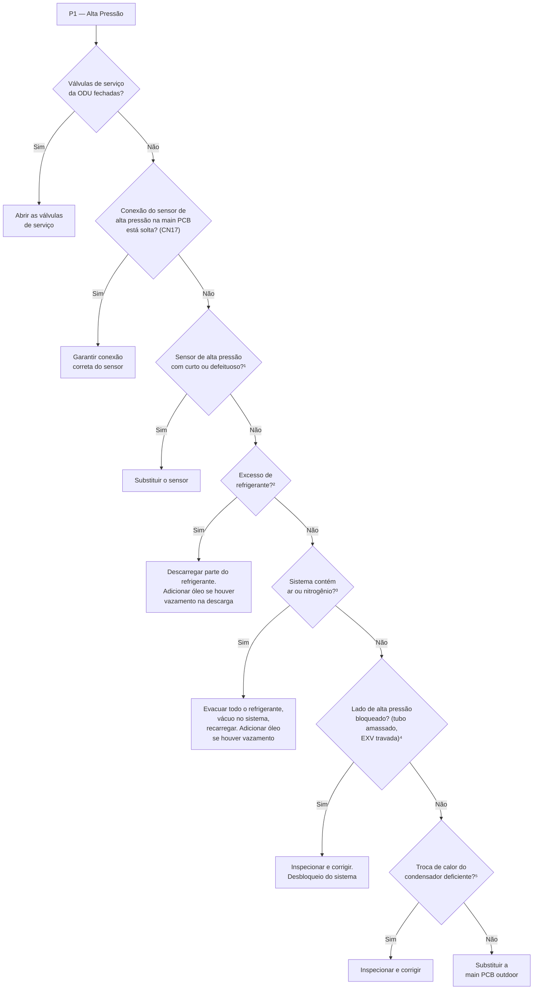
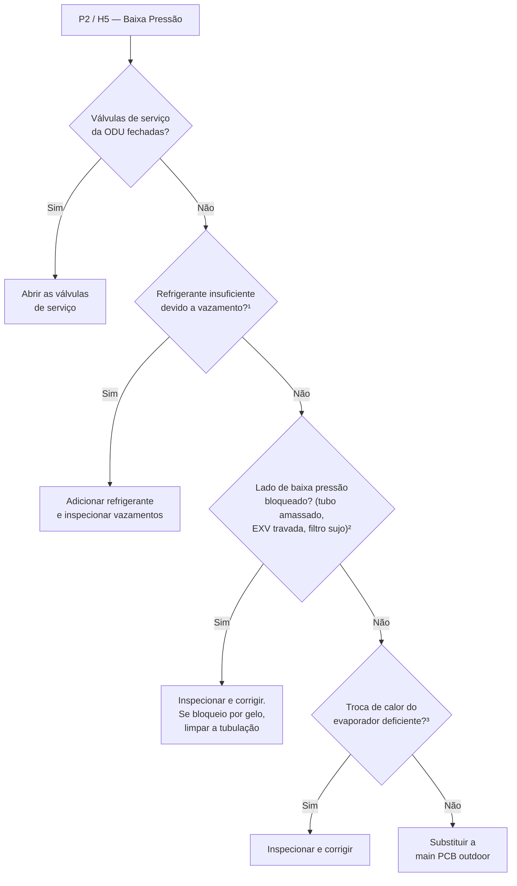
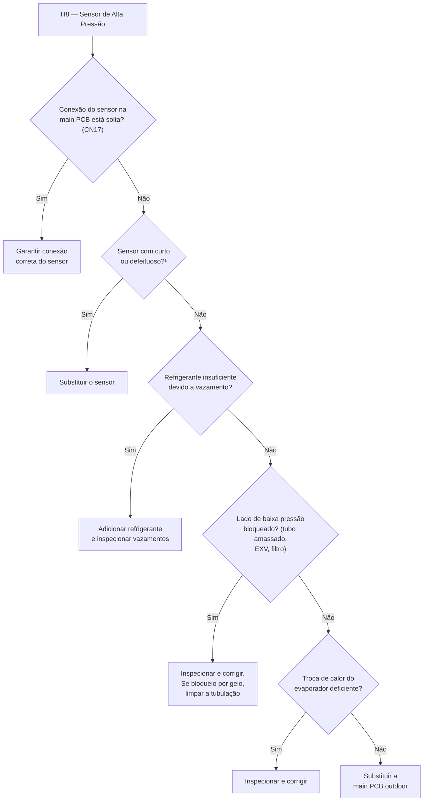
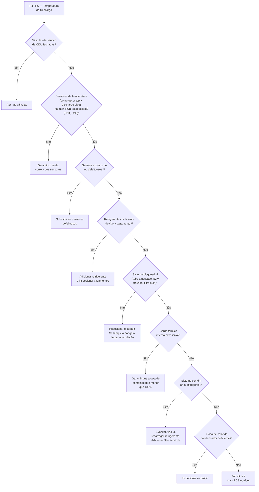
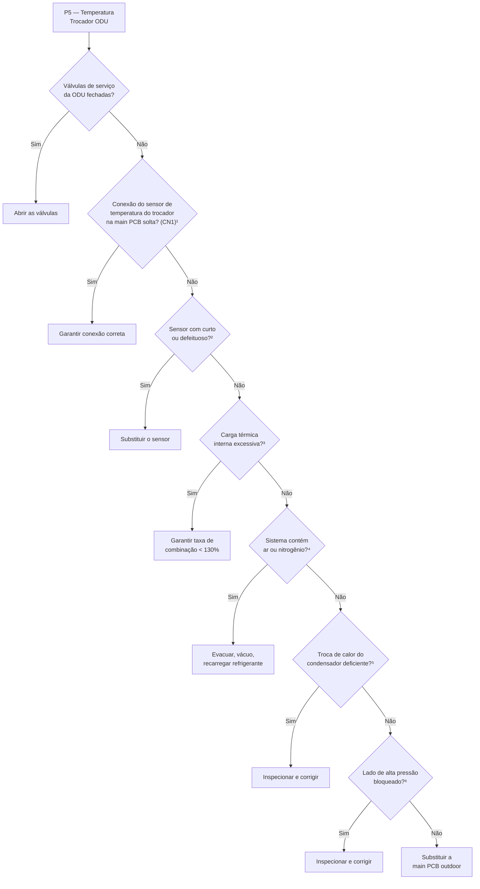
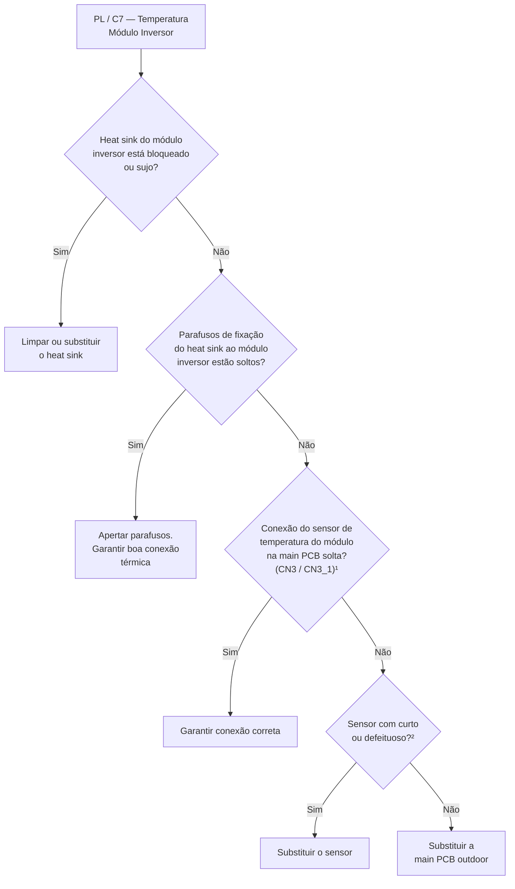
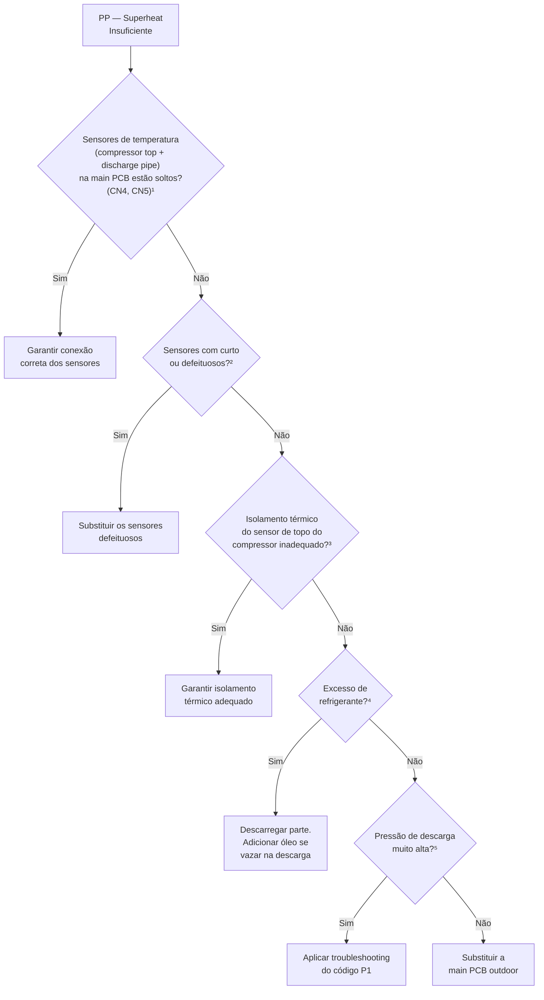
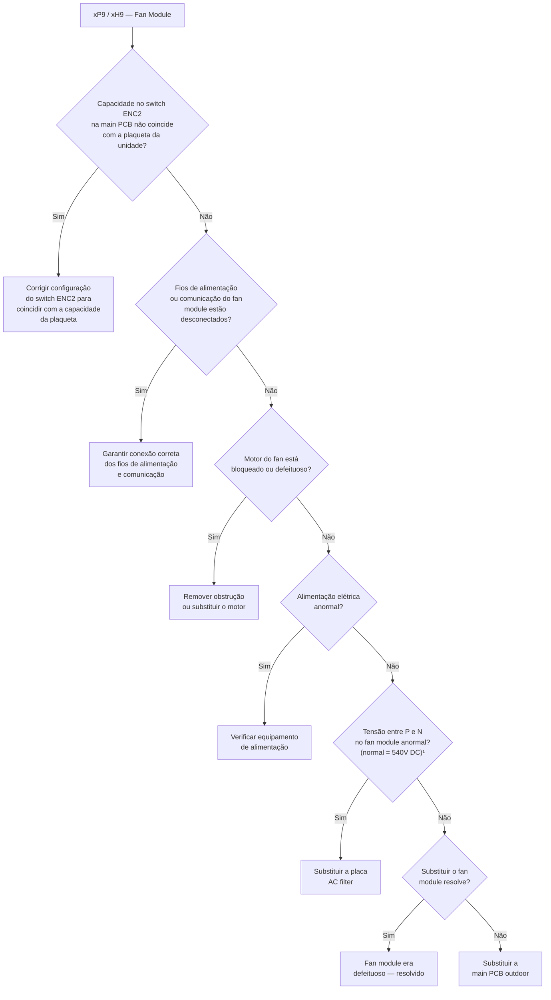
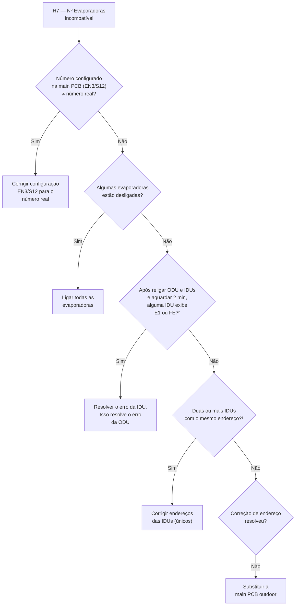

# Tópico 6.3 — Troubleshooting: Proteções de Pressão, Temperatura, Fan Module e Subcódigos do Inversor

> **Curso:** Treinamento Técnico TRANE TVR Pro CO — Série 380V  
> **Parte 6 — Diagnóstico e Troubleshooting (continuação)**  
> **Aula 6.3** — Proteções H5–xP9, PL/C7, PP e Subcódigos xL do Inversor  
> **Referência:** Manual de Serviço 380V TVR Pro, Parte 5 §2.13–2.23 e Apêndice 3 (pág. 80–109)

---

## Schema Metadata (Plataforma EAD)

```yaml
curso: treinamento-trane-tvr-pro-co-380v
modulo: parte-6-diagnostico-troubleshooting
secao: secao-6
aula: aula-6-3
titulo: "Proteções de Pressão, Temperatura, Fan Module e Subcódigos do Inversor"
slug: topico-6-3-protecao-pressao-temperatura-fan-subcodes
ordem: 3
prerequisito: aula-6-2
tempo_estimado: "55 min"
tags:
  - troubleshooting
  - pressao-alta
  - pressao-baixa
  - temperatura-descarga
  - fan-module
  - subcódigos-xL
  - inverter-module
  - compressor-replacement
nivel: avancado
```

---

## 1. Introdução e Mapa de Cobertura

Este tópico cobre **todos os códigos restantes de proteção** da unidade condensadora que não foram abordados nos Tópicos 6.1 e 6.2. Estão organizados em **quatro blocos lógicos**:

| Bloco | Códigos | Foco |
|-------|---------|------|
| **A — Pressão** | P1, P2/H5, H8 | Alta e baixa pressão do refrigerante |
| **B — Temperatura** | P4/H6, P5, PL/C7, PP | Descarga, trocador externo, módulo inversor, superheat |
| **C — Fan Module** | xP9/xH9 | Proteção do sistema de ventilação |
| **D — Subcódigos xL** | xL0–xL9 | Detalhamento interno do xH4 + proteções do módulo inversor |
| **E — Suporte** | H7, yHd | Número de evaporadoras e falha de slave |

> [!IMPORTANT]
> **Convenção de notação (revisão):**
> - **'x'** = compressor system (1=A, 2=B)
> - **'y'** = endereço da unidade slave (1 ou 2)
> - Todos os procedimentos de medição **exigem desligamento prévio da alimentação elétrica**

---

## 2. Bloco A — Proteções de Pressão

### 2.1 P1 — Proteção de Alta Pressão na Tubulação de Descarga

**Seção do manual:** §2.17 (pág. 93–94)

| Parâmetro | Valor |
|-----------|-------|
| **Descrição** | Pressão de descarga excessivamente alta |
| **Efeito** | Todas as unidades param |
| **Display** | Exibido apenas na unidade com o erro |
| **Trigger** | Pressão de descarga ≥ **4,3 MPa** |
| **Recover** | Pressão de descarga ≤ **4,0 MPa** por 2 minutos |
| **Reset** | Automático |
| **Sensor** | High pressure sensor — porta **CN17** na main PCB (item 7, Fig. 5-2.1) |

#### Causas Possíveis

- Válvulas de serviço (stop valves) da ODU fechadas
- Sensor de alta pressão desconectado ou defeituoso
- Excesso de refrigerante
- Sistema contém ar ou nitrogênio
- Bloqueio no lado de alta pressão
- Troca de calor deficiente no condensador
- Main PCB danificada

#### Procedimento P1 (Fluxograma)



**Notas técnicas do fluxograma P1:**
1. Medir resistência entre os 3 terminais do sensor de alta pressão. Resistência na ordem de MΩ ou infinita → sensor defeituoso
2. Excesso de refrigerante causa: Tₐ descarga abaixo do normal, pressões de descarga e sucção acima do normal
3. Ar/nitrogênio causa: Tₐ descarga acima do normal, pressão acima do normal, corrente do compressor acima do normal, ruído anormal, leitura instável do manômetro
4. Bloqueio no lado de alta pressão causa: Tₐ descarga acima do normal, pressão de descarga acima do normal, pressão de sucção abaixo do normal
5. No modo cooling: verificar trocadores outdoor, fans e saídas de ar. No modo heating: verificar trocadores indoor, fans e saídas de ar

---

### 2.2 P2 / H5 — Proteção de Baixa Pressão na Tubulação de Sucção

**Seção do manual:** §2.18 (pág. 95–97)

| Parâmetro | P2 | H5 |
|-----------|----|----|
| **Descrição** | Pressão de sucção baixa | P2 aparece 3× em 60 min |
| **Trigger** | Pressão de sucção ≤ **0,05 MPa** | 3 ocorrências de P2 em 60 min |
| **Recover** | Pressão de sucção ≥ **0,15 MPa** | — |
| **Reset** | Automático | **Manual (requer restart)** |

> [!WARNING]
> **H5 é uma proteção escalada:** P2 que se repete 3 vezes em 60 minutos se transforma em H5 com bloqueio manual. Isso indica uma condição sistêmica que requer investigação profunda antes de religar.

#### Causas Possíveis (P2/H5)

- Válvulas de serviço da ODU fechadas
- Refrigerante insuficiente
- Bloqueio no lado de baixa pressão
- Troca de calor deficiente no evaporador
- Main PCB danificada

#### Procedimento P2/H5 (Fluxograma)



**Notas técnicas do fluxograma P2/H5:**
1. Refrigerante insuficiente causa: Tₐ descarga acima do normal, pressões de descarga e sucção abaixo do normal, possível formação de gelo na linha de sucção
2. Bloqueio no lado de baixa causa: Tₐ descarga acima do normal, pressão de sucção abaixo do normal, corrente do compressor abaixo do normal
3. No modo cooling: verificar trocadores indoor, fans e saídas de ar. No modo heating: verificar trocadores outdoor, fans e saídas de ar

---

### 2.3 H8 — Erro do Sensor de Alta Pressão

**Seção do manual:** §2.15 (pág. 89–90)

| Parâmetro | Valor |
|-----------|-------|
| **Descrição** | Sensor de alta pressão com erro |
| **Efeito** | Todas as unidades param |
| **Display** | Exibido apenas na unidade com o erro |
| **Trigger** | Pressão de descarga ≤ **0,3 MPa** |
| **Recover** | Pressão de descarga > **0,3 MPa** |
| **Reset** | Automático |
| **Sensor** | High pressure sensor — porta **CN17** na main PCB |

#### Procedimento H8 (Fluxograma)



**Nota:** ¹ Medir resistência entre os 3 terminais. Resistência na faixa de MΩ ou infinita indica sensor defeituoso.

---

## 3. Bloco B — Proteções de Temperatura

### 3.1 P4 / H6 — Proteção de Temperatura de Descarga

**Seção do manual:** §2.19 (pág. 99–100)

| Parâmetro | P4 | H6 |
|-----------|----|----|
| **Descrição** | Temperatura de descarga excessiva | P4 aparece 3× em 100 min |
| **Trigger** | Temperatura de descarga (T7C1/2) ≥ **120°C** | 3 ocorrências de P4 em 100 min |
| **Recover** | T7C1/2 ≤ **90°C** | — |
| **Reset** | Automático | **Manual (requer restart)** |
| **Sensores** | Compressor top temp (CN4) + Discharge pipe temp (CN5) na main PCB |

> [!WARNING]
> **H6 é uma proteção escalada:** assim como H5, o código H6 é ativado quando P4 se repete 3 vezes em 100 minutos, indicando problema sistêmico.

#### Causas Possíveis (P4/H6)

- Válvulas de serviço da ODU fechadas
- Sensor de temperatura desconectado ou defeituoso
- Refrigerante insuficiente
- Bloqueio no sistema
- Carga térmica interna excessiva
- Sistema contém ar ou nitrogênio
- Troca de calor do condensador deficiente
- Main PCB danificada

#### Procedimento P4/H6 (Fluxograma)



**Notas técnicas do fluxograma P4/H6:**
1. Sensores CN4 (compressor top temperature, item 3) e CN5 (discharge pipe temperature, item 4) na main PCB
2. Medir resistência do sensor. Se muito baixa → curto-circuito. Se inconsistente com a tabela → sensor defeituoso. Consultar Table 6-3.2 no Apêndice
3. Refrigerante insuficiente causa: Tₐ descarga acima do normal, pressões abaixo do normal, possível gelo na linha de sucção
4. Bloqueio causa: Tₐ descarga acima do normal, pressão de sucção abaixo do normal
5. Carga interna excessiva causa: temperaturas de sucção e descarga acima do normal
6. Ar/nitrogênio: ruído anormal do compressor, pressão e corrente instáveis
7. No modo cooling: verificar trocadores outdoor. No modo heating: verificar trocadores indoor

---

### 3.2 P5 — Proteção de Temperatura do Trocador de Calor Externo (ODU)

**Seção do manual:** §2.20 (pág. 99–101)

| Parâmetro | Valor |
|-----------|-------|
| **Descrição** | Temperatura do trocador de calor outdoor excessiva |
| **Efeito** | Todas as unidades param |
| **Display** | Exibido apenas na unidade com o erro |
| **Trigger** | Temperatura do trocador outdoor (T3) ≥ **65°C** |
| **Recover** | T3 < **55°C** |
| **Reset** | Automático |
| **Sensor** | Outdoor heat exchanger temp sensor — porta **CN1** na main PCB (item 11) |

#### Causas Possíveis

- Válvulas de serviço da ODU fechadas
- Sensor de temperatura desconectado ou defeituoso
- Carga térmica interna excessiva
- Sistema contém ar ou nitrogênio
- Troca de calor deficiente no condensador
- Bloqueio no lado de alta pressão
- Main PCB danificada

#### Procedimento P5 (Fluxograma)



**Notas:**
1. Porta CN1 na main PCB (item 11, Fig. 5-2.1)
2. Medir resistência. Consultar Table 6-3.1 no Apêndice
3-5. Sintomas semelhantes aos documentados em P4/H6
6. Bloqueio no lado de alta causa: Tₐ descarga acima do normal, pressão de descarga acima do normal, pressão de sucção abaixo do normal

---

### 3.3 PL / C7 — Proteção de Temperatura do Módulo Inversor (Heat Sink)

**Seção do manual:** §2.22 (pág. 104–105)

| Parâmetro | xPL | C7 |
|-----------|-----|----|
| **Descrição** | Temperatura do heat sink do módulo inversor alta | xPL aparece 3× em 100 min |
| **Trigger** | Heat sink temperature (TF1/2) ≥ **80°C** | 3 ocorrências de PL em 100 min |
| **Recover** | TF1/2 < **65°C** | — |
| **Reset** | Automático | **Manual (requer restart)** |
| **Sensores** | Inverter module temp sensor — portas **CN3** e **CN3_1** na main PCB (itens 5 e 6) |
| **Prefixo 'x'** | 1PL = módulo inversor A, 2PL = módulo inversor B | — |

> [!IMPORTANT]
> **xPL e C7 são proteções pareadas:** 'x' indica o sistema de compressor (1=A, 2=B). C7 é a versão escalada que exige reinicialização manual.

#### Causas Possíveis

- Heat sink bloqueado, sujo ou solto
- Sensor de temperatura desconectado ou defeituoso
- Main PCB danificada

#### Procedimento PL/C7 (Fluxograma)



**Notas:**
1. Portas CN3 (item 5) e CN3_1 (item 6) na main PCB, conforme Fig. 5-2.1
2. Medir resistência. Se muito baixa → curto. Comparar com Table 6-3.3 no Apêndice

---

### 3.4 PP — Proteção de Superheat Insuficiente na Descarga do Compressor

**Seção do manual:** §2.23 (pág. 106–107)

| Parâmetro | Valor |
|-----------|-------|
| **Descrição** | Superheat de descarga do compressor insuficiente |
| **Efeito** | Todas as unidades param |
| **Display** | Exibido apenas na unidade com o erro |
| **Trigger** | Superheat de descarga ≤ **0°C** por 20 min OU ≤ **5°C** por 60 min |
| **Recover** | Superheat de descarga retorna ao valor normal |
| **Reset** | Automático |
| **Sensores** | Compressor top temp (CN4) + Discharge pipe temp (CN5) |

> [!CAUTION]
> **PP indica risco de retorno de líquido ao compressor (liquid slugging).** Superheat insuficiente significa que refrigerante líquido está chegando ao compressor, podendo causar dano mecânico grave. Não ignore este código.

#### Causas Possíveis

- Sensor de temperatura desconectado ou defeituoso
- Isolamento térmico inadequado do sensor de topo do compressor
- Excesso de refrigerante
- Pressão de descarga muito alta
- Main PCB danificada

#### Procedimento PP (Fluxograma)



**Notas:**
1. CN4 (item 3) e CN5 (item 4) na main PCB
2. Medir resistência. Comparar com Table 6-3.2
3. Leitura mais baixa que a temperatura real → causa falsa detecção de superheat baixo
4. Excesso de refrigerante causa Tₐ descarga abaixo do normal e pressões acima do normal

---

## 4. Bloco C — Proteção do Fan Module (xP9 / xH9)

**Seção do manual:** §2.21 (pág. 102–103)

| Parâmetro | xP9 | xH9 |
|-----------|-----|-----|
| **Descrição** | Proteção do fan module | xP9 aparece 10× em 120 min |
| **Efeito** | Todas as unidades param | Todas as unidades param |
| **Trigger** | Velocidade do fan muito baixa | 10 ocorrências de xP9 em 120 min |
| **Recover** | Velocidade do fan normal | — |
| **Reset** | Automático | **Manual (requer restart)** |
| **Prefixo 'x'** | 1=fan motor system A, 2=fan motor system B | — |

> [!IMPORTANT]
> **Tensão DC normal entre P e N no fan module = 540V DC.**
> Use esta referência para diagnóstico rápido com multímetro.

#### Causas Possíveis

- Switch ENC2 configurado incorretamente
- Fios de alimentação ou comunicação do fan module desconectados
- Motor do fan bloqueado ou defeituoso
- Alimentação elétrica anormal
- Placa AC filter danificada
- Fan module danificado
- Main PCB danificada

#### Procedimento xP9/xH9 (Fluxograma)



---

## 5. Bloco D — Subcódigos xL do Módulo Inversor

Os subcódigos xL são as proteções internas detalhadas do módulo inversor. Quando o código **xH4** aparece no display, os flashes do LED1 na placa inversora indicam qual subcódigo xL está ativo (conforme Table 5-3.2 no Tópico 6.2).

### Tabela 6-3.1 — Resumo dos Subcódigos xL e Ações

| Subcódigo | Nome | Causa Principal | Ação Primária |
|-----------|------|----------------|---------------|
| **xL0** | Inverter module protection | Módulo IPM defeituoso | Verificar fiação do compressor → resistência entre fases → isolação → IPM (gel silicone) → replace inverter module |
| **xL1** | DC bus low voltage | Tensão DC bus < 350V | Verificar alimentação → bridge rectifier → reactor → replace inverter module |
| **xL2** | DC bus high voltage | Tensão DC bus > 700V | Verificar alimentação → 3-phase bridge rectifier → replace inverter module |
| **xL4** | MCE error | Múltiplas causas mecânicas e elétricas | Ventilação ODU → stop valves → fiação → endereçamento → compressor → inverter board |
| **xL5** | Compressor demagnetization | Desmagnetização do motor | Verificar fiação → circuito aberto U/V/W → replace compressor/inverter |
| **xL7** | Phase sequence error | Sequência de fase incorreta | Verificar fiação solta → circuito aberto U/V/W → replace compressor/inverter |
| **xL8** | Freq variation >15Hz/1s | Variação rápida de frequência | Verificar stop valves → fiação → compressor → 12h preheating → inverter board → P1/P3 |
| **xL9** | Freq differs >15Hz | Frequência real difere >15Hz da target | Mesmo procedimento de xL8 |

> [!IMPORTANT]
> **Valores de referência para diagnóstico de subcódigos xL:**
> - **Tensão DC normal entre P e N no módulo inversor: 450-650V**
> - **xL1 trigger:** DC bus < 350V → verificar bridge rectifier e reactor
> - **xL2 trigger:** DC bus > 700V → verificar 3-phase bridge rectifier
> - **Resistência entre fases do compressor:** diferença > 5Ω → substituir compressor
> - **Resistência de isolação do compressor:** < 100kΩ → substituir compressor

### 5.1 xL0 — Inverter Module Protection (Detalhamento)

**Seção do manual:** §2.13.6 (pág. 80)

⚠️ **Desligar a alimentação antes de qualquer verificação!**

```
Procedimento xL0:
1. Fiação do compressor conectada incorretamente? → Reconectar conforme diagrama
2. Resistência entre 3 fases do compressor > 5Ω? → Substituir compressor
3. Resistência de isolação < 100kΩ? → Substituir compressor
4. Módulo inversor não dissipa calor adequadamente?
   4a. Parafusos do IPM soltos? → Apertar
   4b. Gel silicone não aplicado adequadamente? → Reaplicar gel
   4c. Nenhum dos anteriores → Substituir módulo inversor
5. Compressor com < 12h de preheating? → Garantir tempo de preaquecimento
6. Religar e compressor funciona? 
   Sim → Investigar P3 (overcurrent)
   Não → Verificar IPM → Replace inverter module
```

### 5.2 xL1 — DC Bus Low Voltage Protection

**Seção do manual:** §2.13.7 (pág. 81)

```
Procedimento xL1:
1. Alimentação anormal? → Verificar equipamento de alimentação
2. Sem saída do bridge rectifier? → (vai para passo 3)
3. Tensão DC (P,N) no módulo inversor anormal?¹
   Sim → O reactor funciona bem?
     Não → Substituir o reactor
     Sim → Substituir módulo inversor
   Não → Substituir módulo inversor
```
**Nota:** ¹ Tensão normal entre terminais P e N = 450-650V. Quando < 350V, proteção L1 é ativada.

### 5.3 xL2 — DC Bus High Voltage Protection

**Seção do manual:** §2.13.8 (pág. 82)

```
Procedimento xL2:
1. Alimentação anormal? → Verificar equipamento de alimentação
2. Tensão DC (P,N) no módulo inversor anormal?¹
   Sim → Substituir o 3-phase bridge rectifier
   Não → Substituir módulo inversor
```
**Nota:** ¹ Tensão normal = 450-650V. Quando > 700V, proteção L2 é ativada.

### 5.4 xL4 — MCE Error (Multi-Cause Error)

**Seção do manual:** §2.13.9 (pág. 83)

⚠️ **Desligar a alimentação antes de qualquer verificação!**

```
Procedimento xL4 (mais extenso):
1. Ventilação da ODU inadequada? → Remover obstruções do trocador e saída de ar
2. Stop valves da ODU fechadas? → Abrir as válvulas
3. Fiação do compressor incorreta? → Reconectar conforme diagrama
4. Endereço do módulo inversor e fiação do sensor de Tₐ descarga incorretos?¹ 
   → Resetar endereço e reconectar sensor
5. Resistência entre 3 fases do compressor > 5Ω? → Substituir compressor
6. Resistência de isolação < 100kΩ? → Substituir compressor
7. Substituir a compressor inverter board, restart:
   Resolveu? → Normal
   Não → Investigar P1 ou P3
```
**Nota:** ¹ O endereço do módulo inversor é configurado pelo dial switch S7. Posição A/B conforme wiring diagram.

### 5.5 xL5 e xL7 — Desmagnetização e Sequência de Fase

**Seção do manual:** §2.13.10 (pág. 84–85)

⚠️ **Desligar a alimentação antes de qualquer verificação!**

| Verificação | xL5 (Demagnetization) | xL7 (Phase Sequence) |
|------------|----------------------|---------------------|
| 1. Fiação do compressor solta? | Reconectar | Reconectar |
| 2. Circuito aberto nos terminais U/V/W? | Substituir compressor | Substituir compressor |
| 3. Nenhum dos anteriores | Substituir módulo inversor | Substituir módulo inversor |

### 5.6 xL8 / xL9 — Variação de Frequência do Compressor

**Seção do manual:** §2.13.11 (pág. 85)

⚠️ **Desligar a alimentação antes de qualquer verificação!**

```
Procedimento xL8/xL9:
1. Stop valves da ODU fechadas? → Abrir
2. Fiação do compressor incorreta? → Reconectar
3. Resistência entre 3 fases > 5Ω? → Substituir compressor
4. Resistência de isolação < 100kΩ? → Substituir compressor
5. Compressor com < 12h de preheating? → Garantir preaquecimento
6. Substituir compressor inverter board, restart:
   Resolveu? → Normal
   Não → Investigar P1 ou P3
```

---

## 6. Bloco E — Códigos de Suporte

### 6.1 H7 — Número Incompatível de Unidades Internas

**Seção do manual:** §2.14 (pág. 87–88)

| Parâmetro | Valor |
|-----------|-------|
| **Descrição** | Número de evaporadoras detectadas ≠ configurado na main PCB |
| **Efeito** | Todas as unidades param |
| **Display** | Exibido apenas no master unit |
| **Trigger** | 1+ evaporadora não detectada por 8h OU 1+ não detectada por 3 min |
| **Recover** | Número detectado = número configurado na main PCB |
| **Reset** | Automático |
| **Config** | Switches **EN3** e **S12** na main PCB |

#### Procedimento H7



**Notas:**
1. EN3 e S12 configuram o número de evaporadoras
2. E1 = erro de comunicação IDU-ODU; FE = IDU sem endereço atribuído
3. Endereços podem ser verificados/definidos via controle remoto/wired controller, ou auto-atribuídos pelo master outdoor

---

### 6.2 yHd — Falha de Unidade Slave

**Seção do manual:** §2.16 (pág. 91–92)

| Parâmetro | Valor |
|-----------|-------|
| **Descrição** | Erro na unidade slave |
| **Display** | 1Hd = slave endereço 1; 2Hd = slave endereço 2 |
| **Efeito** | Todas as unidades param |
| **Trigger** | Unidade slave com mau funcionamento |
| **Recover** | Slave volta ao normal |
| **Reset** | Automático |

**Procedimento:** Verificar a unidade slave relevante (endereço 1 ou 2) e investigar os erros específicos dessa unidade.

---

## 7. Procedimento de Substituição de Compressor (8 Passos)

**Seção do manual:** §2.13.12 (pág. 86)

Quando o diagnóstico dos subcódigos xL ou proteções P1/P2/P4 resultar na necessidade de substituição do compressor, seguir rigorosamente este procedimento:

| Passo | Ação | Detalhes Críticos |
|-------|------|-------------------|
| **1** | Remover compressor defeituoso e drenar óleo | Agitar o compressor antes de drenar para evitar impurezas no fundo. Drenar pelo tubo de descarga. Reter o óleo para inspeção |
| **2** | Inspecionar o óleo | Óleo claro/transparente = OK. Amarelo claro = OK. **Óleo escuro, preto ou com impurezas = sistema contaminado** → trocar óleo |
| **3** | Verificar óleo nos outros compressores | Óleo limpo → ir para Passo 6. Levemente contaminado → Passo 4. Fortemente contaminado → drenar óleo de todos os compressores do sistema → Passo 4 |
| **4** | Substituir separadores de óleo e acumuladores | Se óleo contaminado (leve ou forte), drenar dos separadores e acumuladores e substituir |
| **5** | Verificar filtros | Se óleo contaminado, verificar filtro entre a stop valve de gás e a válvula de 4 vias. Se bloqueado, limpar com nitrogênio ou substituir |
| **6** | Instalar compressor novo | Se houve drenagem de óleo de outros compressores (Passo 3), limpar antes de reinstalar: adicionar óleo limpo pelo tubo de descarga, agitar, drenar. Repetir várias vezes |
| **7** | Adicionar óleo do compressor | **Usar somente óleo FV50S.** Quantidades por capacidade: **8-12HP → 4L; 14-16HP → 5L; 18-22HP → 6L; 24-30HP → 9L.** Adicionar óleo extra nos acumuladores para compensar o que foi drenado em outros compressores |
| **8** | Vácuo e recarga | Após tudo conectado, realizar vácuo completo no sistema e recarregar refrigerante conforme V6 Engineering Data Book, Part 3 |

> [!CAUTION]
> **Tipo de óleo:** Usar **exclusivamente FV50S**. Compressores diferentes requerem tipos diferentes de óleo. Usar o tipo errado causa problemas graves de lubrificação.

---

## 8. Tabelas de Referência — Resistência dos Sensores de Temperatura

### Tabela 6-3.1 — Sensor de Temperatura Ambiente e Trocador de Calor Outdoor (kΩ)

*(Valores selecionados — tabela completa na pág. 107 do manual)*

| Temp (°C) | Resistência (kΩ) | Temp (°C) | Resistência (kΩ) | Temp (°C) | Resistência (kΩ) |
|-----------|------------------|-----------|------------------|-----------|------------------|
| -20 | 115,3 | 10 | 20,72 | 40 | 5,175 |
| -10 | 62,28 | 15 | 16,12 | 50 | 3,451 |
| 0 | 35,20 | 20 | 12,64 | 60 | 2,358 |
| 5 | 26,88 | 25 | 10,00 | 70 | 1,647 |
| — | — | 30 | 7,971 | 80 | 1,174 |
| — | — | 35 | 6,400 | 90 | 0,8525 |
| — | — | — | — | 100 | 0,6297 |

### Tabela 6-3.2 — Sensor de Temperatura do Topo do Compressor e Tubo de Descarga (kΩ)

*(Valores selecionados — tabela completa na pág. 108 do manual)*

| Temp (°C) | Resistência (kΩ) | Temp (°C) | Resistência (kΩ) | Temp (°C) | Resistência (kΩ) |
|-----------|------------------|-----------|------------------|-----------|------------------|
| -20 | 542,7 | 10 | 109,8 | 50 | 19,69 |
| -10 | 307,7 | 20 | 68,66 | 60 | 13,59 |
| 0 | 180,9 | 25 | 54,89 | 80 | 6,859 |
| 5 | 140,4 | 30 | 44,17 | 100 | 3,702 |
| — | — | 40 | 29,15 | 120 | 2,117 |
| — | — | — | — | 130 | 1,632 |

> [!TIP]
> **Dica de campo:** Ao medir a resistência de um sensor, compare o valor medido com a tabela acima para a temperatura ambiente atual. Se a leitura for muito baixa → sensor em curto. Se for MΩ ou infinita → sensor aberto. Se inconsistente com a temperatura → sensor defeituoso.

---

## 9. Tabela Resumo — Todos os Códigos Cobertos neste Tópico

| Código | Proteção | Trigger | Recover | Reset | Sensor/Porta |
|--------|----------|---------|---------|-------|-------------|
| **P1** | Alta pressão descarga | ≥ 4,3 MPa | ≤ 4,0 MPa / 2 min | Auto | CN17 |
| **P2** | Baixa pressão sucção | ≤ 0,05 MPa | ≥ 0,15 MPa | Auto | — |
| **H5** | P2 × 3 em 60 min | Escalado | — | **Manual** | — |
| **H8** | Sensor HP com erro | ≤ 0,3 MPa | > 0,3 MPa | Auto | CN17 |
| **P4** | Temperatura descarga | T7C ≥ 120°C | T7C ≤ 90°C | Auto | CN4, CN5 |
| **H6** | P4 × 3 em 100 min | Escalado | — | **Manual** | CN4, CN5 |
| **P5** | Temperatura trocador ODU | T3 ≥ 65°C | T3 < 55°C | Auto | CN1 |
| **xPL** | Temperatura módulo inversor | TF1/2 ≥ 80°C | TF1/2 < 65°C | Auto | CN3, CN3_1 |
| **C7** | xPL × 3 em 100 min | Escalado | — | **Manual** | CN3, CN3_1 |
| **PP** | Superheat descarga insuf. | ≤ 0°C/20min ou ≤5°C/60min | Normal | Auto | CN4, CN5 |
| **xP9** | Fan module protection | Fan speed baixa | Normal | Auto | ENC2 |
| **xH9** | xP9 × 10 em 120 min | Escalado | — | **Manual** | ENC2 |
| **H7** | Nº evaporadoras incompatível | Detecção ≠ config | = config | Auto | EN3, S12 |
| **yHd** | Slave unit malfunction | Slave com falha | Slave OK | Auto | — |
| **xL0** | Inverter module protect | Módulo IPM | — | — | LED1 8× |
| **xL1** | DC bus low voltage | < 350V | — | — | LED1 9× |
| **xL2** | DC bus high voltage | > 700V | — | — | LED1 10× |
| **xL4** | MCE error | Multi-causa | — | — | LED1 12× |
| **xL5** | Demagnetization | Motor desmagnetizado | — | — | LED1 13× |
| **xL7** | Phase sequence error | Sequência errada | — | — | LED1 15× |
| **xL8** | Freq variation >15Hz/1s | Instabilidade | — | — | LED1 16× |
| **xL9** | Freq differs >15Hz | Real ≠ target | — | — | LED1 17× |

---

## 10. Infobox (4 Destaques para a Plataforma EAD)

### Infobox 1 — Proteções Escaladas (H5, H6, C7, xH9)
> Quatro códigos usam o mecanismo de **proteção escalada**: quando um erro simples se repete dentro de um período, o sistema ativa uma proteção de nível superior que exige **reinicialização manual**. P2→H5 (3×/60min), P4→H6 (3×/100min), PL→C7 (3×/100min), xP9→xH9 (10×/120min). Proteções escaladas indicam **problema sistêmico** — nunca apenas religar sem investigar a causa raiz.

### Infobox 2 — Óleo FV50S e Contaminação
> Na substituição de compressor, o óleo deve ser **exclusivamente FV50S**. Óleo escuro/preto indica contaminação do sistema, exigindo limpeza de todos os compressores, separadores, acumuladores e filtros antes da reinstalação. Quantidades: 4L (8-12HP), 5L (14-16HP), 6L (18-22HP), 9L (24-30HP).

### Infobox 3 — Tensões DC de Referência
> Dois componentes têm tensões DC de referência críticas: **Módulo inversor P-N = 450-650V** (normal), <350V = xL1, >700V = xL2. **Fan module P-N = 540V DC** (normal). Sempre medir com multímetro DC antes de substituir placas.

### Infobox 4 — Leitura Rápida dos Sensores de Temperatura
> Para diagnóstico rápido em campo: a 25°C, o sensor ambiente/trocador outdoor deve medir ~**10 kΩ**, e o sensor de topo do compressor/descarga ~**55 kΩ**. Valor muito baixo = curto, MΩ/infinito = aberto, inconsistente com temperatura = defeituoso. Sempre consultar Tables 6-3.1 e 6-3.2 para valores exatos.

---

> **Próximo tópico sugerido:** Tópico 6.4 — Troubleshooting Avançado com base nos PDFs suplementares (RS-485 Communication, VRF IPM/Rectifier Diagnostics, VRF Piping Design, System Contamination)
>
> Podemos prosseguir para o **Tópico 6.4**?
