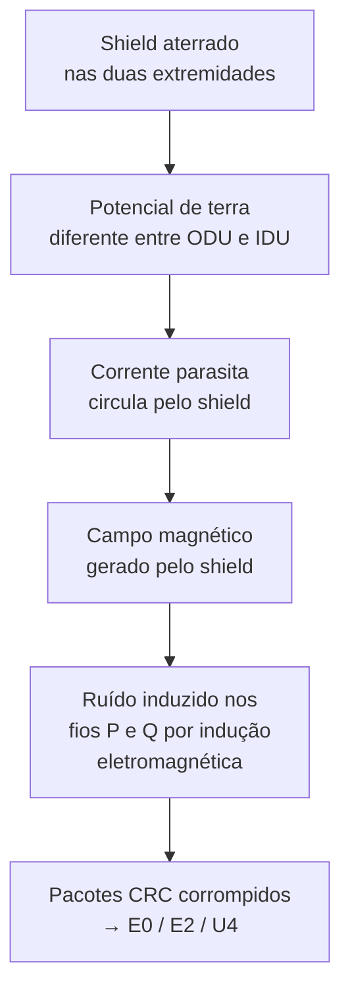
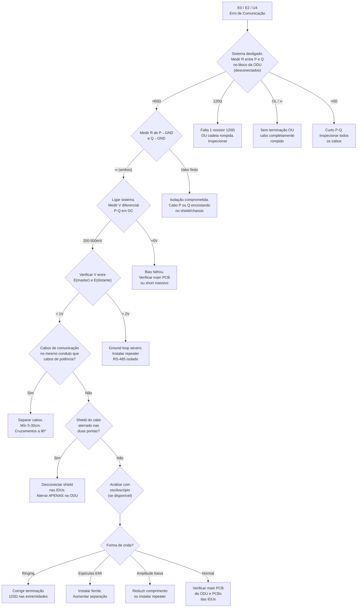
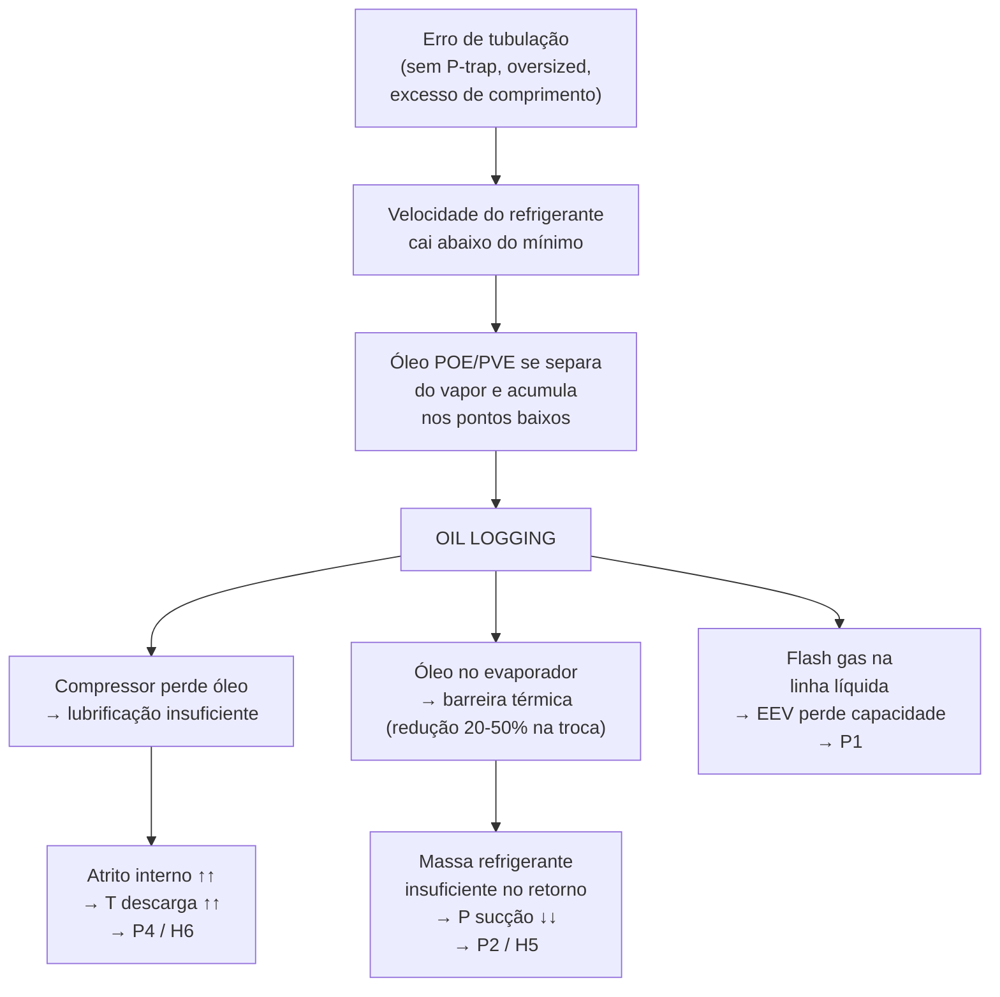
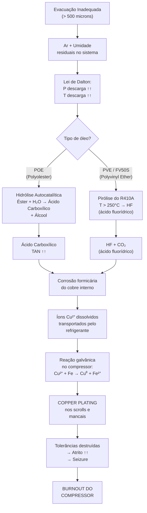
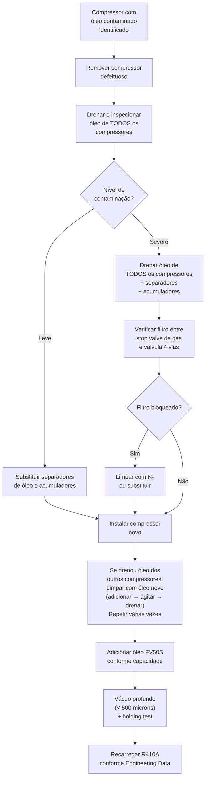

# Tópico 6.4 — Troubleshooting Avançado: Comunicação RS-485, IPM/Retificador, Tubulação e Contaminação

> **Curso:** Treinamento Técnico TRANE TVR Pro CO — Série 380V  
> **Parte 6 — Diagnóstico e Troubleshooting (continuação)**  
> **Aula 6.4** — Troubleshooting Avançado com base nos PDFs Suplementares  
> **Referências:** PDFs suplementares — RS-485 Communication, VRF IPM & Rectifier Diagnostics, VRF Piping Design & Oil Return, VRF System Contamination & Compressor Failure

---

## Schema Metadata (Plataforma EAD)

```yaml
curso: treinamento-trane-tvr-pro-co-380v
modulo: parte-6-diagnostico-troubleshooting
secao: secao-6
aula: aula-6-4
titulo: "Troubleshooting Avançado: RS-485, IPM/Retificador, Tubulação e Contaminação"
slug: topico-6-4-troubleshooting-avancado-pdfs
ordem: 4
prerequisito: aula-6-3
tempo_estimado: "75 min"
tags:
  - troubleshooting-avancado
  - rs-485
  - comunicacao
  - ipm
  - retificador-ponte
  - tubulacao-vrf
  - oil-return
  - contaminacao
  - copper-plating
  - compressor-failure
  - megger
  - diodo-mode
nivel: avancado
```

---

## 1. Introdução e Mapa de Cobertura

Este tópico consolida o conhecimento avançado de **quatro pesquisas suplementares** que aprofundam temas críticos parcialmente abordados nos Tópicos 6.1 a 6.3. Está organizado em **quatro blocos temáticos**:

| Bloco | Tema | Foco |
|-------|------|------|
| **A — Comunicação RS-485** | Rede de dados PQE/M1M2 | Topologia, EMI, ground loops, diagnóstico com multímetro e osciloscópio |
| **B — IPM e Retificador** | Módulo inversor + ponte retificadora | Teste com modo diodo, segurança DC bus, diagnóstico de subcódigos xL |
| **C — Tubulação e Oil Return** | Projeto de tubulação VRF | P-traps, velocidade mínima, oil logging, relação com P1/P2/P4 |
| **D — Contaminação e Falha** | Química do sistema | Evacuação, hidrólise, copper plating, falha mecânica do scroll |

> [!IMPORTANT]
> Este tópico é **complementar** aos Tópicos 6.1–6.3. Os códigos de erro referenciados aqui (E0, E1, E2, P1, P2, P4, H5, H6, xH4, xL0–xL9) já foram detalhados nos tópicos anteriores. Aqui abordamos as **causas-raiz profundas** e os **procedimentos de diagnóstico avançado** que vão além dos fluxogramas básicos.

---

## 2. Bloco A — Troubleshooting Avançado de Comunicação RS-485

### 2.1 Arquitetura da Rede RS-485 em Sistemas VRF

O sistema VRF utiliza comunicação serial **RS-485 half-duplex** para coordenação entre a unidade condensadora (master) e as evaporadoras (slaves). A rede opera a **9600 baud** com protocolo proprietário baseado em pacotes com verificação CRC.

#### Terminais e Nomenclatura

| Terminal | Função | Descrição |
|----------|--------|-----------|
| **P** | Data+ | Linha diferencial positiva |
| **Q** | Data- | Linha diferencial negativa |
| **E** | Signal Ground | Referência de terra do sinal |
| **M1/M2** | HyperLink | Rede secundária de alta velocidade (V8+) |

> [!NOTE]
> A comunicação RS-485 é **diferencial**: o receptor analisa a diferença de tensão entre P e Q. Isso fornece imunidade natural ao ruído de modo comum, mas essa proteção tem limites — quando o EMI excede a capacidade de rejeição dos transceivers, os pacotes são corrompidos.

#### Topologia Obrigatória: Daisy-Chain

| Topologia | Status | Consequência |
|-----------|--------|-------------|
| **Daisy-chain** | ✅ Obrigatória | Impedância controlada, sinais limpos |
| **Estrela (star)** | ❌ Proibida | Reflexões destrutivas, erros CRC |
| **T / stub** | ❌ Proibida | Descasamento de impedância |

A rede **deve** ser terminada com **dois resistores de 120Ω** — um em cada extremidade física do barramento. A resistência total medida entre P e Q (com sistema desligado) deve ser **≈60Ω** (dois 120Ω em paralelo).

### 2.2 Códigos de Erro de Comunicação e Tempos de Timeout

Quando a comunicação falha por tempo prolongado, o sistema gera um shutdown de segurança:

| Fabricante | Código | Timeout Típico |
|-----------|--------|----------------|
| **Midea/Trane** | E0 / E2 | 60–120 segundos sem pacotes válidos |
| **Daikin** | U4 | Similar |
| **Mitsubishi** | 5102 | Similar |

### 2.3 Principais Causas de Falha de Comunicação

#### A) EMI — Interferência Eletromagnética

Fontes comuns de EMI em instalações VRF:
- **VFD (inversor de frequência)** do compressor durante startup
- Cabos de potência compartilhando conduto com cabos de comunicação
- Equipamentos de solda, elevadores, geradores próximos

**Regras de separação obrigatórias:**

| Regra | Especificação |
|-------|---------------|
| Separação mínima (paralelo) | **5–30 cm** dependendo da classe de tensão |
| Cruzamento de cabos | **Exclusivamente a 90°** |
| Conduto compartilhado | **Proibido** — comunicação e potência NUNCA no mesmo conduto |
| Mitigação adicional | Anel de ferrite nos cabos PQE/M1M2 |

#### B) Ground Loops — O Erro Mais Comum de Instalação

> [!CAUTION]
> **O erro mais destrutivo e comum:** Aterrar o shield do cabo de comunicação nas duas extremidades cria um **ground loop** que injeta ruído diretamente na rede RS-485.

**Como o ground loop destrói a comunicação:**



**Solução correta — Aterramento Single-Ended:**

| Item | Regra |
|------|-------|
| **Shield na ODU (master)** | ✅ Aterrar no chassis, junto ao bloco PQE |
| **Shield nas IDUs** | ❌ Deixar flutuando (floating) |
| **Emendas entre IDUs** | Shield twisted + isolado com fita — sem contato com chassis |

### 2.4 Diagnóstico com Multímetro — Checklist de Campo

⚠️ **Todas as medições de resistência devem ser feitas com o sistema DESLIGADO!**

#### Teste 1 — Resistência da Rede (Sistema OFF)

| Medição | Onde | Esperado | Problema |
|---------|------|----------|----------|
| P ↔ Q | Bloco ODU (desconectar P e Q) | **≈60Ω** | — |
| P ↔ Q | Idem | **120Ω** | Falta 1 resistor OU cadeia rompida |
| P ↔ Q | Idem | **∞ (OL)** | Sem terminação OU cabo rompido |
| P ↔ Q | Idem | **≈0Ω** | Curto entre P e Q |
| P ↔ Ground | Idem | **∞ (OL)** | — |
| Q ↔ Ground | Idem | **∞ (OL)** | — |
| P ou Q ↔ GND | Idem | **Qualquer valor finito** | Isolação do cabo comprometida |

#### Teste 2 — Tensão DC de Bias (Sistema ON)

| Medição | Esperado | Problema |
|---------|----------|----------|
| V(P) − V(Q) diferencial | **200–500 mV DC** | — |
| V(P) referência a E | **2,5–2,7V DC** | Específico Midea |
| V(Q) referência a E | **2,5–2,7V DC** | Específico Midea |
| Diferencial ≈ 0V | — | Bias falhou → ruído domina o bus |
| V(E_master) − V(E_distante) | **< 1V DC** | Aceitável |
| V(E_master) − V(E_distante) | **> 2V DC** | Ground loop severo → instalar repeater isolado |

### 2.5 Diagnóstico com Osciloscópio — Análise de Forma de Onda

Para diagnósticos que vão além do multímetro:

**Configuração do osciloscópio:**

| Parâmetro | Configuração |
|-----------|-------------|
| Canal 1 | Probe em Data+ (P) |
| Canal 2 | Probe em Data- (Q) |
| Ground clips | Ambos no E (signal ground) |
| Math function | **Ch1 − Ch2** (sinal diferencial puro) |
| Timebase | ~100 µs/div |
| Vertical | 500 mV–1V/div |

#### Padrões de Forma de Onda e Diagnóstico

| Padrão Observado | Diagnóstico | Causa Raiz |
|-----------------|-------------|------------|
| Onda quadrada limpa, ±1,5V | ✅ **Normal** | Rede saudável |
| Ringing (oscilação) após transições | **Impedância descasada** | Falta terminação 120Ω ou presença de stubs |
| Trace "grosso" / espículas >2V | **EMI externo** | VFD do compressor acoplando ruído |
| Espículas correlacionadas com startup do compressor | **EMI do VFD confirmado** | Separação insuficiente ou shield mal aterrado |
| Bordas arredondadas / amplitude <200mV | **Bus sobrecarregado** | Comprimento >1000m ou excesso de terminações |

### 2.6 Fluxograma Completo — Troubleshooting de Comunicação RS-485



---

## 3. Bloco B — Diagnóstico Avançado: IPM e Retificador Ponte Trifásico

### 3.1 Segurança Antes de Tudo — Descarga do DC Bus

> [!CAUTION]
> **PERIGO LETAL:** Os capacitores do DC bus armazenam **450–650V DC** mesmo com o sistema desligado. Antes de tocar em QUALQUER componente do módulo inversor ou retificador:
> 1. **Desligar o disjuntor** da alimentação trifásica
> 2. **Aguardar mínimo 15 minutos** para descarga natural dos capacitores
> 3. **Verificar com multímetro DC** entre terminais P e N → deve ler **< 50V** antes de proceder
> 4. **Nunca** fazer curto direto entre P e N — usar resistor de descarga de 10kΩ/10W se necessário

### 3.2 Princípio: Modo Diodo do Multímetro

O teste de IPM e retificador utiliza o **modo diodo** do multímetro — NÃO o modo resistência (Ohms):

| Característica | Modo Diodo | Modo Ohms |
|---------------|------------|-----------|
| Método | Injeta ~1mA e mede queda de tensão | Mede resistência |
| Forward bias (OK) | **0,35–0,70V** | Impreciso |
| Reverse bias (OK) | **OL (Open)** | Impreciso |
| Shorted | **0,000V** (bip de continuidade) | ≈0Ω |
| Open | **OL** em ambas direções | ∞ |
| Uso em semicondutores | ✅ Correto | ❌ Incorreto |

### 3.3 Teste do Retificador Ponte Trifásico — Step-by-Step

O retificador possui **5 conexões principais:**
- **3 entradas AC:** L1, L2, L3 (vindas do filtro AC)
- **2 saídas DC:** P (+) e N (−) (para o DC link)

⚠️ **Desconectar TODOS os fios do retificador antes de testar!**

#### Fase 1 — Diodos Superiores (Rail Positivo)

| Ponta Preta (−) | Ponta Vermelha (+) | Esperado |
|-----------------|-------------------|----------|
| **P** | L1 | 0,4–0,7V |
| **P** | L2 | 0,4–0,7V |
| **P** | L3 | 0,4–0,7V |

#### Fase 2 — Diodos Inferiores (Rail Negativo)

| Ponta Vermelha (+) | Ponta Preta (−) | Esperado |
|-------------------|-----------------|----------|
| **N** | L1 | 0,4–0,7V |
| **N** | L2 | 0,4–0,7V |
| **N** | L3 | 0,4–0,7V |

#### Fase 3 — Verificação Reversa (Bloqueio)

Inverter a polaridade para ambos os conjuntos acima. **Todas as 6 medições devem mostrar OL.**

> [!WARNING]
> **Se qualquer medição reversa mostrar um valor de tensão (não OL), o diodo está vazando ou em curto. Substituir o retificador completo.**

### 3.4 Teste do IPM (Intelligent Power Module) — Step-by-Step

O IPM possui **5 conexões de potência:**
- **2 entradas DC:** P (+) e N (−) (do DC bus)
- **3 saídas AC:** U, V, W (para o compressor)

⚠️ **CRÍTICO: Desconectar os fios U, V, W do compressor ANTES de testar!** Se o motor ficar conectado, sua baixa resistência (0,1–2,5Ω) invalidará completamente todas as medições.

#### Fase 1 — FWDs High-Side (Diodos de Roda Livre Superiores)

| Ponta Preta (−) | Ponta Vermelha (+) | Esperado |
|-----------------|-------------------|----------|
| **P** | U | 0,35–0,50V |
| **P** | V | 0,35–0,50V |
| **P** | W | 0,35–0,50V |

#### Fase 2 — FWDs Low-Side (Diodos de Roda Livre Inferiores)

| Ponta Vermelha (+) | Ponta Preta (−) | Esperado |
|-------------------|-----------------|----------|
| **N** | U | 0,35–0,50V |
| **N** | V | 0,35–0,50V |
| **N** | W | 0,35–0,50V |

#### Fase 3 — Integridade do DC Bus Interno

| Medição | Esperado | Se diferente |
|---------|----------|-------------|
| Preta em P, Vermelha em N | **0,7–1,2V** (2 FWDs em série) | IPM comprometido |
| Vermelha em P, Preta em N | **OL** | Se 0V → curto total no DC bus |

### 3.5 Tabela de Interpretação — IPM e Retificador

| Leitura (Modo Diodo) | Status | Ação |
|----------------------|--------|------|
| **0,35–0,70V** (uniforme) | ✅ Saudável | Sem ação |
| **0,000V** (com bip) | ❌ **Curto** | Substituir IPM/Retificador imediatamente |
| **OL** (na direção forward) | ❌ **Aberto** | Wire bond rompido → substituir |
| **Valores inconsistentes** (ex: U=0,42V, V=0,41V, W=0,18V) | ⚠️ **Degradação parcial** | Substituir — falha iminente |

### 3.6 Teste Megger — Isolação do Compressor

Quando os testes do IPM e retificador estão normais, mas os subcódigos xL persistem, testar o compressor:

| Teste | Método | Esperado | Falha |
|-------|--------|----------|-------|
| **Resistência entre fases** | Ohms: U↔V, V↔W, U↔W | Diferença < **5Ω** entre leituras | Diferença > 5Ω → substituir compressor |
| **Isolação** (Megger 500V) | Megger: cada fase ↔ chassis | **> 100 MΩ** | < 100kΩ → substituir compressor |

> [!TIP]
> **Ordem de diagnóstico recomendada para subcódigos xL:**
> 1. Descarregar DC bus e verificar V(P,N) < 50V
> 2. Desconectar U/V/W do compressor
> 3. Testar IPM com modo diodo
> 4. Testar retificador com modo diodo
> 5. Reconectar U/V/W e testar resistência entre fases
> 6. Teste Megger de isolação
> 7. Verificar gel silicone no heat sink do IPM

### 3.7 Correlação: Subcódigos xL ↔ Falhas Detectáveis

| Subcódigo | Componente Mais Provável | Teste Prioritário |
|-----------|------------------------|-------------------|
| **xL0** — IPM Protection | IPM shorted/open | Modo diodo no IPM |
| **xL1** — DC Bus Low (<350V) | Retificador + Reactor | Modo diodo no retificador + V(P,N) |
| **xL2** — DC Bus High (>700V) | Retificador | Modo diodo no retificador |
| **xL4** — MCE Error | Compressor + IPM | Fases + Megger + IPM |
| **xL5** — Demagnetização | Compressor motor | Fases U/V/W (circuito aberto) |
| **xL7** — Phase Sequence | Fiação U/V/W | Verificar conexão + fases |

---

## 4. Bloco C — Tubulação VRF: Projeto, Oil Return e Códigos de Erro

### 4.1 Por que a Tubulação Causa Códigos de Erro

Erros de projeto de tubulação não causam falhas instantâneas — iniciam uma **cascata parasitária lenta** chamada **oil logging**:



### 4.2 Regras Críticas de Projeto de Tubulação

#### Velocidade Mínima para Retorno de Óleo

| Orientação | Velocidade Mínima | Consequência se Violada |
|-----------|-------------------|------------------------|
| **Riser vertical (sucção)** | **≥ 1.500 FPM** (7,62 m/s) | Óleo cai por gravidade, oil logging |
| **Horizontal** | Inclinação mín. para ODU | Acúmulo em pontos baixos |

#### P-Traps (Sifões) — Obrigatórios em Risers Verticais

| Regra | Especificação |
|-------|---------------|
| P-trap na base do riser | **Obrigatório** para cada riser vertical de sucção |
| P-trap intermediário | A cada **10 metros** de altura vertical |
| Função | Acumula óleo e permite que o refrigerante em alta velocidade "varrera" o óleo acumulado de volta ao compressor |
| Sem P-trap | Óleo escorre continuamente para baixo → oil logging permanente |

#### Limites de Comprimento Equivalente

| Parâmetro | Limite Típico TVR Pro |
|-----------|---------------------|
| Comprimento total equivalente | Conforme V6 Engineering Data Book |
| Desnível máximo ODU-IDU | Conforme Engineering Data |
| Comprimento da linha líquida | Excesso → flash gas → P1 |
| Subcooling adicional | Necessário para linhas líquidas longas ou com grande desnível |

### 4.3 Conexão: Erros de Tubulação → Códigos de Erro

| Erro de Tubulação | Mecanismo | Código Resultante |
|-------------------|-----------|-------------------|
| Sem P-trap em riser vertical | Óleo não retorna → oil starvation | **P4/H6** (temperatura descarga) |
| Riser oversized (diâmetro grande demais) | Velocidade < 1500 FPM → óleo cai | **P4/H6** + **P2/H5** |
| Linha líquida muito longa sem subcooling | Flash gas → EEV perde capacidade | **P1** (alta pressão) |
| Horizontal sem inclinação | Óleo acumula → restrição | **P2/H5** (baixa pressão) |
| Comprimento equivalente excedido | Perda de carga → pressão de sucção baixa | **P2/H5** + **P4/H6** |
| Tubo amassado ou bloqueado | Restrição severa | **P2/H5** ou **P1** dependendo da localização |

### 4.4 Oil Return Mode — Algoritmo de Recuperação Ativa

O sistema possui um modo automático de recuperação de óleo:

| Parâmetro | Valor |
|-----------|-------|
| **Frequência** | A cada 6–8 horas de operação acumulada |
| **Trigger adicional** | Monitoramento da Tₐ descarga (estimativa de nível de óleo) |
| **Ação 1** | Válvula de 4 vias pode reverter → gás quente nos evaporadores para aquecer/liquefazer o óleo |
| **Ação 2** | Todas as EEVs abrem totalmente (300–700 pulsos) → remove restrições |
| **Ação 3** | Compressor acelera a **124 Hz** → velocidade alta força o óleo pelos risers |
| **Meta** | Velocidade > 1.500 FPM para varrer óleo de volta |

> [!WARNING]
> **Limitação do Oil Return Mode:** O algoritmo assume que a tubulação foi instalada corretamente. Se os P-traps estão ausentes ou o comprimento equivalente é excessivo, nem o surge de alta velocidade conseguirá recuperar o óleo. A correção deve ser feita na tubulação física.

---

## 5. Bloco D — Contaminação do Sistema e Falha do Compressor

### 5.1 A Evacuação como Ponto Crítico

> [!CAUTION]
> **A causa #1 de falha prematura de compressor VRF é evacuação inadequada do sistema.** Umidade e ar residuais iniciam uma cascata química irreversível que destrói o compressor em semanas ou meses.

#### Requisito de Vácuo

| Parâmetro | Valor |
|-----------|-------|
| **Vácuo mínimo** | **500 microns** (0,5 mmHg / 66,7 Pa) |
| **Tempo de holding** | Manter por mínimo 30 min sem subir |
| **Se subir** | Indica vazamento → localizar e corrigir antes de carregar |

### 5.2 O Que Acontece com Ar/Umidade no Sistema — Lei de Dalton

Quando gases não-condensáveis (ar, nitrogênio) permanecem no sistema:

| Efeito | Mecanismo (Lei de Dalton) |
|--------|--------------------------|
| **Pressão total ↑** | P_total = P_refrigerante + P_ar (pressões parciais somam) |
| **Tₐ condensação ↑** | Compressor precisa comprimir contra pressão artificial |
| **Tₐ descarga ↑↑** | Trabalho de compressão aumenta exponencialmente |
| **Eficiência ↓↓** | Ar ocupa volume no condensador sem contribuir com troca de calor |

### 5.3 Cascata Química: Dois Caminhos para Destruição

Dependendo do tipo de óleo utilizado, a cascata segue caminhos diferentes mas com resultado idêntico:



### 5.4 Pathway A — Hidrólise do POE (Polyolester)

| Aspecto | Detalhe |
|---------|---------|
| **Reação** | Éster + H₂O → Ácido Carboxílico + Álcool |
| **Característica** | **Autocatalítica** — o ácido produzido acelera a produção de mais ácido |
| **Entalpia de ativação** | 11,8 kcal/mol (facilmente alcançada com Tₐ descarga elevada) |
| **TAN** | Total Acid Number sobe rapidamente |
| **Mitigação parcial** | Epóxidos "acid catchers" (ΔH = −30,1 kcal/mol) — mas são finitos e se esgotam |

### 5.5 Pathway B — Pirólise do R410A (com PVE/FV50S)

| Aspecto | Detalhe |
|---------|---------|
| **Composição R410A** | 50% R32 (CH₂F₂) + 50% R125 (C₂HF₅) |
| **Temperatura de decomposição** | > **250°C** (facilmente alcançada com NCGs presentes) |
| **Produtos** | HF (ácido fluorídrico) + COF₂ (carbonil fluoreto) → CO₂ + mais HF |
| **Perigo** | HF é extremamente corrosivo E tóxico |
| **PVE resiste à hidrólise** | Sim — mas o refrigerante decompõe |

> [!IMPORTANT]
> **O sistema está condenado independentemente do tipo de óleo:** POE → ácido carboxílico via hidrólise. PVE → ácido fluorídrico via pirólise do R410A. Ambos os caminhos levam à mesma destruição.

### 5.6 Copper Plating — A Reação Galvânica

Quando ácidos (carboxílico ou HF) atacam a tubulação de cobre interna:

1. **Corrosão formicária** — ácido corrói o cobre criando micro-túneis
2. **Dissolução** — Cu⁰ → Cu²⁺ (íons de cobre na solução)
3. **Transporte** — refrigerante leva os íons Cu²⁺ ao compressor
4. **Deposição galvânica** — no compressor, Cu²⁺ encontra ferro/aço:

**Reação eletroquímica:**
```
Cu²⁺ + Fe⁰ → Cu⁰ (deposita no aço) + Fe²⁺ (dissolve na solução)
```

| Potencial padrão | Valor | Classificação |
|-----------------|-------|---------------|
| Cu²⁺/Cu⁰ | **+0,34V** | Mais nobre (catódico) |
| Fe²⁺/Fe⁰ | **−0,44V** | Menos nobre (anódico) |
| ΔG | **Negativo** | Reação espontânea — não precisa de corrente externa |

### 5.7 Destruição Mecânica do Scroll

A sequência final de destruição:

| Etapa | O que acontece |
|-------|---------------|
| 1. Lubrificação perdida | TAN sobe → óleo vira lama abrasiva → canais de óleo entopem |
| 2. Regime de atrito muda | Hidrodinâmico → **boundary** (metal-metal) |
| 3. Tolerâncias comprometidas | Scrolls: < 20 µm. Bearing clearance: aumento de 0,1mm causa oscilação severa |
| 4. Copper plating espessa | Cu se deposita nos bearings e flancos dos scrolls |
| 5. Clearances zero | Peças não têm espaço para girar |
| 6. **Seized/Galling** | Scrolls soldam a frio — rotor trava |
| 7. **Locked rotor** | Motor puxa LRA contínuo → calor extremo |
| 8. **Burnout** | Isolação do motor derrete → curto → arco elétrico → destruição total |

### 5.8 Como Identificar Contaminação em Campo

| Indicador | O que verificar |
|-----------|----------------|
| **Cor do óleo** | Claro/transparente = OK. **Escuro, preto ou com partículas = contaminado** |
| **Cheiro ácido** | Óleo com cheiro forte e ácido = degradação química |
| **Copper plating** | Superfícies internas do compressor com camada acobreada |
| **Acidez (TAN)** | Teste com kit de acidez → TAN alto = contaminação |
| **Teste Megger** | Isolação < 100kΩ entre fase e chassis = motor danificado |

### 5.9 Procedimento de Recuperação — Sistema Contaminado



#### Quantidades de Óleo FV50S por Capacidade (Revisão)

| Capacidade | Volume de Óleo |
|-----------|---------------|
| 8–12 HP | **4 litros** |
| 14–16 HP | **5 litros** |
| 18–22 HP | **6 litros** |
| 24–30 HP | **9 litros** |

---

## 6. Tabela Resumo — Valores de Referência Críticos do Tópico 6.4

| Parâmetro | Valor | Contexto |
|-----------|-------|----------|
| R(P↔Q) rede RS-485 terminada | **≈60Ω** | 2× 120Ω em paralelo |
| V bias diferencial P-Q | **200–500 mV DC** | Bus idle saudável |
| V(P) e V(Q) ref. a E (Midea) | **2,5–2,7V DC** | Bias individual |
| Ground potential máx aceitável | **< 1V DC** | Entre E master e E distante |
| V(P,N) módulo inversor normal | **450–650V DC** | DC bus energizado |
| V(P,N) fan module normal | **540V DC** | DC bus energizado |
| Diodo mode — forward bias saudável | **0,35–0,70V** | IPM e retificador |
| Diodo mode — reverse bias saudável | **OL** | IPM e retificador |
| DC bus IPM — P→N forward | **0,7–1,2V** | 2 FWDs em série |
| Resistência entre fases compressor | **Diferença < 5Ω** | U↔V, V↔W, U↔W |
| Isolação compressor (Megger) | **> 100 MΩ** | Cada fase ↔ chassis |
| Isolação mín aceitável | **≥ 100 kΩ** | Abaixo disso → substituir |
| Velocidade mín em riser vertical | **≥ 1.500 FPM** (7,62 m/s) | Para retorno de óleo |
| Frequência oil return mode | **124 Hz** | Compressor em surge |
| EEV abertura em oil return | **300–700 pulsos** | Todas IDUs abertas |
| Vácuo mínimo evacuação | **500 microns** | 0,5 mmHg |
| T decomposição R410A | **> 250°C** | Pirólise com NCGs |
| Potencial Cu²⁺/Cu⁰ | **+0,34V** | Mais nobre |
| Potencial Fe²⁺/Fe⁰ | **−0,44V** | Menos nobre → anodo sacrificial |
| Tolerância scroll | **< 20 µm** | Folga radial/axial |
| Óleo exclusivo | **FV50S (PVE)** | Idemitsu Daphne Hermetic Oil |

---

## 7. Infobox (4 Destaques para a Plataforma EAD)

### Infobox 1 — Ground Loop: O Assassino Silencioso da Comunicação
> Em sistemas VRF com erros E0/E2/U4, a causa mais comum não é um cabo rompido — é um **ground loop** causado pelo aterramento do shield do cabo de comunicação nas duas pontas. A solução é simples: aterrar o shield **apenas na ODU master** e deixar flutuando em todas as IDUs. Confirme medindo a resistência P↔Q (≈60Ω) e a diferença de potencial de terra (<1V entre extremidades).

### Infobox 2 — Modo Diodo: O Teste que Salva Tempo e Dinheiro
> Antes de substituir um módulo inversor (IPM) ou retificador ponte, teste com o multímetro em **modo diodo** (não Ohms!). Forward bias saudável = 0,35–0,70V; OL em reverso. Se qualquer leitura é 0V → curto interno → substituir. Se OL em forward → aberto → substituir. **Desconectar U/V/W do compressor antes de medir** — senão a baixa resistência do motor mascara os resultados.

### Infobox 3 — Tubulação Errada = Compressor Morto em Meses
> Um P-trap ausente em um riser vertical causa oil logging silencioso. Em semanas, o óleo migra para os evaporadores e o compressor opera com lubrificação insuficiente. Resultado previsível: P4 (descarga quente) → H6 (lockout) → carbonização do óleo → falha mecânica. O oil return automático (124 Hz) ajuda, mas **não substitui P-traps corretamente instalados**.

### Infobox 4 — Evacuação Inadequada: A Sentença de Morte Química
> Se o vácuo não atingir 500 microns antes da carga, ar e umidade residuais desencadeiam uma cascata química irreversível. Com POE: hidrólise autocatalítica gera ácido carboxílico. Com PVE (FV50S): o R410A decompõe acima de 250°C gerando ácido fluorídrico. Ambos os caminhos corroem o cobre interno, transportam Cu²⁺ ao compressor, e causam **copper plating galvânico** nos scrolls e mancais — destruição garantida, independente do tipo de óleo.

---

> **Este tópico conclui a Parte 6 — Diagnóstico e Troubleshooting** do curso de treinamento TRANE TVR Pro CO 380V. Os tópicos 6.1 a 6.4 cobrem desde códigos de erro básicos até análise química avançada de falhas sistêmicas.
>
> Próximo passo sugerido: **Consolidação do conteúdo na plataforma EAD (simonclimatiza)** — integração dos 17 tópicos (1.1–6.4) no site web do projeto.
