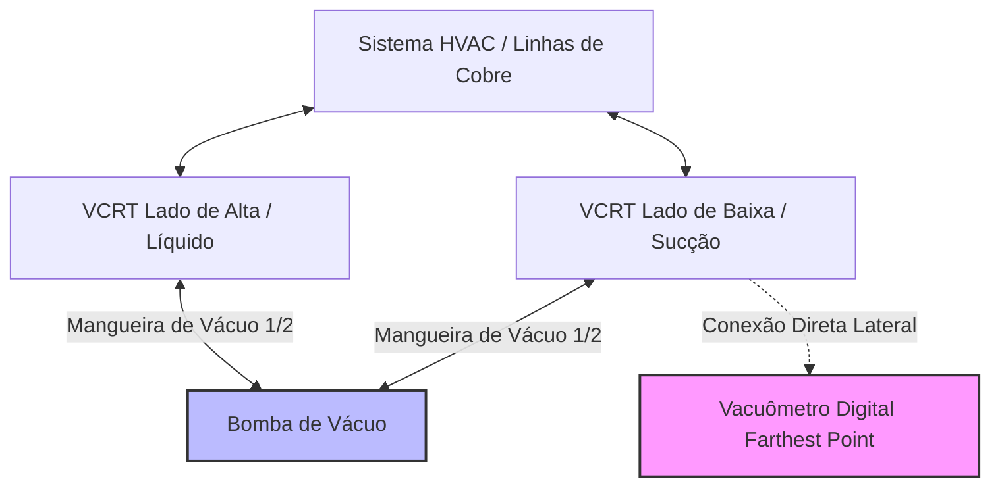
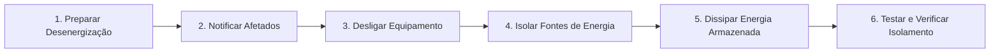

# Módulo 01-04: Ferramentas Digitais de Precisão, Segurança Ocupacional e Conduta do Técnico de Elite — Por que 500 Mícrons Salvam o Compressor

## Introdução: A Mudança de Paradigma na Era Digital

A indústria moderna de aquecimento, ventilação, ar condicionado e refrigeração (HVAC/R) passou por uma transição permanente e irreversível. O antigo modelo baseado em adivinhação mecânica, testes táteis e "regras de bolso" foi definitivamente substituído por procedimentos de engenharia termodinâmica exata e precisão digital rigorosa.

Os sistemas térmicos contemporâneos — projetados sob as mais estritas regulamentações de eficiência energética, como os índices SEER (Seasonal Energy Efficiency Ratio) e EER (Energy Efficiency Ratio) — não toleram mais as margens de erro historicamente aceitas no campo. A integração de serpentinas condensadoras microcanal, compressores inverter de velocidade variável acionados por inversores de frequência, válvulas de expansão eletrônicas (EEVs) e tolerâncias críticas de carga exige que o técnico execute protocolos científicos rigorosos em cada startup, manutenção ou diagnóstico.

Neste cenário digital, os Procedimentos Operacionais Padrão (SOPs) deixaram de ser burocracia e passaram a funcionar como o próprio sistema operacional que padroniza o trabalho. Empresas que adotam SOPs digitalizados registram um aumento de até 25% na produtividade e uma redução de 87% em defeitos reportados via CMMS (Computerized Maintenance Management System). Este documento estabelece as diretrizes de execução técnica, segurança do trabalho e calibração de ferramentas que diferenciam o mecânico comum do técnico de elite, consolidando-se no manifesto de conduta profissional.

---

## Parte I: A Obsolescência da Instrumentação Analógica

O tradicional manifold de manômetros analógicos com tubo de Bourdon foi a ferramenta definidora do técnico de refrigeração por gerações. Contudo, suas limitações físicas, mecânicas e matemáticas tornam-no completamente obsoleto para sistemas modernos de alta eficiência. Utilizar manômetros analógicos em processos de comissionamento hoje representa um gargalo técnico que introduz erros humanos e operacionais inaceitáveis.

### 1.1 Limitações Mecânicas do Tubo de Bourdon

Os manômetros analógicos funcionam com base no tubo de Bourdon: um tubo metálico achatado e curvado que se estica ligeiramente com o aumento da pressão interna, movendo mecanicamente um ponteiro sobre um mostrador impresso. Este mecanismo introduz três erros críticos de medição:

*   **Deriva da Referência Atmosférica:** Os manômetros analógicos utilizam a pressão barométrica local como ponto zero de referência. Como a pressão atmosférica oscila constantemente ao longo do dia devido a mudanças climáticas, temperatura ambiente e altitude do local de trabalho, o ponto de calibração zero sofre deriva. Isso impede o estabelecimento de uma base de medição estável e repetível.
*   **Erro de Paralaxe e Resolução:** Um dial analógico espreme uma escala de pressão gigante (de 30 polegadas de mercúrio de vácuo até mais de 800 PSI) em uma circunferência metálica pequena de poucas polegadas. A espessura física do ponteiro cobre, por si só, uma faixa de vários PSI. Além disso, o erro de paralaxe — a diferença óptica na leitura dependendo do ângulo de visão do técnico — gera interpretações divergentes para a mesma medição. Em sistemas com carga crítica, pequenas variações de pressão alteram drasticamente o cálculo da carga térmica e a eficiência termodinâmica.
*   **Ausência de Cálculos em Tempo Real:** Manifolds analógicos mostram apenas a pressão estática e as curvas de saturação para um número muito limitado de fluidos refrigerantes gravados no dial. Para obter parâmetros dinâmicos cruciais, como sobreaquecimento (superheat) e subarrefecimento (subcooling), o técnico é obrigado a ler manômetros analógicos, acoplar termopares tipo K (propensos a desvios lineares de calibração), consultar tabelas de pressão-temperatura (P-T) em papel e realizar os cálculos matemáticos manualmente. Este processo manual consome tempo, atrasa o diagnóstico e eleva exponencialmente a probabilidade de falhas de cálculo.

### 1.2 O Fenômeno do "Phantom Leak" (Vazamento Fantasma)

Além das imprecisões de leitura, a conexão física de um manifold analógico convencional com mangueiras de borracha causa a perda de refrigerante. Mangueiras padrão de 1/4 de polegada possuem um volume interno que retém aproximadamente 0,28 onças fluidas (cerca de 8 gramas) de refrigerante por pé. 

Em uma configuração padrão com três mangueiras de 1,5 metro (5 pés), o manifold retém uma quantidade expressiva de refrigerante em seu interior. Cada acoplamento e desacoplamento realizado para checar pressões purga ou extrai refrigerante do circuito de refrigeração. Se um instalador realizar esse procedimento em manutenções preventivas semestrais ao longo de 7 anos, ele retirará do sistema uma quantidade cumulativa de refrigerante equivalente a um vazamento físico real — o chamado **"vazamento fantasma" (phantom leak)**.

Em sistemas residenciais e comerciais modernos com trocadores de calor microcanal e volumes internos extremamente reduzidos, a perda de poucas onças de fluido compromete severamente a capacidade térmica do evaporador e o resfriamento do compressor. Consequentemente, o ato de conectar manifolds tradicionais para "verificar" a pressão degrada ativamente a eficiência da máquina que se pretende inspecionar.

### 1.3 Testes Não-Invasivos e Sondas Sem Fio

Para eliminar a depreciação de refrigerante e a imprecisão analógica, técnicos de elite utilizam sondas digitais inteligentes sem fio (wireless smart probes) com conexões diretas de baixíssima perda (low-loss fittings). Estas sondas se conectam às válvulas de serviço sem mangueiras intermediárias, reduzindo o volume de refrigerante exposto a quase zero. Os dados de pressão e temperatura são transmitidos via Bluetooth para dispositivos móveis, calculando automaticamente sobreaquecimento e subarrefecimento em tempo real.

O protocolo de campo determina uma diretriz rigorosa: o circuito frigorífico selado deve ser tratado com o mesmo cuidado de um refrigerador doméstico. A menos que seja estritamente necessário recuperar o refrigerante, evacuar a tubulação ou realizar intervenções profundas, o sistema operando normalmente deve ser avaliado de forma não-invasiva, priorizando a medição de vazão de ar, temperatura de bulbo úmido/seco e Delta T das serpentinas. A pressão de trabalho só deve ser inspecionada via sondas inteligentes de acoplamento direto.

---

## Parte II: O Arsenal de Diagnóstico do Técnico de Elite

Para garantir a calibração perfeita do sistema e evitar falhas prematuras, o ferramental do técnico de elite deve evoluir de ferramentas manuais gerais para instrumentos de diagnóstico de padrão laboratorial.

### 2.1 Manifolds Digitais de Alta Precisão

Quando intervenções profundas, processos de vácuo ou recargas de refrigerante são necessários, o manifold digital de 4 vias (como o Fieldpiece SM482V ou Testo 550s) é o equipamento padrão. Estes manifolds utilizam sensores de pressão eletrônicos de alta precisão com resolução de 0,1 PSI, eliminando aproximações visuais.

Eles possuem bases de dados integradas contendo as propriedades termodinâmicas atualizadas de centenas de fluidos refrigerantes, incluindo os novos fluidos levemente inflamáveis de baixo GWP (como R-32 e R-454B). Acoplados a termistores de contato de alta precisão (vastamente superiores aos termopares tipo K convencionais), eles realizam a leitura de temperatura de linha e executam o cálculo instantâneo e contínuo de sobreaquecimento e subarrefecimento, fornecendo gráficos dinâmicos de estabilização do ciclo diretamente no display ou em aplicativos móveis.

### 2.2 Vacuômetros Digitais Full-Range

O manômetro de baixa pressão analógico (manovacuômetro) é completamente cego na faixa de vácuo exigida para a desidratação adequada de tubulações. A pressão atmosférica padrão ao nível do mar é de 29,92 polegadas de mercúrio (inHg), o equivalente a 760 milímetros de mercúrio (mmHg). Na refrigeração profissional, esta escala milimétrica final é dividida em 760.000 mícrons (sendo 1 mícron igual a 1/1000 de milímetro).

Tentar visualizar a meta de vácuo profundo de 500 mícrons em um ponteiro analógico é impossível; a menor oscilação visual no ponteiro analógico representa uma variação de mais de 40.000 mícrons. Portanto, evacuar um sistema sem um vacuômetro digital é trabalhar às cegas.

Técnicos de elite utilizam vacuômetros digitais dedicados com sensores térmicos do tipo termistor ou termopar expostos diretamente à atmosfera do sistema. Conforme a bomba extrai os gases não-condensáveis e vaporiza a umidade, a condutividade térmica do gás residual se altera. O microprocessador do vacuômetro traduz essa mudança física em uma leitura exata de pressão digital em tempo real, fornecendo resolução de até 0,1 mícron (como o vacuômetro AccuTools BluVac+ Pro) e conectividade Bluetooth para monitorar testes de decaimento (decay tests).

### 2.3 Ferramentas de Remoção de Miolo de Válvula (VCRTs) de Alta Performance

A velocidade de um processo de evacuação de um circuito frigorífico está diretamente relacionada à condutância da tubulação de conexão e não apenas à capacidade de vazão (CFM) da bomba de vácuo. As válvulas Schrader padrão contidas nos ports de serviço de 1/4 de polegada possuem miolos internos com restrições extremas de passagem, com orifícios de apenas 3/16 de polegada.

Manter os miolos Schrader no local durante o processo de evacuação força todo o fluxo de gás a passar por essa restrição microscópica, transformando a desidratação em um processo lento de muitas horas. 

O protocolo SOP de elite exige o uso obrigatório de Ferramentas de Remoção de Miolo de Válvula (VCRTs - Valve Core Removal Tools) classificadas para alto vácuo (como a Appion MGAVCT de 1/4" ou MGAVCR de 5/16" para mini-splits). Essas ferramentas permitem extrair o miolo Schrader com o sistema sob pressão ou vácuo e isolá-lo em uma câmara selada por registro de esfera, desobstruindo totalmente a passagem da válvula de serviço. A remoção do miolo Schrader abre um canal de fluxo livre de diâmetro total. Em um sistema comercial de 10 TR, a remoção do miolo com o uso de mangueiras de vácuo reduz o tempo de evacuação de 40 minutos para menos de 3 minutos.

### 2.4 Balanças Digitais de Alta Precisão

Ajustar a carga de refrigerante "por corrente elétrica", "por pressão de sucção" ou utilizando visores de líquido leva a sérios desvios de calibração. Equipamentos de alto SEER, mini-splits inverter e sistemas comerciais operam com volumes de refrigerante muito ajustados e tolerâncias milimétricas.

Técnicos de elite utilizam balanças eletrônicas de carga (como a Testo 560i ou a série Compute-a-Charge) equipadas com células de carga com calibração rastreável NIST (National Institute of Standards and Technology). A pesagem exata do fluido especificado pelo fabricante previne dois cenários graves de falha:

1.  **Subcarga de Fluido:** Um sistema subcarregado não fornece a vazão mássica necessária para resfriar os enrolamentos do estator do compressor. O retorno de vapor na linha de sucção torna-se rarefeito, gerando superaquecimento do compressor, quebra dielétrica do isolamento e congelamento da serpentina do evaporador devido a pressões de evaporação abaixo do ponto de congelamento da água.
2.  **Sobrecarga de Fluido:** O excesso de refrigerante líquido acumula-se nas passagens inferiores da serpentina condensadora externa, reduzindo a área útil de troca térmica de alta pressão. Isso eleva a pressão de descarga (cabeça), fazendo o motor do compressor demandar correntes elétricas (amperagens) elevadas e operar sob estresse mecânico severo. Em casos extremos, ocorre o golpe de líquido (liquid slugging), que danifica placas de scroll e destrói as válvulas do compressor por estresse hidráulico incompressível.

---

## Parte III: Termodinâmica Aplicada e a Química do Circuito Frigorífico

Os procedimentos operacionais padrão e as ferramentas digitais de elite servem para proteger a integridade química interna do ciclo de refrigeração. Compreender a física molecular por trás do vácuo e as reações químicas com óleos lubrificantes sintéticos é o que define o diagnosticista técnico.

### 3.1 A Física do Vácuo e a Sublimação

O ar atmosférico que preenche uma tubulação recém-instalada contém oxigênio, nitrogênio e, principalmente, água em estado de vapor úmido. Se essa umidade não for completamente removida do circuito selado antes da carga de fluido refrigerante, o sistema falhará. No entanto, a água não pode ser drenada fisicamente como líquido; ela deve ser evaporada (fervida) para que a bomba de vácuo a extraia na forma de vapor.

Pelas leis físicas da termodinâmica, a temperatura de ebulição da água é diretamente proporcional à pressão absoluta exercida sobre ela. Ao nível do mar (pressão padrão de 760.000 mícrons), a água ferve a 212°F (100°C). Se um técnico realizar um procedimento inadequado de evacuação e alcançar apenas a marca de 1.000 mícrons, o ponto de ebulição da água cai para 1°F (-17,2°C). Em instalações de inverno ou regiões frias, se a temperatura do cobre estiver abaixo desse valor, a água líquida congelará dentro do tubo. 

O gelo possui uma pressão de vapor significativamente menor que a água líquida, fazendo com que ele passe diretamente de sólido para vapor (**sublimação**) de maneira extremamente lenta. O técnico pode obter uma leitura falsa de 500 mícrons no vacuômetro devido à baixa taxa de vaporização do gelo residual, achando que o vácuo foi concluído. Quando o compressor derreter esse gelo na partida, a água bruta se misturará com o óleo lubrificante sintético.

Quando a pressão absoluta do sistema é reduzida a exatamente **500 mícrons**, o ponto de ebulição da água cai para **-12°F (-24,4°C)**. Alcançar e manter a marca de 500 mícrons garante que qualquer quantidade de água líquida contida na tubulação ou emulsionada no óleo evapore instantaneamente, permitindo que a bomba a extraia completamente na forma de vapor seco.

### 3.2 Hidrólise do Óleo POE (Polyolester) e Ácidos Carboxílicos

Os refrigerantes HFC (R-410A, R-134a) e os novos A2L (R-32, R-454B) utilizam lubrificantes sintéticos à base de Polyolester (POE) ou Polyalkylene Glycol (PAG). Diferente dos óleos minerais legados (que rejeitam umidade acima de 25 ppm), os óleos POE são altamente polares e higroscópicos, absorvendo rapidamente umidade do ar e retendo até **2.500 ppm** de água.

A síntese industrial do óleo POE envolve uma reação de esterificação entre um ácido orgânico e um álcool, produzindo o éster (óleo) e água como subproduto. Esta reação química é reversível. Se um vácuo inadequado deixar traços de umidade no circuito, as altas temperaturas de operação na descarga do compressor ativam a reação de reversão, conhecida como **hidrólise**:

$$\text{Éster (Óleo POE)} + \text{Água} \rightleftharpoons \text{Ácido Carboxílico} + \text{Álcool}$$

Sob calor e pressão, a umidade quebra as ligações éster do óleo POE, transformando-o novamente em álcool e ácidos orgânicos corrosivos (como o ácido acético). Esta formação ácida causa duas das maiores falhas de campo:

1.  **Corrosão Fórmica (Ant Nest Corrosion):** O ácido carboxílico ataca quimicamente as paredes internas de cobre das serpentinas, criando micro-túneis ramificados invisíveis a olho nu que corroem o metal de dentro para fora, culminando em vazamentos de fluido refrigerante de difícil localização.
2.  **Copper Plating (Deposição de Cobre):** O fluido altamente ácido dissolve o cobre das tubulações e o transporta em suspensão até o compressor. Nas zonas de atrito extremo e alta temperatura localizada (como mancais, eixos e válvulas de descarga de aço), o cobre se precipita e se deposita nas superfícies de aço. A folga dos mancais é reduzida a zero, travando mecanicamente o compressor.

Adicionalmente, os ácidos atacam quimicamente o verniz de isolamento elétrico dos enrolamentos do estator do motor elétrico do compressor, causando curtos-circuitos internos e queima do motor (burnout).

### 3.3 A Penalidade de SEER por Gases Não-Condensáveis (NCGs)

A evacuação incompleta também deixa gases não-condensáveis no sistema, principalmente nitrogênio e oxigênio atmosféricos. De acordo com a Lei das Pressões Parciais de Dalton, a pressão total de um sistema contendo uma mistura de gases é a soma das pressões parciais que cada gás exerceria individualmente nas mesmas condições.

Como o nitrogênio atmosférico não se condensa em líquido sob as pressões de trabalho de sistemas de ar condicionado, ele permanece na fase gasosa e se acumula na seção superior da serpentina condensadora externa. Esse acúmulo de gás não-condensável funciona como uma barreira isolante térmica, bloqueando a área útil de troca de calor destinada à rejeição térmica do fluido.

Isso causa um aumento artificial na pressão de condensação (pressão de cabeça). Estudos laboratoriais conduzidos pela ACEEE (American Council for an Energy-Efficient Economy) demonstraram que a presença de apenas **0,3 onças (cerca de 8,5 gramas) de nitrogênio** em um sistema com carga total de 102 onças (aproximadamente 0,3% da carga total, equivalente ao volume interno contido em uma infraestrutura de 5 metros de tubulação e evaporador não evacuados) reduz severamente a capacidade líquida de resfriamento.

Este volume microscópico de ar residual reduz o índice EER em 13%, degrada o SEER em 13% e eleva o consumo elétrico do compressor em 6%, pois o motor é forçado a trabalhar contra pressões de condensação elevadas. Além disso, em ambientes com alta umidade relativa, onde o sistema exige longos tempos de ciclo para realizar a desumidificação (carga latente), um evaporador operando sob alta pressão de evaporação perderá capacidade latente, deixando o ambiente ocupado úmido e desconfortável, mesmo que o termostato atinja a temperatura de bulbo seco configurada.

---

## Parte IV: Protocolo de Evacuação e Comissionamento de Elite (SOP)

Para erradicar a acidez, evitar a corrosão e assegurar a eficiência SEER nominal do equipamento, o técnico de elite executa o protocolo estruturado de comissionamento de alta condutância.

### Passo 1: Preparação das Tubulações e Brasagem com Nitrogênio
1.  **Purga de Nitrogênio na Brasagem:** Durante a execução de todas as juntas de cobre, deve-se fluir nitrogênio seco livre de oxigênio (OFDN) a uma vazão baixa de 2 a 3 CFH (pés cúbicos por hora) no interior da tubulação. O nitrogênio desloca o oxigênio e evita a formação de carepas de óxido cúprico (fuligem preta). Sem isso, flocos pretos se desprendem e viajam pelo sistema, entupindo filtros secadores e obstruindo os orifícios das TXVs.
2.  **Rebarbação Completa:** Todos os tubos de cobre cortados devem ser rebarbados internamente. Rebarbas geram restrições localizadas de vazão, causam turbulência e dificultam o retorno correto do óleo lubrificante ao compressor.
3.  **Remoção dos Miolos de Válvula:** Instalar VCRTs de alto vácuo nos ports de serviço de alta e baixa pressão e extrair os miolos de válvula Schrader antes de iniciar as conexões de teste e vácuo.

### Passo 2: Teste de Pressurização Estática de Alta Pressão
1.  **Pressurização:** Introduzir nitrogênio seco livre de oxigênio no circuito frigorífico até atingir a pressão de teste especificada pelo fabricante (geralmente entre 300 e 600 PSI, dependendo da classe do equipamento).
2.  **Decaimento Térmico Compensado:** Configurar o manifold digital para o modo de teste de estanqueidade por diferença de pressão. O manifold monitorará a variação de pressão compensando a flutuação da temperatura ambiente. Um manômetro analógico comum não diferencia vazamento físico de queda de pressão por resfriamento térmico. O teste deve ser mantido por no mínimo 15 minutos para certificar a estanqueidade absoluta de todas as soldas.
3.  **Alívio de Pressão Controlado:** Purgar a carga de nitrogênio de teste lentamente até manter uma leve pressão positiva residual de 1 a 2 PSIG. Não zerar completamente a pressão do sistema com a atmosfera para evitar a entrada de ar úmido nas tubulações limpas.

### Passo 3: Teste de Eficiência da Bomba de Vácuo (Blank-Off)
1.  Acoplar um vacuômetro digital de alta resolução (como o AccuTools BluVac+ Pro) diretamente à válvula de entrada da bomba de vácuo utilizando uma conexão em "T" de latão.
2.  Ligar a bomba de vácuo. A bomba deve alcançar uma pressão terminal de vácuo de **100 mícrons ou menos** (o ideal é puxar abaixo de 50 mícrons).
3.  Se a bomba não atingir 100 mícrons, o óleo lubrificante da bomba está contaminado com umidade ou degradado pelo uso e deve ser trocado. Recomenda-se o uso de bombas com sistemas de troca rápida de óleo sob vácuo (como o sistema Appion TEZOM, que permite trocar o cartucho de óleo em 5 segundos sem quebrar o vácuo do sistema, utilizando óleos de baixíssima pressão de vapor de até 1 mícron).

### Passo 4: Setup de Vácuo de Alta Condutância (Bypass do Manifold)
1.  **Eliminar o Manifold de 4 Vias:** Não realizar a evacuação do sistema passando pelas vias do manifold de diagnóstico. Os visores de líquido, registros e conexões rosqueadas dos manifolds convencionais criam pontos de micro-vazamentos sob alto vácuo.
2.  **Utilizar Mangueiras de Vácuo de Grande Diâmetro:** Utilizar mangueiras flexíveis de alto vácuo com diâmetro interno de 1/2 polegada (como o kit Appion MegaFlow) ou mangueiras TruBlu de 3/4 polegada. A condutância de fluxo em vácuo aumenta de forma exponencial com o diâmetro da mangueira. Uma mangueira de 1/2 polegada evacua o sistema até 16 vezes mais rápido que uma mangueira de 1/4 de polegada.
3.  **Conexão Direta:** Ligar as mangueiras de 1/2 polegada diretamente das conexões de entrada da bomba de vácuo aos ports de fluxo total das VCRTs instaladas nos ports de serviço de alta e baixa pressão do sistema.
4.  **Posicionamento do Vacuômetro:** Conectar o vacuômetro digital de alta precisão diretamente na conexão lateral isolada da VCRT instalada no port de sucção da unidade, distante da bomba de vácuo. Isso garante ler a pressão real de equilíbrio estável de todo o sistema e evita a leitura de pressões artificialmente baixas geradas próximas à bomba.

### Passo 5: Teste de Isolamento e Decaimento de Mícrons
1.  **Partida com Gás Ballast Aberto:** Ligar a bomba de vácuo mantendo a válvula de gas ballast aberta durante a fase inicial da evacuação (até que a pressão caia abaixo de 10.000 mícrons). Isso introduz uma corrente regulada de ar seco no estágio de compressão da bomba, evitando que o grande volume de vapor d'água extraído se condense na forma líquida e contamine o óleo da bomba.
2.  **Puxada Final de Vácuo:** Fechar o gas ballast e manter a bomba operando até que a leitura de pressão digital de todo o sistema atinja a meta de 500 mícrons (alvos de comissionamento de elite buscam marcas abaixo de 200 mícrons).
    *   *Nota de segurança técnica:* Não baixar o vácuo além de 100 mícrons em sistemas com lubrificante POE, pois a essa pressão de vácuo extremo as frações voláteis do próprio óleo lubrificante entram em ebulição (degas), degradando a viscosidade e capacidade de lubrificação do óleo.
3.  **Executar o Teste de Decaimento (Decay Test):** Isolar o vacuômetro digital e o sistema fechando os registros das VCRTs, desconectando efetivamente a bomba de vácuo e as mangueiras flexíveis do circuito frigorífico. Desligar a bomba de vácuo.
4.  **Monitorar a Estabilidade por 15 a 30 Minutos:**
    *   **Sucesso (Circuito Estanque e Desidratado):** Um leve aumento inicial nos primeiros minutos é normal devido à equalização interna da pressão em trechos tortuosos das serpentinas. Se a pressão se estabilizar e permanecer abaixo de **500 mícrons** durante todo o intervalo do teste, o sistema está hermeticamente seco e estanque.
    *   **Indicação de Umidade Residual:** Se o vacuômetro digital registrar um aumento de pressão que se estabiliza e cessa em um patamar superior (geralmente estabilizando entre 1.500 e 25.000 mícrons), há água líquida sublimando no circuito. Deve-se interromper o vácuo com uma carga de nitrogênio de 1 a 3 PSIG para absorver a umidade e reiniciar o processo de vácuo (Protocolo de Tripla Evacuação).
    *   **Indicação de Vazamento Físico:** Se a leitura de pressão subir continuamente de forma linear até atingir a pressão atmosférica (760.000 mícrons), existe uma abertura física na tubulação ou conexões das mangueiras. O vazamento deve ser localizado e reparado antes de prosseguir.

### Passo 6: Validação de Carga e Startup de Precisão
Após a certificação do vácuo, quebrar a pressão negativa introduzindo refrigerante na fase líquida pela linha de líquido até atingir pressão positiva, evitando a entrada de ar atmosférico. Em seguida, os registros das VCRTs podem ser abertos para reinstalar os miolos Schrader de forma segura.

A calibração da carga final deve seguir as especificações exatas do tipo de dispositivo de expansão instalado no evaporador:

*   **Sistemas de Orifício Fixo (Pistão ou Capilar):** A carga deve ser calibrada baseando-se estritamente na medição de **Sobreaquecimento Total**. Utilizando manifold ou sondas digitais, mede-se a temperatura de bulbo úmido na entrada do evaporador interno e a temperatura de bulbo seco externa na entrada do condensador. Estes dados calculam dinamicamente a meta de sobreaquecimento alvo através da fórmula. Adiciona-se ou recolhe-se refrigerante até que o sobreaquecimento de sucção medido coincida com a meta matemática.
*   **Sistemas com Válvula de Expansão Termostática (TXV):** Como as TXVs modulam a passagem de fluido continuamente para manter o sobreaquecimento estável, a medição de sobreaquecimento não serve para balizar a carga do sistema. Estes equipamentos devem ser carregados baseando-se na medição de **Subarrefecimento**. O técnico adiciona refrigerante para elevar o subarrefecimento ou recolhe para reduzi-lo, fazendo o parâmetro coincidir exatamente com a meta de subarrefecimento gravada na placa da unidade condensadora externa (geralmente entre 10°F e 12°F), garantindo que uma coluna contínua de líquido chegue à TXV.

---

## Parte V: Segurança Ocupacional Avançada em HVAC Comercial e Industrial

Intervenções em sistemas comerciais e industriais expõem o técnico a riscos ocupacionais severos, como tensões elétricas perigosas, gases térmicos pressurizados, partes mecânicas em movimento e riscos de queda. Técnicos de elite mitigam estes riscos seguindo as normas regulamentadoras nacionais e internacionais.

### 5.1 Lockout / Tagout (LOTO) Digitalizado

A norma regulamentadora de Lockout/Tagout da OSHA (29 CFR 1910.147) estabelece os protocolos de controle de energia perigosa para proteger os técnicos contra acionamentos acidentais ou liberação de energia armazenada durante atividades de reparo e manutenção. 

O protocolo exige a execução rigorosa de seis etapas estruturadas:

Estas etapas devem abranger todas as fontes de energia presentes no equipamento: elétrica (tensões de 220V a 480V trifásicas), mecânica (correias e polias de ventiladores), pneumática (sistemas de controle de dampers) e térmica (linhas de água gelada ou vapor sob alta pressão).

Empresas de engenharia de elite substituíram os antigos sistemas de fichas de papel por fluxos de LOTO integrados digitalmente ao CMMS (como OxMaint). A ordem de serviço no smartphone exige que o técnico realize o LOTO digital anexando fotos georreferenciadas e com carimbo de data/hora do disjuntor bloqueado com cadeado físico e etiqueta antes que a OS seja aberta para digitação técnica. Isso evita acidentes por handover de turnos incorretos e gera um banco de dados auditável.

### 5.2 Risco de Arco Elétrico e Vestimentas NFPA 70E

Técnicos de ar condicionado comercial trabalham frequentemente em painéis elétricos energizados de 380V/480V trifásicos. Nestes painéis, além do risco de choque elétrico, existe a ameaça de **arco elétrico (arc flash)**: uma violenta descarga de energia térmica através do ar causada por curto-circuito. Um arco elétrico atinge temperaturas superiores à superfície do sol, vaporizando cobre e aço instantaneamente, gerando ondas de choque expansivas e estilhaços metálicos letais.

A conformidade com a norma NFPA 70E exige que o técnico use Equipamentos de Proteção Individual (EPIs) com classificação de proteção térmica de arco (Arc Rated - AR ou Flame Resistant - FR). O vestuário é projetado para garantir que, caso ocorra um curto-circuito catastrófico, o técnico sofra no máximo queimaduras de segundo grau tratáveis. A norma estabelece quatro categorias de EPI com base na energia incidente (cal/cm²):

| Categoria PPE | Classificação Mínima do Arco | Faixa de Energia Incidente | Garmentos e Requisitos Obrigatórios de EPI |
| :---: | :---: | :---: | --- |
| **Categoria 1** | 4 cal/cm² | 1,2 cal/cm² até 4 cal/cm² | Camisa e calça AR de camada única (ou macacão AR), protetor facial AR com proteção lateral e balaclava AR OR capuz de proteção AR integral, óculos de segurança, capacete classe B, botas de couro e luvas de borracha isolantes com protetores de couro. |
| **Categoria 2** | 8 cal/cm² | 4 cal/cm² até 8 cal/cm² | Camisa e calça AR (ou macacão AR), capuz de proteção AR integral OR protetor facial AR com balaclava AR, óculos de segurança, capacete classe B, proteção auditiva, botas de couro e luvas de borracha isolantes com protetores de couro. |
| **Categoria 3** | 25 cal/cm² | 8 cal/cm² até 25 cal/cm² | Roupa de arco (arc flash suit) multi-camadas contendo jaqueta AR e calça AR, capuz de proteção AR integral cobrindo toda a cabeça (protetores faciais simples são estritamente insuficientes nesta faixa), óculos de segurança, capacete classe B, proteção auditiva, botas de couro e luvas de borracha isolantes com protetores de couro. |
| **Categoria 4** | 40 cal/cm² | 25 cal/cm² até 40 cal/cm² | Roupa de arco aluminizada ou multi-camadas de alta densidade (jaqueta e calça de proteção arc flash suit) classificada para no mínimo 40 cal/cm², capuz de proteção de arco integral, óculos de segurança, capacete classe B, proteção auditiva, botas de couro e luvas de borracha isolantes com protetores de couro. |

As luvas de borracha isolantes elétricas utilizadas para medições em painéis energizados devem atender à norma ASTM D120-09. O técnico deve inspecioná-las antes de cada uso realizando testes de inflagem de ar (para verificar furos microscópicos) e checando o desgaste elástico ou trincas causadas por ozônio. Luvas com qualquer suspeita de avaria devem ser imediatamente cortadas e descartadas.

### 5.3 Trabalho em Altura, Espaços Confinados e Gestão Digital de Ferramentas

Em campo, o técnico de elite enfrenta riscos de quedas de coberturas comerciais ou plataformas elevadas, exigindo o cumprimento estrito das diretrizes de trabalho em altura (OSHA 29 CFR 1926.502), com o uso de cinturões de segurança tipo paraquedista, talabartes de segurança com absorvedor de energia e pontos de ancoragem certificados.

Intervenções em salas de máquinas subterrâneas, dutos de ar ou forros residenciais configuram trabalho em espaço confinado (OSHA 29 CFR 1910.146). Tais locais apresentam riscos de atmosferas inflamáveis ou asfixia (deficiência de oxigênio por vazamento de gás). O protocolo exige o uso de detectores portáteis de quatro gases para monitoramento atmosférico antes da entrada, ventilação mecânica insufladora e proteção respiratória adequada contra fibras de vidro, poeira e mofo biológico.

Além disso, veículos de assistência técnica carregam investimentos elevados em instrumentos digitais, manifolds e vacuômetros, que podem somar de $15.000 a $30.000 em equipamentos. Para evitar extravios e garantir que todos os instrumentos sigam os planos de calibração periódica recomendados, o técnico de elite utiliza sistemas de rastreamento digital integrados via QR codes ou beacons Bluetooth vinculados ao CMMS. Isso garante o controle de posse, histórico de uso e calibração constante das ferramentas de medição de precisão.

---

## Parte VI: O Manifesto de Conduta Profissional do Técnico de Elite

A transição de profissional operacional comum para especialista em diagnósticos térmicos exige uma mudança de postura ética e profissional. Para atuar em instalações de grande porte com ativos valiosos, o técnico de elite segue estas diretrizes profissionais:

### Artigo I: O Compromisso com a Precisão Diagnóstica
"Entendo que os sistemas de climatização modernos são circuitos termodinâmicos de engenharia complexa. Portanto, rejeito o achismo, o uso de manifolds analógicos obsoletos e o carregamento de fluidos baseando-me apenas na intuição ou no tato. Comprometo-me a utilizar manifolds digitais, vacuômetros eletrônicos de alta precisão e balanças calibradas em todos os atendimentos. A exatidão matemática é o meu padrão de qualidade."

### Artigo II: A Preservação da Integridade do Circuito e do Meio Ambiente
"Compreendo a física molecular e química aplicada que regem os sistemas HVAC. Juro nunca realizar um startup ou liberar refrigerante sem alcançar um vácuo estável verificado sub-500 mícrons. Utilizarei ferramentas de remoção de miolo Schrader e mangueiras de grande diâmetro para desidratar o circuito de forma eficaz, impedindo a formação de ácidos corrosivos que destroem compressores e reduzem a eficiência SEER. Cumprirei integralmente as leis de recuperação de gases, evitando o descarte de fluidos na atmosfera."

### Artigo III: A Inviolabilidade das Regras de Segurança e Proteção à Vida
"Declaro que nenhuma meta de prazo ou pressão administrativa está acima da minha segurança física ou das pessoas no local de trabalho. Aplicarei os bloqueios LOTO físicos e registros digitais em todas as fontes de energia perigosa antes de iniciar qualquer manutenção. Usarei os EPIs recomendados pela norma NFPA 70E, incluindo vestimentas de arco elétrico e luvas de borracha isolantes testadas. A segurança é o pré-requisito absoluto para a execução do meu trabalho."

### Artigo IV: Ética Comercial e Transparência Profissional
"Sou um representante técnico de elite do setor de climatização. Rejeito diagnósticos simplistas e práticas de venda casada ou baseadas no medo do cliente. Apresentarei laudos baseados em dados numéricos extraídos de ferramentas digitais calibradas, priorizando a segurança, saúde e conforto do usuário. Instalarei e executarei projetos de climatização em conformidade estrita com as normas técnicas vigentes."

### Artigo V: A Busca Contínua pelo Aperfeiçoamento Técnico
"Entendo que a tecnologia de controle térmico e automação predial evolui rapidamente. Não permitirei a estagnação do meu conhecimento. Dedicarei tempo a capacitações profissionais contínuas para dominar novos refrigerantes A2L, sistemas VRF inteligentes e ferramentas de diagnóstico digital de última geração. Minha meta profissional é elevar o padrão técnico da refrigeração."
