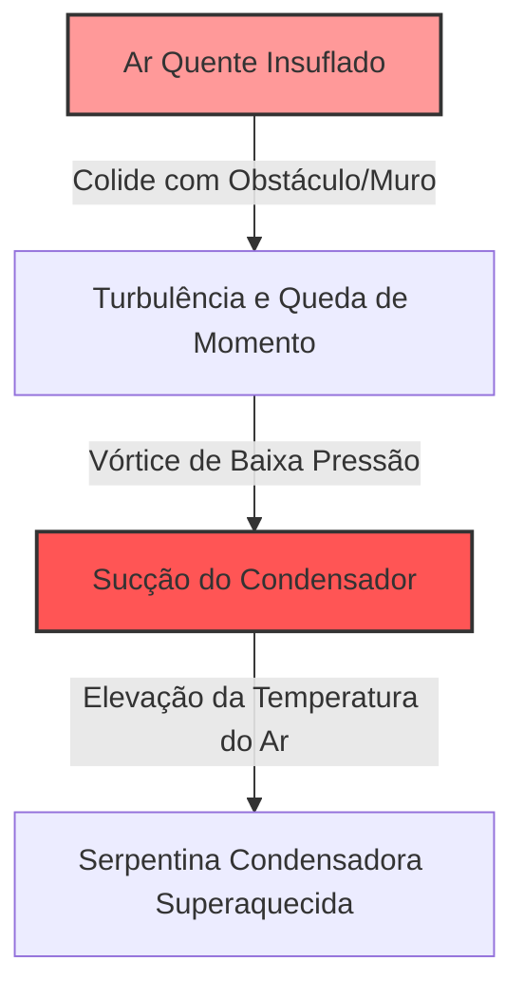

# Módulo 02-02: Posicionamento Estratégico de Equipamentos — Fluxo de Ar, Acoplamento Acústico e Acessibilidade de Serviço (SOP)

## Introdução: A Linha entre Instalação e Engenharia Térmica

A demarcação entre um sistema de climatização meramente funcional e uma obra-prima de engenharia térmica reside na precisão e rigor de sua instalação física. O posicionamento estratégico de evaporadoras, condensadoras, chillers e caixas de seleção VRF não é uma questão de conveniência estética ou mera conformidade burocrática com códigos locais; é a fundação que determina a eficiência termodinâmica, a invisibilidade acústica e a facilidade de manutenção de todo o sistema ao longo de seu ciclo de vida (que pode ultrapassar duas décadas).

Em sistemas VRF/VRV, chillers de alta capacidade e splits comerciais, a tolerância para erros de posicionamento aproxima-se de zero. O posicionamento de elite exige o domínio de três disciplinas técnicas integradas: a física do fluxo de ar e rejeição térmica, a mecânica do desacoplamento estrutural/acústico e a mentalidade de facilidade de manutenção (Serviceability Mindset), projetando o acesso para o técnico que fará a manutenção preventiva do equipamento daqui a dez anos.

---

## Parte I: A Física do Fluxo de Ar e Rejeição Térmica

O princípio básico de qualquer ciclo de refrigeração por compressão de vapor é transferir calor de um local onde ele é indesejável para outro onde não cause incômodo. A eficiência deste ciclo baseia-se diretamente na vazão livre de ar sobre as serpentinas de troca térmica. Violar as distâncias mínimas de projeto e os princípios aerodinâmicos restringe a vazão, altera a dinâmica do diagrama Pressão-Entalpia (P-H) e causa a falha mecânica prematura do compressor. Estudos do NIST (National Institute of Standards and Technology) apontam que erros de espaçamento externo e restrição de fluxo elevam o consumo elétrico de climatização em até 30%.

### 1.1 Aerodinâmica Aplicada a Condensadores: Leis de Conservação

O movimento do ar através de dutos, plenuns de descarga e serpentinas externas obedece às leis da mecânica dos fluidos:

*   **Conservação da Massa (Equação da Continuidade):** A massa de ar que entra em um canal de fluxo deve ser exatamente igual à massa que sai ($V_1 \times A_1 = V_2 \times A_2$, onde $V$ representa a velocidade e $A$ representa a área). Restringir a área de captação de ar ou de descarga de uma condensadora eleva artificialmente a velocidade local do ar, aumentando a perda de carga estática e reduzindo o volume de ar (CFM) movimentado pelo ventilador.
*   **Conservação da Energia (Teorema de Bernoulli):** A energia total do fluxo é constante. A diferença de pressão total entre dois pontos equivale às perdas por atrito e perdas dinâmicas locais. Quando uma condensadora é montada excessivamente próxima a uma parede, o ventilador opera contra uma pressão estática (dynamic head) elevada, consumindo maior potência elétrica para deslocar uma massa menor de ar.
*   **Conservação do Momento Linear:** O ar tende a manter sua direção e velocidade de movimento a menos que seja forçado a alterá-las por uma força externa. Se o jato de descarga quente do ventilador colidir contra uma barreira física próxima (como um muro, platibanda ou unidade condensadora vizinha), seu momento é rompido, criando turbulência e empurrando o ar quente de volta para a zona de sucção de baixa pressão do equipamento. Essa recirculação forma um vórtice térmico de alta entalpia.

### 1.2 O Fenômeno do Curto-Circuito de Ar (Air Short-Circuiting)

O curto-circuito de ar ocorre quando o fluxo quente de ar rejeitado pelo condensador é succionado de volta pelas venezianas de entrada do próprio equipamento antes de se dispersar na atmosfera.



Em grupos de condensadoras instaladas próximas (como bancos de condensadoras VRF ou chillers modulares), a falta de distanciamento adequado destrói o microclima local. Diretrizes de fabricantes como York e Trane exigem espaçamentos mínimos de até **3 metros (10 pés)** entre chillers resfriados a ar instalados em paralelo para evitar o curto-circuito.

A capacidade de rejeição de calor de um condensador é diretamente proporcional à diferença de temperatura (TD) entre a Temperatura de Saturação de Condensação (SCT) e a temperatura de bulbo seco do ar de entrada. Se o ar de entrada for misturado com o ar de exaustão superaquecido, essa diferença de temperatura reduz-se significativamente, prejudicando a eficiência de troca.

### 1.3 Condensador: Diferenciando Delta T e TD

Técnicos experientes distinguem os parâmetros **Delta T** e **TD (Temperature Difference)**:

*   **Delta T do Evaporador:** A diferença de temperatura sensível do fluxo de ar através da serpentina interna (queda típica de 15°F a 20°F).
*   **Delta T do Condensador:** O aumento da temperatura do ar ao passar pela serpentina externa (elevação típica de 15°F a 25°F). Uma variação fora dessa faixa indica baixa vazão de ar ou anomalias térmicas.
*   **TD do Evaporador:** A diferença entre a temperatura do ar de retorno e a temperatura de saturação de sucção (SST) do fluido dentro do tubo (média de 35°F para sistemas de conforto).
*   **TD do Condensador:** A diferença entre a Temperatura de Saturação de Condensação (SCT) do refrigerante e a temperatura de bulbo seco do ar externo que entra na serpentina (média de 20°F a 30°F em sistemas de alta temperatura). Um TD anormalmente baixo indica problemas de vazão mássica de refrigerante (compressor deficiente ou carga incorreta), enquanto um Delta T incorreto aponta para restrições físicas de fluxo de ar.

### 1.4 Desvio no Diagrama Pressão-Entalpia (P-H)

O curto-circuito de ar e a restrição de fluxo alteram a dinâmica do ciclo frigorífico no diagrama P-H (onde a entalpia está no eixo horizontal e a pressão absoluta no eixo vertical):

1.  **Elevação da SCT:** Se o ar de admissão do condensador sobe de 95°F (35°C) para 115°F (46°C) devido à recirculação de calor, a pressão de descarga deve subir de forma acentuada para elevar a SCT do refrigerante, mantendo a diferença de temperatura (TD) necessária para rejeitar o calor no ar quente circundante. A linha superior de condensação no diagrama P-H é deslocada verticalmente para cima.
2.  **Redução do Efeito Refrigerante Líquido:** Com o aumento da pressão de condensação, o refrigerante líquido entra no dispositivo de expansão (TXV/EEV) em um estado de entalpia mais elevado. Isso exige que uma maior porcentagem de líquido se evapore instantaneamente (flash gas) apenas para resfriar a si mesmo até a temperatura de evaporação, restando menos líquido no evaporador para absorver a carga térmica útil do edifício.
3.  **Aumento do Calor de Compressão:** O compressor realiza maior trabalho mecânico para elevar o vapor de refrigerante da pressão de sucção até a pressão de descarga elevada. A linha inclinada de compressão à direita no diagrama P-H se alonga em direção a pressões e entalpias superiores, adicionando calor de compressão desnecessário ao condensador.
4.  **Degradação do Compressor:** O compressor consome maior corrente elétrica (amperagem), gerando superaquecimento do motor elétrico. O lubrificante sintético POE ou PVE sofre degradação térmica rápida sob altas temperaturas de descarga, causando carbonização do óleo, desgaste acelerado dos mancais de aço e queima por falha mecânica.

---

## Parte II: Desacoplamento Estrutural e Engenharia Acústica

Em hotéis de luxo, edifícios comerciais de grande porte, hospitais ou residências de alto padrão, o silêncio acústico é um requisito de projeto tão importante quanto o conforto térmico. O instalador de elite projeta a atenuação mecânica para conter a energia vibratória dos motores antes que ela se propague e se transforme em ruído audível.

### 2.1 Propagação do Ruído: Ruído Aéreo versus Estrutural

O ruído gerado por sistemas de climatização propaga-se por duas vias distintas:

*   **Ruído Aéreo (Airborne Noise):** Propaga-se diretamente através das passagens de ar ou por vazamento acústico nas paredes finas de dutos metálicos não isolados, manifestando-se como chiados ou sopros. Sua mitigação exige dutos de formato circular (que possuem alta resistência estrutural e reduzem a vibração das paredes do duto), velocidades de fluxo menores, curvas de raio longo com aletas direcionadoras e a divisão dos fluxos de ar em ramificações (uma divisão em dois ramos idênticos atenua a potência sonora de cada ramal em **3 dB**, reduzindo a percepção do ruído pela metade).
*   **Ruído Estrutural (Structure-Borne Noise):** Ocorre quando as vibrações mecânicas de compressores, ventiladores e bombas são transmitidas a estruturas sólidas (vigas metálicas, lajes de concreto, suportes de tubulação). A vibração viaja sem atenuação através do esqueleto da edificação até atingir uma superfície rígida (como paredes de drywall ou tetos de gesso), que passa a funcionar como a membrana de um alto-falante, traduzindo a energia cinética vibratória em ruído audível de baixa frequência (zumbidos ou vibrações nas placas de piso).

### 2.2 Ressonância Mecânica e Baixas Frequências

A vibração estrutural é intensificada pelo fenômeno de ressonância. Toda superfície construtiva possui uma frequência natural de oscilação. Se a frequência de perturbação gerada pelo compressor (por exemplo, um compressor de rotação fixa operando a 40 Hz) coincidir com a frequência natural da laje ou parede de suporte, a amplitude da vibração é amplificada exponencialmente.

Ruídos de baixa frequência (entre 20 Hz e 200 Hz) caracterizam-se por comprimentos de onda longos que penetram facilmente em drywall ou isolamentos de fibra de vidro comuns. Para conter esta propagação, o sistema de suporte deve isolar e desacoplar fisicamente o equipamento da laje, assegurando uma **eficiência de isolamento acústico superior a 90%** na frequência de perturbação da máquina. Isso requer a seleção de amortecedores de vibração corretos com base no peso do equipamento, rotação (RPM) de operação e deflexão estática exigida.

### 2.3 Amortecedores de Vibração: Elastômeros versus Molas de Aço

Tratar todas as bases ou coxins antivibratórios de forma genérica compromete o desempenho acústico do sistema. A especificação entre suportes elastoméricos (borracha/neoprene) e isoladores de mola de aço helicoidal obedece à física aplicada:

*   **Isoladores Elastoméricos (Borracha/Neoprene):** Utilizam a compressão do elastômero para absorver vibrações de alta frequência. A dureza do elastômero (medida na escala Shore A Durometer) é o fator crítico. Borrachas mais macias sofrem maior deformação inicial, distribuindo a energia ao longo do tempo, enquanto elastômeros muito duros transmitem o impacto mecânico diretamente à laje. Possuem limitação física de deflexão estática, operando tipicamente na faixa de **3 a 7 mm**. Devido a essa limitação e ao aumento da rigidez dinâmica (Dynamic Stiffness) quando vibrados rapidamente, suportes de borracha só são eficazes para isolar vibrações de alta frequência geradas por equipamentos leves de rotação elevada (**acima de 1.000 RPM**), como fancoletes (FCUs), pequenas bombas em linha e condensadoras splits em suportes de parede (desde que equipadas com arruelas isolantes de borracha nas conexões de fixação).
*   **Isoladores de Mola de Aço Helicoidal:** Equipamentos pesados de rotação baixa (como chillers centrífugos, grandes unidades de tratamento de ar e compressores operando **abaixo de 500 RPM**) geram vibrações de ondas longas e baixa frequência que exigem isoladores com grande capacidade de deformação física. As molas de aço helicoidal permitem deflexões estáticas de **12 mm a 50 mm** (0.5 a 2.0 polegadas) sob carga. Ao contrário do elastômero, o aço mantém uma curva de carga-deflexão linear, e sua rigidez dinâmica permanece idêntica à estática em qualquer frequência de vibração. Adicionalmente, as molas podem ser equipadas com amortecedores internos de fluido viscoso para limitar o deslocamento mecânico da máquina durante as partidas e paradas.

### 2.4 Bases de Inércia de Concreto e Sistemas Massa-Mola-Massa

Para bombas centrífugas de grande porte ou compressores instalados em lajes suspensas de coberturas, o uso de amortecedores isolados de mola pode não ser suficiente. Nestes cenários, exige-se o uso de bases de inércia de concreto.

A base de inércia é uma estrutura metálica de aço estrutural preenchida com concreto armado que atua como uma plataforma de grande peso sustentada por amortecedores de mola. A física aplicada baseia-se na adição de massa inercial ao sistema e no rebaixamento do centro de gravidade do conjunto. O peso da base de concreto deve ser calculado para atingir aproximadamente **2,5 vezes o peso de operação** do equipamento montado.

Esta plataforma flutuante absorve as forças rotacionais das partidas e paradas, reduz os movimentos de oscilação e preserva o alinhamento de acoplamento dos eixos e tubulações, atenuando a transmissão de energia mecânica para a estrutura leve do edifício. A espessura da base de concreto deve respeitar proporções de projeto: uma bomba de 100 HP, por exemplo, exige uma base com espessura mínima de **30 cm (12 polegadas)**.

Para conter a ressonância em cavidades aéreas fechadas (como atrás de evaporadoras splits montadas em paredes leves), aplica-se a estruturação acústica massa-mola-massa. Ao intercalar barreiras de alta densidade (massa), uma câmara de ar de 50 mm (mola) e espumas acústicas de célula aberta ou mantas de lã de rocha (amortecedor), obtêm-se atenuações sonoras superiores a **30 dB**, eliminando a propagação de ruídos na edificação.

---

## Parte III: Mentalidade de Facilidade de Manutenção (Serviceability Mindset)

O instalador de elite posiciona os equipamentos assegurando que o sistema possa ser facilmente diagnosticado, ajustado ou reformado por qualquer técnico ao longo de todo o ciclo de vida do ativo. O posicionamento de máquinas sem o planejamento de acesso inviabiliza as manutenções preventivas rotineiras, gerando abandono técnico e falhas sistêmicas em cascata.

### 3.1 Distâncias Mínimas Elétricas (NEC e IMC)

A segurança em painéis elétricos e chaves disjuntoras de controle é regulamentada pela norma NEC (National Electrical Code - Seção 110.26) e IMC (International Mechanical Code - Seção 306.1). Para disjuntores de controle e painéis de força operando em tensões de até 600V, deve ser garantida uma área tridimensional de trabalho livre de obstruções:

*   **Profundidade:** Espaço livre frontal mínimo de **90 cm (36 polegadas)**.
*   **Largura:** A largura física do próprio painel ou no mínimo **76 cm (30 polegadas)** (o que for maior).
*   **Altura:** Pé-direito livre estendendo-se do piso ou plataforma até **2 metros (6,5 pés)** ou a altura do topo do painel.

O IMC 306.1 exige uma área de serviço plana mínima de 30" x 30" (76 cm x 76 cm) defronte ao painel de controle e conexões de serviço do aparelho. Os painéis de acesso elétrico devem permitir aberturas de porta de no mínimo 90 graus. 

Em instalações de grande porte ou críticas (UFC - Unified Facilities Criteria), as portas de painéis e dobradiças de caixas elétricas de condensadores devem abrir a **180 graus**. Isso reduz riscos de aprisionamento do técnico em casos de arco elétrico e facilita a remoção física de contatores ou inversores de frequência pesados sem barreiras. Nenhuma tubulação de água, vegetação, dutos ou pilares estruturais podem invadir esta área tridimensional de segurança elétrica.

### 3.2 Topografia de Chillers: Área de Extração de Tubos (Tube Pull Clearance)

No planejamento físico da sala de máquinas de chillers de grande porte (centrífugos ou parafusos refrigerados a água), a manutenção futura dos trocadores de calor do tipo casco e tubos (shell-and-tube) exige atenção redobrada.

Os tubos internos de cobre das serpentinas do evaporador e condensador acumulam incrustações minerais e biofilme ao longo do tempo, necessitando de limpeza mecânica (escovação periódica) ou substituição completa por corrosão galvânica. O posicionamento do chiller deve prever uma área linear livre de obstruções na extremidade do cabeçote marítimo (marine waterbox) idêntica ao comprimento total do trocador de calor da máquina (geralmente entre **4,3 e 5 metros** de espaço livre linear projetado para fora da parede do chiller).

```
[ CHILLER - Casco e Tubos ] ====> [ Espaço Livre de 4.3m a 5m para Tube Pull ] ====> [Parede]
```

A falta desse planejamento exige a desmontagem integral do chiller ou a demolição de paredes estruturais do prédio para a substituição de tubos da serpentina.

Além disso, sensores eletromagnéticos ou ultrassônicos de fluxo de água gelada exigem vazões laminares estáveis para leituras precisas de controle. A hidrônica de precisão determina que esses sensores de fluxo sejam instalados em trechos retos de tubulação respeitando a regra:

$$\text{Trecho Reto} \ge 10D \text{ (a montante)} \quad \text{e} \quad \ge 5D \text{ (a jusante)}$$

Onde $D$ representa o diâmetro nominal da tubulação de água. Se o chiller for instalado em área apertada e as tubulações hidrônicas sofrerem curvas bruscas adjacentes aos sensores, a turbulência gerada causará flutuações e erros de leitura nos medidores. O microprocessador do chiller indicará falha por perda de vazão de água (flow loss trip), desarmando o equipamento de forma constante.

### 3.3 VRF / VRV: Acessibilidade de Caixas Selectoras e Tubulação

Sistemas VRF e VRV distribuem centenas de metros de tubulações de refrigerante de alta pressão e caixas Branch Selector (BS) em forros e áreas internas da edificação.

As caixas Branch Selector (BS) realizam o chaveamento de fluxo de refrigerante para prover resfriamento e aquecimento simultâneo em diferentes zonas do edifício. Elas contêm placas eletrônicas de controle, solenoides e válvulas de expansão eletrônicas que operam em temperaturas de linha de até 200°F (93°C). Estas caixas devem ser isoladas termicamente com borracha elastomérica EPDM de alto padrão para evitar condensação e gotejamentos no forro de gesso.

O posicionamento dessas caixas selectoras em forros falsos deve ser acompanhado pela instalação de portinholas ou alçapões de acesso com dimensões generosas. O espaço livre sob a tampa da caixa BS deve permitir ao técnico visualizar os componentes, utilizar chaves inglesas ou chaves de aperto de tubos simultaneamente nas conexões flangeadas, realizar soldas de brasagem com segurança elétrica e extrair fisicamente as placas eletrônicas para diagnósticos.

A distribuição de tubulações externas de VRF também deve obedecer às diretrizes rígidas dos fabricantes (como Daikin e Mitsubishi) para garantir o retorno eficiente do óleo POE ou PVE ao compressor:

*   **Comprimentos Máximos de Tubulação:** Limites máximos estritos (por exemplo, no máximo 165 metros de comprimento de linha equivalente até a unidade evaporadora mais distante).
*   **Limites de Altura (Desnível):** Desníveis máximos permitidos (por exemplo, no máximo 50 metros de desnível vertical se a condensadora estiver posicionada acima das evaporadoras internas).

Operar no limite máximo ou violar esses desníveis sem instalar acumuladores de sucção adequados causa o acúmulo de óleo lubrificante nos pontos baixos das linhas de vapor, provocando falta de óleo no compressor, quebra mecânica acelerada e perda de capacidade de modulação do compressor inverter.
