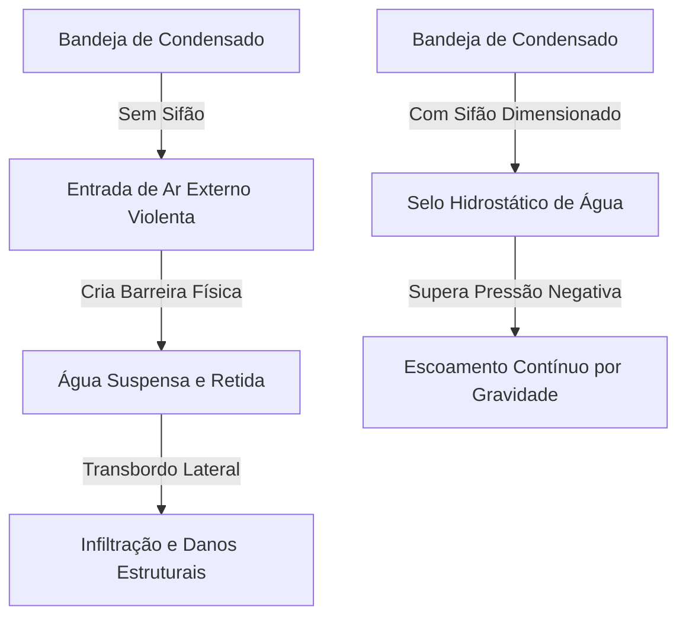

# Módulo 02-03: Drenagem de Condensado de Elite — Psicrometria, Hidrodinâmica, Airlocks e Protocolos de Proteção

## Introdução: O Cano de 3/4" que Protege Milhões de Reais

No desenvolvimento de sistemas de climatização (AVAC-R), a atenção de engenheiros e projetistas é frequentemente absorvida pelo cálculo de eficiências térmicas (COP/EER), balanceamento de vazão de ar e lógicas de fluxo de refrigerante variável. Contudo, a integridade física de uma residência de luxo ou de um centro de dados de missão crítica depende de um componente de infraestrutura aparentemente banal: uma tubulação de dreno de PVC de 3/4 de polegada.

A negligência no projeto e execução dos sistemas de drenagem de condensado é a principal causa de vazamentos internos de água, gerando prejuízos severos e retrabalhos na indústria. Segundo dados do *Insurance Information Institute*, danos por infiltração de água e congelamento representam a segunda maior causa de sinistros prediais segurados (aproximadamente 29,4% de todos os sinistros residenciais), superando incêndios e roubos. Cerca de 14.000 pessoas sofrem com sinistros de danos de água diariamente nos EUA, com custos de indenização que variam de $10.000 a mais de $14.000 por ocorrência.

Em ambientes comerciais, como salas de servidores (CPDs) ou subestações elétricas, um dreno obstruído pode inundar painéis de distribuição ou servidores de rack, resultando em paralisação operacional, perda de dados e custos de recuperação que superam facilmente os $85.000. O instalador de elite encara o sistema de drenagem não como um simples serviço de encanamento, mas como um subsistema hidráulico crítico que requer precisão geométrica, controle de pressões e redundâncias eletrônicas.

---

## Parte I: Psicrometria e a Hidrodinâmica da Drenagem

A formação de condensado é o subproduto inevitável do resfriamento latente. Quando o ar de retorno quente e úmido passa pelas serpentinas do evaporador (que operam abaixo da temperatura de ponto de orvalho do ar), o vapor de água sofre uma mudança de fase para o estado líquido. Este fluxo é recolhido na bandeja de condensado sob o bloco da serpentina.

A remoção contínua e segura deste volume de água depende do equilíbrio hidrostático entre a gravidade e as pressões aerodinâmicas internas do equipamento de climatização.

### 1.1 A Física do Sifão (P-Trap) em Pressão Negativa

O erro conceitual mais frequente na drenagem é o mau posicionamento ou ausência do sifão (P-trap) em unidades que operam sob pressão negativa (configurações *Draw-Through*).

*   **Configuração Draw-Through (Sucção):** É o padrão na maioria dos fancoils, splits e unidades rooftop. O evaporador está posicionado a montante (antes) do ventilador. O ventilador succiona o ar através da serpentina, gerando um vácuo (pressão estática negativa) no interior do gabinete onde está a bandeja de dreno.
*   **A Barreira Aerodinâmica:** Sem um sifão instalado na saída do dreno, a pressão atmosférica externa (maior) força a entrada rápida de ar através do cano aberto para dentro do gabinete de baixa pressão. Esse fluxo de ar reverso de alta velocidade atua como uma barreira aerodinâmica impenetrável contra a saída de água. A gravidade não consegue empurrar o condensador para fora; a água fica suspensa, sobe de nível e transborda pelas bordas da bandeja, inundando o gabinete e gotejando sobre placas eletrônicas e motores.



O sifão cria uma barreira de água em formato de "U" que bloqueia a passagem do ar. Para que a drenagem ocorra, o peso da coluna de água acumulada no ramo de entrada do sifão deve gerar uma pressão hidrostática que supere a pressão de sucção do ventilador.

### 1.2 Dimensionamento do Sifão e Cálculo de Pressão Estática (TESP)

A profundidade do sifão não pode ser empírica. Sifões excessivamente rasos são desarmados (a água é sugada para dentro do equipamento); sifões profundos demais acumulam sedimentos rapidamente e criam restrições desnecessárias.

O dimensionamento correto exige a medição da Pressão Estática Externa Total (TESP) com um manômetro digital conectado à câmara do evaporador. A regra de engenharia estabelece a seguinte geometria para sistemas sob pressão negativa:

$$\text{Profundidade Vertical da Mola (D)} \ge \text{Pressão Estática Negativa (em polegadas de coluna d'água)} + 1\text{ polegada de segurança}$$
$$\text{Altura da Borda de Saída (H)} \ge \text{Pressão Estática Negativa} + \frac{1}{2}\text{ polegada de segurança}$$

Abaixo é exibido o guia paramétrico para profundidades verticais do sifão baseadas na TESP:

| Pressão Estática Negativa (pol. H2O) | Altura do Ramo de Sucção (Mínimo) | Altura do Ramo de Descarga (Mínimo) |
| :---: | :---: | :---: |
| **0,50"** | 1,50" (38 mm) | 1,00" (25 mm) |
| **0,75"** | 2,00" (50 mm) | 1,50" (38 mm) |
| **1,00"** | 2,50" (63 mm) | 2,00" (50 mm) |
| **1,50"** | 3,00" (76 mm) | 2,50" (63 mm) |

### 1.3 A Patologia do Sifão Seco e Sifões Mecânicos (Waterless Air-Traps)

Sifões hidrostáticos dependem de água líquida para manter o selo. Durante a estação de aquecimento ou períodos de inatividade, a água do sifão evapora completamente. Um sifão seco acarreta sérias consequências:
*   Entrada de ar não tratado para o interior do sistema, reduzindo a eficiência e puxando poeira.
*   Sucção de odores e gases nocivos caso o dreno esteja interligado de forma indireta com sistemas pluviais ou de esgoto.
*   O fenômeno do "jato inicial" (geyser effect) no reinício da operação de resfriamento, espalhando aerossóis de água acumulada nas serpentinas.

Para solucionar essas patologias, especificações modernas determinam o uso de **Sifões Mecânicos a Seco (Waterless Air-Traps)**, como os fabricados pela *Des Champs Technologies*. Esses dispositivos operam através de uma esfera leve interna assentada sobre um anel de vedação (O-ring). 
Sob pressão negativa, a esfera é puxada contra a sede, criando uma vedação hermética mesmo sem água no sistema. Quando o condensado flui para a câmara, a pressão hidrostática flutua a esfera para longe da sede, liberando a passagem del fluido. Por não reterem água acumulada, esses dispositivos não sofrem congelamento em ambientes frios, evitam a proliferação biológica no interior da curva e atendem à norma IMC Seção M307.2.4.1.

---

## Parte II: Geometria de Tubulação, Suporte e Malpráticas de Campo

Após transpor o sifão, o escoamento do condensado opera exclusivamente por gravidade. O projeto físico da linha de dreno deve seguir parâmetros rígidos de declividade, diâmetro e fixação.

### 2.1 Dimensionamento de Diâmetro e Declividade Crítica

A norma *International Mechanical Code* (IMC Seção 307.2) determina que a tubulação de condensado deve manter diâmetro nominal interno mínimo de **3/4 de polegada** e nunca sofrer redução ao longo de seu curso descendente. Abaixo está a tabela de dimensionamento com base na capacidade térmica total do sistema:

*   **Até 20 TR (70 kW):** Diâmetro interno mínimo de 3/4" (19 mm)
*   **De 21 a 40 TR (70 a 140 kW):** Diâmetro interno mínimo de 1" (25 mm)
*   **De 41 a 90 TR (140 a 315 kW):** Diâmetro interno mínimo de 1 1/4" (32 mm)
*   **De 91 a 125 TR (315 a 440 kW):** Diâmetro interno mínimo de 1 1/2" (38 mm)
*   **De 126 a 250 TR (440 a 880 kW):** Diâmetro interno mínimo de 2" (50 mm)

A declividade mínima exigida por norma para tubos por gravidade é de **1%** (queda de 1/8" por pé linear). Contudo, a prática de engenharia de elite especifica uma declividade de **2%** (queda de 1/4" por pé linear). Este gradiente acentuado garante velocidade autolimpante ao fluxo, arrastando poeira e detritos biológicos suspensos e prevenindo a formação de depósitos de lodo.

### 2.2 Suporte Estrutural contra Flambagem (Sagging)

Tubulações de PVC são flexíveis e sofrem relaxamento térmico e deformação lenta (creep) quando expostas a temperaturas elevadas (comuns em forros e sótãos não climatizados). Se a tubulação ceder sob o peso da água acumulada, forma-se uma barriga ou depressão mecânica na linha.

Essa depressão acumula água permanentemente, comportando-se como um sifão secundário indesejado (duplo sifonamento). Para conter esse fenômeno:
*   **Suporte Horizontal (PVC):** Deve ser instalado no máximo a cada **4 pés (1,2 metros)**.
*   **Suporte Vertical (PVC):** Deve ser travado a cada **10 pés (3 metros)**.
*   **Suporte em Tubos de Cobre:** Espaçamento horizontal recomendado de 5 a 6 pés utilizando abraçadeiras isoladas.
*   **Acessórios de Fixação:** Devem ser utilizados berços metálicos, abraçadeiras de aço ou tirantes rígidos reguláveis. O uso de fitas perfuradas flexíveis de plástico, fios elétricos ou abraçadeiras plásticas (zip-ties) é proibido.

### 2.3 A Malprática Gravíssima do Agrupamento de Tubulações (Line-Set Bundling)

Um dos erros de campo mais destrutivos é agrupar a tubulação de dreno de PVC colada diretamente contra a linha de sucção de cobre isolada do refrigerante. 

O tubo de sucção opera em temperaturas frias. O contato direto hiper-resfria a parede do tubo de PVC por ponte térmica. Quando o ar úmido do sótão ou forro atinge a parede externa resfriada do PVC, ocorre uma condensação intensa na parte externa do tubo de dreno. A água passa a gotejar de forma generalizada sobre o gesso ou forro de drywall, causando danos estruturais severos que são falsamente atribuídos a vazamentos nas conexões. Além disso, o resfriamento interno acelerado do condensado estimula a aglutinação e proliferação de biofilmes bacterianos gelatinosos. A linha de dreno deve ser roteada e isolada de forma independente.

---

## Parte III: Física de Airlocks, Respiros e Duplo Sifonamento

O movimento hidráulico em uma linha de dreno fechada exige a movimentação e escape do ar interno. Quando o fluxo de ar é impedido, ocorre a paralisia hidráulica do sistema.

### 3.1 O Efeito Pistão e a Instalação do Respiro (Vent)

O escoamento de água em descidas verticais longas comporta-se como um pistão mecânico móvel: ele comprime o ar à sua frente e gera vácuo atrás de si. Este vácuo pode sugar a água do sifão primário, desarmando o selo hidrostático e iniciando a sucção de ar externo.

Para quebrar o vácuo, instala-se um **respiro (vent)** vertical aberto. A localização deste respiro é crucial:
*   **Sempre a jusante (depois) do sifão:** Um respiro instalado antes do sifão (no trecho entre a bandeja de condensado e o P-trap) destrói completamente o diferencial de pressão do sifão. O ar atmosférico entrará pelo respiro aberto diretamente para o gabinete sob vácuo, impedindo a saída de água da mesma forma que um dreno não sifonado.
*   **Geometria do Respiro:** O topo do tubo de respiro deve permanecer aberto e estender-se verticalmente acima da borda máxima de transbordo da bandeja interna de condensado da máquina. Se houver uma obstrução total na saída de dreno, a água subirá pelo dreno e pelo respiro; se o respiro estiver cortado abaixo do nível da bandeja, a água jorrará pelo respiro inundando a laje do sótão.

```
[ Evaporador ] ── (Bandeja) ──┐
                              │
                        ┌─────┴─────┐  <--- SIFÃO (P-Trap)
                        │  (Água)   │
                        └─────┬─────┘
                              │   ┌───[ Vent Aberto ] (Excede a altura da bandeja)
                              ├───┘
                              │
                              ▼ (Para o Ponto de Descarte)
```

### 3.2 O Bloqueio por Duplo Sifonamento (Double Trapping)

O duplo sifonamento ocorre quando a tubulação de dreno apresenta dois trechos sifonados em série sem ventilação intermediária. Isso pode ocorrer pela instalação incorreta de dois sifões físicos ou acidentalmente devido à flambagem de trechos horizontais da tubulação.

Fisicamente, quando a água avança e preenche o segundo sifão, o ar contido no trecho reto entre ambos os sifões torna-se enclausurado. A água que tenta descer do evaporador encontra a resistência pneumática deste colchão de ar sob pressão. A força da gravidade que atua sobre a pequena coluna de condensado do primeiro sifão não é capaz de comprimir este ar enclausurado. A drenagem para completamente e a água transborda na unidade interna. O encanamento permanece livre de obstruções físicas de lodo, mas bloqueado pneumaticamente. A correção exige a eliminação do segundo sifão ou a instalação de um respiro aberto que atue como exaustão para o colchão de ar acumulado.

---

## Parte IV: Transporte Mecanizado e Protocolos para Bombas de Condensado

Quando as restrições físicas de layout impedem a descida natural da água por gravidade, o escoamento deve ser forçado por meio de uma bomba de condensado elétrica acionada por flutuador.

### 4.1 Desacoplamento Vibratório e Nivelamento da Bomba

As bombas de condensado utilizam micromotores elétricos de alta rotação acoplados a rotores centrífugos. A vibração de alta frequência gerada não deve ser transmitida para a edificação.
*   **Montagem Suspensa:** A bomba nunca deve ser fixada diretamente contra painéis de gesso, drywalls ou vigas de madeira leve sem isolação. Devem ser empregados suportes antivibratórios com coxins ou isoladores de suspensão de neoprene (especificações tipo *RH* ou *SRH*).
*   **Alinhamento Horizontal:** O reservatório da bomba deve ser montado perfeitamente plano em relação à horizontal. Inclinações na instalação causam o desalinhamento do eixo do flutuador magnético interno, travando o flutuador contra as paredes plásticas do reservatório. Esse travamento impede a partida da bomba (causando inundação) ou impede o desligamento (queimando o motor por operação contínua a seco).

### 4.2 Lógica Hidráulica e Prevenção de Short-Cycling

A saída da bomba é conectada a uma tubulação flexível de menor diâmetro (geralmente mangueira de vinil de 3/8"). Na desativação da bomba, toda a coluna vertical de água remanescente na mangueira de descarga tende a retornar por gravidade ao reservatório.

Esse retorno de água eleva novamente o flutuador e reinicia o motor da bomba de forma cíclica (short-cycling rápido). Em instalações sem controle, a bomba liga e desliga constantemente a cada 30 segundos, queimando o motor em poucos meses por fadiga térmica. O uso de uma **válvula de retenção (check valve)** robusta instalada diretamente na saída de descarga da bomba é obrigatório para bloquear o retorno da coluna de água.

### 4.3 O Intertravamento Elétrico de Segurança (Safety Interlock)

O maior erro de instalação em bombas de condensado é conectá-las à tomada e ignorar os cabos do contato auxiliar de segurança (High-limit float switch). As bombas de elite contam com um segundo microinterruptor interno acionado por um nível de segurança de água elevado.

Este contato NF (Normalmente Fechado) deve ser cabeado em série com a linha de controle de 24V (geralmente o fio `R` ou o sinal de chamada de resfriamento `Y` do termostato):

```
[ Transformador 24V ] ─── (R) ─── [ Contato Auxiliar da Bomba (NF) ] ─── [ Termostato ]
```

Caso a bomba sofra falha por motor queimado, perda de energia ou mangueira de descarga obstruída, o nível de água subirá além do limite de operação da bomba, abrindo o contato auxiliar de segurança. O circuito de controle de 24V é interrompido instantaneamente, desligando a contactora do compressor externo. Sem a operação mecânica do ciclo frigorífico, a serpentina evapora à temperatura ambiente e cessa imediatamente a condensação de água, impedindo o transbordo na edificação.

---

## Parte V: Normas Globais, Requisitos de Descarte e Manutenção Biológica

A destinação e tratamento do condensado coletado sofrem restrições severas por parte das autoridades reguladoras para a proteção da saúde pública e conservação ambiental.

### 5.1 Proibição de Ligação Direta e Requisitos de "Air Gap"

Sob nenhuma circunstância a tubulação de condensado pode ser conectada de forma hermética ou direta (sem quebra de vácuo) à rede de esgoto sanitário primário ou tubulações de ventilação de esgoto.

Se uma conexão direta for executada, a evaporação natural da água do sifão durante períodos de desligamento do AVAC quebrará o selo hidráulico. A pressão negativa do evaporador passará a succionar de forma contínua o gás metano inflamável da rede pública de esgoto, além de microrganismos patogênicos aerosolizados, espalhando toxinas biológicas para a rede de dutos e ambientes habitados.

O descarte deve ocorrer por meio de um **receptor indireto de resíduos**, garantindo um **Air Gap** (folga física vertical livre de ar) de no mínimo duas vezes o diâmetro da tubulação de saída acima da borda de transbordo do ralo ou pia receptora.

### 5.2 ABNT NBR 16401-3 (Normativa Brasileira)

No cenário nacional, o controle de condensado em centrais e equipamentos unitários é regulamentado pela norma **ABNT NBR 16401-3 (Instalações de ar condicionado - Sistemas centrais e unitários - Parte 3: Qualidade do ar interior)**.

As diretrizes do padrão nacional estabelecem:
*   É proibido o descarte livre de condensado sobre lajes, pisos de salas técnicas ou tetos decorativos. A drenagem deve ser direcionada por dutos contínuos até pontos de recolhimento adequados.
*   Bandejas de condensado devem possuir declividade contínua em direção à conexão do dreno para evitar zonas de acúmulo de água estagnada.
*   Deve ser assegurado um espaço periférico livre mínimo de **0,7 metros** ao redor dos climatizadores para permitir acesso irrestrito para inspeção visual e higienização das bandejas de dreno.

### 5.3 O Combate Biológico à Bactéria Zoogloea

O ambiente no interior de uma bandeja e tubulação de condensado — caracterizado por escuridão, umidade persistente e suprimento contínuo de nutrientes orgânicos (poeira fina e células de pele humana que escapam dos filtros comuns) — constitui um ecossistema ideal para a colonização bacteriana.

O principal agente causador de entupimentos em drenos de AVAC é a bactéria do gênero **Zoogloea**. Esta bactéria sintetiza uma matriz extracelular espessa à base de polissacarídeos gelatinosos, vulgarmente conhecida na prática de campo como "slime branco" ou "baba de elefante". Este gel biológico recobre as paredes internas dos tubos e funciona como uma rede de captura, retendo poeira e carepas de ferrugem até formar um tampão biológico impenetrável.

#### Protocolos de Erradicação e Prevenção:
1.  **Limpeza Hidrocinética:** A desobstrução por sopro repentino com nitrogênio sob alta pressão deve ser evitada em tubulações ocultas de PVC, pois o pico de pressão pode romper juntas internas não soldadas ou desencaixar conexões no interior da parede. Recomenda-se a lavagem hidrodinâmica com água pressurizada para cisalhar o biofilme aderido à parede do tubo.
2.  **Mitigação Química:** O despejo descontrolado de cloro concentrado ou ácidos industriais é desencorajado, pois esses compostos atacam os adesivos de PVC, corroem as aletas de alumínio da serpentina adjacente por evaporação de vapores ácidos e poluem solos ou mananciais de drenagem.
3.  **Ação Oligodinâmica Passiva:** Uma estratégia clássica e de alta eficácia consiste na instalação de pastilhas de cobre metálico puro ou fitas de cobre na base da bandeja de condensado. Em contato contínuo com a água ácida do condensado, o cobre libera íons metálicos solúveis ($Cu^{2+}$) que atuam como biocidas naturais. Estes íons interrompem a síntese celular das colônias de *Zoogloea*, impedindo a formação do biofilme inicial de forma ecológica e sem agressão química aos componentes mecânicos da máquina.

---

## Verificação e Comissionamento da Drenagem

Ao finalizar a instalação física da linha de dreno, o comissionamento técnico deve registrar os seguintes ensaios de campo:

*   **Teste de Estanqueidade:** Isolar as extremidades e submeter a tubulação a uma leve carga hidrostática para detectar vazamentos nas conexões coladas antes do fechamento de drywall.
*   **Ensaio de Vazão Mássica:** Adicionar rapidamente **2 a 5 litros de água** diretamente na bandeja interna da evaporadora. A vazão deve ocorrer de forma imediata e laminar, sem retenção temporária na câmara, confirmando o perfeito dimensionamento do P-trap e a ausência de arlocks ou dupla sifonagem.
*   **Teste de Intertravamento:** Provocar o transbordo intencional na boia da bomba ou no switch de segurança para comprovar que o compressor da condensadora externa é imediatamente desenergizado em 24V.
