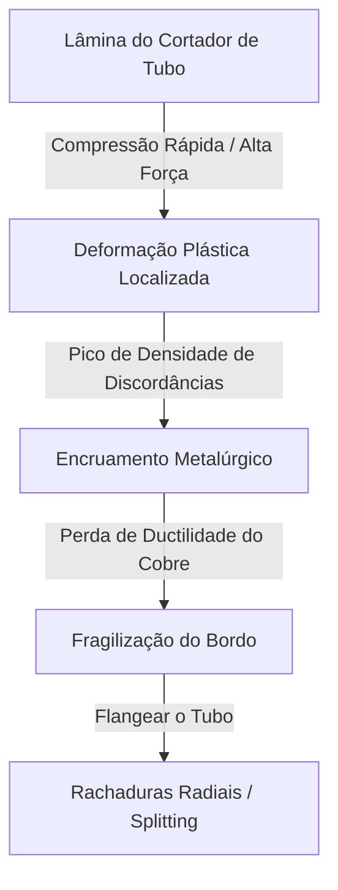

# Módulo 03-01: Como Rebarbas de Cobre Matam Compressores — Metalurgia do Corte, Tribologia de Flanges e Dinâmica de Retorno de Óleo

## Introdução: O Sistema Vascular Térmico do AVAC-R

Na engenharia de refrigeração e climatização (AVAC-R) de alta performance, a tubulação de cobre não deve ser concebida como mera tubulação estrutural passiva. O instalador de elite enxerga a tubulação de cobre como o **sistema vascular** de um organismo termodinâmico complexo e sob extrema pressão.

Nesta analogia fisiológica, o compressor é o coração pulsante, o fluido refrigerante é o sangue que carrega energia térmica e o óleo sintético lubrificante — como o Polioléster (POE) ou Polivinil Éter (PVE) — é o plasma vital que garante a ausência de atrito mecânico.

A transição de fluidos refrigerantes clássicos (como R-22) para sistemas HFC de alta pressão (R-410A) e fluidos levemente inflamáveis A2L (R-32, R-454B) eliminou qualquer tolerância para contaminação interna. As pressões de descarga rotineiramente excedem **400 a 500 PSI** sob plena carga. Os óleos lubrificantes sintéticos atuais são extremamente higroscópicos e quimicamente reativos na presença de contaminantes. Sob esta perspectiva, uma rebarba interna negligenciada ou uma lasca de cobre solta atua exatamente como um coágulo no sistema circulatório. A rebarba impede o arraste estável de óleo, restringe o fluxo mássico e gera micropartículas abrasivas que destroem a isolação mecânica do compressor, culminando em sua falha mecânica ou elétrica prematura.

---

## Parte I: A Metalurgia do Tubo de Cobre e a Física do Corte

A tubulação padrão em AVAC-R é fabricada em **Cobre Desoxidado com Fósforo (Cu-DHP)**. Esta liga possui excepcional condutividade térmica, maleabilidade mecânica e estabilidade química. Ela é comercializada em tempera dura (retos rígidos) ou tempera recozida (rolos maleáveis).

### 1.1 Cristalografia de Deformação e o Fenômeno de Encruamento

No nível atômico, o cobre possui uma estrutura cristalina cúbica de faces centradas (CFC). A flexibilidade e maleabilidade do tubo dependem do deslizamento suave de planos atômicos sobre os outros.

Quando aplicamos pressão mecânica sobre o tubo — como a compressão gerada pela lâmina circular de aço rápido de um cortador de tubos — induzimos uma deformação plástica localizada. Essa deformação faz a **densidade de discordâncias (defeitos na rede cristalina)** disparar de $10^7$ para até $10^{11}$ ou $10^{12} \text{ cm/cm}^3$ no ponto de compressão.

Esse acúmulo extremo de imperfeições na rede atômica trava o movimento das discordâncias nas fronteiras dos grãos cristalinos, endurecendo localmente o metal e removendo sua ductilidade. Este fenômeno metalúrgico é chamado de **encruamento** (ou *work hardening*).



Se o técnico apertar o parafuso do cortador de tubos de forma rápida e violenta para agilizar o trabalho, a força esmagadora provoca um encruamento severo na extremidade. Mais tarde, quando esse bordo for expandido pelo cone de flangeamento, a rede cristalina fragilizada e sem ductilidade não conseguirá se esticar elasticamente. A tensão excessiva aplicada causará rasgos ou fissuras radiais microscópicas (fenômeno chamado de **splitting**), inviabilizando a estanqueidade da junta.

*   **O Protocolo de Elite:** O corte deve ser executado com paciência: múltiplas voltas e apenas microajustes graduais no parafuso de avanço do cortador de tubos após cada volta completa, garantindo cisalhamento progressivo sem endurecimento do metal por compressão abrupta.

### 1.2 Proibição Absoluta do Uso de Serras Mecânicas

A utilização de serras sabre, serras de arco manual ou serras de fita para cortar tubulações de refrigeração é terminantemente proibida em instalações profissionais. 

As serras operam por atrito abrasivo e arrancamento de metal. A análise microscópica revela que esse corte injeta milhares de cavacos metálicos de tamanhos variados e limalhas no interior do tubo. Essas partículas atuarão como corpos estranhos abrasivos flutuando no ciclo frigorífico, destruindo superfícies polidas, obstruindo válvulas de expansão e desgastando os mancais do compressor. O corte deve ser feito exclusivamente por cortadores de tubo de disco.

---

## Parte II: A Patologia da Rebarba (Burr) e Dinâmica do Fluxo de Óleo

O processo de corte por disco de compressão desloca metal para a parte interna da parede, criando um lábio ou ressalto afiado: a **rebarba**. A permanência desse lábio na entrada do tubo causa sérias anomalias dinâmicas no fluxo.

### 2.1 Separação de Camada Limite e Perda de Carga

A rebarba interna funciona hidrodinamicamente como uma placa de orifício em miniatura, estrangulando o diâmetro útil interno do tubo. Ao passar por esta restrição, as linhas de fluxo laminar sofrem uma **separação de camada limite**.

Essa separação cria uma zona de forte turbulência, refluxos e remoinhos de alta dissipação energética logo após a rebarba. Na linha de sucção do compressor, onde o fluido está no estado de vapor, essa perda de velocidade de arraste e turbulência acarreta consequências graves.

### 2.2 Velocidade Crítica de Arraste e Retorno de Óleo (Oil Logging)

O fluido refrigerante na fase de vapor não solubiliza o óleo POE/PVE lubrificante. A condução do óleo de volta para o cárter do compressor depende unicamente da energia cinética do vapor correndo em alta velocidade pelas paredes internas, servindo como uma esteira transportadora para as gotículas de óleo.

A norma técnica da ASHRAE estabelece velocidades mínimas estritas para o arraste de óleo:
*   **Linhas Horizontais:** Mínimo de 700 a 800 pés por minuto (FPM).
*   **Subidas Verticais (Risers):** Mínimo de 1.000 a 1.500 FPM para vencer a gravidade.

```
LADO UPSTREAM (Laminar) ──► [ REBARBA / RESTRIÇÃO ] ──► LADO DOWNSTREAM (Turbulência/Redemoinho)
Velocidade: 800 FPM                                    Velocidade Local: < 500 FPM (Óleo acumula)
```

A turbulência gerada pela rebarba reduz a velocidade local abaixo do patamar mínimo de 700 FPM. Sem energia de arraste, o óleo decanta e passa a acumular-se nos trechos downstream das rebarbas. Em redes extensas (como sistemas VRF), o acúmulo de óleo nas linhas (conhecido como **oil logging**) esvazia o reservatório do compressor.

Um compressor scroll comercial de 5 HP trabalhando sem retorno de óleo devido a obstruções fluidodinâmicas bombeia toda sua carga de cárter em menos de 50 minutos. Sem óleo de retorno, as espirais e rolamentos operam em contato metal-metal seco, atingindo superaquecimento por fricção e travamento físico em poucas horas de operação. O escareamento correto do tubo é vital para garantir o perfil estável de escoamento e o retorno de óleo.

---

## Parte III: Mecanismos Químicos e Elétricos de Falha por Contaminação

Quando escareamos ou cortamos a tubulação sem os cuidados adequados de aspiração e inclinação, limalhas e poeira de cobre penetram nas linhas e circulam com o fluido. A migração dessas partículas resulta em três mecanismos distintos de quebra do compressor:

### 3.1 Mecanismo 1: Curto-Circuito Elétrico nas Espiras do Estator

Em compressores herméticos e semi-hermétricos, o vapor frio de sucção corre diretamente sobre os enrolamentos do motor elétrico para refrigeração do estator antes de ser comprimido. As micropartículas de cobre flutuantes colidem contra os fios esmaltados de cobre do motor.

Sob a vibração eletromecânica constante da máquina nas partidas e paradas, essas lascas duras agem como pequenas lâminas, cortando lentamente o verniz esmalte isolante de poliimida que recobre as bobinas. A remoção da isolação expõe o cobre nu da fiação, e a limalha condutora fecha o curto-circuito entre espiras vizinhas ou para a carcaça aterrada. Isso causa a destruição térmica instantânea do estator elétrico.

### 3.2 Mecanismo 2: Destruição Dinâmica da Placa de Válvulas

Compressores alternativos e rotativos possuem palhetas finas de aço mola (reed valves) que controlam a admissão e descarga do refrigerante comprimido. Essas válvulas abrem e fecham dezenas de vezes por segundo.

Se uma lasca dura de cobre for capturada entre a palheta de aço e a sede da válvula no fechamento, ela causará deformações, amassamentos ou rachaduras microscópicas por concentração de tensões na palheta metálica flexível, que se rompe por fadiga mecânica. Com a válvula quebrada ou danificada, ocorre o refluxo contínuo de gás de descarga de alta pressão de volta para a sucção, com queda de capacidade volumétrica e superaquecimento crítico do compressor.

### 3.3 Mecanismo 3: Cobreado Químico (Copper Plating)

Esse fenômeno é de natureza eletroquímica e ocorre em sistemas onde há contaminação por umidade e ar combinados ao lubrificante POE altamente higroscópico.

A umidade promove a hidrólise do óleo POE, gerando ácidos orgânicos corrosivos. Esses ácidos reagem com as limalhas finas de cobre soltas na linha, dissolvendo-as sob forma de compostos e sais de cobre em suspensão no lubrificante. Quando essa mistura ácida atinge pontos de alta temperatura e atrito intenso dentro do compressor (como os mancais de aço e eixos de rotação), ocorre uma reação eletroquímica de oxirredução.

O cobre em solução precipita e deposita-se ("plaqueia") sob a forma de uma camada sólida de cobre puro metálico nas superfícies de aço polido dos mancais de suporte. Essa deposição gradual reduz a folga mecânica projetada entre as partes rotativas até atingir zero, eliminando o filme lubrificante protetor e provocando o travamento completo do compressor por sobrecarga de torque.

---

## Parte IV: O Protocolo Cirúrgico de Escareamento (Reaming/Deburring)

Para eliminar a rebarba sem introduzir limalhas metálicas na tubulação, o instalador deve aplicar de forma obrigatória o seguinte procedimento mecânico:

1.  **Orientação Gravitacional Descendente:** A boca da tubulação de cobre a ser reamada deve permanecer apontada estritamente para o chão (ângulo de 90° para baixo) durante todo o processo. Com isso, os cavacos metálicos de cobre cortados caem livremente pela força da gravidade no chão, nunca adentrando o duto.
2.  **Escareamento Controlado:** Deve ser utilizada uma ferramenta de escareamento do tipo caneta de lâmina rotativa de aço rápido. Deve-se evitar o escareamento excessivo (over-reaming), que reduz a espessura da parede do tubo e compromete a resistência mecânica do flange a ser gerado a seguir.
3.  **Tapa e Purga Dinâmica:** Após o término, deve-se golpear levemente o tubo com um martelo de borracha ou cabo de ferramenta para desprender micropartículas estáticas. Se o tubo estiver preso em uma parede sem possibilidade de inclinação descendente, é obrigatório pressurizar a outra ponta com um fluxo constante de nitrogênio seco (purga) para soprar os cavacos para fora do corte durante a reamação. Se a purga não puder ser aplicada e o tubo estiver horizontal/ascendente, é mais seguro deixar a rebarba intacta do que reamar e contaminar o sistema com limalhas internas.

---

## Parte V: Arquitetura de Tubulações e Curvadores Mecânicos

A estruturação geométrica do circuito frigorífico exige mudanças de direção. O instalador comum costuma cortar o tubo e brasagem com conexões em 90° (cotovelos de raio curto). O instalador de elite prioriza o uso de **curvadores mecânicos de alavanca ou catraca** na própria tubulação contínua, reduzindo ao máximo a brasagem de conexões curvas.

### 5.1 Perdas Hidrodinâmicas e Vórtices de Dean

Quando o fluido de alta velocidade colide contra uma parede abrupta de cotovelo de 90° curto, as linhas de fluxo aceleram violentamente no raio interno e desaceleram bruscamente no raio externo. A força centrífuga gera uma movimentação helicoidal secundária e reversa: as **células ou vórtices de Dean**.

Esses redemoinhos dissipam severamente a energia cinética do fluido, gerando perdas de carga substanciais que degradam a pressão de sucção, reduzindo a densidade do gás que adentra o compressor e forçando o motor elétrico a consumir mais potência mecânica (Watts/BTU).

### 5.2 Tabela de Equivalência de Perda de Carga por Método de Curvatura

Abaixo está o comparativo paramétrico do comprimento de tubo reto (em pés) que causa a mesma perda de pressão gerada por diferentes métodos de curva:

| Diâmetro Nominal Externo (pol) | Cotovelo 90° Raio Curto (Brazado) | Cotovelo 90° Raio Longo (Brazado) | Curva com Curvador Mecânico (Sweeping) |
| :---: | :---: | :---: | :---: |
| **3/8"** | 1,40 ft | 0,90 ft | **0,72 ft** |
| **1/2"** | 1,60 ft | 1,00 ft | **0,80 ft** |
| **5/8"** | 2,00 ft | 1,40 ft | **1,12 ft** |
| **7/8"** | 2,60 ft | 1,70 ft | **1,36 ft** |
| **1-1/8"** | 3,30 ft | 2,30 ft | **1,84 ft** |

*   **Vantagem Metalúrgica e de Confiabilidade:** O curvador dispensa aquecimento por brasagem com maçarico de oxiacetileno (acima de 1.200°F). O aquecimento térmico amolece e remove a têmpera do cobre adjacentemente à junta e propicia a formação de **óxido cúprico interno (fuligem preta)** caso a linha não seja purgada com fluxo de nitrogênio estável. Adicionalmente, cada solda evitada representa a remoção de dois pontos estatísticos de potenciais vazamentos de refrigerante ao longo do ciclo de vida da instalação.

---

## Parte VI: Tribologia e Mecânica dos Flanges de Alta Performance

A conexão final de evaporadoras de menor porte, caixas selectoras VRF e condensadores unitários depende do aperto mecânico estanque de junções flangeadas. Com pressões de R-410A e R-32 operando próximas de **400-500 PSI**, qualquer microvazamento de gás A2L (levemente inflamável) constitui um risco severo de segurança.

### 6.1 Tribologia: Flangeamento Excêntrico vs. Concêntrico

*   **Flangeamento Concêntrico (Deslizamento Manual Padrão):** O cone metálico central do flangeador desce e gira de forma concêntrica sobre a boca do cobre. Ocorre atrito severo por deslizamento sob altíssima pressão. No nível microscópico (tribologia), as imperfeições (asperezas) dos metais engatam, removendo a película de óxido natural e provocando solda a frio de micropartículas. O resultado é a abrasão generalizada e ranhuras profundas na face de cobre, impossibilitando a vedação hermética contra o latão do terminal da válvula.
*   **Flangeamento Excêntrico Orbital (Padrão de Elite):** O cone desce fora de centro e executa um movimento orbital semelhante a uma engrenagem planetária. O atrito de deslizamento é substituído por um **atrito de rolamento puro**. O cone de aço temperado "amassa" e conforma gradualmente a parede do cobre contra a matriz metálica de forma suave. Isso burne e pole a parede de contato, garantindo acabamento de espelho de alta densidade e espessura uniforme, livre de fissuras de conformação.

### 6.2 O Mecanismo de Embreagem (Clutch) e a Prevenção de Extrusão Plástica

Flangeadores profissionais de elite possuem embreagem interna de limitação de torque de avanço. Quando a face de cobre atinge a conformação total na parede da matriz, a embreagem é acionada, rodando em falso.

Sem a embreagem, o técnico inevitavelmente aperta em excesso o parafuso de avanço do flangeador. O excesso de pressão gera **extrusão plástica do cobre**, forçando o metal a fluir para fora da zona de aperto e reduzindo drasticamente a espessura da parede do tubo no pescoço do flange. Esse flange afilado trinca sob as tensões mecânicas no aperto final com chave.

### 6.3 A Física da Lubrificação e o Perigo do Aperto de Rosca

É altamente recomendado aplicar uma única gota de óleo sintético POE limpo ou composto vedante à base de éster (como o *Nylog*) nas seguintes zonas:
*   Na face interna cônica do flange (auxilia no assentamento estanque das irregularidades microscópicas de contato).
*   No ombro traseiro do flange de cobre (reduz a fricção e impede que a porca rotativa agarre e torça o pescoço de cobre ao ser apertada).

*   **A Proibição Crítica:** **Nunca lubrifique as roscas da porca ou da válvula de latão.** Os torques nominais especificados por fabricantes baseiam-se em coeficientes de atrito para roscas secas. Aplicar lubrificação nas roscas reduz drasticamente a resistência por fricção do passo. O torque de aperto ideal no torquímetro será alcançado após uma rotação excessiva da porca, esmagando e deformando plasticamente a junta cônica interna de cobre, fragilizando o metal e provocando trincas estruturais permanentes.

### 6.4 Hooke's Law e Torque de Precisão contra Ciclagem Térmica

O torque aplicado na porca cônica cria uma força de compressão que deforma levemente e de maneira **elástica** o flange de cobre contra o latão da sede (Hooke's Law: $F = -k \cdot x$). O flange deformado atua como uma mola de alta rigidez sob compressão contínua.

Durante a operação do equipamento, as variações bruscas de ciclo térmico (resfriamento a 4°C e aquecimento a 60°C em bombas de calor) causam dilatação e contração dos metais. Como o cobre e o latão possuem coeficientes de dilatação térmica linear ligeiramente distintos, ocorrem deslocamentos mecânicos microscópicos de dilatação e contração diferencial.

Se o flange foi apertado com torquímetro dentro de sua zona elástica, a elasticidade residual da mola metálica garante que o cobre acompanhe as expansões e contrações diferenciais, mantendo a pressão de vedação constante. Se o flange foi apertado excessivamente (over-torquing) e sofreu deformação plástica permanente, o metal perde a capacidade de mola e não acompanha as contrações térmicas. Na primeira contração fria severa, abre-se uma folga microscópica na sede, resultando em um vazamento crônico de gás refrigerante de difícil localização.

#### Torques Recomendados para Flanges por Diâmetro:

| Diâmetro Nominal Externo (pol) | Faixa de Torque Recomendada (ft·lbs) | Faixa de Torque Recomendada (N·m) |
| :---: | :---: | :---: |
| **1/4"** | 13 a 18 ft·lbs | 18 a 25 N·m |
| **3/8"** | 25 a 30 ft·lbs | 33 a 41 N·m |
| **1/2"** | 36 a 42 ft·lbs | 50 a 58 N·m |
| **5/8"** | 46 a 55 ft·lbs | 63 a 75 N·m |
| **3/4"** | 73 a 85 ft·lbs | 99 a 115 N·m |

---

## Verificação e Controle de Qualidade do Flange

Antes de efetuar o encaixe físico das tubulações flangeadas, a junta deve atender à seguinte inspeção de campo:

*   **Inspeção Visual da Face:** Ausência de ranhuras concêntricas profundas, escamações metálicas ou irregularidades por contaminação de poeira (mirror finish).
*   **Geometria do Colar:** O flange não deve ser excessivamente curto (comprometendo a área de aperto do ombro) nem longo demais (invadindo as roscas da porca e impedindo o assentamento mecânico estanque da parede cônica).
*   **Aperto com Torquímetro de Garra:** Utilização de duas ferramentas: uma chave de boca contrária para segurar o corpo da válvula de latão (anulando o torque reverso destrutivo na carcaça do evaporador/condensador) e o torquímetro com cabeça de boca de tamanho adequado no aperto axial.
