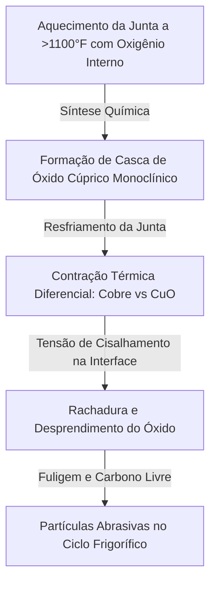

# Módulo 03-02: Brasagem de Alta Performance com Purga de Nitrogênio — Termodinâmica da Oxidação e Proteção de Atuadores VRF

## Introdução: A Sabotagem Mecânica da Brasagem sem Nitrogênio

Brazar tubulações de cobre sem circular nitrogênio é um ato latente de sabotagem mecânica. Na arquitetura complexa, integrada e eletronicamente densa de sistemas de Fluxo de Refrigerante Variável (VRF) e unidades de climatização inverter modernas, a ausência de um gás inerte de arraste para deslocar o oxigênio atmosférico durante o aquecimento gera uma reação de oxidação interna catastrófica. 

O que se inicia como uma alteração térmica localizada na parede interna do tubo de cobre evolui rapidamente para uma contaminação sistêmica insolúvel. A fuligem abrasiva desprendida circulará livremente pelo ciclo frigorífico, provocando o travamento mecânico de atuadores de precisão de micrômetros, entupimento de filtros e a degradação catalítica e química dos lubrificantes sintéticos. As tolerâncias mecânicas internas atuais exigem esterilidade microscópica; não há margem para a fuligem de oxidação de brasagem.

---

## Parte I: A Metalurgia e a Química da Contaminação Interna

Para compreender a severidade deste problema, deve-se analisar a cinética química em altas temperaturas quando o cobre Cu-DHP é exposto a um maçarico de oxiacetileno em contato com o ar ambiente (que contém 21% de oxigênio).

### 1.1 A Reação de Síntese do Óxido Cúprico (CuO)

Durante o processo de brasagem, o cobre é aquecido a temperaturas extremas, variando de **1100°F a 1500°F (590°C a 815°C)**, para que a liga de brasagem de prata (como a liga *StaySilv 15*) atinja fluidez ideal por capilaridade.

Nesse patamar de calor, o oxigênio atmosférico contido no interior da tubulação não purgada reage violentamente com a superfície do metal. O cobre possui dois estados de oxidação estáveis comuns: $+1$ (óxido cuproso, $Cu_2O$) e $+2$ (óxido cúprico, $CuO$). A temperaturas moderadas, forma-se uma fina película marrom ou avermelhada de óxido cuproso ($Cu_2O$). Contudo, sob o calor intenso da brasagem e na presença de excesso de oxigênio, ocorre a oxidação total para o óxido cúprico ($CuO$):

$$2Cu + O_2 \xrightarrow{\Delta} 2CuO$$

Esta reação de síntese ou combinação gera o óxido cúprico, uma estrutura cristalina monoclínica que assume a forma de uma **casca preta, áspera e quebradiça** sobre a região afetada pelo calor na parede interna do tubo.

### 1.2 O Mecanismo Físico de Descamação (Flaking) por Contração Diferencial

Enquanto a casca preta de óxido cúprico externa pode ser facilmente removida por limpeza física ou abrasão manual, a casca gerada na parede interna permanece inacessível. O maior perigo físico ocorre durante a fase de resfriamento da junta soldada.

O cobre metálico possui um elevado coeficiente de dilatação térmica linear. Durante o resfriamento pós-soldagem, o tubo de cobre contrai-se rapidamente de volta à sua dimensão original. A rígida e frágil malha cristalina do óxido cúprico ($CuO$), no entanto, não acompanha essa contração do substrato de cobre.



Essa contração diferencial gera severas tensões mecânicas de cisalhamento na interface de fusão entre o óxido e o metal. Sem ductilidade, a casca de óxido cúprico sofre fraturas, descama e se desprende da parede interna sob a forma de pequenos flocos ou poeira preta de carvão de óxido (conhecida em campo como "fuligem de brasagem"). Em um sistema VRF centralizado com centenas de conexões soldadas, o volume acumulado dessa fuligem atua como um abrasivo destrutivo em circulação.

---

## Parte II: A Catástrofe Tribológica: Óleos Sintéticos vs. Óxido Cúprico

O impacto da fuligem interna foi amplificado na transição de sistemas antigos de R-22 com óleos minerais para fluidos modernos de alta eficiência (R-410A, R-32) com óleos sintéticos.

### 2.1 Polaridade e Ação Solvente do POE e PVE

O óleo mineral antigo é apolar e quimicamente inerte perante o óxido cúprico. A fuligem gerada tendia a permanecer estática, depositada nos trechos horizontais inferiores das tubulações.

Em contraste, os óleos sintéticos **Polioléster (POE)** e **Polivinil Éter (PVE)** possuem uma estrutura molecular altamente polar. Esta polaridade atua como um solvente de limpeza ativo de alta afinidade química pelas superfícies metálicas.

Conforme o lubrificante POE ou PVE corre pelo circuito arrastado pelo fluxo de refrigerante, a sua polaridade limpa quimicamente as paredes internas de cobre. A película de fuligem de óxido cúprico ($CuO$) é desprendida e dispersa no lubrificante, transformando o óleo protetor em uma pasta ou lodo abrasivo circulante. Esta pasta entope rapidamente as telas dos capilares de filtragem e as sedes das microválvulas.

### 2.2 Hidrólise Catalisada por Cobre

Os lubrificantes POE são sintéticos produzidos por esterificação, um processo químico reversível por meio da **hidrólise**. O POE é altamente higroscópico, absorvendo umidade atmosférica rapidamente se exposto ao ar ambiente.

Na presença de umidade, a molécula de POE sofre hidrólise, quebrando-se de volta em álcool e ácidos orgânicos corrosivos (ácidos carboxílicos, como o ácido acético).

A poeira de óxido cúprico ($CuO$) e os íons de cobre dissolvidos agem como potentes catalisadores metálicos para esta reação química de degradação. O óxido acelera o processo de hidrólise, elevando rapidamente o TAN (Total Acid Number) do lubrificante. A acidez resultante ataca o verniz de isolamento elétrico dos enrolamentos do estator do compressor, desencadeando queima por curto-circuito.

### 2.3 Complicações da Substituição por PVE

Alguns fabricantes de VRF adotam o óleo **Polivinil Éter (PVE)** para anular a vulnerabilidade à hidrólise, visto que os éteres não se decompõem em ácidos na presença de água.

Contudo, a adoção do PVE não elimina a ameaça da fuligem de brasagem:
*   O PVE continua sendo altamente polar e remove a fuligem das paredes com igual agressividade.
*   O PVE possui elevada tensão superficial. Ele retém as partículas abrasivas de óxido cúprico e umidade de forma tenaz, impedindo a sua eliminação durante a desidratação por vácuo. Obter vácuo abaixo de 500 mícrons em um sistema contaminado por PVE e fuligem de cobre torna-se extremamente lento.
*   Visto que compressores PVE muitas vezes eliminam filtros secadores nas linhas físicas de líquido, o lodo abrasivo possui caminho desobstruído para colidir contra componentes internos móveis de altíssima precisão.

---

## Parte III: A Destruição da Válvula de Expansão Eletrônica (EEV)

O componente de maior precisão e o mais vulnerável à circulação do lodo de óxido cúprico é a **Válvula de Expansão Eletrônica (EEV)**. A EEV modula dinamicamente a injeção de refrigerante na evaporadora para controle de superaquecimento preciso em cargas parciais.

### 3.1 Anatomia e Micro-Tolerâncias da EEV

A EEV é composta por:
1.  **Bobina Estatora Externa:** Bobina elétrica que recebe pulsos de tensão contínua (12VDC) da placa eletrônica de controle para gerar um campo magnético rotatório.
2.  **Rotor Magnético Interno:** Rotor blindado hermeticamente dentro da tubulação de latão do refrigerante, que rotaciona em passos discretos (stepper motor).
3.  **Lead Screw (Eixo Roscado):** Eixo helicoidal micrométrico com rosca fina que transforma o giro do rotor em movimento linear descendente ou ascendente.
4.  **Agulha e Orifício de Vedação:** Agulha cônica de latão que obstrui ou abre um micro-orifício de controle físico.

A resolução dessas válvulas de controle varia de **480 a 2000 micro-passos** do fechamento total à abertura total. As folgas de projeto nas roscas de bronze do lead screw e o canal anular da agulha no orifício de passagem são medidos na escala de micrômetros (microns).

```
 [ Pulsos 12VDC ] ──► [ Bobina Estatora ]
                            │ (Campo Magnético)
                            ▼
                     [ Rotor Magnético ]
                            │ (Rotação por Passos)
                            ▼
                     [ Lead Screw Roscado ] <─── ACÚMULO DE ÓXIDO CÚPRICO (Travamento Mecânico)
                            │ (Movimento Linear)
                            ▼
                     [ Agulha e Orifício ]
```

### 3.2 O Mecanismo de Travamento (Dropped Domino Effect)

Quando o lodo de óleo e óxido cúprico penetra na EEV, as partículas rígidas e pontiagudas de óxido se fixam nos filetes da micro-rosca do lead screw ou alojam-se ao redor do rotor magnético.

Como a rotação do rotor ocorre em passos elétricos discretos baseados em pulsos eletromagnéticos de baixo torque, qualquer resistência por atrito impede o giro. A válvula trava mecanicamente na posição em que se encontra. Este fenômeno de travamento em cascata é conhecido como o **efeito "Dropped Domino"**: a paralisia do lead screw interrompe a modulação do ciclo frigorífico.

*   **Travamento na Posição Aberta (Flooding):** O evaporador é inundado por vazão excessiva de líquido. O superaquecimento cai a zero e ocorre o retorno de fluido refrigerante líquido ao compressor (sujeito a lavagem do cárter e quebra mecânica das espiras de compressão por calço hidráulico).
*   **Travamento na Posição Fechada (Starving):** O evaporador é privado de fluido. A pressão de sucção cai severamente, o superaquecimento do ar de retorno sobe acentuadamente e o motor do compressor sofre superaquecimento por falta de refrigeração gasosa de sucção.

---

## Parte IV: O Procedimento Operacional Padrão de Purga e Fluxo de Nitrogênio

A única metodologia capaz de mitigar a formação interna de óxido cúprico é a substituição do oxigênio atmosférico por **Nitrogênio Livre de Oxigênio (OFN)** durante a brasagem. Sendo um gás inerte, o nitrogênio impede a oxidação térmica do cobre.

O procedimento deve ser executado respeitando duas fases distintas e controladas:

### 4.1 Fase 1: Purga Volumétrica Inicial (Oxygen Displacement)

Antes de acender o maçarico, o ar acumulado no interior da tubulação deve ser deslocado por purga.
*   Conecta-se um regulador de pressão e um fluxômetro de nitrogênio calibrado em CFH ou SCFH (Standard Cubic Feet per Hour) à válvula de acesso do sistema.
*   Injeta-se nitrogênio sob alta vazão temporária para varrer volumetricamente o oxigênio e a umidade interna para fora da tubulação aberta, preenchendo a rede com gás inerte.

### 4.2 Fase 2: Transição para Fluxo de Brasagem (Brazing Flow)

Após o deslocamento volumétrico inicial e **antes de iniciar o aquecimento**, o fluxômetro deve ser imediatamente reduzido para um patamar de **2 a 5 SCFH (equivalente a 1,5 a 2,0 PSI)**. Esta transição é essencial:

*   **O Erro da Purga em Alta Velocidade durante a Brasagem:** Se o técnico tentar soldar a junta com nitrogênio em alta velocidade, o fluxo de gás interno agirá como um resfriador térmico severo (*heat sink*). O técnico será forçado a sobreaquecer a parede externa do cobre com o maçarico para conseguir derreter a liga de StaySilv, gerando cavidades na parede de cobre (**wall pitting**). Adicionalmente, a pressão interna sopra o metal líquido da brasagem de StaySilv para fora do canal capilar da conexão, gerando microfuros (*pinholes*) propensos a vazamento de refrigerante.
*   **O Fluxo de Elite (2-5 SCFH):** O fluxo de 2 a 5 SCFH gera um leve sopro ( Whisper / Faint Puff ) na saída da linha. Essa micro-pressão positiva contínua impede o retorno de ar atmosférico para a tubulação aquecida, sem provocar contrapressão ou resfriamento interno da junta soldada.
*   **Resfriamento Contínuo:** O fluxo de nitrogênio deve continuar ativo durante todo o processo de resfriamento. Desligar o gás assim que a solda é concluída gera vácuo por contração térmica, succionando oxigênio e oxidando a parede ainda superaquecida. Mantenha o fluxo de nitrogênio até que o tubo possa ser tocado diretamente com as mãos.

---

## Parte V: Auditoria e Testes Destrutivos em VRF

A obrigatoriedade da purga e fluxo de nitrogênio em AVAC-R é especificada na norma brasileira **ABNT NBR 16655-2 (Instalações de sistemas de ar condicionado residenciais - Parte 2)**, que exige expressamente que os tubos permaneçam livres de resíduos e fuligens internas pós-brasagem.

Em grandes empreendimentos corporativos de VRF, as empresas auditoras realizam o **Teste de Bisseccionamento de Juntas (Destructive Pipe Testing)** antes do comissionamento:

1.  Um percentual de até 5% das juntas brasadas do projeto é selecionado aleatoriamente e cortado da linha física.
2.  Essas conexões de teste são cortadas longitudinalmente para visualização microscópica interna.
3.  A presença de qualquer resíduo preto de óxido cúprico ($CuO$) ou deformações por pitting de calor indica falha de conformidade do empreiteiro. O contratante pode exigir o refugo e reconstrução de ramais inteiros da tubulação à custa da equipe instaladora.

---

## Tabelas e Métodos de Comparação de Lubrificantes e Ensaios

Abaixo estão dispostos os quadros comparativos das tecnologias de lubrificantes e os ensaios aplicados no comissionamento de duto de refrigeração:

### Comparativo de Lubrificantes e Comportamento com Óxido Cúprico (CuO)

| Propriedade de Campo | Óleo Mineral Clássico (Apolar) | Óleo Polioléster - POE (Polar) | Óleo Polivinil Éter - PVE (Polar) |
| :--- | :--- | :--- | :--- |
| **Compatibilidade de Fluidos** | CFC / HCFC (Ex: R-22) | HFC / HFO (Ex: R-410A / R-32) | HFC / HFO (Daikin / VRF) |
| **Polaridade Molecular** | Não-polar (Baixa afinidade) | Altamente polar | Altamente polar |
| **Ação de Arraste sobre CuO** | Baixa (Óxido decanta e fica estático) | Altíssima (Desprende e mobiliza o óxido) | Altíssima (Desprende e mobiliza o óxido) |
| **Higiene Higroscópica (Água)** | Baixa absorção de umidade | Altíssima absorção de umidade | Altíssima absorção de umidade |
| **Risco de Hidrólise (Acidez)** | Nenhum | Altíssimo (Reversão para ácido carboxílico) | Nenhum (Estrutura de éter estável) |
| **Tensão Superficial de Linha** | Normal | Normal | Altíssima (Retém água e dificulta vácuo) |

### Métodos de Diagnóstico e Comissionamento de Linhas Frigoríficas

| Método de Diagnóstico | Parâmetro Alvo / Defeito Detectado | Estado Requerido do Sistema | Descrição Operacional |
| :--- | :--- | :--- | :--- |
| **Ensaio de Pressurização OFN** | Vazamento físico macroscópico na solda | Pre-comissionamento (Desenergizado) | Pressurização estática a 500 PSI com Nitrogênio por 24 horas. |
| **Vácuo Abaixo de 500 Microns** | Presença de umidade livre na linha | Pre-comissionamento (Estático) | Estabilização duradoura da leitura de vácuo após isolar a bomba. |
| **Teste de Bissecção de Junta** | Presença de fuligem $CuO$ e pitting interno | Auditoria de Juntas (Corte físico) | Corte e inspeção visual da seção longitudinal de soldas aleatórias. |
| **Análise Acústica de EEV** | Travamento mecânico do rotor/lead screw | Operação Ativa (Energizado) | Verificação de pulso de ruído de clique de inicialização da bobina. |
| **Desvio de Superaquecimento** | Restrição de vazão na sede da agulha EEV | Operação Ativa (Compressor On) | Leituras de temperatura e pressão na saída de fancoils VRF. |
