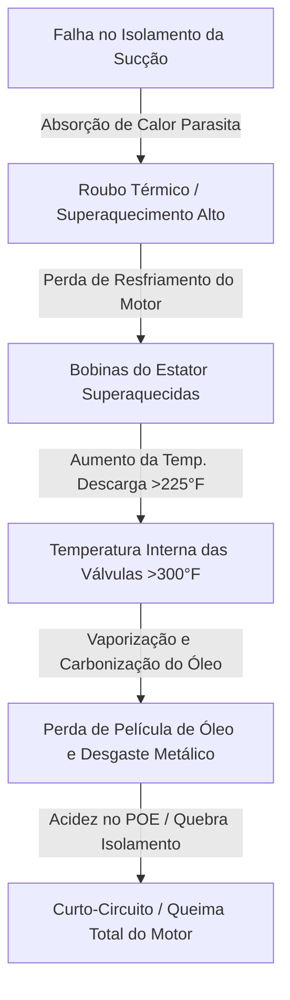

# Módulo 03-03: Isolamento Térmico de Elite — Blindagem Térmica contra o Roubo de Capacidade e Condensação Predial

## Introdução: O Paradigma da Blindagem Térmica (Thermal Armor)

Na engenharia avançada de sistemas de aquecimento, ventilação, ar condicionado e refrigeração (AVAC-R), o isolamento térmico de tubulações é rotineiramente — e perigosamente — mal compreendido por instaladores iniciantes. Muitas vezes relegado ao status de mero acabamento estético ou detalhe secundário, esse componente é frequentemente aplicado às pressas, com materiais inadequados e total desconhecimento dos conceitos fundamentais da termodinâmica e psicrometria.

Essa incompreensão gera consequências graves: falhas prematuras de compressores de alto custo e danos estruturais insidiosos nas edificações. A mentalidade de elite exige uma mudança fundamental de paradigma: o isolamento térmico de elastômero não deve ser visto como uma simples capa protetora, mas sim como uma **"Blindagem Térmica"** ativa.

Esta Blindagem Térmica funciona como um escudo termodinâmico projetado para proteger a integridade do ciclo frigorífico e o ambiente arquitetônico. Sua instalação não segue regras práticas informais de campo, mas sim os princípios da ciência dos materiais, engenharia química e leis psicrométricas. A compressão mecânica da espuma, costuras abertas, adesivos incompatíveis ou juntas desalinhadas comprometem o sistema por completo.

---

## Parte I: A Física Termodinâmica do Roubo Térmico e Mortalidade do Compressor

Para compreender a necessidade vital do isolamento da linha de sucção, deve-se analisar a trajetória física do fluido refrigerante. A função principal da linha de sucção (o tubo de cobre de maior diâmetro) é transportar o vapor de baixa pressão e baixa temperatura da evaporadora de volta ao compressor, carregando o calor latente e sensível removido do ambiente climatizado. Esse vapor deve permanecer o mais frio possível para cumprir uma segunda função crítica: resfriar o compressor.

### 1.1 O Mecanismo do Roubo Térmico (Thermal Theft)

Quando a linha de sucção é deixada exposta ou possui isolamento comprometido por rasgos ou compressão, o cobre atua como um condutor de calor extremamente eficiente exposto ao ambiente externo. O calor flui naturalmente da atmosfera mais quente para o refrigerante frio nas tubulações. Este processo parasita é denominado **"Roubo Térmico"** (Thermal Theft).

Nessa condição, a linha de sucção atua como um evaporador secundário não planejado, absorvendo calor sensível de sótãos quentes, shafts prediais ou do ar externo. Esse aquecimento prematuro eleva o superaquecimento (superheat) da sucção a níveis perigosos antes mesmo que o vapor atinja a entrada do compressor, reduzindo a capacidade útil de refrigeração da serpentina interna. 

Sob superaquecimento excessivo, o compressor trabalha mais para realizar a mesma transferência de calor, operando em ciclos longos com maior consumo de amperagem. A eficiência do sistema é reduzida drasticamente por conta de uma falha de isolamento barata.

### 1.2 Mortalidade do Compressor e a Regra "225 para Sobrevivência"

Nos compressores scroll e alternativos semi-herméticos ou herméticos modernos, o motor elétrico interno é resfriado diretamente pelo fluxo de gás frio que retorna pela linha de sucção.

Se a Blindagem Térmica falhar, o motor perde seu meio de refrigeração. O gás que retorna, já superaquecido pelo roubo térmico, é incapaz de absorver o calor das bobinas elétricas e da fricção mecânica das espiras de compressão. Como consequência direta, a temperatura de descarga na saída do compressor sobe exponencialmente.

Na engenharia de compressores, aplica-se a **Regra "225 para Sobrevivência"** (225 Stay Alive):

> [!IMPORTANT]
> A temperatura física medida na linha de descarga do compressor, a exatos 15 cm (6 polegadas) da saída do bloco, nunca deve ultrapassar **225°F (107°C)**.

Se a temperatura externa atinge esse limite de 225°F, a temperatura interna na placa de válvulas e no topo das espiras scroll estará cerca de 75°F (42°C) mais quente, atingindo mais de **300°F (149°C)**. Nesse nível térmico, a degradação física do compressor ocorre de forma acelerada.

### 1.3 Degradação de Lubrificantes e Danos Mecânicos

Os óleos sintéticos (como o POE) ou minerais possuem limites estritos de temperatura de trabalho. A maioria dos óleos de compressores começa a vaporizar, carbonizar e perder viscosidade a partir de **350°F (177°C)**. 

Sob temperaturas internas extremas causadas por superaquecimento:
1.  **Perda de Viscosidade:** O óleo afina e perde a capacidade de formar uma película micrométrica protetora entre as partes metálicas em atrito. Pistões e scrolls sofrem desgaste abrasivo direto, gerando partículas de ferro que se acumulam como lama metálica no cárter.
2.  **Carbonização (Coking):** O lubrificante queima e forma resíduos sólidos de carbono nas placas de válvulas. Essa sujeira impede o fechamento estanque das palhetas (*reed valves*), gerando vazamento de gás de descarga de volta para a câmara de sucção (*blow-by*). Esse refluxo recircula o calor interno em um ciclo destrutivo contínuo.
3.  **Geração de Ácidos:** A quebra térmica do lubrificante gera ácidos corrosivos que atacam o verniz de isolamento elétrico das bobinas do estator, provocando curto-circuitos e a queima definitiva (burnout) do motor do compressor.

---

## Parte II: A Psicrometria da Condensação e Pontes Térmicas

A segunda missão fundamental da Blindagem Térmica é gerenciar a umidade e a física psicrométrica do ar nas superfícies frias da instalação.

### 2.1 A Dinâmica do Ponto de Orvalho (Dew Point)

A psicrometria estuda as propriedades físicas de misturas de ar e vapor de água. O ar ambiente contém uma quantidade de vapor de água invisível determinada pela relação entre a temperatura de bulbo seco (temperatura ambiente real) e a umidade relativa (UR).

O ponto de orvalho representa a temperatura limite na qual o ar atinge 100% de saturação (UR = 100%). Quando o ar úmido entra em contato com qualquer superfície abaixo de sua temperatura de ponto de orvalho, ele perde calor sensível instantaneamente. A umidade excedente condensa na forma líquida de água diretamente sobre a superfície fria.

### 2.2 Estudo de Caso: Ferraz de Vasconcelos, São Paulo

Tomemos como exemplo o perfil climático típico da região de Ferraz de Vasconcelos, na Região Metropolitana de São Paulo. Caracterizada por um clima temperado úmido, a região apresenta umidade relativa média anual próxima a **75%**, com pontos de orvalho frequentes na faixa de **59°F (15°C)**.

Em uma linha de cobre de sucção operando sem isolamento ou com isolamento falho, a temperatura do tubo de cobre fica frequentemente em **40°F (4,4°C)**. Estando 19°F (10,6°C) abaixo do ponto de orvalho atmosférico local, a condensação de água ocorre de forma imediata e contínua em toda a extensão do tubo exposto.

### 2.3 Mecanismo de Ponte Térmica (Thermal Bridge)

Se o isolamento possuir frestas, cortes abertos, amassados ou juntas mal coladas, cria-se uma **"Ponte Térmica"**. Como o cobre possui alta condutividade térmica, a seção exposta resfria as bordas adjacentes, fazendo com que o ponto de orvalho seja alcançado localmente e gerando gotejamento persistente naquele ponto específico.

A água de condensação escorre pela gravidade, infiltrando-se em drywall, forros de gesso ou lajes de concreto. Isso causa desintegração de placas de gesso, manchas escuras, corrosão de eletrodutos metálicos e, principalmente, cria um ambiente biológico propício para proliferação de mofo preto e fungos em espaços sem ventilação.

---

## Parte III: Ciência dos Materiais de Elastômeros de Célula Fechada (ASTM C534)

Para garantir resistência térmica estável e impermeabilidade ao vapor, a especificação técnica dos elastômeros baseia-se na norma **ASTM C534**, que regula os isolamentos celulares pré-formados.

### 3.1 Classificação ASTM C534

A norma divide os isolamentos conforme a composição e estrutura física:

*   **Type I (Tubular):** Formatos de tubos pré-moldados para encaixe em tubulações.
*   **Type II (Sheet/Roll):** Mantas ou rolos planos para dutos de ar, chillers ou tubulações de grande diâmetro.

Abaixo estão detalhados os graus de classificação de acordo com a temperatura e pureza:

| ASTM C534 Grau | Composição Básica | Faixa de Trabalho Térmico | Aplicações Principais |
| :--- | :--- | :--- | :--- |
| **Grade 1** | Borracha Nitrílica Butadieno e PVC (NBR/PVC) ou EPDM. | -297°F a 220°F (-183°C a 104°C) | Climatização comum, água gelada, VRF comercial padrão. |
| **Grade 2** | Elastômero especial de alta temperatura. | -297°F a 300°F (-183°C a 150°C) | Aplicações industriais de alta temperatura, linhas de vapor ou painéis solares. |
| **Grade 3** | Elastômero de alta pureza (baixo teor de halogênios: <200 ppm clorofluor). | -297°F a 250°F (-183°C a 120°C) | Indústrias farmacêuticas, salas limpas e laboratórios de alta sensibilidade. |

### 3.2 O Valor K e a Estrutura de Células Fechadas

O desempenho isolante é medido pela condutividade térmica (**Valor K**), que representa o fluxo de calor que atravessa o material por hora. Os isolantes elastômeros de elite apresentam baixos valores de K, situando-se tipicamente entre **0,235 e 0,280 Btu-in / h-ft²-°F** (quanto menor o valor de K, maior o poder isolante).

Esse desempenho é alcançado graças à estrutura celular fechada do material, que aprisiona milhões de microbolhas isoladas de gás inerte. Ao contrário da fibra de vidro ou lã de rocha (célula aberta), que absorvem água e exigem barreira de vapor externa, o elastômero de célula fechada é naturalmente impermeável. Ele impede a penetração de umidade em todo o seu corpo, mantendo o valor K estável por longos anos sem necessidade de coberturas plásticas ou metálicas adicionais em ambientes internos.

### 3.3 A Complexidade da Resistência Radial (Valor R)

Enquanto a resistência térmica (**Valor R**) de mantas planas é calculada de forma linear ($R = \text{espessura} / K$), o isolamento de tubos circulares segue uma geometria radial governada pela fórmula logarítmica:

$$R = \frac{r_o \ln(r_o / r_i)}{K}$$

Onde:
*   $r_o$ = Raio externo do isolamento instalado.
*   $r_i$ = Raio interno do isolamento (raio externo do tubo de cobre).
*   $K$ = Condutividade térmica do isolante.
*   $\ln$ = Logaritmo natural.

Devido a essa geometria radial, a eficiência do isolamento é maior em diâmetros menores de tubulação, pois o volume relativo de elastômero é maior em proporção à superfície do tubo de cobre. Esse comportamento deve ser cuidadosamente avaliado por engenheiros na especificação das espessuras exigidas pela norma ASHRAE 90.1.

---

## Parte IV: Protocolos de Instalação e Proibição de Compressão

A maior eficácia térmica do material ASTM C534 é anulada caso o isolamento seja submetido a compressão mecânica durante a montagem.

### 4.1 O Colapso Celular por Amassamento

Quando a espuma elastomérica é comprimida, as microbolhas de gás internas são forçadas a colapsar e achatar. Isso reduz a distância física entre o tubo de cobre frio e o ar externo úmido, além de elevar a densidade no ponto comprimido, criando uma ponte de condução térmica. Sob compressão contínua, o material perde a capacidade de retornar à forma original ("deformação permanente por compressão").

Ensaios térmicos empíricos mostram a severidade desse impacto:

*   Um isolamento com espessura nominal de 6,25 polegadas (R-19) comprimido em uma cavidade de 3,5 polegadas sofre queda de desempenho de **R-19 para R-13** (perda de 31%).
*   Um material R-21 (5,5 polegadas) prensado no mesmo espaço reduz a eficiência para **R-14** (perda de 33%).

### 4.2 Proibição Absoluta do Uso de Abraçadeiras Plásticas (Zip-Ties)

> [!CAUTION]
> É terminantemente proibido o uso de abraçadeiras plásticas de nylon apertadas ("enforca-gato") diretamente sobre o isolamento térmico de elastômero para fixação em suportes prediais.

O aperto agressivo da abraçadeira de nylon esmaga o elastômero em formato de anel contínuo, reduzindo a espessura protetora a quase zero. Isso cria uma ponte térmica circunferencial onde o ponto de orvalho é atingido, gerando gotejamento constante sobre os forros inferiores e causando danos estruturais severos.

### 4.3 Suportes Rígidos Pré-Isolados (Shielded Inserts)

Para evitar o colapso celular do isolamento nos pontos de sustentação (pendurais ou suportes de perfil unistrut), devem ser instalados blocos de suporte rígidos integrados, como os sistemas **K-FLEX 360** ou **ArmaFix**:

*   Esses componentes utilizam um núcleo rígido de 360° feito de poliuretano (PUR) de alta densidade ou PET estrutural, envolto em uma chapa protetora de alumínio.
*   A base rígida suporta o peso operacional do tubo com refrigerante líquido sem sofrer deformação mecânica.
*   As bordas externas do suporte rígido são dotadas de abas de elastômero flexível de célula fechada. Isso permite que o técnico cole as extremidades dos tubos de isolamento diretamente nas abas de transição do pendural usando cola de contato de alta performance, eliminando pontes térmicas na suspensão.

---

## Parte V: Técnicas Avançadas de Junção Química e Geometria de Campo

Para garantir a estanqueidade absoluta contra a entrada de umidade por pressão de vapor (vapor drive), a Blindagem Térmica exige um processo de fusão química contínua de 100%.

### 5.1 O Erro do Uso de Fitas Adesivas Simples

Muitos técnicos amadores tentam selar emendas e cortes longitudinais de isolamentos utilizando fitas isolantes, fitas crepes ou fitas de alumínio comuns. Esta prática é tecnicamente inaceitável e incorre em falhas rápidas.

Durante a operação do sistema, o tubo de cobre se contrai ao esfriar e se expande ao aquecer. Essa constante movimentação térmica desgasta a cola adesiva das fitas superficiais comuns, gerando fendas nas emendas em poucos meses. O fabricante desencoraja fortemente o uso de fitas adesivas como selante primário, uma vez que elas não barram a pressão de vapor e propiciam a condensação interna. Fitas acrílicas ou butílicas de alta performance possuem utilidade apenas como reforço de barreira protetora externa, nunca como junta mecânica principal.

### 5.2 Protocolo de Selagem Química por Adesão Úmida (Wet Seal)

O único método aceitável para união de elastômeros de célula fechada é a soldagem molecular por meio de adesivos químicos especiais de contato de base solvente, como **ArmaFlex 520**, **ArmaFlex Ultima 700** ou **K-FLEX Contact Adhesive**:

1.  **Condições de Campo:** A aplicação ideal do adesivo deve ocorrer em temperaturas entre 59°F e 68°F (15°C a 20°C). Evite aplicar abaixo de 32°F (0°C).
2.  **Preparação de Superfície:** As emendas devem estar completamente secas e limpas de poeira ou resíduos de talco industrial. Para descontaminação completa, limpe os lábios da espuma com álcool isopropílico.
3.  **Aplicação do Adesivo:** Aplique uma camada fina e uniforme de adesivo em ambas as faces a serem soldadas usando um pincel de cerdas curtas e firmes.
4.  **Tempo de Flash-off:** Deixe o solvente evaporar por alguns minutos. A junta deve ser unida somente quando a cola estiver seca ao toque suave, porém pegajosa sob compressão.
5.  **União por Compressão Lateral:** **Nunca estique o isolamento para fechar uma junta.** O elastômero possui memória elástica; se colado sob tensão mecânica, a força de retração abrirá a junta futuramente. O isolamento deve ser cortado de 5 a 10 mm mais longo (sobredimensionado) e empurrado sob compressão lateral para soldar as faces com bunching positivo.

### 5.3 Construção de Cotovelos e Derivações (Mitered Joints)

Em curvas de 90° ou derivações em T, dobrar a espuma de isolamento à força estica o material na curva externa (reduzindo a espessura da parede térmica) e enruga o material na curva interna.

O instalador profissional realiza cortes meia-esquadria precisos de **45 graus** usando facas de isolamento com lâmina lisa altamente afiadas. As faces cortadas são unidas com adesivo de contato e soldadas sob leve compressão, garantindo que a espessura de parede nominal permaneça uniforme em toda a curva da tubulação.

---

## Parte VI: Blindagem Ambiental Contra UV e Intempéries Externas

A radiação ultravioleta (UV) solar quebra as ligações carbono-carbono das cadeias poliméricas do elastômero NBR/PVC ou EPDM, tornando a superfície do isolante ressecada, trincada e quebradiça em áreas externas.

### 6.1 Regulamentações de Eficiência (IECC e ASHRAE 90.1)

As normas internacionais de conservação de energia (IECC-2021 Seção C403.12.3.1) e a ASHRAE 90.1-2019 (Seção 6.3.2.1) exigem a proteção física de isolamentos térmicos expostos às intempéries climáticas. A IECC **proíbe expressamente o uso de fitas adesivas comuns** como proteção externa contra radiação solar em linhas expostas no telhado.

### 6.2 Soluções Homologadas de Cobertura Externa

Para proteger a integridade mecânica e impedir a degradação por raios UV, vento e ataques de aves ou roedores, duas metodologias são aprovadas para trechos ao ar livre:

1.  **Pinturas Acrílicas Flexíveis Albedo:** Aplicação de tintas elastoméricas protetoras de alta elasticidade, como **Aerocoat** ou **ArmaFinish**. A tinta deve ser aplicada em duas demãos fartas e cruzadas para bloquear a passagem de raios UV sem rachar sob dilatação térmica. Essa proteção química exige reaplicação predial a cada **3 a 5 anos** devido à ação de desgaste natural da atmosfera.
2.  **Jaquetas de Proteção Mecânica:** Envelopamento do isolamento com jaquetas de PVC rígido, chapas de alumínio calandradas ou fitas laminadas multicamadas com barreira de alumínio integrada. As jaquetas protegem contra danos por impacto de manutenção, resistem ao ataque físico de aves e eliminam a necessidade de pintura recorrente nas coberturas dos prédios.
3.  **Selagem de Transição de Passagem de Parede:** O ponto onde a linha frigorífica entra na edificação através do shaft de alvenaria externa deve ser vedado com mastic impermeável ou fita zero-permeabilidade (Protape) para evitar que o fluxo de vento ou chuva penetre no forro interno por trás da isolação.

---

## Tabelas Técnicas e Métodos Paramétricos

Abaixo encontram-se dispostos os quadros analíticos comparativos de perdas de eficiência térmica e especificações de espessura de isolamento para linhas de sucção:

### Perda de Eficiência por Compressão Física do Isolante

A tabela abaixo demonstra a redução da resistência térmica equivalente (R-Value) sob compressão de cavidade estrutural:

| Espessura Nominal Loteada | Resistência Original Rotulada (R-Value) | Espessura Comprimida no Ponto de Aperto | Resistência Térmica Resultante | Perda Percentual de Eficiência |
| :--- | :--- | :--- | :--- | :--- |
| **6,25 polegadas (158 mm)** | R-19 | 3,50 polegadas (89 mm) | R-13 | 31,5% de perda térmica |
| **5,50 polegadas (140 mm)** | R-21 | 3,50 polegadas (89 mm) | R-14 | 33,3% de perda térmica |
| **3,50 polegadas (89 mm)** | R-11 | 2,00 polegadas (50 mm) | R-7,6 | 30,9% de perda térmica |
| **1,00 polegada (25 mm)** | R-4,2 | 0,25 polegada (6 mm) | R-1,1 | 73,8% de perda térmica |

### Espessura Mínima Recomendada de Isolamento (ASHRAE 90.1-2019)

Espessuras nominais mínimas exigidas para linhas de sucção sob temperaturas de projeto padrão entre 40°F e 60°F em ambientes de alta umidade:

| Diâmetro Nominal da Tubulação de Cobre | Espessura Mínima de Isolamento Requerida | Resistência Mínima Requerida (R-Value) | Código de Conformidade de Projeto |
| :--- | :--- | :--- | :--- |
| **3/8" a 5/8"** | 1/2 polegada (13 mm) | R-4,0 | ASHRAE 90.1-2019 / IECC |
| **3/4" a 1 1/8"** | 3/4 polegada (19 mm) | R-6,0 | ASHRAE 90.1-2019 / IECC |
| **1 3/8" a 2 1/8"** | 1,0 polegada (25 mm) | R-8,0 | ASHRAE 90.1-2019 / IECC |
| **Acima de 2 1/8"** | 1 1/2 polegadas (38 mm) | R-12,0 | ASHRAE 90.1-2019 / IECC |

### Comparativo de Tecnologias de Jaquetas Protetoras Externas

| Categoria de Proteção | Resistência Mecânica (Puncionamento) | Resistência Química e Solar (UV) | Ciclo de Manutenção Requerido | Vantagens de Instalação |
| :--- | :--- | :--- | :--- | :--- |
| **Pinturas Aerocoat / ArmaFinish** | Baixa (Sensível a quedas de ferramentas) | Excelente (Reflete UV ativamente) | Renovação recomendada a cada 3 a 5 anos | Fácil aplicação com rolo/pincel em curvas e manifolds complexos. |
| **Chapas de Alumínio Clad** | Altíssima (Resiste a granizo e ferramentas) | Imbatível (Blindagem metálica total) | Livre de manutenção por até 15 anos | Proteção máxima física de longo prazo, mas exige calandra técnica e parafusos de costura. |
| **Jaquetas de PVC Rígido UV** | Média-Alta (Resiste a chuva e bicadas de aves) | Excelente (Formulação especial UV) | Livre de manutenção por 8 a 10 anos | Acabamento estético clean, encaixe rápido com cola de PVC nas conexões. |
