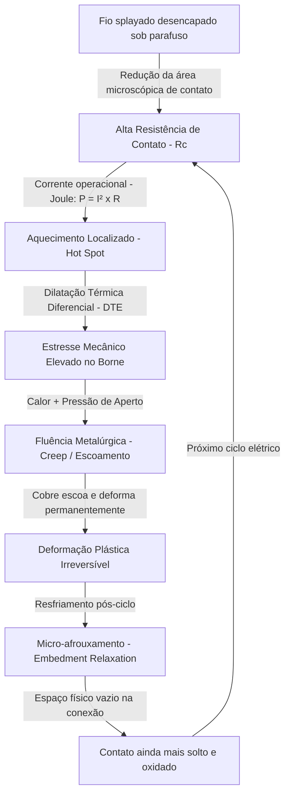

# Módulo 04-02: Como Erros Milimétricos Destroem Máquinas Gigantes — A Regra de Ouro da Terminação Elétrica

## Introdução: O Fio Stranded Decapado como Ponto Crítico de Falha

*Fio flexível multifilar (stranded) desencapado e esmagado queima placas e incendeia painéis.* Esta verdade imutável constitui a premissa fundamental dos protocolos elétricos de elite em AVAC-R. Em sistemas industriais e comerciais modernos de Fluxo de Refrigerante Variável (VRF), chillers de grande porte e centrais de automação predial, milhões de reais em equipamentos de alta tecnologia sofrem panes devido à execução inadequada de terminações elétricas em campo.

A disparidade entre a engenharia sofisticada de inversores de frequência e a prática comum de esmagar condutores flexíveis sob parafusos de bornes é a maior vulnerabilidade dessas instalações. Uma central controladora microprocessada de última geração torna-se inútil ou pode entrar em curto-circuito catastrófico se os fios de alimentação ou comando forem mal crimpados. 

A terminação elétrica correta baseia-se nas leis da física, termodinâmica e metalurgia. Este módulo detalha os mecanismos de degradação provocados pela falta de terminais industriais e estabelece os procedimentos para garantir conexões herméticas ao gás, resistentes à oxidação e à vibração.

---

## Parte I: A Física do Contato Elétrico e a Deformação por Esmagamento

Para entender a fragilidade do condutor flexível desencapado sob pressão direta do parafuso do borne, deve-se analisar a interface metálica em nível microscópico. 

O condutor stranded (flexível) é composto por finos filamentos de cobre entrelaçados para garantir a flexibilidade necessária para absorver as vibrações mecânicas constantes geradas por compressores, motores de ventiladores e pela turbulência de fluido refrigerante nas tubulações. Essa flexibilidade evita a fadiga por cisalhamento e fratura que acomete fios rígidos.

### 1.1 O Mecanismo de Esmagamento e Splay (Abertura dos Fios)

Quando o técnico insere o cabo flexível desencapado diretamente sob um parafuso de borne ou placa de pressão:
1.  **Espalhamento (Splay):** À medida que o parafuso desce aplicando torque rotacional e compressão, as vias de cobre, livres do isolamento, espalham-se para os lados do borne para escapar da zona de maior pressão.
2.  **Redução da Área de Contato:** Em uma junta perfeita, 100% da seção transversal do cabo faz contato mecânico plano e firme com o barramento do borne. No esmagamento livre, essa área de contato efetiva cai para valores entre **60% e 80%**, deixando vias de cobre soltas e inúteis fora do ponto de aperto.
3.  **Rompe-se o Cobre:** O atrito direto dos filetes de aço do parafuso contra o cobre dúctil esmaga e corta as vias externas. Ocorre o fenômeno do **"Gaiola de Passarinho"** (bird-caging), onde os filamentos internos se expandem em formato desordenado fora do borne. Isso diminui a capacidade de condução de corrente (ampacidade) e cria caminhos para curtos-circuitos entre bornes adjacentes de placas lógicas.

```
[ Cabo Stranded Sem Terminal ]
           │
           ├─► Sob o Parafuso: Os fios espalham-se (Splay) e sofrem fadiga
           ├─► Fios cortados criam o efeito "Bird-caging" (Gaiola de Passarinho)
           └─► Área de contato reduzida a 60%-80% (Gera gargalo térmico)

[ Cabo Stranded Com Terminal Ilhós ]
           │
           └─► Encapsulamento de 100% dos filamentos em um bloco sólido e estanho-galvânico
```

---

## Parte II: O Ciclo Termodinâmico de uma Conexão Degradada

A pane provocada por uma terminação inadequada raramente ocorre no primeiro acionamento. Trata-se de um processo lento e progressivo de fadiga termomecânica estruturada em um ciclo de realimentação destrutiva:



### 2.1 Resistência de Contato e Efeito Joule
A resistência elétrica no ponto de união é dada pela área de contato em nível microscópico (pontos de toque real das rugosidades dos metais). Como a área de contato do fio esmagado é reduzida, a resistência de contato ($R_c$) é alta.

Pela **Primeira Lei de Joule** ($P = I^2 R_c$), a corrente exigida para alimentar compressores e motores de grande porte ao atravessar esse gargalo resistivo é convertida em calor, criando um ponto quente localizado (*hot spot*).

### 2.2 Dilatação Térmica Diferencial (DTE)
Os materiais do borne possuem coeficientes de dilatação térmica (CTE) diferentes. O condutor é de cobre dúctil, enquanto o parafuso e a carcaça do borne são de aço, latão ou ligas de zinco. Com o aquecimento por efeito Joule, o cobre expande-se a taxas e volumes maiores que o borne, gerando um estresse de compressão mecânica extremo dentro do borne.

### 2.3 Fluência Metalúrgica (Creep / Cold Flow)
Sob o calor do ponto quente e a alta pressão mecânica exercida pelo parafuso, o cobre ultrapassa o seu limite de deformação elástica e entra em deformação plástica permanente, sofrendo **fluência metalúrgica** (*creep*). Os átomos de cobre deslizam e reorganizam-se, fazendo o condutor "escorrer" para fora da zona de maior pressão do parafuso (achatamento).

### 2.4 Relaxamento por Acomodação (Embedment Relaxation)
Quando o ciclo elétrico termina e o sistema esfria, os materiais contraem-se. Como o cobre sofreu deformação plástica definitiva enquanto estava quente, ele não retorna ao volume inicial. 

Cria-se uma folga microscópica sob o parafuso. No próximo ciclo de trabalho, o contato estará mais frouxo, a resistência de contato será maior e o calor gerado será ainda mais intenso. Esse ciclo repete-se em campo até que a folga dê lugar ao início de arcos elétricos.

---

## Parte III: Micro-Arcos Elétricos, Carbonização e Explosão por Arc Flash

Com o afrouxamento mecânico progressivo da terminação, surge uma fresta de ar entre o cobre e o borne. 

### 3.1 Ionização por Micro-Arco
O ar funciona como isolante térmico sob condições normais. Porém, em frestas micrométricas, o forte campo elétrico ioniza as moléculas de gás do ar, gerando um canal de plasma condutivo. Surgem micro-arcos elétricos contínuos sob o parafuso frouxo.

A temperatura no centro de um arco elétrico supera facilmente **10.000 Kelvin (9.727°C)**. Essa energia térmica vaporiza o cobre dos fios, derrete o revestimento de estanho protetor e ataca a carcaça de plástico de sustentação do borne. Em sistemas de corrente contínua (DC) inverter de 24V ou superiores, os micro-arcos são altamente prováveis de se manter ativos. Em redes de força AC (220V a 480V), a ignição por arco é inevitável.

### 3.2 O Processo de Carbon Tracking (Arc Tracking)
Os bornes de controle e potência são feitos de plásticos de engenharia retardantes de chama. Sob o bombardeio de calor de 10.000K do micro-arco, o polímero sofre pirólise (decomposição térmica sem oxigênio):

```
[ Plástico Isolante do Borne ] ──► [ Bombardeio Térmico do Micro-Arco (10.000 K) ]
                                            │
                                            ▼ (Pirólise: Decomposição Química)
                                   [ Resíduo de Carbono Sólido ] (Excelente Condutor)
                                            │
                                            ▼ (Propagação das Trilhas Condutivas)
                                   [ Curto-Circuito Fase-Fase ou Fase-Terra ]
                                            │
                                            ▼ (Surto Instantâneo de Amperagem)
                                   [ Explosão por Arc Flash ]
```

Como o carbono conduz eletricidade, essa trilha encurta o isolamento elétrico entre bornes adjacentes ou carcaça. Uma fuga de corrente constante inicia-se através da trilha carbonizada. O aquecimento acelera até que a trilha derreta por completo, gerando um curto-circuito franco fase-fase ou fase-terra. 

Em milissegundos, o ar ao redor sofre ionização completa, gerando uma explosão por **Arc Flash**, que destrói o quadro elétrico e pode propagar incêndios prediais. Vistorias forenses baseadas na norma NFPA 921 apontam a falta de terminais em fios flexíveis como uma das maiores causas de incêndios elétricos em AVAC.

---

## Parte IV: A Física da Conexão Hermética (Gas-Tight) e o Erro da Soldagem

A única forma de impedir a formação de óxido de cobre (altamente isolante) e a degradação termomecânica do cabo flexível é garantir uma conexão estanque ao gás (*gas-tight*).

### 4.1 O Princípio da Crimpagem Estanque ao Gás
Uma crimpagem de nível industrial de elite deforma simultaneamente o cilindro metálico do terminal e os filetes de cobre do cabo flexível em uma seção poligonal densa. A força física aplicada elimina vazios microscópicos entre as vias de cobre. 

Os metais sofrem fusão mecânica a frio (soldagem a frio), fundindo-se em uma única massa homogênea. Sem espaços internos livres, os gases da atmosfera (oxigênio, umidade ou salinidade) não conseguem penetrar na terminação. A junta fica imune à oxidação interna, mantendo baixos níveis de resistência por toda a vida útil da máquina.

### 4.2 A Proibição Crítica da Soldagem (Estanhagem de Pontas)

> [!CAUTION]
> É estritamente proibido aplicar solda de estanho na ponta do cabo flexível (tinning) antes de inseri-lo em bornes de parafuso ou pressão.

A solda de estanho-chumbo ou estanho-prata é um metal macio e de baixo ponto de fusão, altamente propenso a escoamento e deformação lenta (*creep*) sob pressão mecânica fria do parafuso. A ponta estanhada deforma-se rapidamente sob o aperto, soltando a conexão e iniciando o ciclo de aquecimento por efeito Joule. Terminações industriais utilizam deformação por pressão a frio, nunca solda metálica.

---

## Parte V: Tipologias de Terminais: Ilhós (Ferrules), Olhais e Garfos

Para adequar o cabo flexível ao borne correspondente, o instalador deve utilizar terminais apropriados:

### 5.1 O Terminal Ilhós (Bootlace Ferrule)
Consiste em um tubo fino de cobre estanhado eletrolítico de alta pureidade (>99.9% Cu-DHP), dotado de uma gola plástica de isolamento. O ilhós encapsula 100% das vias do cabo flexível. 

*   **Vantagens:** Garante 100% de apresentação da seção de cobre ao borne de borne, protege os filamentos contra esmagamento de parafusos ou travas de mola e elimina fiação desfiada. Os fios podem ser retirados e reconectados inúmeras vezes para manutenção sem fadiga mecânica ou perda de fios.
*   **Normas:** A aplicação de ilhós rege-se mundialmente pela norma **UL 486F** (ferrules cobertos e descobertos) e a alemã **DIN 46228**, exigindo testes severos de resistência mecânica à tração (pull-out test).

### 5.2 Terminal Olhal (Ring Lug)
Terminal plano com anel de contato fechado em sua extremidade. É fixado por aperto sob prisioneiros ou parafusos roscados. 

É a conexão de segurança mecânica máxima em áreas de alta vibração, como bobinas de contatores de compressores e barras de aterramento predial. Como o anel envolve o parafuso por completo, o terminal permanece acoplado ao borne mesmo que o parafuso perca o aperto por vibração dinâmica.

### 5.3 Terminal Garfo (Spade/Fork)
Possui extremidade aberta em formato de "U". Permite montagens e substituições rápidas em painéis de comando, pois não exige a retirada total do parafuso de aperto para ser inserido ou retirado, apenas o afrouxamento da rosca. É ligeiramente mais suscetível a desprendimento físico que o olhal em caso de afrouxamento severo do borne.

---

## Parte VI: Procedimento Operacional Padrão (SOP) de Terminação Elétrica

A execução de terminações de nível industrial segue um protocolo sequencial inegociável:

1.  **Desenergização LOTO:** Desligar a chave seccionadora geral do circuito, instalar cadeados e etiquetas de aviso (Lockout/Tagout) e testar a ausência de tensão com multímetro calibrado.
2.  **Uso de Crimpadores Catracados:**
    
    > [!IMPORTANT]
    > É expressamente proibido o uso de alicates de pressão comuns ou alicates universais de eletricista para crimpagem de terminais.
    
    A crimpagem exige alicates especiais dotados de sistema de catraca que impede a abertura do alicate até que a pressão calibrada de amassamento seja atingida por completo.
3.  **Medição e Decapagem Limpa:** Medir a profundidade do cilindro metálico do terminal para guiar o comprimento de decapagem do cabo. Utilizar decapadores automáticos ajustados para a seção AWG correspondente. Cortes manuais com estiletes que riscam ou cortam as vias de cobre reduzem a ampacidade e geram pontos de ruptura mecânica.
4.  **Alinhamento e Inserção:** Inserir o cabo de forma que todos os filamentos de cobre passem por dentro da luva metálica do terminal. A fiação de cobre deve ficar nivelada com a extremidade do terminal ou projetar-se no máximo 0,5 mm para fora. O isolamento do cabo deve ficar encaixado dentro da aba plástica do terminal (funil de proteção contra exposição).
5.  **Crimpagem:** Selecionar a cavidade correta do alicate catraca (ex.: cavidade vermelha para terminais isolados de 1,5 a 2,5 mm²) e comprimir o alicate até a liberação automática da catraca.
6.  **Aperto por Torquímetro Dinamométrico:** Apertar os parafusos dos bornes utilizando chaves de torque dinamométricas calibradas de acordo com as especificações do fabricante (expressas em N.m ou Lb-In). Evitar o torque manual visual.
7.  **Marcação de Conformidade (Witness Marks):** Aplicar uma linha contínua de lacre de torque colorido (torque seal) cruzando a cabeça do parafuso e o borne físico. Qualquer rotação física de afrouxamento provocada por vibrações térmicas ou mecânicas quebrará o lacre, permitindo identificação visual imediata em manutenções.

---

## Tabelas Técnicas e Parâmetros de Instalação

### Resistência Mecânica à Tração Exigida para Terminais (UL 486F)

Tabela de pull-out mínimo para aceitação de crimpagens de terminais em campo conforme a seção do condutor elétrico:

| Bitola do Cabo Elétrico (AWG) | Seção Equivalente do Condutor (mm²) | Força de Tração Mínima Exigida (Newtons) | Força de Tração Mínima Exigida (Libras-força) |
| :--- | :--- | :--- | :--- |
| **AWG 22** | 0,34 mm² | 15 N | 3,4 lbf |
| **AWG 20** | 0,50 mm² | 20 N | 4,5 lbf |
| **AWG 18** | 0,75 mm² | 30 N | 6,7 lbf |
| **AWG 16** | 1,50 mm² | 40 N | 9,0 lbf |
| **AWG 14** | 2,50 mm² | 50 N | 11,2 lbf |
| **AWG 12** | 4,00 mm² | 60 N | 13,5 lbf |
| **AWG 10** | 6,00 mm² | 90 N | 20,2 lbf |
| **AWG 8** | 10,00 mm² | 100 N | 22,5 lbf |

### Comparativo Técnico de Bornes e Métodos de Acoplamento

| Tipo de Borne | Vibração e Expansão Térmica | Tempo de Instalação | Riscos de Bare Wire | Terminal Recomendado |
| :--- | :--- | :--- | :--- | :--- |
| **Bornes de Parafuso Direto** | Ruim (Afrouxamento crônico por DTE) | Médio | Extremo (Parafuso guilhotina e splaya fios) | Terminal Ilhós (Ferrule) |
| **Bornes de Placa de Pressão** | Regular (Exige reapertos frequentes) | Médio | Alto (Splayamento nas laterais da placa) | Terminal Ilhós ou Fork |
| **Bornes de Conexão de Mola** | Excelente (Mola compensa a contração mecânica) | Rápido | Médio (Dificuldade de inserção sem ferrolho) | Terminal Ilhós (Ferrule) |
| **Pinos de Prisioneiro (Studs)** | Excelente (Aperto plano por porca de latão) | Lento | Inviável | Terminal Olhal (Ring Lug) |

### Tabela Diagnóstica: Classificação Térmica de Conexões Elétricas

Inspeção termográfica baseada na diferença de temperatura ($\Delta T$) entre a conexão suspeita e um condutor de referência ou fase balanceada sob carga normal:

| Diferença de Temperatura (&Delta;T) | Classificação de Risco | Ação Corretiva Recomendada |
| :--- | :--- | :--- |
| **1°C a 3°C** | Anomalia Leve (Estágio Inicial) | Realizar reaperto na próxima parada de manutenção preventiva. |
| **4°C a 15°C** | Anomalia Moderada | Agendar desmontagem, limpeza física e recrimpagem com terminal adequado. |
| **16°C a 30°C** | Anomalia Severa | Intervenção urgente. Risco iminente de carbonização e danos à carcaça do borne. |
| **Acima de 30°C** | Crítico / Emergência | Desligamento imediato do equipamento. Perigo iminente de incêndio e arc flash. |
